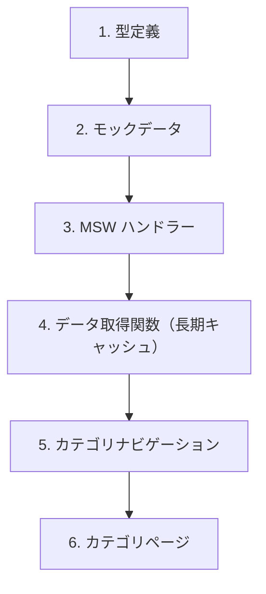

# 演習 2: カテゴリ API

## 目次

- [目標](#目標)
- [前提条件](#前提条件)
- [実装する機能](#実装する機能)
- [ステップ 1: 型定義](#ステップ-1-型定義)
  - [1.1 カテゴリの型を定義](#11-カテゴリの型を定義)
- [ステップ 2: モックデータ](#ステップ-2-モックデータ)
  - [2.1 カテゴリデータを作成](#21-カテゴリデータを作成)
- [ステップ 3: MSW ハンドラー](#ステップ-3-msw-ハンドラー)
  - [3.1 カテゴリハンドラーを作成](#31-カテゴリハンドラーを作成)
  - [3.2 ハンドラーを追加](#32-ハンドラーを追加)
- [ステップ 4: データ取得関数](#ステップ-4-データ取得関数)
  - [4.1 カテゴリ API クライアント](#41-カテゴリ-api-クライアント)
- [ステップ 5: カテゴリナビゲーション](#ステップ-5-カテゴリナビゲーション)
  - [5.1 カテゴリナビコンポーネント](#51-カテゴリナビコンポーネント)
  - [5.2 カテゴリナビ Skeleton](#52-カテゴリナビ-skeleton)
  - [5.3 レイアウトに組み込み](#53-レイアウトに組み込み)
- [ステップ 6: カテゴリページ](#ステップ-6-カテゴリページ)
  - [6.1 カテゴリ一覧ページ](#61-カテゴリ一覧ページ)
  - [6.2 カテゴリ詳細ページ（商品一覧）](#62-カテゴリ詳細ページ商品一覧)
  - [6.3 カテゴリ詳細 loading.tsx](#63-カテゴリ詳細-loadingtsx)
  - [6.4 カテゴリ not-found.tsx](#64-カテゴリ-not-foundtsx)
- [キャッシュ戦略の確認](#キャッシュ戦略の確認)
- [確認チェックリスト](#確認チェックリスト)
- [トラブルシューティング](#トラブルシューティング)
  - [カテゴリナビが表示されない](#カテゴリナビが表示されない)
  - [キャッシュが効いているか確認](#キャッシュが効いているか確認)
- [発展課題](#発展課題)
- [完了条件](#完了条件)

## 目標

カテゴリ一覧 API のモックを作成し、長期キャッシュ戦略を適用してカテゴリナビゲーションとカテゴリ別商品ページを実装します。

***

## 前提条件

[演習 1: 商品データ API](./01-product-api.md) が完了していることを確認してください。

***

## 実装する機能



***

## ステップ 1: 型定義

### 1.1 カテゴリの型を定義

```typescript
// types/category.ts
export type Category = {
  id: string;
  name: string;
  slug: string;
  description: string;
  imageUrl: string;
};
```

***

## ステップ 2: モックデータ

### 2.1 カテゴリデータを作成

```typescript
// mocks/data/categories.ts
import type { Category } from "@/types/category";

export const categories: Category[] = [
  {
    id: "food",
    name: "食品・飲料",
    slug: "food",
    description: "コーヒー、お茶、スナック、調味料など",
    imageUrl: "/images/categories/food.jpg",
  },
  {
    id: "electronics",
    name: "電子機器",
    slug: "electronics",
    description: "スマートフォン、タブレット、イヤホン、スマートウォッチなど",
    imageUrl: "/images/categories/electronics.jpg",
  },
  {
    id: "beauty",
    name: "美容・コスメ",
    slug: "beauty",
    description: "スキンケア、メイクアップ、ヘアケア、ボディケアなど",
    imageUrl: "/images/categories/beauty.jpg",
  },
  {
    id: "fashion",
    name: "ファッション",
    slug: "fashion",
    description: "バッグ、アクセサリー、シューズ、ウェアなど",
    imageUrl: "/images/categories/fashion.jpg",
  },
  {
    id: "lifestyle",
    name: "ライフスタイル",
    slug: "lifestyle",
    description: "インテリア、キッチン用品、ステーショナリーなど",
    imageUrl: "/images/categories/lifestyle.jpg",
  },
];
```

***

## ステップ 3: MSW ハンドラー

### 3.1 カテゴリハンドラーを作成

```typescript
// mocks/handlers/categories.ts
import { http, HttpResponse } from "msw";
import { categories } from "../data/categories";
import { products } from "../data/products";

export const categoryHandlers = [
  // カテゴリ一覧
  http.get("/api/categories", () => {
    return HttpResponse.json(categories);
  }),

  // カテゴリ詳細（slug で取得）
  http.get("/api/categories/:slug", ({ params }) => {
    const category = categories.find((c) => c.slug === params.slug);

    if (!category) {
      return HttpResponse.json({ error: "Category not found" }, { status: 404 });
    }

    return HttpResponse.json(category);
  }),

  // カテゴリ別商品一覧
  http.get("/api/categories/:slug/products", ({ params }) => {
    const category = categories.find((c) => c.slug === params.slug);

    if (!category) {
      return HttpResponse.json({ error: "Category not found" }, { status: 404 });
    }

    const categoryProducts = products.filter((p) => p.categoryId === category.id);

    return HttpResponse.json(categoryProducts);
  }),
];
```

### 3.2 ハンドラーを追加

```typescript
// mocks/handlers/index.ts
import { productHandlers } from "./products";
import { categoryHandlers } from "./categories";

export const handlers = [...productHandlers, ...categoryHandlers];
```

***

## ステップ 4: データ取得関数

### 4.1 カテゴリ API クライアント

カテゴリは変更頻度が低いため、長期キャッシュ（1 時間）を設定します。

```typescript
// lib/api/categories.ts
import type { Category } from "@/types/category";
import type { Product } from "@/types/product";

const API_BASE_URL = process.env.API_BASE_URL || "http://localhost:3000";

export async function getCategories(): Promise<Category[]> {
  const response = await fetch(`${API_BASE_URL}/api/categories`, {
    next: {
      revalidate: 3600, // 1 時間キャッシュ
      tags: ["categories"],
    },
  });

  if (!response.ok) {
    throw new Error(`Failed to fetch categories: ${response.status}`);
  }

  return response.json() as Promise<Category[]>;
}

export async function getCategory(slug: string): Promise<Category> {
  const response = await fetch(`${API_BASE_URL}/api/categories/${slug}`, {
    next: {
      revalidate: 3600,
      tags: ["categories", `category-${slug}`],
    },
  });

  if (!response.ok) {
    if (response.status === 404) {
      throw new Error("Category not found");
    }
    throw new Error(`Failed to fetch category: ${response.status}`);
  }

  return response.json() as Promise<Category>;
}

export async function getCategoryProducts(slug: string): Promise<Product[]> {
  const response = await fetch(`${API_BASE_URL}/api/categories/${slug}/products`, {
    next: {
      revalidate: 60, // 商品は 1 分キャッシュ
      tags: ["products", `category-products-${slug}`],
    },
  });

  if (!response.ok) {
    throw new Error(`Failed to fetch category products: ${response.status}`);
  }

  return response.json() as Promise<Product[]>;
}
```

***

## ステップ 5: カテゴリナビゲーション

### 5.1 カテゴリナビコンポーネント

```tsx
// components/CategoryNav.tsx
import Link from "next/link";
import { getCategories } from "@/lib/api/categories";

export async function CategoryNav(): Promise<React.ReactElement> {
  const categories = await getCategories();

  return (
    <nav className="border-b border-gray-200">
      <div className="container mx-auto px-4">
        <ul className="flex gap-6 overflow-x-auto py-4">
          <li>
            <Link
              href="/products"
              className="whitespace-nowrap text-gray-600 hover:text-blue-600"
            >
              すべて
            </Link>
          </li>
          {categories.map((category) => (
            <li key={category.id}>
              <Link
                href={`/categories/${category.slug}`}
                className="whitespace-nowrap text-gray-600 hover:text-blue-600"
              >
                {category.name}
              </Link>
            </li>
          ))}
        </ul>
      </div>
    </nav>
  );
}
```

### 5.2 カテゴリナビ Skeleton

```tsx
// components/CategoryNavSkeleton.tsx
export function CategoryNavSkeleton(): React.ReactElement {
  return (
    <nav className="border-b border-gray-200">
      <div className="container mx-auto px-4">
        <div className="flex animate-pulse gap-6 py-4">
          {Array.from({ length: 6 }).map((_, i) => (
            <div
              key={i}
              className="h-5 w-20 rounded bg-gray-200"
            />
          ))}
        </div>
      </div>
    </nav>
  );
}
```

### 5.3 レイアウトに組み込み

```tsx
// app/(shop)/layout.tsx
import { Suspense, type ReactNode } from "react";
import { CategoryNav } from "@/components/CategoryNav";
import { CategoryNavSkeleton } from "@/components/CategoryNavSkeleton";

type Props = {
  children: ReactNode;
};

export default function ShopLayout({ children }: Props): React.ReactElement {
  return (
    <div>
      <Suspense fallback={<CategoryNavSkeleton />}>
        <CategoryNav />
      </Suspense>
      {children}
    </div>
  );
}
```

***

## ステップ 6: カテゴリページ

### 6.1 カテゴリ一覧ページ

```tsx
// app/categories/page.tsx
import Image from "next/image";
import Link from "next/link";
import { getCategories } from "@/lib/api/categories";

export default async function CategoriesPage(): Promise<React.ReactElement> {
  const categories = await getCategories();

  return (
    <main className="container mx-auto px-4 py-8">
      <h1 className="mb-8 text-3xl font-bold">カテゴリ一覧</h1>

      <div className="grid grid-cols-1 gap-6 sm:grid-cols-2 lg:grid-cols-3">
        {categories.map((category) => (
          <Link
            key={category.id}
            href={`/categories/${category.slug}`}
            className="group relative aspect-[4/3] overflow-hidden rounded-lg"
          >
            <Image
              src={category.imageUrl}
              alt={category.name}
              fill
              className="object-cover transition-transform group-hover:scale-105"
            />
            <div className="absolute inset-0 bg-black/40 transition-colors group-hover:bg-black/50" />
            <div className="absolute inset-0 flex flex-col justify-end p-6 text-white">
              <h2 className="text-xl font-bold">{category.name}</h2>
              <p className="mt-1 text-sm opacity-90">{category.description}</p>
            </div>
          </Link>
        ))}
      </div>
    </main>
  );
}
```

### 6.2 カテゴリ詳細ページ（商品一覧）

```tsx
// app/categories/[slug]/page.tsx
import { notFound } from "next/navigation";
import { getCategory, getCategoryProducts } from "@/lib/api/categories";
import { ProductCard } from "@/components/ProductCard";

type Props = {
  params: Promise<{ slug: string }>;
};

export default async function CategoryPage({ params }: Props): Promise<React.ReactElement> {
  const { slug } = await params;

  let category;
  try {
    category = await getCategory(slug);
  } catch (error) {
    if (error instanceof Error && error.message === "Category not found") {
      notFound();
    }
    throw error;
  }

  const products = await getCategoryProducts(slug);

  return (
    <main className="container mx-auto px-4 py-8">
      <div className="mb-8">
        <h1 className="text-3xl font-bold">{category.name}</h1>
        <p className="mt-2 text-gray-600">{category.description}</p>
      </div>

      {products.length > 0 ? (
        <div className="grid grid-cols-1 gap-6 sm:grid-cols-2 lg:grid-cols-4">
          {products.map((product) => (
            <ProductCard
              key={product.id}
              product={product}
            />
          ))}
        </div>
      ) : (
        <p className="text-gray-600">このカテゴリに商品はありません</p>
      )}
    </main>
  );
}
```

### 6.3 カテゴリ詳細 loading.tsx

```tsx
// app/categories/[slug]/loading.tsx
import { ProductCardSkeleton } from "@/components/ProductCardSkeleton";

export default function CategoryLoading(): React.ReactElement {
  return (
    <main className="container mx-auto animate-pulse px-4 py-8">
      <div className="mb-8">
        <div className="h-9 w-48 rounded bg-gray-200" />
        <div className="mt-2 h-5 w-96 rounded bg-gray-200" />
      </div>

      <div className="grid grid-cols-1 gap-6 sm:grid-cols-2 lg:grid-cols-4">
        {Array.from({ length: 4 }).map((_, i) => (
          <ProductCardSkeleton key={i} />
        ))}
      </div>
    </main>
  );
}
```

### 6.4 カテゴリ not-found.tsx

```tsx
// app/categories/[slug]/not-found.tsx
import Link from "next/link";

export default function CategoryNotFound(): React.ReactElement {
  return (
    <main className="container mx-auto px-4 py-16 text-center">
      <h1 className="text-2xl font-bold text-gray-900">カテゴリが見つかりません</h1>
      <p className="mt-4 text-gray-600">
        お探しのカテゴリは存在しないか、削除された可能性があります。
      </p>
      <Link
        href="/categories"
        className="mt-8 inline-block rounded-lg bg-blue-600 px-6 py-3 text-white transition-colors hover:bg-blue-700"
      >
        カテゴリ一覧に戻る
      </Link>
    </main>
  );
}
```

***

## キャッシュ戦略の確認

この演習で設定したキャッシュ戦略は以下の通りです。

| データ       | revalidate | 理由            |
| --------- | ---------- | ------------- |
| カテゴリ一覧    | 3600 秒     | 変更頻度が低い       |
| カテゴリ詳細    | 3600 秒     | 変更頻度が低い       |
| カテゴリ別商品一覧 | 60 秒       | 商品在庫が変わる可能性あり |

***

## 確認チェックリスト

以下を確認してください。

- [ ] `/categories` でカテゴリ一覧が表示される
- [ ] `/categories/food` でカテゴリ詳細（商品一覧）が表示される
- [ ] カテゴリナビゲーションが表示される
- [ ] 存在しないカテゴリで 404 ページが表示される
- [ ] ローディング中に Skeleton が表示される

***

## トラブルシューティング

### カテゴリナビが表示されない

1. `CategoryNav` が async コンポーネントになっているか確認
2. Suspense で囲まれているか確認

### キャッシュが効いているか確認

開発環境では `revalidate` の効果を確認しにくいため、以下の方法で確認します。

```typescript
// 一時的にログを追加
export async function getCategories(): Promise<Category[]> {
  console.log("Fetching categories...");
  // ...
}
```

本番ビルド（`pnpm build && pnpm start`）でキャッシュの効果を確認できます。

***

## 発展課題

1. **パンくずリスト**: カテゴリページにパンくずリストを追加
2. **サブカテゴリ**: カテゴリに親子関係を追加
3. **カテゴリ別商品数**: カテゴリ一覧に商品数を表示

***

## 完了条件

以下がすべて動作すれば、この演習は完了です。

- カテゴリ一覧ページで 5 件のカテゴリが表示される
- カテゴリをクリックするとカテゴリ別商品一覧に遷移
- カテゴリナビゲーションが動作する
- 存在しないカテゴリで 404 ページが表示される

次は [演習 3: 検索 API](./03-search-api.md) に進みましょう。
