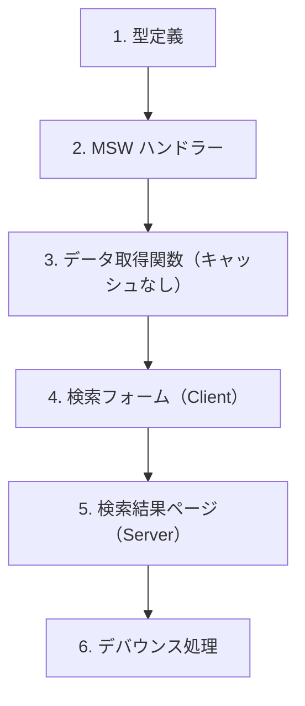

# 演習 3: 検索 API

## 目次

- [目標](#目標)
- [前提条件](#前提条件)
- [実装する機能](#実装する機能)
- [ステップ 1: 型定義](#ステップ-1-型定義)
  - [1.1 検索パラメータと結果の型を定義](#11-検索パラメータと結果の型を定義)
- [ステップ 2: MSW ハンドラー](#ステップ-2-msw-ハンドラー)
  - [2.1 検索ハンドラーを作成](#21-検索ハンドラーを作成)
  - [2.2 ハンドラーを追加](#22-ハンドラーを追加)
- [ステップ 3: データ取得関数](#ステップ-3-データ取得関数)
  - [3.1 検索 API クライアント](#31-検索-api-クライアント)
- [ステップ 4: 検索フォーム（Client Component）](#ステップ-4-検索フォームclient-component)
  - [4.1 検索フォームコンポーネント](#41-検索フォームコンポーネント)
  - [4.2 ヘッダーに検索フォームを配置](#42-ヘッダーに検索フォームを配置)
- [ステップ 5: 検索結果ページ（Server Component）](#ステップ-5-検索結果ページserver-component)
  - [5.1 検索結果ページを作成](#51-検索結果ページを作成)
  - [5.2 検索フィルターコンポーネント](#52-検索フィルターコンポーネント)
  - [5.3 ページネーションコンポーネント](#53-ページネーションコンポーネント)
  - [5.4 検索 loading.tsx](#54-検索-loadingtsx)
- [ステップ 6: デバウンス処理（発展）](#ステップ-6-デバウンス処理発展)
  - [6.1 useDebounce フック](#61-usedebounce-フック)
  - [6.2 デバウンス付き検索フォーム](#62-デバウンス付き検索フォーム)
- [確認チェックリスト](#確認チェックリスト)
- [トラブルシューティング](#トラブルシューティング)
  - [検索結果が表示されない](#検索結果が表示されない)
  - [フィルターが反映されない](#フィルターが反映されない)
- [発展課題](#発展課題)
- [完了条件](#完了条件)

## 目標

商品検索 API のモックを作成し、検索フォーム（Client Component）と検索結果ページ（Server Component）を実装します。検索はリアルタイム性が必要なため、キャッシュなし（`cache: 'no-store'`）で実装します。

---

## 前提条件

[演習 2: カテゴリ API](./02-category-api.md) が完了していることを確認してください。

---

## 実装する機能



---

## ステップ 1: 型定義

### 1.1 検索パラメータと結果の型を定義

```typescript
// types/search.ts
import type { Product } from "./product";

export type SearchParams = {
  q?: string;
  categoryId?: string;
  minPrice?: number;
  maxPrice?: number;
  sortBy?: "price" | "name" | "createdAt";
  order?: "asc" | "desc";
  page?: number;
  limit?: number;
};

export type SearchResult = {
  products: Product[];
  total: number;
  page: number;
  totalPages: number;
  hasNextPage: boolean;
  hasPrevPage: boolean;
};
```

---

## ステップ 2: MSW ハンドラー

### 2.1 検索ハンドラーを作成

```typescript
// mocks/handlers/search.ts
import { http, HttpResponse } from "msw";
import { products } from "../data/products";
import type { Product } from "@/types/product";

export const searchHandlers = [
  http.get("/api/search", ({ request }) => {
    const url = new URL(request.url);

    // クエリパラメータを取得
    const query = url.searchParams.get("q") || "";
    const categoryId = url.searchParams.get("categoryId");
    const minPrice = url.searchParams.get("minPrice");
    const maxPrice = url.searchParams.get("maxPrice");
    const sortBy = url.searchParams.get("sortBy") || "createdAt";
    const order = url.searchParams.get("order") || "desc";
    const page = parseInt(url.searchParams.get("page") || "1", 10);
    const limit = parseInt(url.searchParams.get("limit") || "12", 10);

    // キーワード検索
    let results = products.filter(
      (p) =>
        p.name.toLowerCase().includes(query.toLowerCase()) ||
        p.description.toLowerCase().includes(query.toLowerCase())
    );

    // カテゴリフィルター
    if (categoryId) {
      results = results.filter((p) => p.categoryId === categoryId);
    }

    // 価格フィルター
    if (minPrice) {
      results = results.filter((p) => p.price >= parseInt(minPrice, 10));
    }
    if (maxPrice) {
      results = results.filter((p) => p.price <= parseInt(maxPrice, 10));
    }

    // ソート
    results.sort((a, b) => {
      const aValue = a[sortBy as keyof Product];
      const bValue = b[sortBy as keyof Product];

      if (typeof aValue === "number" && typeof bValue === "number") {
        return order === "asc" ? aValue - bValue : bValue - aValue;
      }

      const aStr = String(aValue);
      const bStr = String(bValue);
      return order === "asc" ? aStr.localeCompare(bStr) : bStr.localeCompare(aStr);
    });

    // ページネーション
    const total = results.length;
    const totalPages = Math.ceil(total / limit);
    const start = (page - 1) * limit;
    const paginatedResults = results.slice(start, start + limit);

    return HttpResponse.json({
      products: paginatedResults,
      total,
      page,
      totalPages,
      hasNextPage: page < totalPages,
      hasPrevPage: page > 1,
    });
  }),
];
```

### 2.2 ハンドラーを追加

```typescript
// mocks/handlers/index.ts
import { productHandlers } from "./products";
import { categoryHandlers } from "./categories";
import { searchHandlers } from "./search";

export const handlers = [...productHandlers, ...categoryHandlers, ...searchHandlers];
```

---

## ステップ 3: データ取得関数

### 3.1 検索 API クライアント

検索結果はキャッシュしません（毎回新しいクエリ）。

```typescript
// lib/api/search.ts
import type { SearchParams, SearchResult } from "@/types/search";

const API_BASE_URL = process.env.API_BASE_URL || "http://localhost:3000";

export async function searchProducts(params: SearchParams): Promise<SearchResult> {
  const url = new URL(`${API_BASE_URL}/api/search`);

  // パラメータを URL に追加
  if (params.q) url.searchParams.set("q", params.q);
  if (params.categoryId) url.searchParams.set("categoryId", params.categoryId);
  if (params.minPrice) url.searchParams.set("minPrice", String(params.minPrice));
  if (params.maxPrice) url.searchParams.set("maxPrice", String(params.maxPrice));
  if (params.sortBy) url.searchParams.set("sortBy", params.sortBy);
  if (params.order) url.searchParams.set("order", params.order);
  if (params.page) url.searchParams.set("page", String(params.page));
  if (params.limit) url.searchParams.set("limit", String(params.limit));

  const response = await fetch(url.toString(), {
    cache: "no-store", // 検索はキャッシュしない
  });

  if (!response.ok) {
    throw new Error(`Search failed: ${response.status}`);
  }

  return response.json() as Promise<SearchResult>;
}
```

---

## ステップ 4: 検索フォーム（Client Component）

### 4.1 検索フォームコンポーネント

```tsx
// components/SearchForm.tsx
"use client";

import { useRouter, useSearchParams } from "next/navigation";
import { useState, useTransition, type FormEvent } from "react";

export function SearchForm(): React.ReactElement {
  const router = useRouter();
  const searchParams = useSearchParams();
  const [isPending, startTransition] = useTransition();

  const [query, setQuery] = useState(searchParams.get("q") || "");

  const handleSubmit = (e: FormEvent<HTMLFormElement>): void => {
    e.preventDefault();

    if (!query.trim()) return;

    startTransition(() => {
      router.push(`/search?q=${encodeURIComponent(query.trim())}`);
    });
  };

  return (
    <form
      onSubmit={handleSubmit}
      className="relative"
    >
      <input
        type="search"
        value={query}
        onChange={(e) => setQuery(e.target.value)}
        placeholder="商品を検索..."
        className="w-full rounded-lg border border-gray-300 px-4 py-2 pr-12 focus:border-transparent focus:ring-2 focus:ring-blue-500 focus:outline-none"
      />
      <button
        type="submit"
        disabled={isPending}
        className="absolute top-1/2 right-2 -translate-y-1/2 p-2 text-gray-500 hover:text-blue-600 disabled:opacity-50"
      >
        {isPending ? <span className="animate-spin">⏳</span> : <span>🔍</span>}
      </button>
    </form>
  );
}
```

### 4.2 ヘッダーに検索フォームを配置

```tsx
// components/Header.tsx
import Link from "next/link";
import { Suspense } from "react";
import { SearchForm } from "./SearchForm";

export function Header(): React.ReactElement {
  return (
    <header className="border-b border-gray-200 bg-white">
      <div className="container mx-auto flex items-center gap-8 px-4 py-4">
        <Link
          href="/"
          className="text-xl font-bold"
        >
          EC Store
        </Link>

        <div className="max-w-md flex-1">
          <Suspense fallback={<div className="h-10 rounded-lg bg-gray-100" />}>
            <SearchForm />
          </Suspense>
        </div>

        <nav className="flex gap-4">
          <Link
            href="/products"
            className="text-gray-600 hover:text-blue-600"
          >
            商品一覧
          </Link>
          <Link
            href="/cart"
            className="text-gray-600 hover:text-blue-600"
          >
            カート
          </Link>
        </nav>
      </div>
    </header>
  );
}
```

---

## ステップ 5: 検索結果ページ（Server Component）

### 5.1 検索結果ページを作成

```tsx
// app/search/page.tsx
import { searchProducts } from "@/lib/api/search";
import { ProductCard } from "@/components/ProductCard";
import { SearchFilters } from "@/components/SearchFilters";
import { Pagination } from "@/components/Pagination";

type Props = {
  searchParams: Promise<{
    q?: string;
    categoryId?: string;
    minPrice?: string;
    maxPrice?: string;
    sortBy?: string;
    order?: string;
    page?: string;
  }>;
};

export default async function SearchPage({ searchParams }: Props): Promise<React.ReactElement> {
  const params = await searchParams;

  const query = params.q || "";
  const page = parseInt(params.page || "1", 10);

  const result = await searchProducts({
    q: query,
    categoryId: params.categoryId,
    minPrice: params.minPrice ? parseInt(params.minPrice, 10) : undefined,
    maxPrice: params.maxPrice ? parseInt(params.maxPrice, 10) : undefined,
    sortBy: params.sortBy as "price" | "name" | "createdAt" | undefined,
    order: params.order as "asc" | "desc" | undefined,
    page,
    limit: 12,
  });

  return (
    <main className="container mx-auto px-4 py-8">
      <div className="mb-6">
        <h1 className="text-2xl font-bold">{query ? `「${query}」の検索結果` : "検索結果"}</h1>
        <p className="mt-1 text-gray-600">{result.total} 件の商品が見つかりました</p>
      </div>

      <div className="grid grid-cols-1 gap-8 lg:grid-cols-4">
        {/* フィルターサイドバー */}
        <aside className="lg:col-span-1">
          <SearchFilters />
        </aside>

        {/* 検索結果 */}
        <div className="lg:col-span-3">
          {result.products.length > 0 ? (
            <>
              <div className="grid grid-cols-1 gap-6 sm:grid-cols-2 lg:grid-cols-3">
                {result.products.map((product) => (
                  <ProductCard
                    key={product.id}
                    product={product}
                  />
                ))}
              </div>

              {result.totalPages > 1 && (
                <div className="mt-8">
                  <Pagination
                    currentPage={result.page}
                    totalPages={result.totalPages}
                    baseUrl={`/search?q=${encodeURIComponent(query)}`}
                  />
                </div>
              )}
            </>
          ) : (
            <div className="py-12 text-center">
              <p className="text-gray-600">該当する商品が見つかりませんでした</p>
              <p className="mt-2 text-sm text-gray-500">別のキーワードで検索してみてください</p>
            </div>
          )}
        </div>
      </div>
    </main>
  );
}
```

### 5.2 検索フィルターコンポーネント

```tsx
// components/SearchFilters.tsx
"use client";

import { useRouter, useSearchParams } from "next/navigation";
import { useState, type FormEvent } from "react";

export function SearchFilters(): React.ReactElement {
  const router = useRouter();
  const searchParams = useSearchParams();

  const [minPrice, setMinPrice] = useState(searchParams.get("minPrice") || "");
  const [maxPrice, setMaxPrice] = useState(searchParams.get("maxPrice") || "");
  const [sortBy, setSortBy] = useState(searchParams.get("sortBy") || "");

  const handleSubmit = (e: FormEvent<HTMLFormElement>): void => {
    e.preventDefault();

    const params = new URLSearchParams(searchParams.toString());

    if (minPrice) {
      params.set("minPrice", minPrice);
    } else {
      params.delete("minPrice");
    }

    if (maxPrice) {
      params.set("maxPrice", maxPrice);
    } else {
      params.delete("maxPrice");
    }

    if (sortBy) {
      params.set("sortBy", sortBy);
    } else {
      params.delete("sortBy");
    }

    // ページをリセット
    params.delete("page");

    router.push(`/search?${params.toString()}`);
  };

  const handleClear = (): void => {
    const query = searchParams.get("q");
    if (query) {
      router.push(`/search?q=${encodeURIComponent(query)}`);
    } else {
      router.push("/search");
    }
    setMinPrice("");
    setMaxPrice("");
    setSortBy("");
  };

  return (
    <form
      onSubmit={handleSubmit}
      className="space-y-6"
    >
      <div>
        <h3 className="mb-3 font-medium">価格帯</h3>
        <div className="flex items-center gap-2">
          <input
            type="number"
            value={minPrice}
            onChange={(e) => setMinPrice(e.target.value)}
            placeholder="最小"
            className="w-full rounded border border-gray-300 px-3 py-2"
          />
          <span>〜</span>
          <input
            type="number"
            value={maxPrice}
            onChange={(e) => setMaxPrice(e.target.value)}
            placeholder="最大"
            className="w-full rounded border border-gray-300 px-3 py-2"
          />
        </div>
      </div>

      <div>
        <h3 className="mb-3 font-medium">並び順</h3>
        <select
          value={sortBy}
          onChange={(e) => setSortBy(e.target.value)}
          className="w-full rounded border border-gray-300 px-3 py-2"
        >
          <option value="">新着順</option>
          <option value="price">価格が安い順</option>
          <option value="-price">価格が高い順</option>
          <option value="name">名前順</option>
        </select>
      </div>

      <div className="flex gap-2">
        <button
          type="submit"
          className="flex-1 rounded bg-blue-600 py-2 text-white hover:bg-blue-700"
        >
          絞り込む
        </button>
        <button
          type="button"
          onClick={handleClear}
          className="rounded border border-gray-300 px-4 py-2 hover:bg-gray-50"
        >
          クリア
        </button>
      </div>
    </form>
  );
}
```

### 5.3 ページネーションコンポーネント

```tsx
// components/Pagination.tsx
import Link from "next/link";

type Props = {
  currentPage: number;
  totalPages: number;
  baseUrl: string;
};

export function Pagination({ currentPage, totalPages, baseUrl }: Props): React.ReactElement {
  const pages = Array.from({ length: totalPages }, (_, i) => i + 1);

  const getPageUrl = (page: number): string => {
    const separator = baseUrl.includes("?") ? "&" : "?";
    return `${baseUrl}${separator}page=${page}`;
  };

  return (
    <nav className="flex justify-center gap-2">
      {currentPage > 1 && (
        <Link
          href={getPageUrl(currentPage - 1)}
          className="rounded border border-gray-300 px-4 py-2 hover:bg-gray-50"
        >
          前へ
        </Link>
      )}

      {pages.map((page) => (
        <Link
          key={page}
          href={getPageUrl(page)}
          className={`rounded border px-4 py-2 ${
            page === currentPage
              ? "border-blue-600 bg-blue-600 text-white"
              : "border-gray-300 hover:bg-gray-50"
          }`}
        >
          {page}
        </Link>
      ))}

      {currentPage < totalPages && (
        <Link
          href={getPageUrl(currentPage + 1)}
          className="rounded border border-gray-300 px-4 py-2 hover:bg-gray-50"
        >
          次へ
        </Link>
      )}
    </nav>
  );
}
```

### 5.4 検索 loading.tsx

```tsx
// app/search/loading.tsx
import { ProductCardSkeleton } from "@/components/ProductCardSkeleton";

export default function SearchLoading(): React.ReactElement {
  return (
    <main className="container mx-auto px-4 py-8">
      <div className="mb-6 animate-pulse">
        <div className="h-8 w-64 rounded bg-gray-200" />
        <div className="mt-1 h-5 w-32 rounded bg-gray-200" />
      </div>

      <div className="grid grid-cols-1 gap-8 lg:grid-cols-4">
        <aside className="lg:col-span-1">
          <div className="animate-pulse space-y-6">
            <div className="h-32 rounded bg-gray-200" />
            <div className="h-20 rounded bg-gray-200" />
          </div>
        </aside>

        <div className="lg:col-span-3">
          <div className="grid grid-cols-1 gap-6 sm:grid-cols-2 lg:grid-cols-3">
            {Array.from({ length: 6 }).map((_, i) => (
              <ProductCardSkeleton key={i} />
            ))}
          </div>
        </div>
      </div>
    </main>
  );
}
```

---

## ステップ 6: デバウンス処理（発展）

リアルタイム検索を実装する場合、デバウンスでリクエスト数を抑制します。

### 6.1 useDebounce フック

```typescript
// hooks/useDebounce.ts
import { useState, useEffect } from "react";

export function useDebounce<T>(value: T, delay: number): T {
  const [debouncedValue, setDebouncedValue] = useState(value);

  useEffect(() => {
    const timer = setTimeout(() => {
      setDebouncedValue(value);
    }, delay);

    return () => {
      clearTimeout(timer);
    };
  }, [value, delay]);

  return debouncedValue;
}
```

### 6.2 デバウンス付き検索フォーム

```tsx
// components/SearchFormWithDebounce.tsx
"use client";

import { useRouter, useSearchParams } from "next/navigation";
import { useState, useEffect } from "react";
import { useDebounce } from "@/hooks/useDebounce";

export function SearchFormWithDebounce(): React.ReactElement {
  const router = useRouter();
  const searchParams = useSearchParams();

  const [query, setQuery] = useState(searchParams.get("q") || "");
  const debouncedQuery = useDebounce(query, 300);

  useEffect(() => {
    if (debouncedQuery) {
      router.push(`/search?q=${encodeURIComponent(debouncedQuery)}`);
    }
  }, [debouncedQuery, router]);

  return (
    <input
      type="search"
      value={query}
      onChange={(e) => setQuery(e.target.value)}
      placeholder="商品を検索..."
      className="w-full rounded-lg border border-gray-300 px-4 py-2 focus:ring-2 focus:ring-blue-500 focus:outline-none"
    />
  );
}
```

---

## 確認チェックリスト

以下を確認してください。

- [ ] ヘッダーの検索フォームが動作する
- [ ] `/search?q=コーヒー` で検索結果が表示される
- [ ] 価格フィルターが動作する
- [ ] ソート機能が動作する
- [ ] ページネーションが動作する
- [ ] 該当なしの場合にメッセージが表示される

---

## トラブルシューティング

### 検索結果が表示されない

1. MSW ハンドラーが正しく登録されているか確認
2. `cache: 'no-store'` が設定されているか確認

### フィルターが反映されない

`useSearchParams` を使う場合は Suspense で囲む必要があります。

```tsx
<Suspense fallback={<div>Loading...</div>}>
  <SearchFilters />
</Suspense>
```

---

## 発展課題

1. **検索サジェスト**: 入力中に候補を表示
2. **検索履歴**: 過去の検索キーワードを保存（Jotai + localStorage）
3. **無限スクロール**: ページネーションの代わりに無限スクロール

---

## 完了条件

以下がすべて動作すれば、この演習は完了です。

- 検索フォームでキーワード検索ができる
- 価格フィルターで絞り込みができる
- ソート機能が動作する
- ページネーションが動作する

おめでとうございます！Phase 5 の演習が完了しました。

[チェックリスト](../checklist.md) で理解度を確認しましょう。
