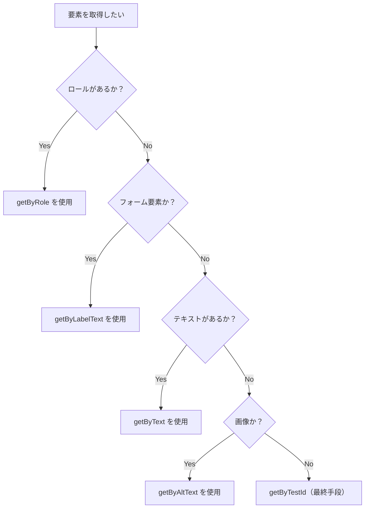

# Testing Library

## 概要

Testing Library は「ユーザーがアプリケーションを使用する方法」に基づいてテストを書くためのライブラリです。
実装の詳細ではなく、ユーザーが見る画面や行う操作をテストすることで、リファクタリングに強いテストを作成できます。

このセクションでは、React コンポーネントを Testing Library でテストする方法を学びます。

---

## Testing Library とは

### 設計思想

> "The more your tests resemble the way your software is used, the more confidence they can give you."
>
> テストがソフトウェアの実際の使用方法に近いほど、より信頼性の高いテストになる。

### 特徴

- DOM 要素をユーザーが認識する方法（ロール、テキスト、ラベル）でクエリする
- クラス名や内部構造ではなく、アクセシビリティ属性を使用する
- `getByRole` や `getByLabelText` などアクセシビリティ属性でクエリすることで a11y 対応も促進される

---

## 基本構文

### render と screen

```typescript
import { render, screen } from '@testing-library/react';
import { ProductCard } from './ProductCard';

it('商品名が表示される', () => {
  // コンポーネントを描画
  render(<ProductCard product={mockProduct} />);

  // screen からクエリを実行
  expect(screen.getByRole('heading', { name: 'Tシャツ' })).toBeInTheDocument();
});
```

### cleanup

Vitest では `@testing-library/react` が自動的に cleanup を実行するため、手動で呼び出す必要はありません。

---

## クエリの種類

### クエリのプレフィックス

| プレフィックス | 要素が存在しない場合 | 非同期 | 用途                       |
| -------------- | -------------------- | ------ | -------------------------- |
| `getBy`        | エラー               | No     | 要素が存在することを確認   |
| `queryBy`      | null を返す          | No     | 要素が存在しないことを確認 |
| `findBy`       | エラー               | Yes    | 非同期で要素を待機         |

### 複数要素のクエリ

| 単数形    | 複数形       | 説明                                     |
| --------- | ------------ | ---------------------------------------- |
| `getBy`   | `getAllBy`   | 複数要素を取得                           |
| `queryBy` | `queryAllBy` | 複数要素を取得（存在しない場合は空配列） |
| `findBy`  | `findAllBy`  | 非同期で複数要素を待機                   |

---

## クエリの優先順位

Testing Library では、以下の優先順位でクエリを選択することを推奨しています。

### 1. 誰でもアクセスできるクエリ（最優先）

```typescript
// 1. getByRole - アクセシビリティロール
screen.getByRole("button", { name: "カートに追加" });
screen.getByRole("heading", { level: 1, name: "商品詳細" });
screen.getByRole("link", { name: "トップページ" });

// 2. getByLabelText - フォーム要素のラベル
screen.getByLabelText("メールアドレス");

// 3. getByPlaceholderText - プレースホルダー
screen.getByPlaceholderText("検索...");

// 4. getByText - テキストコンテンツ
screen.getByText("¥1,000");

// 5. getByDisplayValue - フォームの現在値
screen.getByDisplayValue("test@example.com");
```

### 2. セマンティッククエリ

```typescript
// 6. getByAltText - 画像の alt 属性
screen.getByAltText("商品画像");

// 7. getByTitle - title 属性
screen.getByTitle("閉じる");
```

### 3. テスト ID（最終手段）

```typescript
// 8. getByTestId - data-testid 属性
screen.getByTestId("cart-badge");
```

### クエリ選択のフローチャート



---

## userEvent

### setup

```typescript
import userEvent from '@testing-library/user-event';

it('ボタンをクリックできる', async () => {
  // userEvent のセットアップ
  const user = userEvent.setup();

  render(<Counter />);

  // クリック
  await user.click(screen.getByRole('button', { name: '+1' }));

  expect(screen.getByText('1')).toBeInTheDocument();
});
```

### よく使う操作

```typescript
const user = userEvent.setup();

// クリック
await user.click(element);

// ダブルクリック
await user.dblClick(element);

// テキスト入力
await user.type(input, "テキスト");

// クリア後に入力
await user.clear(input);
await user.type(input, "新しいテキスト");

// キーボード操作
await user.keyboard("{Enter}");
await user.keyboard("{Tab}");

// ホバー
await user.hover(element);
await user.unhover(element);

// セレクトボックス
await user.selectOptions(select, "option-value");

// チェックボックス
await user.click(checkbox);
```

### fireEvent との違い

```typescript
// fireEvent: ブラウザイベントを直接発火（低レベル）
import { fireEvent } from "@testing-library/react";
fireEvent.click(button);

// userEvent: ユーザーの実際の操作をシミュレート（推奨）
import userEvent from "@testing-library/user-event";
await user.click(button);
```

userEvent を使うと以下の動作が発生する。

- フォーカス移動
- hover イベント
- 入力時の keydown/keypress/keyup

---

## 非同期処理の待機

### waitFor

```typescript
import { waitFor } from '@testing-library/react';

it('データをロードできる', async () => {
  render(<ProductList />);

  // 条件が満たされるまで待機
  await waitFor(() => {
    expect(screen.getByText('商品A')).toBeInTheDocument();
  });
});
```

### findBy

```typescript
it('データをロードできる', async () => {
  render(<ProductList />);

  // findBy は内部で waitFor を使用
  const product = await screen.findByText('商品A');
  expect(product).toBeInTheDocument();
});
```

### waitForElementToBeRemoved

```typescript
it('ローディングが消える', async () => {
  render(<ProductList />);

  // 要素が消えるまで待機
  await waitForElementToBeRemoved(() => screen.queryByText('読み込み中...'));

  expect(screen.getByText('商品A')).toBeInTheDocument();
});
```

---

## EC サイトでの活用例

### ProductCard コンポーネントのテスト

```typescript
// ProductCard.tsx
interface ProductCardProps {
  product: {
    id: string;
    name: string;
    price: number;
    imageUrl: string;
    isNew?: boolean;
    inStock: boolean;
  };
  onAddToCart?: (product: Product) => void;
}

export function ProductCard({ product, onAddToCart }: ProductCardProps): JSX.Element {
  return (
    <article>
      
      <h3>{product.name}</h3>
      <p>¥{product.price.toLocaleString()}</p>
      {product.isNew && <span>NEW</span>}
      <button
        onClick={() => onAddToCart?.(product)}
        disabled={!product.inStock}
      >
        {product.inStock ? 'カートに追加' : '売り切れ'}
      </button>
    </article>
  );
}
```

```typescript
// ProductCard.test.tsx
import { render, screen } from '@testing-library/react';
import userEvent from '@testing-library/user-event';
import { describe, it, expect, vi } from 'vitest';
import { ProductCard } from './ProductCard';

const mockProduct = {
  id: '1',
  name: 'プレミアム T シャツ',
  price: 3980,
  imageUrl: '/tshirt.jpg',
  isNew: false,
  inStock: true,
};

describe('ProductCard', () => {
  it('商品名が表示される', () => {
    render(<ProductCard product={mockProduct} />);

    expect(
      screen.getByRole('heading', { name: 'プレミアム T シャツ' })
    ).toBeInTheDocument();
  });

  it('価格が表示される', () => {
    render(<ProductCard product={mockProduct} />);

    expect(screen.getByText('¥3,980')).toBeInTheDocument();
  });

  it('商品画像に alt テキストがある', () => {
    render(<ProductCard product={mockProduct} />);

    expect(
      screen.getByRole('img', { name: 'プレミアム T シャツ' })
    ).toBeInTheDocument();
  });

  it('NEW バッジが表示される', () => {
    const newProduct = { ...mockProduct, isNew: true };
    render(<ProductCard product={newProduct} />);

    expect(screen.getByText('NEW')).toBeInTheDocument();
  });

  it('在庫切れ時はボタンが無効化される', () => {
    const soldOut = { ...mockProduct, inStock: false };
    render(<ProductCard product={soldOut} />);

    expect(
      screen.getByRole('button', { name: '売り切れ' })
    ).toBeDisabled();
  });

  it('カートに追加ボタンをクリックできる', async () => {
    const user = userEvent.setup();
    const onAddToCart = vi.fn();

    render(<ProductCard product={mockProduct} onAddToCart={onAddToCart} />);

    await user.click(
      screen.getByRole('button', { name: 'カートに追加' })
    );

    expect(onAddToCart).toHaveBeenCalledTimes(1);
    expect(onAddToCart).toHaveBeenCalledWith(mockProduct);
  });
});
```

---

## NG / OK パターン

### NG: 実装詳細に依存

```typescript
// NG: クラス名やデータ属性に依存
it('商品名が表示される', () => {
  const { container } = render(<ProductCard product={mockProduct} />);

  expect(container.querySelector('.product-name')).toHaveTextContent('Tシャツ');
});
```

### OK: ユーザー視点でクエリ

```typescript
// OK: ロールとアクセシブルな名前でクエリ
it('商品名が表示される', () => {
  render(<ProductCard product={mockProduct} />);

  expect(
    screen.getByRole('heading', { name: 'Tシャツ' })
  ).toBeInTheDocument();
});
```

### NG: getByTestId を多用

```typescript
// NG: すべてに data-testid を付与
it('商品情報が表示される', () => {
  render(<ProductCard product={mockProduct} />);

  expect(screen.getByTestId('product-name')).toHaveTextContent('Tシャツ');
  expect(screen.getByTestId('product-price')).toHaveTextContent('¥1,000');
  expect(screen.getByTestId('add-to-cart-button')).toBeEnabled();
});
```

### OK: 適切なクエリを選択

```typescript
// OK: セマンティックなクエリを使用
it('商品情報が表示される', () => {
  render(<ProductCard product={mockProduct} />);

  expect(screen.getByRole('heading', { name: 'Tシャツ' })).toBeInTheDocument();
  expect(screen.getByText('¥1,000')).toBeInTheDocument();
  expect(screen.getByRole('button', { name: 'カートに追加' })).toBeEnabled();
});
```

### NG: 不要な wrapper

```typescript
// NG: describe で過度にネスト
describe("ProductCard", () => {
  describe("rendering", () => {
    describe("when product is in stock", () => {
      describe("button", () => {
        it("should be enabled", () => {
          // ...
        });
      });
    });
  });
});
```

### OK: フラットで読みやすい構造

```typescript
// OK: 必要最小限のネスト
describe('ProductCard', () => {
  it('在庫がある場合、カートに追加ボタンが有効', () => {
    render(<ProductCard product={inStockProduct} />);
    expect(screen.getByRole('button', { name: 'カートに追加' })).toBeEnabled();
  });

  it('在庫切れの場合、ボタンが無効', () => {
    render(<ProductCard product={soldOutProduct} />);
    expect(screen.getByRole('button', { name: '売り切れ' })).toBeDisabled();
  });
});
```

---

## デバッグ

### screen.debug()

```typescript
it('デバッグ', () => {
  render(<ProductCard product={mockProduct} />);

  // DOM 全体を出力
  screen.debug();

  // 特定の要素を出力
  screen.debug(screen.getByRole('button'));
});
```

### logRoles

```typescript
import { logRoles } from '@testing-library/react';

it('ロールを確認', () => {
  const { container } = render(<ProductCard product={mockProduct} />);

  // 利用可能なロールを出力
  logRoles(container);
});
```

### Testing Playground

ブラウザ拡張機能を使って、最適なクエリを見つけることができます。

- [Testing Playground Chrome Extension](https://chrome.google.com/webstore/detail/testing-playground/hejbmebodbijjdhflfknehhcgaklhano)

---

## 確認質問

1. `getByRole` を優先すべき理由は何ですか？

   **回答例**: アクセシビリティロールはユーザー（特に支援技術を使用するユーザー）がアプリケーションを認識する方法と一致するため、より信頼性の高いテストになる。また、アクセシビリティの問題を早期に発見できる。

2. `findBy` と `getBy` の違いは何ですか？

   `getBy` は同期的なクエリであり、要素が見つからない場合は即座にエラーを投げる。`findBy` は非同期で、要素が現れるまで待機する（デフォルトで最大 1000ms）。

3. `userEvent.setup()` を使う理由は何ですか？

   **回答例**: `setup()` を使うと、ユーザーの実際の操作により近いシミュレーションができる。イベントの順序（keydown → keypress → keyup など）が正しく発火し、フォーカス移動も適切に行われる。

4. `queryBy` はいつ使いますか？

   要素が存在しないことをテストしたい場合に使う。`getBy` は要素が見つからないとエラーになる。一方、`queryBy` は `null` を返すため、`expect(element).not.toBeInTheDocument()` でアサーションできる。

---

## 次のステップ

Testing Library の基礎を学んだら、次は [Storybook + Vitest 連携](./03-storybook-vitest.md) でインタラクションテストを学びましょう。
