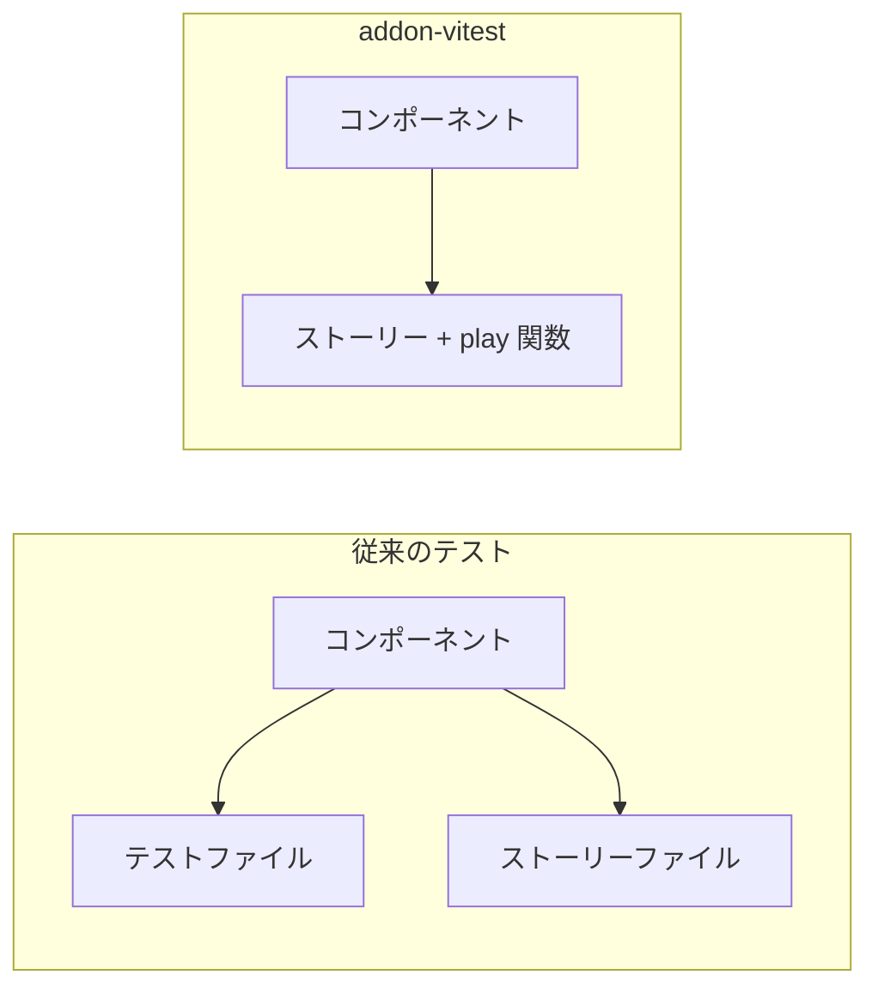

# Storybook + Vitest 連携

## 目次

- [概要](#概要)
- [addon-vitest とは](#addon-vitest-とは)
  - [特徴](#特徴)
  - [従来のテストとの違い](#従来のテストとの違い)
- [セットアップ](#セットアップ)
  - [インストール](#インストール)
  - [Storybook 設定](#storybook-設定)
  - [Vitest 設定](#vitest-設定)
- [play 関数の基本](#play-関数の基本)
  - [基本構造](#基本構造)
  - [canvasElement と within](#canvaselement-と-within)
- [@storybook/test API](#storybooktest-api)
  - [アサーション](#アサーション)
  - [userEvent](#userevent)
  - [fn() - モック関数](#fn---モック関数)
- [EC サイトでの活用例](#ec-サイトでの活用例)
  - [ProductCard のインタラクションテスト](#productcard-のインタラクションテスト)
  - [Modal のインタラクションテスト](#modal-のインタラクションテスト)
  - [フォームのインタラクションテスト](#フォームのインタラクションテスト)
- [複数ステップのテスト](#複数ステップのテスト)
  - [step 関数](#step-関数)
- [テストの実行](#テストの実行)
  - [Storybook UI で確認](#storybook-ui-で確認)
  - [Vitest で実行](#vitest-で実行)
- [NG / OK パターン](#ng--ok-パターン)
  - [NG: テストが長すぎる](#ng-テストが長すぎる)
  - [OK: 1つの play 関数に1つの目的](#ok-1つの-play-関数に1つの目的)
  - [NG: await を忘れる](#ng-await-を忘れる)
  - [OK: すべての非同期操作に await](#ok-すべての非同期操作に-await)
- [VRT（Visual Regression Testing）との関係](#vrtvisual-regression-testingとの関係)
- [確認質問](#確認質問)
- [次のステップ](#次のステップ)

## 概要

Storybook 10 では `@storybook/addon-vitest` を使って、ストーリーをそのままテストとして実行できます。
ストーリーに `play` 関数を追加することで、インタラクションテストを記述し、Vitest で実行できます。

このセクションでは、Storybook と Vitest を連携させ、コンポーネントのインタラクションテストを書く方法を学びます。

***

## addon-vitest とは

### 特徴

- 既存のストーリーをテストとして再利用できる
- play 関数でユーザーインタラクションを記述する
- `pnpm test` でストーリーのテストも実行できる
- 実際のブラウザでテストを実行可能

### 従来のテストとの違い



***

## セットアップ

### インストール

```bash
pnpm add -D @storybook/addon-vitest @storybook/test
```

### Storybook 設定

```typescript
// .storybook/main.ts
import type { StorybookConfig } from "@storybook/react-vite";

const config: StorybookConfig = {
  stories: ["../stories/**/*.stories.@(js|jsx|ts|tsx)"],
  addons: [
    "@storybook/addon-vitest",
    // 他のアドオン...
  ],
  framework: {
    name: "@storybook/react-vite",
    options: {},
  },
};

export default config;
```

### Vitest 設定

```typescript
// vitest.config.ts
import { defineConfig } from "vitest/config";
import { storybookTest } from "@storybook/addon-vitest/vitest-plugin";

export default defineConfig({
  plugins: [storybookTest()],
  test: {
    include: ["**/*.stories.?(m)[jt]s?(x)"],
    browser: {
      enabled: true,
      name: "chromium",
      provider: "playwright",
    },
  },
});
```

***

## play 関数の基本

### 基本構造

```typescript
import type { Meta, StoryObj } from "@storybook/react";
import { expect, within, userEvent } from "@storybook/test";
import { ProductCard } from "./ProductCard";

const meta: Meta<typeof ProductCard> = {
  component: ProductCard,
};
export default meta;

type Story = StoryObj<typeof ProductCard>;

export const ClickAddToCart: Story = {
  args: {
    product: mockProduct,
    onAddToCart: fn(), // モック関数
  },
  play: async ({ canvasElement, args }) => {
    // canvasElement からクエリを取得
    const canvas = within(canvasElement);

    // ボタンをクリック
    await userEvent.click(canvas.getByRole("button", { name: "カートに追加" }));

    // コールバックが呼ばれたことを確認
    await expect(args.onAddToCart).toHaveBeenCalledTimes(1);
  },
};
```

### canvasElement と within

```typescript
play: async ({ canvasElement }) => {
  // within() でストーリーの描画領域にスコープを限定
  const canvas = within(canvasElement);

  // canvas を使ってクエリ
  const button = canvas.getByRole("button");
};
```

***

## @storybook/test API

### アサーション

```typescript
import { expect } from "@storybook/test";

// 要素の存在
await expect(element).toBeInTheDocument();
await expect(element).toBeVisible();

// 要素の状態
await expect(button).toBeEnabled();
await expect(button).toBeDisabled();
await expect(checkbox).toBeChecked();

// テキスト
await expect(element).toHaveTextContent("テキスト");

// 関数の呼び出し
await expect(mockFn).toHaveBeenCalled();
await expect(mockFn).toHaveBeenCalledWith(arg1, arg2);
await expect(mockFn).toHaveBeenCalledTimes(1);
```

### userEvent

```typescript
import { userEvent } from "@storybook/test";

// クリック
await userEvent.click(element);

// テキスト入力
await userEvent.type(input, "テキスト");

// キーボード
await userEvent.keyboard("{Enter}");

// ホバー
await userEvent.hover(element);
```

### fn() - モック関数

```typescript
import { fn } from "@storybook/test";

export const WithCallback: Story = {
  args: {
    onClick: fn(), // モック関数を作成
  },
  play: async ({ args, canvasElement }) => {
    const canvas = within(canvasElement);

    await userEvent.click(canvas.getByRole("button"));

    // モック関数の呼び出しを検証
    await expect(args.onClick).toHaveBeenCalled();
  },
};
```

***

## EC サイトでの活用例

### ProductCard のインタラクションテスト

```typescript
// ProductCard.stories.tsx
import type { Meta, StoryObj } from "@storybook/react";
import { expect, fn, within, userEvent } from "@storybook/test";
import { ProductCard } from "./ProductCard";

const mockProduct = {
  id: "1",
  name: "プレミアム T シャツ",
  price: 3980,
  imageUrl: "/tshirt.jpg",
  isNew: true,
  inStock: true,
};

const meta: Meta<typeof ProductCard> = {
  component: ProductCard,
  args: {
    product: mockProduct,
  },
};
export default meta;

type Story = StoryObj<typeof ProductCard>;

// 基本表示
export const Default: Story = {};

// NEW バッジ表示
export const WithNewBadge: Story = {
  args: {
    product: { ...mockProduct, isNew: true },
  },
  play: async ({ canvasElement }) => {
    const canvas = within(canvasElement);

    await expect(canvas.getByText("NEW")).toBeVisible();
  },
};

// カートに追加
export const AddToCart: Story = {
  args: {
    onAddToCart: fn(),
  },
  play: async ({ args, canvasElement }) => {
    const canvas = within(canvasElement);

    // ボタンをクリック
    await userEvent.click(canvas.getByRole("button", { name: "カートに追加" }));

    // コールバックが正しい引数で呼ばれたことを確認
    await expect(args.onAddToCart).toHaveBeenCalledWith(
      expect.objectContaining({ id: "1", name: "プレミアム T シャツ" })
    );
  },
};

// 売り切れ
export const SoldOut: Story = {
  args: {
    product: { ...mockProduct, inStock: false },
  },
  play: async ({ canvasElement }) => {
    const canvas = within(canvasElement);

    const button = canvas.getByRole("button", { name: "売り切れ" });

    await expect(button).toBeDisabled();
  },
};
```

### Modal のインタラクションテスト

```typescript
// Modal.stories.tsx
import type { Meta, StoryObj } from "@storybook/react";
import { expect, fn, within, userEvent } from "@storybook/test";
import { Modal } from "./Modal";

const meta: Meta<typeof Modal> = {
  component: Modal,
  args: {
    isOpen: true,
    title: "確認",
    onClose: fn(),
  },
};
export default meta;

type Story = StoryObj<typeof Modal>;

export const CloseWithButton: Story = {
  play: async ({ args, canvasElement }) => {
    const canvas = within(canvasElement);

    // 閉じるボタンをクリック
    await userEvent.click(canvas.getByRole("button", { name: "閉じる" }));

    await expect(args.onClose).toHaveBeenCalledTimes(1);
  },
};

export const CloseWithEscape: Story = {
  play: async ({ args }) => {
    // Escape キーを押す
    await userEvent.keyboard("{Escape}");

    await expect(args.onClose).toHaveBeenCalledTimes(1);
  },
};

export const CloseWithBackdrop: Story = {
  play: async ({ args, canvasElement }) => {
    const canvas = within(canvasElement);

    // 背景をクリック
    await userEvent.click(canvas.getByTestId("modal-backdrop"));

    await expect(args.onClose).toHaveBeenCalledTimes(1);
  },
};
```

### フォームのインタラクションテスト

```typescript
// SearchForm.stories.tsx
import type { Meta, StoryObj } from "@storybook/react";
import { expect, fn, within, userEvent } from "@storybook/test";
import { SearchForm } from "./SearchForm";

const meta: Meta<typeof SearchForm> = {
  component: SearchForm,
  args: {
    onSearch: fn(),
  },
};
export default meta;

type Story = StoryObj<typeof SearchForm>;

export const SubmitSearch: Story = {
  play: async ({ args, canvasElement }) => {
    const canvas = within(canvasElement);

    // 検索ワードを入力
    await userEvent.type(canvas.getByRole("searchbox"), "Tシャツ");

    // 検索ボタンをクリック
    await userEvent.click(canvas.getByRole("button", { name: "検索" }));

    await expect(args.onSearch).toHaveBeenCalledWith("Tシャツ");
  },
};

export const SubmitWithEnter: Story = {
  play: async ({ args, canvasElement }) => {
    const canvas = within(canvasElement);

    // 検索ワードを入力して Enter
    await userEvent.type(canvas.getByRole("searchbox"), "Tシャツ{Enter}");

    await expect(args.onSearch).toHaveBeenCalledWith("Tシャツ");
  },
};

export const EmptySearchDisabled: Story = {
  play: async ({ canvasElement }) => {
    const canvas = within(canvasElement);

    // 空の状態では検索ボタンが無効
    await expect(canvas.getByRole("button", { name: "検索" })).toBeDisabled();
  },
};
```

***

## 複数ステップのテスト

### step 関数

```typescript
import { expect, within, userEvent, step } from "@storybook/test";

export const MultiStepInteraction: Story = {
  play: async ({ canvasElement }) => {
    const canvas = within(canvasElement);

    await step("商品を選択", async () => {
      await userEvent.click(canvas.getByText("商品A"));
      await expect(canvas.getByText("選択中: 商品A")).toBeVisible();
    });

    await step("数量を変更", async () => {
      await userEvent.type(canvas.getByLabelText("数量"), "3");
      await expect(canvas.getByText("合計: ¥3,000")).toBeVisible();
    });

    await step("カートに追加", async () => {
      await userEvent.click(canvas.getByRole("button", { name: "カートに追加" }));
      await expect(canvas.getByText("カートに追加しました")).toBeVisible();
    });
  },
};
```

***

## テストの実行

### Storybook UI で確認

```bash
pnpm storybook
```

Storybook の Interactions パネルで、play 関数の実行結果を確認できます。

### Vitest で実行

```bash
# すべてのストーリーテストを実行
pnpm test

# 特定のストーリーファイルをテスト
pnpm test ProductCard.stories.tsx

# watch モード
pnpm test --watch
```

***

## NG / OK パターン

### NG: テストが長すぎる

```typescript
// NG: 1つの play 関数に多すぎるアサーション
play: async ({ canvasElement }) => {
  const canvas = within(canvasElement);

  // 10個以上のアサーション...
  await expect(canvas.getByText("A")).toBeVisible();
  await expect(canvas.getByText("B")).toBeVisible();
  // ... さらに続く
};
```

### OK: 1つの play 関数に1つの目的

```typescript
// OK: 各ストーリーが1つの目的を持つ
export const DisplaysProductName: Story = {
  play: async ({ canvasElement }) => {
    const canvas = within(canvasElement);
    await expect(canvas.getByRole("heading")).toHaveTextContent("Tシャツ");
  },
};

export const DisplaysPrice: Story = {
  play: async ({ canvasElement }) => {
    const canvas = within(canvasElement);
    await expect(canvas.getByText("¥1,000")).toBeVisible();
  },
};
```

### NG: await を忘れる

```typescript
// NG: await がない
play: async ({ canvasElement }) => {
  const canvas = within(canvasElement);

  userEvent.click(button); // await がない！
  expect(result).toBeVisible(); // await がない！
};
```

### OK: すべての非同期操作に await

```typescript
// OK: await を付ける
play: async ({ canvasElement }) => {
  const canvas = within(canvasElement);

  await userEvent.click(button);
  await expect(result).toBeVisible();
};
```

***

## VRT（Visual Regression Testing）との関係

Storybook のテストには2つの側面があります。

| テスト種別    | ツール                    | 検証内容         |
| -------- | ---------------------- | ------------ |
| インタラクション | addon-vitest + play 関数 | 機能が正しく動作するか  |
| ビジュアル    | Chromatic / reg-suit   | 見た目が変わっていないか |

このセクションではインタラクションテストを扱いました。
VRT については Phase 12 で学習します。

***

## 確認質問

1. `play` 関数はいつ実行されますか？

   **回答例**: Storybook UI ではストーリーが表示された後に自動実行される。Vitest で実行する場合は、テストランナーがストーリーをレンダリングした後に実行される。

2. `within(canvasElement)` の役割は何ですか？

   **回答例**: ストーリーの描画領域にクエリのスコープを限定する。これにより、Storybook のUI要素ではなく、テスト対象のコンポーネント内の要素のみをクエリできる。

3. ストーリーをテストに使うメリットは何ですか？

   **回答例**: ストーリーとテストを別々に書く必要がなくなり、メンテナンスコストが下がる。また、ストーリーを視覚的に確認しながらテストを書けるため、開発体験が向上する。

4. `fn()` はいつ使いますか？

   **回答例**: コールバック関数（onClick, onChange など）をモックしたい場合に使う。`fn()` で作成したモック関数は、呼び出し回数や引数を検証できる。

***

## 次のステップ

Storybook + Vitest 連携を学んだら、次は [Playwright 基礎](./04-playwright-basics.md) で E2E テストを学びましょう。
