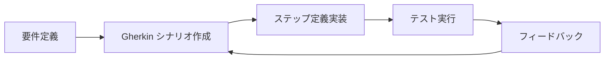

# playwright-bdd で Gherkin シナリオ

## 目次

- [概要](#概要)
- [BDD とは](#bdd-とは)
  - [Behavior Driven Development](#behavior-driven-development)
  - [メリット](#メリット)
- [Gherkin 構文](#gherkin-構文)
  - [基本構造](#基本構造)
  - [キーワード](#キーワード)
- [セットアップ](#セットアップ)
  - [インストール](#インストール)
  - [プロジェクト構造](#プロジェクト構造)
  - [Playwright 設定](#playwright-設定)
- [EC サイトでの Gherkin シナリオ](#ec-サイトでの-gherkin-シナリオ)
  - [カート機能](#カート機能)
  - [購入フロー](#購入フロー)
  - [検索機能](#検索機能)
- [ステップ定義](#ステップ定義)
  - [基本構造](#基本構造-1)
  - [カート関連のステップ](#カート関連のステップ)
  - [データテーブルの処理](#データテーブルの処理)
  - [Scenario Outline のパラメータ](#scenario-outline-のパラメータ)
- [テストの実行](#テストの実行)
- [タグ](#タグ)
  - [タグの付け方](#タグの付け方)
  - [タグでフィルター](#タグでフィルター)
- [ベストプラクティス](#ベストプラクティス)
  - [1. シナリオは独立させる](#1-シナリオは独立させる)
  - [2. 技術詳細を避ける](#2-技術詳細を避ける)
  - [3. 再利用可能なステップ](#3-再利用可能なステップ)
- [確認質問](#確認質問)
- [次のステップ](#次のステップ)

## 概要

playwright-bddはPlaywrightとGherkinを組み合わせたBDD（Behavior Driven Development）テストフレームワークです。
自然言語に近いGherkin構文でテストシナリオを記述し、非エンジニアとも共有しやすいテストを作成できます。

このセクションでは、ECサイトの購入フローをGherkinシナリオで記述する方法を学びます。

***

## BDD とは

### Behavior Driven Development

BDDは、ソフトウェアの振る舞い（Behavior）を中心にテストを記述する開発手法です。



### メリット

- 開発者、QA、ビジネス担当者が同じ言語でテストを理解できる（共通言語）
- シナリオ自体が仕様書として機能する（ドキュメント）
- 技術詳細ではなくユーザーの行動を記述できる（ユーザー視点）

***

## Gherkin 構文

### 基本構造

```gherkin
Feature: 機能名
  機能の説明

  Background:
    各シナリオの前に実行される共通ステップ

  Scenario: シナリオ名
    Given 前提条件
    When 操作
    Then 期待結果
    And 追加の条件/操作/結果
```

### キーワード

| キーワード        | 意味         | 例              |
| ------------ | ---------- | -------------- |
| `Feature`    | 機能・テスト対象   | ショッピングカート      |
| `Background` | 共通の前提条件    | ログイン済み         |
| `Scenario`   | テストケース     | 商品をカートに追加する    |
| `Given`      | 前提条件       | 商品詳細ページを表示している |
| `When`       | ユーザーの操作    | カートに追加ボタンをクリック |
| `Then`       | 期待される結果    | カートに商品が追加される   |
| `And`        | 直前と同じ種類の追加 | カートアイコンに「1」と表示 |
| `But`        | 否定的な条件/結果  | エラーは表示されない     |

***

## セットアップ

### インストール

```bash
pnpm add -D playwright-bdd
```

### プロジェクト構造

```text
e2e/
├── features/           # Gherkin ファイル
│   ├── cart.feature
│   └── purchase.feature
├── steps/              # ステップ定義
│   ├── cart.steps.ts
│   └── common.steps.ts
└── playwright.config.ts
```

### Playwright 設定

```typescript
// playwright.config.ts
import { defineConfig } from "@playwright/test";
import { defineBddConfig } from "playwright-bdd";

const testDir = defineBddConfig({
  features: "e2e/features/**/*.feature",
  steps: "e2e/steps/**/*.ts",
});

export default defineConfig({
  testDir,
  use: {
    baseURL: "http://localhost:3000",
  },
});
```

***

## EC サイトでの Gherkin シナリオ

### カート機能

```gherkin
# e2e/features/cart.feature

Feature: ショッピングカート
  EC サイトのユーザーとして、
  商品をカートに追加・管理したい

  Background:
    Given トップページを表示している

  Scenario: 商品をカートに追加する
    Given 商品「プレミアム T シャツ」の詳細ページを表示している
    When 「カートに追加」ボタンをクリックする
    Then 「カートに追加しました」というメッセージが表示される
    And カートアイコンに「1」と表示される

  Scenario: カートの商品数量を変更する
    Given カートに「プレミアム T シャツ」が 1 点入っている
    When 数量を「3」に変更する
    Then 合計金額が「¥11,940」になる

  Scenario: カートから商品を削除する
    Given カートに「プレミアム T シャツ」が 1 点入っている
    When 「削除」ボタンをクリックする
    Then カートが空になる
    And 「カートに商品がありません」と表示される
```

### 購入フロー

```gherkin
# e2e/features/purchase.feature

Feature: 購入フロー
  会員ユーザーとして、
  カートの商品を購入したい

  Background:
    Given ログイン済みである
    And カートに商品が 1 点入っている

  Scenario: 購入を完了する
    Given カートページを表示している
    When 「購入手続きへ」ボタンをクリックする
    And 配送先情報を入力する
      | 項目     | 値                   |
      | お名前   | テスト 太郎          |
      | 郵便番号 | 100-0001             |
      | 住所     | 東京都千代田区...    |
    And 「次へ」ボタンをクリックする
    And 支払い方法で「クレジットカード」を選択する
    And 「次へ」ボタンをクリックする
    And 「注文を確定する」ボタンをクリックする
    Then 注文完了ページが表示される
    And 「ご注文ありがとうございます」と表示される
    And 注文番号が表示される

  Scenario: 在庫切れ商品がある場合は購入できない
    Given カートに在庫切れ商品が含まれている
    When 「購入手続きへ」ボタンをクリックする
    Then 「在庫切れの商品があります」というエラーが表示される
    And 購入手続きに進めない
```

### 検索機能

```gherkin
# e2e/features/search.feature

Feature: 商品検索
  ユーザーとして、
  キーワードで商品を検索したい

  Scenario: キーワードで検索する
    Given トップページを表示している
    When 検索ボックスに「Tシャツ」と入力する
    And 検索ボタンをクリックする
    Then 検索結果ページが表示される
    And 「Tシャツ」を含む商品が表示される

  Scenario: 検索結果が 0 件の場合
    Given トップページを表示している
    When 検索ボックスに「存在しない商品名」と入力する
    And 検索ボタンをクリックする
    Then 「検索結果がありません」と表示される

  Scenario Outline: カテゴリでフィルターする
    Given 検索結果ページを表示している
    When カテゴリ「<category>」でフィルターする
    Then 「<category>」カテゴリの商品のみが表示される

    Examples:
      | category |
      | トップス |
      | ボトムス |
      | シューズ |
```

***

## ステップ定義

### 基本構造

```typescript
// e2e/steps/common.steps.ts
import { Given, When, Then } from "@playwright/test";
import { createBdd } from "playwright-bdd";

const { Given, When, Then } = createBdd();

Given("トップページを表示している", async ({ page }) => {
  await page.goto("/");
});

Given("ログイン済みである", async ({ page }) => {
  await page.goto("/login");
  await page.getByLabel("メールアドレス").fill("test@example.com");
  await page.getByLabel("パスワード").fill("password123");
  await page.getByRole("button", { name: "ログイン" }).click();
  await page.waitForURL("/");
});
```

### カート関連のステップ

```typescript
// e2e/steps/cart.steps.ts
import { expect } from "@playwright/test";
import { Given, When, Then, createBdd } from "playwright-bdd";

const { Given, When, Then } = createBdd();

Given("商品「{string}」の詳細ページを表示している", async ({ page }, productName: string) => {
  // 商品一覧から該当商品を探してクリック
  await page.goto("/products");
  await page.getByRole("article").filter({ hasText: productName }).click();
});

Given(
  "カートに「{string}」が {int} 点入っている",
  async ({ page }, productName: string, quantity: number) => {
    // カートに商品を追加するAPIを直接呼ぶ、またはUIで追加
    await page.goto("/products");
    await page.getByRole("article").filter({ hasText: productName }).click();

    for (let i = 0; i < quantity; i++) {
      await page.getByRole("button", { name: "カートに追加" }).click();
    }
  }
);

When("「{string}」ボタンをクリックする", async ({ page }, buttonName: string) => {
  await page.getByRole("button", { name: buttonName }).click();
});

When("数量を「{int}」に変更する", async ({ page }, quantity: number) => {
  await page.getByLabel("数量").fill(quantity.toString());
});

Then("「{string}」というメッセージが表示される", async ({ page }, message: string) => {
  await expect(page.getByText(message)).toBeVisible();
});

Then("カートアイコンに「{int}」と表示される", async ({ page }, count: number) => {
  await expect(page.getByTestId("cart-badge")).toHaveText(count.toString());
});

Then("カートが空になる", async ({ page }) => {
  await expect(page.getByRole("article")).toHaveCount(0);
});

Then("合計金額が「{string}」になる", async ({ page }, amount: string) => {
  await expect(page.getByTestId("cart-total")).toHaveText(amount);
});
```

### データテーブルの処理

```typescript
// e2e/steps/purchase.steps.ts
import { DataTable } from "@cucumber/cucumber";
import { When, createBdd } from "playwright-bdd";

const { When } = createBdd();

When("配送先情報を入力する", async ({ page }, dataTable: DataTable) => {
  const rows = dataTable.rows();

  for (const [label, value] of rows) {
    await page.getByLabel(label).fill(value);
  }
});
```

### Scenario Outline のパラメータ

```typescript
// Scenario Outline の Examples で定義されたパラメータを受け取る
When("カテゴリ「{string}」でフィルターする", async ({ page }, category: string) => {
  await page.getByLabel("カテゴリ").selectOption(category);
});

Then("「{string}」カテゴリの商品のみが表示される", async ({ page }, category: string) => {
  const products = page.getByRole("article");
  const count = await products.count();

  for (let i = 0; i < count; i++) {
    await expect(products.nth(i)).toContainText(category);
  }
});
```

***

## テストの実行

```bash
# feature ファイルからテストコードを生成
npx bddgen

# テスト実行
npx playwright test

# 特定の feature ファイルのみ
npx playwright test --grep "ショッピングカート"

# タグでフィルター
npx playwright test --grep "@smoke"
```

***

## タグ

### タグの付け方

```gherkin
@smoke @cart
Feature: ショッピングカート

  @critical
  Scenario: 商品をカートに追加する
    Given ...

  @slow
  Scenario: 大量の商品を追加する
    Given ...
```

### タグでフィルター

```bash
# @smoke タグのテストのみ実行
npx playwright test --grep "@smoke"

# @slow タグを除外
npx playwright test --grep-invert "@slow"
```

***

## ベストプラクティス

### 1. シナリオは独立させる

```gherkin
# NG: 前のシナリオに依存
Scenario: 商品を追加
  When カートに追加する

Scenario: 商品を削除
  # 前のシナリオで追加した商品に依存
  When カートから削除する

# OK: 各シナリオが独立
Scenario: 商品を追加
  Given 商品詳細ページを表示している
  When カートに追加する
  Then カートに商品がある

Scenario: 商品を削除
  Given カートに商品がある
  When カートから削除する
  Then カートが空になる
```

### 2. 技術詳細を避ける

```gherkin
# NG: 技術詳細が露出
Scenario: 商品を追加
  When "#add-to-cart-btn" をクリックする
  Then localStorage に商品データがある

# OK: ビジネス言語で記述
Scenario: 商品を追加
  When 「カートに追加」ボタンをクリックする
  Then カートに商品が追加される
```

### 3. 再利用可能なステップ

```gherkin
# 共通のステップを再利用
Given ログイン済みである
Given カートに商品が {int} 点入っている
When 「{string}」ボタンをクリックする
Then 「{string}」というメッセージが表示される
```

***

## 確認質問

1. Given / When / Thenそれぞれの役割は何ですか？

   `Given` はテストの前提条件（初期状態）を設定する。`When` はユーザーが行う操作を記述する。`Then` は操作の結果として期待される状態を記述する。

2. BackgroundとScenarioの違いは何ですか？

   `Background` はFeature内のすべてのScenarioの前に実行される共通のステップである。各Scenarioで繰り返し書く必要がある前提条件を一箇所にまとめられる。

3. Gherkinを使うメリットは何ですか？

   自然言語に近い記述ができるため、非エンジニア（ビジネス担当者、QA）もテスト内容を理解・レビューできる。また、シナリオ自体が仕様書として機能し、ドキュメントとテストを一元管理できる。

4. Scenario Outlineはいつ使いますか？

   同じシナリオを異なるデータで複数回実行したい場合に使う。`Examples` テーブルでパラメータを定義し、テストケースを効率的に記述できる。

***

## 次のステップ

playwright-bddを学んだら、次は [Property-based Testing（fast-check）](./06-fast-check.md) でエッジケースを自動検出する方法を学びましょう。
