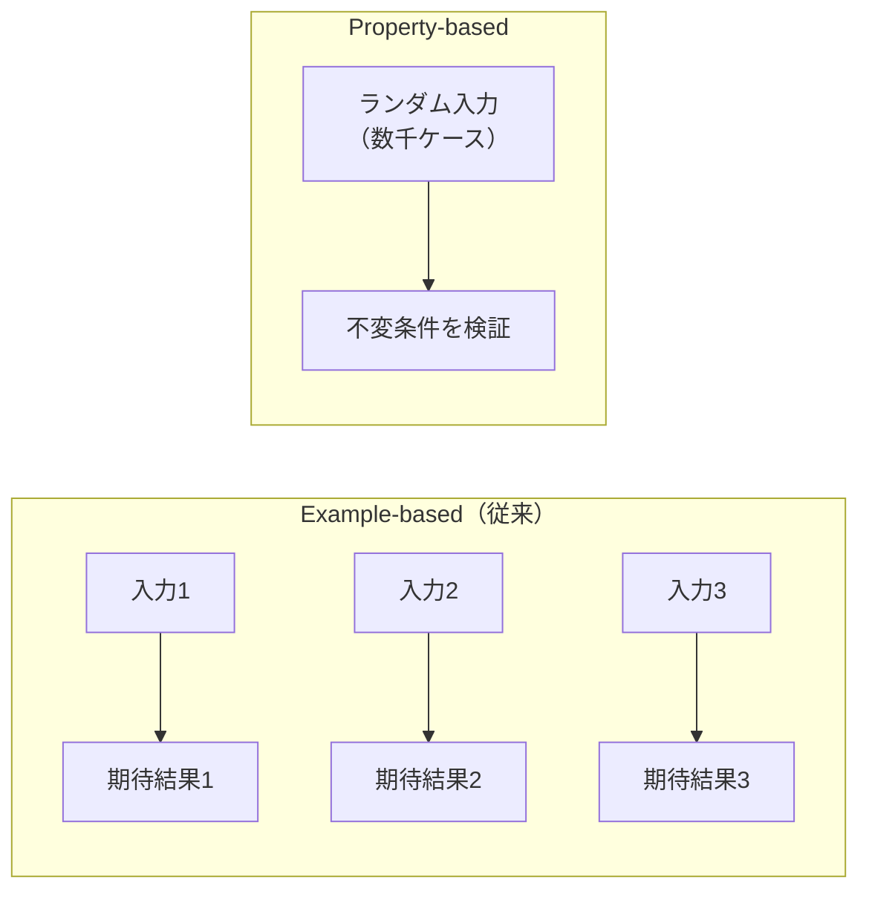

# Property-based Testing（fast-check）

## 目次

- [概要](#概要)
- [Property-based Testing とは](#property-based-testing-とは)
  - [従来のテストとの違い](#従来のテストとの違い)
  - [Example-based テスト（従来）](#example-based-テスト従来)
  - [Property-based テスト](#property-based-テスト)
- [セットアップ](#セットアップ)
- [基本構文](#基本構文)
  - [fc.assert と fc.property](#fcassert-と-fcproperty)
  - [複数の Arbitrary](#複数の-arbitrary)
- [Arbitrary（生成器）](#arbitrary生成器)
  - [基本型](#基本型)
  - [コレクション型](#コレクション型)
  - [オブジェクト](#オブジェクト)
  - [特殊な型](#特殊な型)
- [EC サイトでの活用例](#ec-サイトでの活用例)
  - [価格計算ロジック](#価格計算ロジック)
  - [バリデーション](#バリデーション)
- [カスタム Arbitrary](#カスタム-arbitrary)
  - [商品データの Arbitrary](#商品データの-arbitrary)
  - [条件付き生成](#条件付き生成)
  - [変換](#変換)
- [エラーの再現](#エラーの再現)
- [設定オプション](#設定オプション)
- [不変条件の例](#不変条件の例)
  - [よくある不変条件パターン](#よくある不変条件パターン)
- [確認質問](#確認質問)
- [次のステップ](#次のステップ)

## 概要

Property-based Testing は、ランダムな入力データを自動生成してテストする手法です。
手動で考えたテストケースでは見落としがちなエッジケースを自動的に発見できます。

fast-check は JavaScript/TypeScript で Property-based Testing を行うためのライブラリです。

***

## Property-based Testing とは

### 従来のテストとの違い



### Example-based テスト（従来）

```typescript
// 手動でテストケースを考える
test("価格計算", () => {
  expect(calculateTotal(100, 2)).toBe(200);
  expect(calculateTotal(250, 3)).toBe(750);
  expect(calculateTotal(0, 1)).toBe(0);
});
// → テストケースの漏れがあるかもしれない
```

### Property-based テスト

```typescript
// 不変条件（プロパティ）を定義
test("価格計算の不変条件", () => {
  fc.assert(
    fc.property(
      fc.integer({ min: 0, max: 100000 }),
      fc.integer({ min: 1, max: 100 }),
      (price, quantity) => {
        const total = calculateTotal(price, quantity);
        // 不変条件: 合計は常に 価格 × 数量 と等しい
        return total === price * quantity;
      }
    )
  );
});
// → 何千もの組み合わせを自動テスト
```

***

## セットアップ

```bash
pnpm add -D fast-check
```

***

## 基本構文

### fc.assert と fc.property

```typescript
import * as fc from "fast-check";
import { describe, it } from "vitest";

describe("Property-based テスト", () => {
  it("不変条件をテスト", () => {
    fc.assert(
      fc.property(
        fc.integer(), // ランダムな整数を生成
        (n) => {
          // 不変条件: n + 0 = n
          return n + 0 === n;
        }
      )
    );
  });
});
```

### 複数の Arbitrary

```typescript
fc.assert(
  fc.property(
    fc.integer(), // 第1引数
    fc.string(), // 第2引数
    fc.boolean(), // 第3引数
    (num, str, bool) => {
      // num, str, bool を使ってテスト
      return true;
    }
  )
);
```

***

## Arbitrary（生成器）

### 基本型

```typescript
// 整数
fc.integer(); // 任意の整数
fc.integer({ min: 0, max: 100 }); // 範囲指定
fc.nat(); // 自然数（0以上）
fc.nat({ max: 1000 }); // 最大値指定

// 浮動小数点
fc.float();
fc.double();

// 文字列
fc.string(); // 任意の文字列
fc.string({ minLength: 1, maxLength: 100 });
fc.hexaString(); // 16進数文字列
fc.uuid(); // UUID

// 真偽値
fc.boolean();

// 定数
fc.constant("固定値");
```

### コレクション型

```typescript
// 配列
fc.array(fc.integer()); // 整数の配列
fc.array(fc.string(), { minLength: 1, maxLength: 10 });

// Set
fc.set(fc.integer());

// Map
fc.dictionary(fc.string(), fc.integer());

// タプル
fc.tuple(fc.integer(), fc.string(), fc.boolean());
```

### オブジェクト

```typescript
// レコード
fc.record({
  id: fc.uuid(),
  name: fc.string({ minLength: 1, maxLength: 100 }),
  price: fc.integer({ min: 0, max: 10000000 }),
  quantity: fc.integer({ min: 1, max: 100 }),
});

// 部分的なオブジェクト
fc.record(
  {
    id: fc.string(),
    name: fc.string(),
    optional: fc.string(),
  },
  { requiredKeys: ["id", "name"] } // optional は省略可能
);
```

### 特殊な型

```typescript
// メールアドレス
fc.emailAddress();

// URL
fc.webUrl();

// 日付
fc.date();
fc.date({ min: new Date("2020-01-01"), max: new Date("2025-12-31") });

// JSON
fc.json();
fc.jsonValue();

// null / undefined を含む
fc.option(fc.string()); // string | null
```

***

## EC サイトでの活用例

### 価格計算ロジック

```typescript
// pricing.ts
export function calculateTotal(items: Array<{ price: number; quantity: number }>): number {
  return items.reduce((total, item) => total + item.price * item.quantity, 0);
}

export function applyDiscount(price: number, discountPercent: number): number {
  if (discountPercent < 0 || discountPercent > 100) {
    throw new Error("Invalid discount percent");
  }
  return Math.floor(price * (1 - discountPercent / 100));
}

export function calculateTax(subtotal: number, taxRate: number = 0.1): number {
  return Math.floor(subtotal * taxRate);
}
```

```typescript
// pricing.property.test.ts
import * as fc from "fast-check";
import { describe, it, expect } from "vitest";
import { calculateTotal, applyDiscount, calculateTax } from "./pricing";

describe("価格計算 Property-based テスト", () => {
  describe("calculateTotal", () => {
    it("合計金額は常に 0 以上", () => {
      fc.assert(
        fc.property(
          fc.array(
            fc.record({
              price: fc.integer({ min: 0, max: 10000000 }),
              quantity: fc.integer({ min: 1, max: 100 }),
            }),
            { minLength: 0, maxLength: 50 }
          ),
          (items) => {
            const total = calculateTotal(items);
            return total >= 0;
          }
        )
      );
    });

    it("商品がなければ合計は 0", () => {
      expect(calculateTotal([])).toBe(0);
    });

    it("各商品の小計の合計と一致する", () => {
      fc.assert(
        fc.property(
          fc.array(
            fc.record({
              price: fc.integer({ min: 0, max: 10000 }),
              quantity: fc.integer({ min: 1, max: 10 }),
            }),
            { minLength: 1, maxLength: 10 }
          ),
          (items) => {
            const total = calculateTotal(items);
            const expected = items.reduce((sum, item) => sum + item.price * item.quantity, 0);
            return total === expected;
          }
        )
      );
    });
  });

  describe("applyDiscount", () => {
    it("割引後の価格は元の価格以下", () => {
      fc.assert(
        fc.property(
          fc.integer({ min: 0, max: 10000000 }),
          fc.integer({ min: 0, max: 100 }),
          (price, discountPercent) => {
            const discounted = applyDiscount(price, discountPercent);
            return discounted <= price;
          }
        )
      );
    });

    it("割引後の価格は 0 以上", () => {
      fc.assert(
        fc.property(
          fc.integer({ min: 0, max: 10000000 }),
          fc.integer({ min: 0, max: 100 }),
          (price, discountPercent) => {
            const discounted = applyDiscount(price, discountPercent);
            return discounted >= 0;
          }
        )
      );
    });

    it("0% 割引は元の価格と同じ", () => {
      fc.assert(
        fc.property(fc.integer({ min: 0, max: 10000000 }), (price) => {
          return applyDiscount(price, 0) === price;
        })
      );
    });

    it("100% 割引は 0", () => {
      fc.assert(
        fc.property(fc.integer({ min: 0, max: 10000000 }), (price) => {
          return applyDiscount(price, 100) === 0;
        })
      );
    });
  });

  describe("calculateTax", () => {
    it("税額は小計の taxRate 倍（切り捨て）", () => {
      fc.assert(
        fc.property(
          fc.integer({ min: 0, max: 10000000 }),
          fc.double({ min: 0, max: 0.5, noNaN: true }),
          (subtotal, taxRate) => {
            const tax = calculateTax(subtotal, taxRate);
            const expected = Math.floor(subtotal * taxRate);
            return tax === expected;
          }
        )
      );
    });

    it("税額は常に 0 以上", () => {
      fc.assert(
        fc.property(fc.integer({ min: 0, max: 10000000 }), (subtotal) => {
          const tax = calculateTax(subtotal);
          return tax >= 0;
        })
      );
    });
  });
});
```

### バリデーション

```typescript
// validation.property.test.ts
import * as fc from "fast-check";
import { describe, it, expect } from "vitest";
import { validateEmail, validatePostalCode } from "./validation";

describe("バリデーション Property-based テスト", () => {
  describe("validateEmail", () => {
    it("有効なメールアドレスは常にパスする", () => {
      fc.assert(
        fc.property(fc.emailAddress(), (email) => {
          const result = validateEmail(email);
          return result.success === true;
        })
      );
    });

    it("任意の文字列でクラッシュしない", () => {
      fc.assert(
        fc.property(fc.string(), (input) => {
          // エラーをスローしないことを確認
          const result = validateEmail(input);
          return typeof result.success === "boolean";
        })
      );
    });
  });

  describe("validatePostalCode", () => {
    it("正しい形式の郵便番号は常にパスする", () => {
      fc.assert(
        fc.property(
          fc.tuple(fc.integer({ min: 100, max: 999 }), fc.integer({ min: 0, max: 9999 })),
          ([first, second]) => {
            const postalCode = `${first}-${second.toString().padStart(4, "0")}`;
            const result = validatePostalCode(postalCode);
            return result.success === true;
          }
        )
      );
    });
  });
});
```

***

## カスタム Arbitrary

### 商品データの Arbitrary

```typescript
// 商品の Arbitrary
const productArbitrary = fc.record({
  id: fc.uuid(),
  name: fc.string({ minLength: 1, maxLength: 200 }),
  price: fc.integer({ min: 0, max: 100000000 }),
  description: fc.string({ maxLength: 2000 }),
  category: fc.constantFrom("tops", "bottoms", "shoes", "accessories"),
  inStock: fc.boolean(),
  quantity: fc.integer({ min: 0, max: 1000 }),
});

// カートアイテムの Arbitrary
const cartItemArbitrary = fc.record({
  product: productArbitrary,
  quantity: fc.integer({ min: 1, max: 100 }),
});

// テストで使用
it("カートの合計が正しい", () => {
  fc.assert(
    fc.property(fc.array(cartItemArbitrary, { minLength: 0, maxLength: 20 }), (items) => {
      const total = calculateCartTotal(items);
      const expected = items.reduce((sum, item) => sum + item.product.price * item.quantity, 0);
      return total === expected;
    })
  );
});
```

### 条件付き生成

```typescript
// 在庫がある商品のみ
const inStockProductArbitrary = productArbitrary.filter(
  (product) => product.inStock && product.quantity > 0
);

// 特定の価格帯
const premiumProductArbitrary = productArbitrary.filter((product) => product.price >= 10000);
```

### 変換

```typescript
// 生成後に変換
const productWithTaxArbitrary = productArbitrary.map((product) => ({
  ...product,
  priceWithTax: Math.floor(product.price * 1.1),
}));
```

***

## エラーの再現

テストが失敗した場合、fast-check は失敗を再現するためのシードを出力します。

```typescript
// 失敗したテストを再現
fc.assert(
  fc.property(fc.integer(), (n) => {
    return someFunction(n);
  }),
  { seed: 123456789 } // 失敗時のシードを指定
);
```

***

## 設定オプション

```typescript
fc.assert(fc.property(/* ... */), {
  numRuns: 1000, // 実行回数（デフォルト: 100）
  seed: 42, // 乱数シード
  verbose: true, // 詳細ログ
  endOnFailure: true, // 失敗時に即座に停止
});
```

***

## 不変条件の例

### よくある不変条件パターン

| パターン | 例                                 |
| ---- | --------------------------------- |
| 恒等性  | `f(f(x)) === x`（逆変換）              |
| 交換法則 | `f(a, b) === f(b, a)`             |
| 結合法則 | `f(f(a, b), c) === f(a, f(b, c))` |
| 単位元  | `f(x, 0) === x`                   |
| 範囲   | `0 <= result <= max`              |
| 非負   | `result >= 0`                     |
| 単調性  | `a < b => f(a) <= f(b)`           |
| 保存則  | 入力の合計 === 出力の合計                   |

```typescript
// 恒等性の例: JSON のシリアライズ/デシリアライズ
it("JSON の往復変換で元に戻る", () => {
  fc.assert(
    fc.property(fc.jsonValue(), (value) => {
      const serialized = JSON.stringify(value);
      const deserialized = JSON.parse(serialized);
      return deepEqual(value, deserialized);
    })
  );
});

// 交換法則の例: 合計計算
it("商品の順序に依存しない", () => {
  fc.assert(
    fc.property(fc.array(cartItemArbitrary, { minLength: 2 }), (items) => {
      const total1 = calculateTotal(items);
      const total2 = calculateTotal([...items].reverse());
      return total1 === total2;
    })
  );
});
```

***

## 確認質問

1. Property-based テストと Example-based テストの違いは何ですか？

   Example-based テストは開発者が手動でテストケースを考える。Property-based テストはランダムな入力を自動生成し、不変条件（プロパティ）が常に成り立つことを検証する。手動では思いつかないエッジケースを発見できる。

2. 不変条件（invariant）とは何ですか？

   どのような入力に対しても常に成り立つべき条件である。例えば「合計金額は常に 0 以上」「割引後の価格は元の価格を超えない」などが該当する。

3. fast-check はいつ使うべきですか？

   計算ロジック（価格計算、税計算など）、バリデーション、データ変換（シリアライズ/デシリアライズ）など、多様な入力を扱う関数のテストに有効である。UI のテストよりもロジックのテストに向いている。

4. Arbitrary とは何ですか？

   ランダムなテストデータを生成するための定義である。`fc.integer()` や `fc.string()` などの組み込み Arbitrary を組み合わせて、複雑なデータ構造も生成できる。

***

## 次のステップ

Property-based Testing を学んだら、次は [テスト戦略](./07-test-strategy.md) で全体的なテスト設計を学びましょう。
