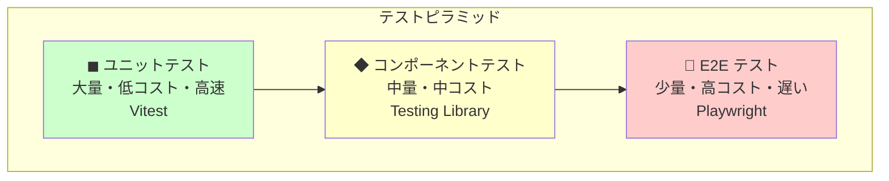
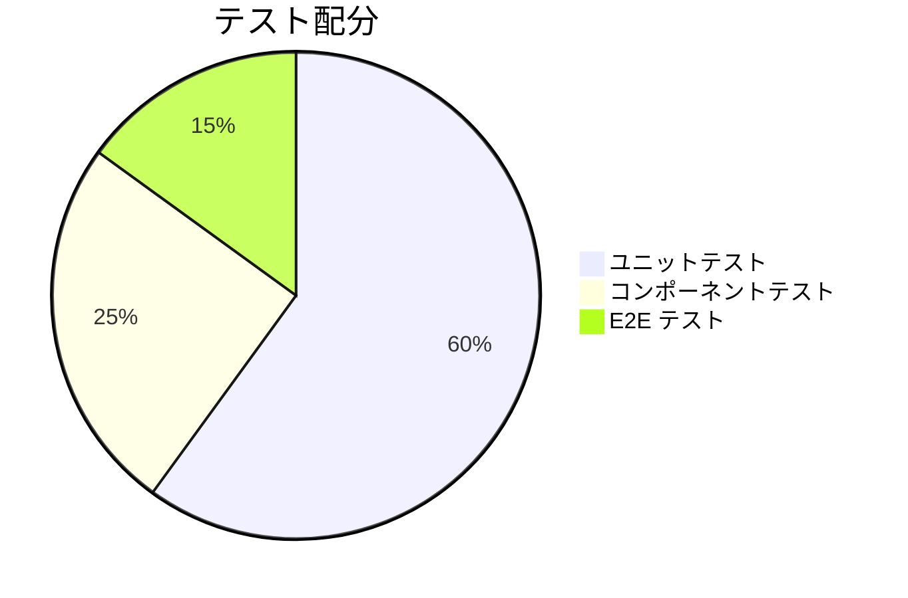
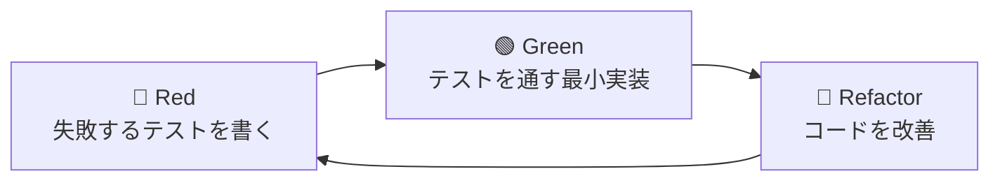
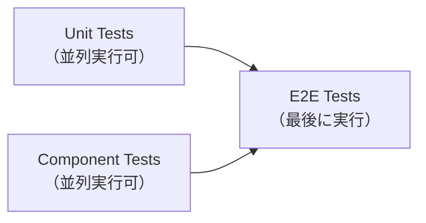

# テスト戦略

## 概要

このセクションでは、EC サイト開発におけるテスト戦略を学びます。
テストピラミッド、TDD（テスト駆動開発）、カバレッジ目標、CI での実行戦略など、テスト全体の設計について理解を深めます。

---

## テストピラミッド

### 構造



### 各層の特徴

| 層             | 対象               | 特徴                      | 実行速度 |
| -------------- | ------------------ | ------------------------- | -------- |
| ユニット       | 関数、クラス       | 独立、高速、大量に書ける  | ◎        |
| コンポーネント | 個別コンポーネント | 中程度の統合、UI 検証可能 | ○        |
| E2E            | ユーザーフロー全体 | 高い信頼性、遅い、脆い    | △        |

---

## EC サイトでのテスト配分

### 推奨配分



### 各テストの対象

| テスト種別     | 対象                                             | ツール          |
| -------------- | ------------------------------------------------ | --------------- |
| ユニット       | 価格計算、税計算、バリデーション、ユーティリティ | Vitest          |
| コンポーネント | ProductCard、CartItem、Form、Modal               | Testing Library |
| Storybook      | UI コンポーネントのインタラクション              | addon-vitest    |
| E2E            | 購入フロー、認証フロー、検索                     | Playwright      |
| Property-based | 計算ロジック、バリデーション                     | fast-check      |

---

## 何をどうテストするか

### ユニットテスト（60%）

**対象:**

- ビジネスロジック（価格計算、在庫チェック、割引適用）
- ユーティリティ関数（フォーマット、変換、パース）
- バリデーション関数
- カスタムフック（純粋なロジック部分）

以下は価格計算とバリデーションのテスト例です。

```typescript
// 価格計算
describe("calculateTotal", () => {
  it("商品の合計金額を計算する", () => {
    const items = [
      { price: 1000, quantity: 2 },
      { price: 500, quantity: 3 },
    ];
    expect(calculateTotal(items)).toBe(3500);
  });
});

// バリデーション
describe("validateEmail", () => {
  it("有効なメールアドレスを受け入れる", () => {
    expect(validateEmail("test@example.com")).toEqual({ success: true });
  });
});
```

### コンポーネントテスト（25%）

**対象:**

- 表示コンポーネント（ProductCard、Badge、Button）
- フォームコンポーネント（Input、Select、Checkbox）
- インタラクティブコンポーネント（Modal、Drawer、Toast）

以下は ProductCard のテスト例です。

```typescript
describe('ProductCard', () => {
  it('商品情報を表示する', () => {
    render(<ProductCard product={mockProduct} />);
    expect(screen.getByRole('heading')).toHaveTextContent('Tシャツ');
    expect(screen.getByText('¥1,000')).toBeInTheDocument();
  });

  it('カートに追加できる', async () => {
    const onAddToCart = vi.fn();
    render(<ProductCard product={mockProduct} onAddToCart={onAddToCart} />);
    await userEvent.click(screen.getByRole('button', { name: 'カートに追加' }));
    expect(onAddToCart).toHaveBeenCalled();
  });
});
```

### E2E テスト（15%）

**対象（クリティカルパスのみ）:**

- 購入フロー（カート → 配送先 → 支払い → 完了）
- 認証フロー（登録 → ログイン → ログアウト）
- 商品検索・フィルター

以下は購入フローの E2E テスト例です。

```typescript
test("購入を完了できる", async ({ page }) => {
  await page.goto("/products/1");
  await page.getByRole("button", { name: "カートに追加" }).click();
  await page.goto("/cart");
  await page.getByRole("button", { name: "購入手続きへ" }).click();
  // ... 以下購入フロー
  await expect(page.getByText("ご注文ありがとうございます")).toBeVisible();
});
```

---

## TDD（テスト駆動開発）

### Red-Green-Refactor サイクル



### TDD の手順

1. **Red**: 実装前にテストを書く。テストは失敗する
2. **Green**: テストを通す最小限のコードを書く
3. **Refactor**: コードを改善する（テストは通ったまま）

### TDD の例: カート機能

```typescript
// Step 1: Red - 失敗するテストを書く
describe("Cart", () => {
  it("商品を追加できる", () => {
    const cart = new Cart();
    cart.addItem({ id: "1", name: "Tシャツ", price: 1000 });
    expect(cart.items).toHaveLength(1);
  });
});
// → Cart クラスがないのでエラー

// Step 2: Green - 最小限の実装
class Cart {
  items: CartItem[] = [];

  addItem(product: Product): void {
    this.items.push({ product, quantity: 1 });
  }
}
// → テストが通る

// Step 3: Refactor - 改善（同じ商品の数量を増やす）
class Cart {
  items: CartItem[] = [];

  addItem(product: Product): void {
    const existing = this.items.find((item) => item.product.id === product.id);
    if (existing) {
      existing.quantity += 1;
    } else {
      this.items.push({ product, quantity: 1 });
    }
  }
}
// → テストはそのまま通る
```

---

## テスト優先度

### 最優先（必須）

| 機能       | 理由                 | テスト種別      |
| ---------- | -------------------- | --------------- |
| 決済関連   | 金銭的な影響が大きい | Unit + E2E      |
| 在庫管理   | 売り越し防止         | Unit            |
| 認証       | セキュリティ         | Unit + E2E      |
| カート計算 | 正確な金額表示が必須 | Unit + Property |

### 高優先

| 機能       | 理由                 | テスト種別 |
| ---------- | -------------------- | ---------- |
| 商品表示   | ユーザー体験の基本   | Component  |
| フォーム   | データ入力の正確性   | Component  |
| 購入フロー | コンバージョンに直結 | E2E        |

### 中優先

| 機能        | 理由         | テスト種別 |
| ----------- | ------------ | ---------- |
| UI 状態変化 | UX 向上      | Storybook  |
| エラー表示  | ユーザー理解 | Component  |
| 検索        | 発見性       | E2E        |

---

## カバレッジ目標

### 全体目標

| メトリクス        | 目標 | 説明               |
| ----------------- | ---- | ------------------ |
| Line Coverage     | 80%+ | 実行された行の割合 |
| Branch Coverage   | 75%+ | 分岐のカバー率     |
| Function Coverage | 85%+ | 関数のカバー率     |

### 機能別目標

| 機能              | 目標 | 理由               |
| ----------------- | ---- | ------------------ |
| 決済ロジック      | 100% | クリティカル       |
| 価格計算          | 100% | 金額の正確性       |
| バリデーション    | 95%+ | セキュリティ       |
| UI コンポーネント | 70%+ | 視覚的な確認が中心 |

### カバレッジの注意点

```typescript
// NG: カバレッジのためだけのテスト
it("すべての行を通る", () => {
  const result = someFunction(1);
  // アサーションなし → 意味がない
});

// OK: 意味のあるアサーション
it("正しい結果を返す", () => {
  const result = someFunction(1);
  expect(result).toBe(expected);
});
```

**カバレッジは目標であってゴールではない。**
意味のあるテストを書いた結果としてカバレッジが上がる状態を目指す。

---

## CI でのテスト実行

### GitHub Actions の設定例

```yaml
# .github/workflows/test.yml
name: Test

on:
  push:
    branches: [main]
  pull_request:
    branches: [main]

jobs:
  unit-test:
    runs-on: ubuntu-latest
    steps:
      - uses: actions/checkout@v4
      - uses: pnpm/action-setup@v4
      - uses: actions/setup-node@v4
        with:
          node-version: "24"
          cache: "pnpm"

      - run: pnpm install
      - run: pnpm test:unit
      - run: pnpm test:coverage

      - name: Upload coverage
        uses: codecov/codecov-action@v4

  component-test:
    runs-on: ubuntu-latest
    steps:
      - uses: actions/checkout@v4
      - uses: pnpm/action-setup@v4
      - uses: actions/setup-node@v4
        with:
          node-version: "24"
          cache: "pnpm"

      - run: pnpm install
      - run: pnpm test:component

  e2e-test:
    runs-on: ubuntu-latest
    steps:
      - uses: actions/checkout@v4
      - uses: pnpm/action-setup@v4
      - uses: actions/setup-node@v4
        with:
          node-version: "24"
          cache: "pnpm"

      - run: pnpm install
      - run: npx playwright install --with-deps

      - run: pnpm build
      - run: pnpm test:e2e

      - uses: actions/upload-artifact@v4
        if: failure()
        with:
          name: playwright-report
          path: playwright-report/
```

### 実行順序



- Unit / Component は高速なので並列実行する
- E2E はビルドを必要とし実行時間も長いため最後に実行する

---

## テストの保守性

### 良いテストの特徴

| 特徴       | 説明                     |
| ---------- | ------------------------ |
| 独立性     | 他のテストに依存しない   |
| 再現性     | 何度実行しても同じ結果   |
| 高速       | フィードバックが早い     |
| 読みやすさ | 何をテストしているか明確 |

### テストの命名規則

```typescript
// パターン 1: 「〜すると〜になる」
it("商品を追加すると、カートの商品数が増える", () => {});

// パターン 2: 「〜の場合、〜」
it("在庫切れの場合、ボタンが無効になる", () => {});

// パターン 3: should + 動詞
it("should add item to cart", () => {});
```

### 避けるべきパターン

```typescript
// NG: テストが曖昧
it("動作する", () => {});

// NG: 複数のことをテスト
it("カートに追加と削除ができる", () => {});

// NG: 実装詳細に依存
it("_items 配列に追加される", () => {});
```

---

## モック戦略

### モックする基準

| 対象             | モックする？ | 理由                     |
| ---------------- | ------------ | ------------------------ |
| 外部 API         | ✅           | ネットワーク依存を排除   |
| データベース     | ✅           | テスト速度、独立性       |
| 時間（Date）     | ✅           | 再現性のため             |
| ファイルシステム | ✅           | 環境依存を排除           |
| 内部モジュール   | ❌           | 実装詳細への依存を避ける |
| 純粋関数         | ❌           | モック不要、直接テスト   |

### モックの例

```typescript
// 日時をモック
vi.useFakeTimers();
vi.setSystemTime(new Date("2025-01-01"));

// API をモック
vi.mock("./api", () => ({
  fetchProducts: vi.fn().mockResolvedValue([{ id: "1", name: "Tシャツ" }]),
}));
```

---

## 確認質問

1. テストピラミッドの各層の特徴は何ですか？

   ユニットテストは高速で大量に書け、関数やクラスを独立してテストする。コンポーネントテストは中程度の統合レベルで、UI コンポーネントを検証する。E2E テストはユーザーフロー全体をテストし、高い信頼性があるが遅く脆い。

2. E2E テストを最小限に抑える理由は何ですか？

   E2E テストは実行が遅く、ネットワークや環境への依存で不安定になりやすい。また、失敗時のデバッグが困難である。クリティカルパスに限定し、詳細なロジック検証はユニットテストで行うのが効率的である。

3. TDD の Red-Green-Refactor サイクルとは何ですか？

   Red は失敗するテストを先に書く段階、Green はテストを通す最小限の実装を書く段階、Refactor はテストを維持しながらコードを改善する段階である。このサイクルを繰り返すことで、テスタブルで品質の高いコードを書ける。

4. カバレッジ目標はなぜ 100% ではないのですか？

   100% を目指すと、カバレッジのためだけの意味のないテストを書く傾向がある。また、一部のコード（エラーハンドリングの一部など）はテストが困難な場合もある。重要なのはカバレッジの数字ではなく、意味のあるテストを書くことである。

---

## まとめ

- テストピラミッドはユニット（60%）、コンポーネント（25%）、E2E（15%）の配分
- TDD は Red → Green → Refactor のサイクルを繰り返す
- テスト優先度は決済・在庫・認証を最優先にする
- カバレッジ目標は 80% だが、意味のあるテストを書くことが前提
- CI ではユニット/コンポーネントを並列実行し、E2E は最後に実行する

---

## 次のステップ

テスト戦略を学んだら、[チェックリスト](./checklist.md) で Phase 6 の理解度を確認しましょう。

実践演習は以下を参照してください。

- [演習 1: カート機能テスト](./exercises/01-cart-unit-test.md)
- [演習 2: コンポーネントテスト](./exercises/02-component-test.md)
- [演習 3: E2E 購入フロー](./exercises/03-e2e-purchase.md)
- [演習 4: Property-based テスト](./exercises/04-property-test.md)
