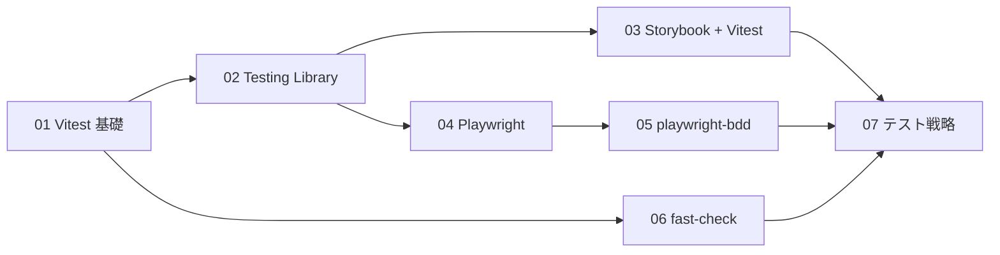
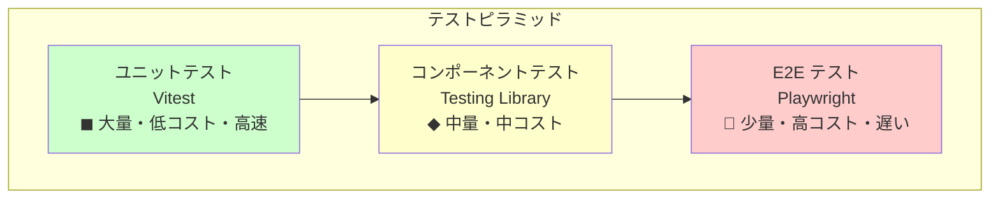
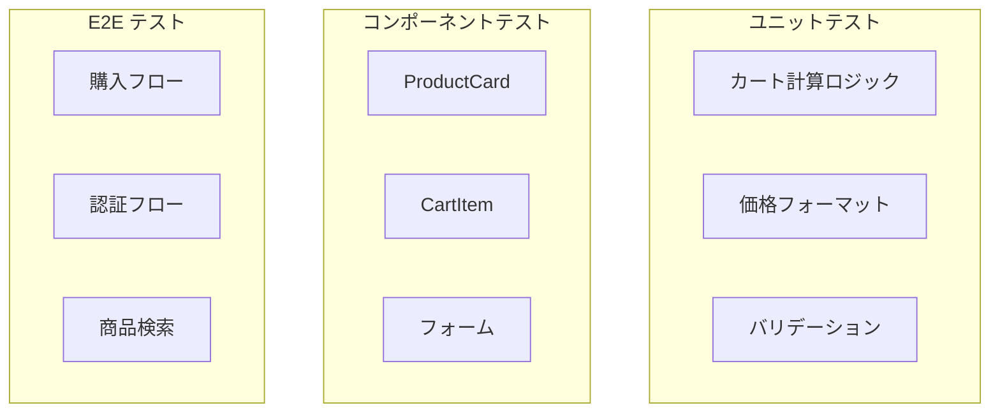

# Phase 6: テスト駆動開発

## 概要

テストファーストで開発できるスキルを習得するフェーズです。
Vitest、Testing Library、Playwright、fast-check を使った各種テスト手法を学びます。
EC サイトの品質を担保するテスト戦略を身につけます。

---

## 難易度

難易度: 3/5（中級）

テストの概念理解と、テスタブルなコード設計の考え方が重要です。

---

## 所要時間目安

約 8〜12 時間です。

---

## 前提知識

- Phase 1〜5 を完了していること
- React コンポーネントの基本的な理解
- Jotai による状態管理の理解
- async/await の基本

---

## 学習目標

このフェーズを完了すると、以下ができるようになります。

- [ ] Vitest でユニットテストを書ける
- [ ] Testing Library でコンポーネントテストを書ける
- [ ] Storybook + addon-vitest でインタラクションテストを書ける
- [ ] Playwright で E2E テストを書ける
- [ ] playwright-bdd で Gherkin シナリオを記述できる
- [ ] fast-check で Property-based テストを書ける
- [ ] テストピラミッドに基づくテスト戦略を説明できる

---

## 目次

1. [Vitest 基礎](./01-vitest-basics.md)
2. [Testing Library](./02-testing-library.md)
3. [Storybook + Vitest 連携](./03-storybook-vitest.md)
4. [Playwright 基礎](./04-playwright-basics.md)
5. [playwright-bdd で Gherkin シナリオ](./05-playwright-bdd.md)
6. [Property-based Testing（fast-check）](./06-fast-check.md)
7. [テスト戦略](./07-test-strategy.md)

### 学習フロー

---

## 演習問題

| 演習                                                             | 内容                            | 難易度 |
| ---------------------------------------------------------------- | ------------------------------- | ------ |
| [演習 1: カート機能テスト](./exercises/01-cart-unit-test.md)     | Vitest でカートロジックをテスト | 2/5    |
| [演習 2: コンポーネントテスト](./exercises/02-component-test.md) | ProductCard をテスト            | 3/5    |
| [演習 3: E2E 購入フロー](./exercises/03-e2e-purchase.md)         | Playwright で購入フロー         | 3/5    |
| [演習 4: Property-based テスト](./exercises/04-property-test.md) | fast-check で価格計算           | 4/5    |

---

## テストピラミッド

### EC サイトでのテスト配分

| テスト種別     | 対象                             | 割合 | ツール          |
| -------------- | -------------------------------- | ---- | --------------- |
| ユニット       | ビジネスロジック、ユーティリティ | 60%  | Vitest          |
| コンポーネント | 個別コンポーネント               | 25%  | Testing Library |
| E2E            | クリティカルパス                 | 15%  | Playwright      |

---

## 使用ツール

| ツール                      | バージョン | 用途                          |
| --------------------------- | ---------- | ----------------------------- |
| Vitest                      | 3.x        | ユニット/コンポーネントテスト |
| @testing-library/react      | 16.x       | コンポーネントテスト          |
| @testing-library/user-event | 14.x       | ユーザー操作シミュレーション  |
| Playwright                  | 1.x        | E2E テスト                    |
| playwright-bdd              | 8.x        | Gherkin シナリオ              |
| fast-check                  | 3.x        | Property-based テスト         |
| @storybook/addon-vitest     | 10.x       | Storybook 連携                |

---

## 関連する EC サイト機能

このフェーズで以下の EC 機能をテスト対象として扱います。

| 機能        | テスト種別     | 演習   |
| ----------- | -------------- | ------ |
| カート計算  | ユニット       | 演習 1 |
| ProductCard | コンポーネント | 演習 2 |
| 購入フロー  | E2E            | 演習 3 |
| 価格計算    | Property-based | 演習 4 |

---

## 推奨学習リソース

### 公式ドキュメント

- [Vitest ドキュメント](https://vitest.dev/)
- [Testing Library ドキュメント](https://testing-library.com/)
- [Playwright ドキュメント](https://playwright.dev/)
- [fast-check ドキュメント](https://fast-check.dev/)
- [Storybook Testing](https://storybook.js.org/docs/writing-tests)

### 参考記事

- [Testing Library のクエリ優先順位](https://testing-library.com/docs/queries/about/#priority)
- [Playwright Best Practices](https://playwright.dev/docs/best-practices)

---

## 自己チェックリスト

Phase 6 を完了する前に、以下を確認してください。

- [ ] describe / it / expect の使い方を理解している
- [ ] vi.fn() / vi.mock() / vi.spyOn() の違いを説明できる
- [ ] Testing Library のクエリ優先順位を説明できる
- [ ] userEvent でユーザー操作をシミュレートできる
- [ ] Storybook の play 関数でインタラクションテストを書ける
- [ ] Playwright でページ遷移とアサーションができる
- [ ] Gherkin 構文で Given / When / Then を記述できる
- [ ] fast-check で不変条件をテストできる
- [ ] テストピラミッドの各層の特徴を説明できる
- [ ] TDD の Red-Green-Refactor サイクルを説明できる

詳細なチェックリストは [checklist.md](./checklist.md) を参照してください。

---

## 次のフェーズ

Phase 6 を完了したら、[Phase 7: フォーム + Server Actions](../phase-07-forms-validation/README.md) に進みましょう。
