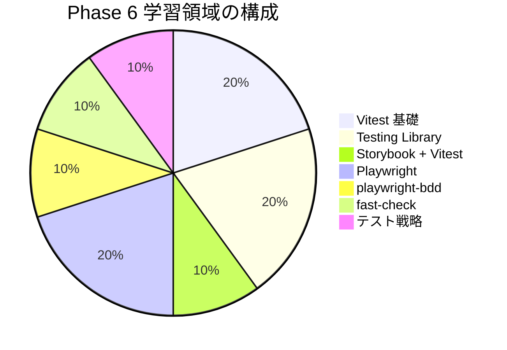

# Phase 6: 自己チェックリスト

Phase 6 の理解度を確認するためのチェックリストです。
各項目を確認し、自信を持って「はい」と答えられるか確認してください。

## 目次

- [学習領域の概要](#学習領域の概要)
- [Vitest](#vitest)
  - [理解度チェック](#理解度チェック)
  - [確認質問](#確認質問)
- [Testing Library](#testing-library)
  - [理解度チェック](#理解度チェック-1)
  - [確認質問](#確認質問-1)
- [Storybook + Vitest](#storybook--vitest)
  - [理解度チェック](#理解度チェック-2)
  - [確認質問](#確認質問-2)
- [Playwright](#playwright)
  - [理解度チェック](#理解度チェック-3)
  - [確認質問](#確認質問-3)
- [playwright-bdd](#playwright-bdd)
  - [理解度チェック](#理解度チェック-4)
  - [確認質問](#確認質問-4)
- [fast-check（Property-based Testing）](#fast-checkproperty-based-testing)
  - [理解度チェック](#理解度チェック-5)
  - [確認質問](#確認質問-5)
- [テスト戦略](#テスト戦略)
  - [理解度チェック](#理解度チェック-6)
  - [確認質問](#確認質問-6)
- [実践確認](#実践確認)
  - [演習チェック](#演習チェック)
  - [操作チェック](#操作チェック)
- [総合評価](#総合評価)
- [次のステップ](#次のステップ)

## 学習領域の概要

---

## Vitest

### 理解度チェック

- [ ] `describe` / `it` / `test` の違いを説明できる
- [ ] `beforeEach` / `afterEach` の使い方を知っている
- [ ] `beforeAll` / `afterAll` の使い方を知っている
- [ ] `expect` のアサーションを使える
- [ ] `toBe` と `toEqual` の違いを説明できる
- [ ] `vi.fn()` でモック関数を作成できる
- [ ] `vi.mock()` でモジュールをモックできる
- [ ] `vi.spyOn()` でスパイを設定できる
- [ ] 非同期テストを書ける（async/await）

### 確認質問

1. `vi.fn()` と `vi.spyOn()` の違いは何ですか？

   **回答例**: `vi.fn()` は新しいモック関数を作成する。`vi.spyOn()` は既存の関数を監視し、戻り値や実装を変更したい場合は置換できる。`spyOn` は `mockRestore()` で元に戻せる。

2. `beforeEach` と `beforeAll` の違いは何ですか？

   **回答例**: `beforeEach` は各テストの前に毎回実行される。`beforeAll` は describe ブロック内のすべてのテストの前に1回だけ実行される。

3. テストが独立している必要がある理由は何ですか？

   **回答例**: テストの実行順序に依存すると、単独実行時や順序変更時に失敗する可能性がある。各テストが独立していれば、並列実行や部分実行が可能になる。

---

## Testing Library

### 理解度チェック

- [ ] `render()` でコンポーネントを描画できる
- [ ] `screen.getByRole()` でクエリできる
- [ ] `screen.getByText()` でクエリできる
- [ ] `screen.getByLabelText()` でクエリできる
- [ ] `getBy` / `queryBy` / `findBy` の違いを説明できる
- [ ] クエリの優先順位を説明できる
- [ ] `userEvent.setup()` を使える
- [ ] `userEvent.click()` でクリックをシミュレートできる
- [ ] `userEvent.type()` で入力をシミュレートできる
- [ ] `waitFor()` で非同期処理を待機できる

### 確認質問

1. `getByRole` を優先すべき理由は何ですか？

   **回答例**: アクセシビリティロールはユーザー（特に支援技術を使用するユーザー）が要素を認識する方法と一致する。ロールベースのクエリを使うと、アクセシビリティの問題も早期に発見できる。

2. `getBy` と `queryBy` の違いは何ですか？

   **回答例**: `getBy` は要素が見つからないとエラーをスローする。`queryBy` は要素が見つからないと `null` を返す。要素が存在しないことをテストする場合は `queryBy` を使う。

3. `userEvent` と `fireEvent` の違いは何ですか？

   **回答例**: `fireEvent` は単一のイベントを発火する。`userEvent` はユーザーの実際の操作をシミュレートし、関連するすべてのイベント（フォーカス、hover など）を発火する。より現実的なテストになる。

---

## Storybook + Vitest

### 理解度チェック

- [ ] `play` 関数でインタラクションテストを書ける
- [ ] `within(canvasElement)` でキャンバス内の要素を取得できる
- [ ] `@storybook/test` の `expect` を使える
- [ ] `fn()` でモック関数を作成できる
- [ ] `step()` でテストをステップ分けできる

### 確認質問

1. `play` 関数はいつ実行されますか？

   **回答例**: Storybook UI ではストーリーが表示された後に自動実行される。Vitest で実行する場合は、コンポーネントがレンダリングされた後に実行される。

2. ストーリーをテストに使うメリットは何ですか？

   **回答例**: ストーリーとテストを別々に書く必要がなくなり、メンテナンスコストが下がる。また、視覚的に確認しながらテストを書ける。

---

## Playwright

### 理解度チェック

- [ ] `page.goto()` でページにアクセスできる
- [ ] `page.getByRole()` で要素を取得できる
- [ ] `page.getByLabel()` でフォーム要素を取得できる
- [ ] `page.getByText()` でテキストを取得できる
- [ ] `expect(page).toHaveURL()` でアサーションできる
- [ ] `expect(locator).toBeVisible()` でアサーションできる
- [ ] スクリーンショットを取得できる
- [ ] UI モードでデバッグできる
- [ ] `page.pause()` でブレークポイントを設定できる

### 確認質問

1. E2E テストの実行タイミングはいつですか？

   **回答例**: CI パイプラインでは、ユニットテストとコンポーネントテストの後に実行する。E2E はビルドを必要とし時間がかかるため、最後に実行するのが効率的である。

2. `page.waitForTimeout()` を使わない理由は何ですか？

   **回答例**: 固定時間の待機は不安定なテストの原因になる。代わりに `waitFor()` や自動待機を使い、必要な時間だけ待機するとテストが安定する。

3. ロケーターの優先順位は何ですか？

   **回答例**: `getByRole` → `getByLabel` → `getByPlaceholder` → `getByText` → `getByAltText` → `getByTestId` の順である。

---

## playwright-bdd

### 理解度チェック

- [ ] Gherkin 構文を書ける
- [ ] `Given` / `When` / `Then` の役割を説明できる
- [ ] `And` / `But` の使い方を知っている
- [ ] ステップ定義を実装できる
- [ ] `Background` の使い方を知っている
- [ ] `Scenario Outline` と `Examples` を使える
- [ ] タグでテストをフィルターできる

### 確認質問

1. `Given` / `When` / `Then` それぞれの役割は何ですか？

   **回答例**: `Given` は前提条件（初期状態）、`When` はユーザーの操作、`Then` は期待される結果を記述する。

2. `Background` と `Scenario` の違いは何ですか？

   **回答例**: `Background` は Feature 内のすべての Scenario の前に実行される共通ステップである。各 Scenario で繰り返す前提条件を一箇所にまとめられる。

3. Gherkin を使うメリットは何ですか？

   **回答例**: 自然言語に近いため、非エンジニアもテスト内容を理解・レビューできる。シナリオ自体が仕様書として機能する。

---

## fast-check（Property-based Testing）

### 理解度チェック

- [ ] `fc.property()` でプロパティテストを書ける
- [ ] `fc.assert()` でテストを実行できる
- [ ] `fc.integer()` / `fc.string()` などの基本 Arbitrary を使える
- [ ] `fc.record()` でオブジェクトを生成できる
- [ ] `fc.array()` で配列を生成できる
- [ ] 不変条件を定義できる
- [ ] カスタム Arbitrary を作成できる

### 確認質問

1. Property-based テストと Example-based テストの違いは何ですか？

   **回答例**: Example-based は手動でテストケースを考える。Property-based はランダムな入力を自動生成し、不変条件（プロパティ）が常に成り立つことを検証する。手動では思いつかないエッジケースを発見できる。

2. 不変条件（invariant）の例を挙げてください。

   **回答例**: 「合計金額は常に 0 以上」「割引後の価格は元の価格を超えない」「配列をソートしても要素数は変わらない」などである。

3. fast-check はいつ使うべきですか？

   **回答例**: 計算ロジック、バリデーション、データ変換など、多様な入力を扱う関数のテストに有効である。

---

## テスト戦略

### 理解度チェック

- [ ] テストピラミッドを説明できる
- [ ] 各テスト種別の使い分けを説明できる
- [ ] TDD の Red-Green-Refactor を説明できる
- [ ] カバレッジ目標の設定根拠を理解している
- [ ] CI でのテスト実行戦略を理解している
- [ ] モックする/しないの判断基準を説明できる

### 確認質問

1. テストピラミッドの各層の特徴は何ですか？

   **回答例**: ユニット（60%）は高速で大量に書ける。コンポーネント（25%）は中程度の統合でUI検証可能。E2E（15%）は高い信頼性があるが遅く脆い。

2. E2E テストを最小限に抑える理由は何ですか？

   **回答例**: 実行が遅く、環境依存で不安定になりやすい。デバッグも困難。クリティカルパスに限定し、詳細はユニットテストで検証するのが効率的。

3. TDD の利点は何ですか？

   **回答例**: テスタブルなコードになる、仕様を先に明確にできる、リファクタリングが安心してできる、過剰な実装を避けられる。

---

## 実践確認

### 演習チェック

- [ ] [演習 1](./exercises/01-cart-unit-test.md): カート機能のユニットテストを書けた
- [ ] [演習 2](./exercises/02-component-test.md): ProductCard のコンポーネントテストを書けた
- [ ] [演習 3](./exercises/03-e2e-purchase.md): 購入フローの E2E テストを書けた
- [ ] [演習 4](./exercises/04-property-test.md): 価格計算の Property-based テストを書けた

### 操作チェック

- [ ] `pnpm test` でユニットテストが実行される
- [ ] `pnpm test:coverage` でカバレッジが出力される
- [ ] `npx playwright test` で E2E テストが実行される
- [ ] `npx playwright test --ui` で UI モードが起動する
- [ ] Storybook のインタラクションテストが動作する

---

## 総合評価

| 達成率    | 評価                                   |
| --------- | -------------------------------------- |
| 90% 以上  | Phase 7 に進みましょう                 |
| 70% - 89% | 良好。不安な部分を復習してから進む     |
| 50% - 69% | 該当するドキュメントを再読してください |
| 50% 未満  | 最初からもう一度取り組みましょう       |

---

## 次のステップ

Phase 6 のチェックが完了したら、[Phase 7: フォーム + Server Actions](../phase-07-forms-validation/README.md) に進みましょう。
