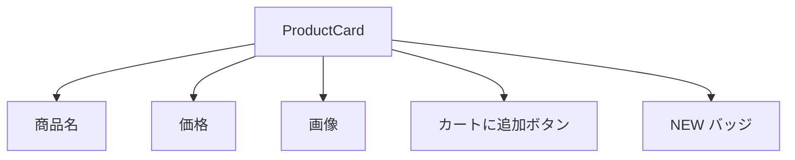

# 演習 2: コンポーネントテスト

## 目標

Testing Library を使って、ProductCard コンポーネントをテストします。
ユーザー視点でのテストを実践し、アクセシビリティを意識したクエリの使い方を身につけます。



---

## 前提条件

- [02-testing-library.md](../02-testing-library.md) を読んでいること
- Testing Library のセットアップ済み

---

## 完成イメージ

以下はテスト実行結果の例です。

```text
 ✓ ProductCard
   ✓ 表示
     ✓ 商品名が表示される
     ✓ 価格が表示される
     ✓ 商品画像に alt テキストがある
   ✓ バッジ
     ✓ NEW バッジが表示される（isNew: true）
     ✓ NEW バッジが非表示（isNew: false）
   ✓ 在庫状態
     ✓ 在庫があればボタンが有効
     ✓ 在庫切れならボタンが無効
   ✓ インタラクション
     ✓ カートに追加ボタンをクリックできる
     ✓ コールバックが正しい引数で呼ばれる
```

---

## ステップ 1: テスト対象のコンポーネント

まず、テスト対象の ProductCard コンポーネントを確認します。

```tsx
// components/ProductCard.tsx
interface Product {
  id: string;
  name: string;
  price: number;
  imageUrl: string;
  isNew?: boolean;
  inStock: boolean;
}

interface ProductCardProps {
  product: Product;
  onAddToCart?: (product: Product) => void;
}

export function ProductCard({ product, onAddToCart }: ProductCardProps): JSX.Element {
  return (
    <article className="rounded-lg border p-4">
      
      <h3 className="mt-2 text-lg font-bold">{product.name}</h3>
      <p className="text-xl">¥{product.price.toLocaleString()}</p>
      {product.isNew && <span className="rounded bg-red-500 px-2 py-1 text-white">NEW</span>}
      <button
        onClick={() => onAddToCart?.(product)}
        disabled={!product.inStock}
        className="mt-2 w-full rounded bg-blue-500 px-4 py-2 text-white disabled:bg-gray-300"
      >
        {product.inStock ? "カートに追加" : "売り切れ"}
      </button>
    </article>
  );
}
```

---

## ステップ 2: テストファイルの作成

```typescript
// components/__tests__/ProductCard.test.tsx
import { render, screen } from "@testing-library/react";
import userEvent from "@testing-library/user-event";
import { describe, it, expect, vi } from "vitest";
import { ProductCard } from "../ProductCard";

// モックデータ
const mockProduct = {
  id: "1",
  name: "プレミアム T シャツ",
  price: 3980,
  imageUrl: "/images/tshirt.jpg",
  isNew: false,
  inStock: true,
};
```

---

## ステップ 3: 表示のテスト

```typescript
describe('ProductCard', () => {
  describe('表示', () => {
    it('商品名が表示される', () => {
      render(<ProductCard product={mockProduct} />);

      expect(
        screen.getByRole('heading', { name: 'プレミアム T シャツ' })
      ).toBeInTheDocument();
    });

    it('価格が表示される', () => {
      render(<ProductCard product={mockProduct} />);

      expect(screen.getByText('¥3,980')).toBeInTheDocument();
    });

    it('商品画像に alt テキストがある', () => {
      render(<ProductCard product={mockProduct} />);

      expect(
        screen.getByRole('img', { name: 'プレミアム T シャツ' })
      ).toBeInTheDocument();
    });

    it('article 要素として構造化されている', () => {
      render(<ProductCard product={mockProduct} />);

      expect(screen.getByRole('article')).toBeInTheDocument();
    });
  });
});
```

---

## ステップ 4: バッジのテスト

```typescript
describe('バッジ', () => {
  it('isNew が true のとき NEW バッジが表示される', () => {
    const newProduct = { ...mockProduct, isNew: true };
    render(<ProductCard product={newProduct} />);

    expect(screen.getByText('NEW')).toBeInTheDocument();
  });

  it('isNew が false のとき NEW バッジが非表示', () => {
    const regularProduct = { ...mockProduct, isNew: false };
    render(<ProductCard product={regularProduct} />);

    expect(screen.queryByText('NEW')).not.toBeInTheDocument();
  });
});
```

---

## ステップ 5: 在庫状態のテスト

```typescript
describe('在庫状態', () => {
  it('在庫がある場合、カートに追加ボタンが有効', () => {
    const inStockProduct = { ...mockProduct, inStock: true };
    render(<ProductCard product={inStockProduct} />);

    const button = screen.getByRole('button', { name: 'カートに追加' });
    expect(button).toBeEnabled();
  });

  it('在庫切れの場合、ボタンが無効で売り切れ表示', () => {
    const soldOutProduct = { ...mockProduct, inStock: false };
    render(<ProductCard product={soldOutProduct} />);

    const button = screen.getByRole('button', { name: '売り切れ' });
    expect(button).toBeDisabled();
  });
});
```

---

## ステップ 6: インタラクションのテスト

```typescript
describe('インタラクション', () => {
  it('カートに追加ボタンをクリックできる', async () => {
    const user = userEvent.setup();
    const onAddToCart = vi.fn();

    render(<ProductCard product={mockProduct} onAddToCart={onAddToCart} />);

    await user.click(
      screen.getByRole('button', { name: 'カートに追加' })
    );

    expect(onAddToCart).toHaveBeenCalledTimes(1);
  });

  it('コールバックが正しい引数で呼ばれる', async () => {
    const user = userEvent.setup();
    const onAddToCart = vi.fn();

    render(<ProductCard product={mockProduct} onAddToCart={onAddToCart} />);

    await user.click(
      screen.getByRole('button', { name: 'カートに追加' })
    );

    expect(onAddToCart).toHaveBeenCalledWith(mockProduct);
  });

  it('onAddToCart が未定義でもエラーにならない', async () => {
    const user = userEvent.setup();

    render(<ProductCard product={mockProduct} />);

    // エラーがスローされないことを確認
    await expect(
      user.click(screen.getByRole('button', { name: 'カートに追加' }))
    ).resolves.not.toThrow();
  });
});
```

---

## ステップ 7: 完成したテストコード

```typescript
// components/__tests__/ProductCard.test.tsx
import { render, screen } from '@testing-library/react';
import userEvent from '@testing-library/user-event';
import { describe, it, expect, vi } from 'vitest';
import { ProductCard } from '../ProductCard';

const mockProduct = {
  id: '1',
  name: 'プレミアム T シャツ',
  price: 3980,
  imageUrl: '/images/tshirt.jpg',
  isNew: false,
  inStock: true,
};

describe('ProductCard', () => {
  describe('表示', () => {
    it('商品名が表示される', () => {
      render(<ProductCard product={mockProduct} />);

      expect(
        screen.getByRole('heading', { name: 'プレミアム T シャツ' })
      ).toBeInTheDocument();
    });

    it('価格が表示される', () => {
      render(<ProductCard product={mockProduct} />);

      expect(screen.getByText('¥3,980')).toBeInTheDocument();
    });

    it('商品画像に alt テキストがある', () => {
      render(<ProductCard product={mockProduct} />);

      expect(
        screen.getByRole('img', { name: 'プレミアム T シャツ' })
      ).toBeInTheDocument();
    });

    it('article 要素として構造化されている', () => {
      render(<ProductCard product={mockProduct} />);

      expect(screen.getByRole('article')).toBeInTheDocument();
    });
  });

  describe('バッジ', () => {
    it('isNew が true のとき NEW バッジが表示される', () => {
      const newProduct = { ...mockProduct, isNew: true };
      render(<ProductCard product={newProduct} />);

      expect(screen.getByText('NEW')).toBeInTheDocument();
    });

    it('isNew が false のとき NEW バッジが非表示', () => {
      const regularProduct = { ...mockProduct, isNew: false };
      render(<ProductCard product={regularProduct} />);

      expect(screen.queryByText('NEW')).not.toBeInTheDocument();
    });
  });

  describe('在庫状態', () => {
    it('在庫がある場合、カートに追加ボタンが有効', () => {
      const inStockProduct = { ...mockProduct, inStock: true };
      render(<ProductCard product={inStockProduct} />);

      const button = screen.getByRole('button', { name: 'カートに追加' });
      expect(button).toBeEnabled();
    });

    it('在庫切れの場合、ボタンが無効で売り切れ表示', () => {
      const soldOutProduct = { ...mockProduct, inStock: false };
      render(<ProductCard product={soldOutProduct} />);

      const button = screen.getByRole('button', { name: '売り切れ' });
      expect(button).toBeDisabled();
    });
  });

  describe('インタラクション', () => {
    it('カートに追加ボタンをクリックできる', async () => {
      const user = userEvent.setup();
      const onAddToCart = vi.fn();

      render(<ProductCard product={mockProduct} onAddToCart={onAddToCart} />);

      await user.click(
        screen.getByRole('button', { name: 'カートに追加' })
      );

      expect(onAddToCart).toHaveBeenCalledTimes(1);
    });

    it('コールバックが正しい引数で呼ばれる', async () => {
      const user = userEvent.setup();
      const onAddToCart = vi.fn();

      render(<ProductCard product={mockProduct} onAddToCart={onAddToCart} />);

      await user.click(
        screen.getByRole('button', { name: 'カートに追加' })
      );

      expect(onAddToCart).toHaveBeenCalledWith(mockProduct);
    });

    it('onAddToCart が未定義でもエラーにならない', async () => {
      const user = userEvent.setup();

      render(<ProductCard product={mockProduct} />);

      await expect(
        user.click(screen.getByRole('button', { name: 'カートに追加' }))
      ).resolves.not.toThrow();
    });
  });
});
```

---

## 確認チェックリスト

- [ ] `render()` でコンポーネントを描画できた
- [ ] `screen.getByRole()` でクエリできた
- [ ] `screen.getByText()` でクエリできた
- [ ] `screen.queryByText()` で要素の非存在を確認できた
- [ ] `userEvent.setup()` を使えた
- [ ] `vi.fn()` でコールバックをモックできた
- [ ] すべてのテストがパスする

---

## トラブルシューティング

### getByRole で要素が見つからない

```typescript
import { logRoles } from '@testing-library/react';

it('デバッグ', () => {
  const { container } = render(<ProductCard product={mockProduct} />);
  logRoles(container); // 利用可能なロールを出力
});
```

### screen.debug() で DOM を確認

```typescript
it('デバッグ', () => {
  render(<ProductCard product={mockProduct} />);
  screen.debug(); // DOM 全体を出力
});
```

### userEvent が動作しない

`await` を忘れていないか確認してください。

```typescript
// NG
user.click(button);

// OK
await user.click(button);
```

---

## 発展課題

1. **ホバー効果のテスト**: ホバー時にスタイルが変わることをテスト
2. **お気に入りボタン**: お気に入りボタンのテストを追加
3. **セール価格表示**: 元の価格と割引価格の両方が表示されることをテスト

---

## 完了条件

- [ ] すべてのテストがパスする
- [ ] `getByRole` を優先して使用している
- [ ] ユーザー視点でテストが書かれている

---

## 次の演習

[演習 3: E2E 購入フロー](./03-e2e-purchase.md) に進みましょう。
