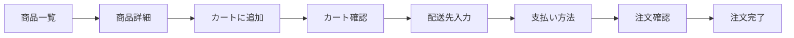

# 演習 3: 購入フロー E2E テスト

## 目次

- [目標](#目標)
- [前提条件](#前提条件)
- [完成イメージ](#完成イメージ)
- [ステップ 1: テストファイルの作成](#ステップ-1-テストファイルの作成)
- [ステップ 2: 商品閲覧のテスト](#ステップ-2-商品閲覧のテスト)
- [ステップ 3: カート操作のテスト](#ステップ-3-カート操作のテスト)
- [ステップ 4: 購入完了のテスト](#ステップ-4-購入完了のテスト)
- [ステップ 5: エラーケースのテスト](#ステップ-5-エラーケースのテスト)
- [ステップ 6: モバイル対応のテスト](#ステップ-6-モバイル対応のテスト)
- [ステップ 7: 完成したテストコード](#ステップ-7-完成したテストコード)
- [テストの実行](#テストの実行)
- [確認チェックリスト](#確認チェックリスト)
- [トラブルシューティング](#トラブルシューティング)
  - [要素が見つからない](#要素が見つからない)
  - [タイムアウトエラー](#タイムアウトエラー)
  - [スクリーンショットで確認](#スクリーンショットで確認)
- [発展課題](#発展課題)
- [完了条件](#完了条件)
- [次の演習](#次の演習)

## 目標

Playwrightを使って、商品を見つけてから購入完了までの一連のフローをE2Eテストします。
ユーザーが実際に行う操作をシミュレートし、クリティカルパスが正しく動作することを確認します。



***

## 前提条件

- [04-playwright-basics.md](../04-playwright-basics.md) を読んでいること
- Playwrightのセットアップ済み

***

## 完成イメージ

以下はテスト実行結果の例です。

```text
 ✓ 購入フロー
   ✓ 商品閲覧
     ✓ 商品一覧から商品を選択できる
     ✓ 商品詳細ページで情報を確認できる
   ✓ カート操作
     ✓ 商品をカートに追加できる
     ✓ カートページで内容を確認できる
   ✓ 購入完了
     ✓ 購入を完了できる
```

***

## ステップ 1: テストファイルの作成

```typescript
// e2e/purchase-flow.spec.ts
import { test, expect } from "@playwright/test";

test.describe("購入フロー", () => {
  test.describe("商品閲覧", () => {
    // テストケースを追加
  });

  test.describe("カート操作", () => {
    // テストケースを追加
  });

  test.describe("購入完了", () => {
    // テストケースを追加
  });
});
```

***

## ステップ 2: 商品閲覧のテスト

```typescript
test.describe("商品閲覧", () => {
  test("商品一覧から商品を選択できる", async ({ page }) => {
    // 商品一覧ページにアクセス
    await page.goto("/products");

    // 商品カードが表示されている
    await expect(page.getByRole("article")).toHaveCount.greaterThan(0);

    // 最初の商品をクリック
    await page.getByRole("article").first().click();

    // 商品詳細ページに遷移
    await expect(page).toHaveURL(/\/products\/\d+/);
  });

  test("商品詳細ページで情報を確認できる", async ({ page }) => {
    await page.goto("/products/1");

    // 商品名が表示されている
    await expect(page.getByRole("heading", { level: 1 })).toBeVisible();

    // 価格が表示されている
    await expect(page.getByText(/¥[\d,]+/)).toBeVisible();

    // カートに追加ボタンが表示されている
    await expect(page.getByRole("button", { name: "カートに追加" })).toBeVisible();
  });
});
```

***

## ステップ 3: カート操作のテスト

```typescript
test.describe("カート操作", () => {
  test("商品をカートに追加できる", async ({ page }) => {
    await page.goto("/products/1");

    // カートに追加
    await page.getByRole("button", { name: "カートに追加" }).click();

    // 成功通知が表示される
    await expect(page.getByText("カートに追加しました")).toBeVisible();

    // カートバッジが更新される
    await expect(page.getByTestId("cart-badge")).toHaveText("1");
  });

  test("カートページで内容を確認できる", async ({ page }) => {
    // 商品をカートに追加
    await page.goto("/products/1");
    await page.getByRole("button", { name: "カートに追加" }).click();

    // カートページに移動
    await page.goto("/cart");

    // 商品が表示されている
    await expect(page.getByRole("article")).toHaveCount(1);

    // 合計金額が表示されている
    await expect(page.getByTestId("cart-total")).toBeVisible();

    // 購入手続きボタンが表示されている
    await expect(page.getByRole("button", { name: "購入手続きへ" })).toBeVisible();
  });

  test("カートの数量を変更できる", async ({ page }) => {
    // 商品をカートに追加
    await page.goto("/products/1");
    await page.getByRole("button", { name: "カートに追加" }).click();

    // カートページに移動
    await page.goto("/cart");

    // 数量を変更
    await page.getByLabel("数量").fill("3");

    // 合計金額が更新される（値は実装に依存）
    await expect(page.getByTestId("cart-total")).not.toHaveText("¥0");
  });

  test("カートから商品を削除できる", async ({ page }) => {
    // 商品をカートに追加
    await page.goto("/products/1");
    await page.getByRole("button", { name: "カートに追加" }).click();

    // カートページに移動
    await page.goto("/cart");

    // 削除ボタンをクリック
    await page.getByRole("button", { name: "削除" }).click();

    // カートが空になる
    await expect(page.getByText("カートに商品がありません")).toBeVisible();
  });
});
```

***

## ステップ 4: 購入完了のテスト

```typescript
test.describe("購入完了", () => {
  test.beforeEach(async ({ page }) => {
    // 商品をカートに追加
    await page.goto("/products/1");
    await page.getByRole("button", { name: "カートに追加" }).click();
  });

  test("購入を完了できる", async ({ page }) => {
    // カートページへ
    await page.goto("/cart");

    // 購入手続きへ進む
    await page.getByRole("button", { name: "購入手続きへ" }).click();
    await expect(page).toHaveURL("/checkout/shipping");

    // 配送先入力
    await page.getByLabel("お名前").fill("テスト 太郎");
    await page.getByLabel("郵便番号").fill("100-0001");
    await page.getByLabel("住所").fill("東京都千代田区千代田1-1-1");
    await page.getByLabel("電話番号").fill("03-1234-5678");
    await page.getByRole("button", { name: "次へ" }).click();

    // 支払い方法選択
    await expect(page).toHaveURL("/checkout/payment");
    await page.getByLabel("クレジットカード").check();
    await page.getByRole("button", { name: "次へ" }).click();

    // 注文確認
    await expect(page).toHaveURL("/checkout/confirm");
    await expect(page.getByText("テスト 太郎")).toBeVisible();
    await page.getByRole("button", { name: "注文を確定する" }).click();

    // 完了画面
    await expect(page).toHaveURL(/\/orders\/\d+\/complete/);
    await expect(page.getByRole("heading", { name: "ご注文ありがとうございます" })).toBeVisible();
    await expect(page.getByText(/注文番号/)).toBeVisible();
  });
});
```

***

## ステップ 5: エラーケースのテスト

```typescript
test.describe("エラーケース", () => {
  test("空のカートで購入手続きに進めない", async ({ page }) => {
    await page.goto("/cart");

    // カートが空
    await expect(page.getByText("カートに商品がありません")).toBeVisible();

    // 購入ボタンが無効または非表示
    await expect(page.getByRole("button", { name: "購入手続きへ" })).toBeDisabled();
  });

  test("必須項目が未入力の場合エラーが表示される", async ({ page }) => {
    // 商品をカートに追加
    await page.goto("/products/1");
    await page.getByRole("button", { name: "カートに追加" }).click();

    // 購入手続きへ
    await page.goto("/checkout/shipping");

    // 何も入力せずに次へ
    await page.getByRole("button", { name: "次へ" }).click();

    // エラーメッセージが表示される
    await expect(page.getByText("お名前を入力してください")).toBeVisible();
  });
});
```

***

## ステップ 6: モバイル対応のテスト

```typescript
// playwright.config.ts で mobile プロジェクトを設定済みの前提
test.describe("モバイル対応", () => {
  test("モバイルでも購入フローが動作する", async ({ page, isMobile }) => {
    test.skip(!isMobile, "モバイルのみ実行");

    await page.goto("/");

    // ハンバーガーメニューを開く
    await page.getByRole("button", { name: "メニュー" }).click();

    // 商品一覧へ
    await page.getByRole("link", { name: "商品一覧" }).click();
    await expect(page).toHaveURL("/products");

    // 商品をタップ
    await page.getByRole("article").first().click();
    await expect(page).toHaveURL(/\/products\/\d+/);
  });
});
```

***

## ステップ 7: 完成したテストコード

```typescript
// e2e/purchase-flow.spec.ts
import { test, expect } from "@playwright/test";

test.describe("購入フロー", () => {
  test.describe("商品閲覧", () => {
    test("商品一覧から商品を選択できる", async ({ page }) => {
      await page.goto("/products");
      expect(await page.getByRole("article").count()).toBeGreaterThan(0);
      await page.getByRole("article").first().click();
      await expect(page).toHaveURL(/\/products\/\d+/);
    });

    test("商品詳細ページで情報を確認できる", async ({ page }) => {
      await page.goto("/products/1");
      await expect(page.getByRole("heading", { level: 1 })).toBeVisible();
      await expect(page.getByText(/¥[\d,]+/)).toBeVisible();
      await expect(page.getByRole("button", { name: "カートに追加" })).toBeVisible();
    });
  });

  test.describe("カート操作", () => {
    test("商品をカートに追加できる", async ({ page }) => {
      await page.goto("/products/1");
      await page.getByRole("button", { name: "カートに追加" }).click();
      await expect(page.getByText("カートに追加しました")).toBeVisible();
      await expect(page.getByTestId("cart-badge")).toHaveText("1");
    });

    test("カートページで内容を確認できる", async ({ page }) => {
      await page.goto("/products/1");
      await page.getByRole("button", { name: "カートに追加" }).click();
      await page.goto("/cart");
      await expect(page.getByRole("article")).toHaveCount(1);
      await expect(page.getByTestId("cart-total")).toBeVisible();
    });
  });

  test.describe("購入完了", () => {
    test.beforeEach(async ({ page }) => {
      await page.goto("/products/1");
      await page.getByRole("button", { name: "カートに追加" }).click();
    });

    test("購入を完了できる", async ({ page }) => {
      await page.goto("/cart");
      await page.getByRole("button", { name: "購入手続きへ" }).click();

      // 配送先入力
      await page.getByLabel("お名前").fill("テスト 太郎");
      await page.getByLabel("郵便番号").fill("100-0001");
      await page.getByLabel("住所").fill("東京都千代田区千代田1-1-1");
      await page.getByLabel("電話番号").fill("03-1234-5678");
      await page.getByRole("button", { name: "次へ" }).click();

      // 支払い方法
      await page.getByLabel("クレジットカード").check();
      await page.getByRole("button", { name: "次へ" }).click();

      // 確認・確定
      await page.getByRole("button", { name: "注文を確定する" }).click();

      // 完了確認
      await expect(page).toHaveURL(/\/orders\/\d+\/complete/);
      await expect(page.getByRole("heading", { name: "ご注文ありがとうございます" })).toBeVisible();
    });
  });
});
```

***

## テストの実行

```bash
# すべての E2E テストを実行
npx playwright test

# 特定のファイルのみ
npx playwright test e2e/purchase-flow.spec.ts

# UI モードで実行
npx playwright test --ui

# headed モードで実行（ブラウザを表示）
npx playwright test --headed

# 特定のプロジェクト（ブラウザ）のみ
npx playwright test --project=chromium
```

***

## 確認チェックリスト

- [ ] `page.goto()` でページ遷移できた
- [ ] `page.getByRole()` で要素を取得できた
- [ ] フォーム入力をシミュレートできた
- [ ] `expect(page).toHaveURL()` でアサーションできた
- [ ] `beforeEach` で共通のセットアップができた
- [ ] すべてのテストがパスする

***

## トラブルシューティング

### 要素が見つからない

```typescript
// デバッグモードで実行
await page.pause();
```

### タイムアウトエラー

```typescript
// 個別のテストにタイムアウトを設定
test(
  "長い処理",
  async ({ page }) => {
    // ...
  },
  { timeout: 60000 }
);
```

### スクリーンショットで確認

```typescript
await page.screenshot({ path: "debug.png" });
```

***

## 発展課題

1. **ログイン済みユーザーの購入フロー**: ログイン状態を維持してテスト
2. **複数商品の購入**: 複数の商品をカートに追加して購入
3. **在庫切れエラー**: 購入途中で在庫切れになった場合のエラー処理

***

## 完了条件

- [ ] 商品閲覧フローのテストがパスする
- [ ] カート操作のテストがパスする
- [ ] 購入完了フローのテストがパスする
- [ ] `npx playwright test` でテストが成功する

***

## 次の演習

[演習 4: Property-based テスト](./04-property-test.md) に進みましょう。
