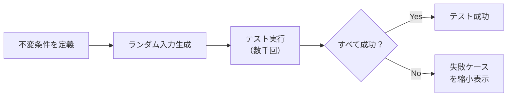

# 演習 4: Property-based テスト

## 目次

- [目標](#目標)
- [前提条件](#前提条件)
- [完成イメージ](#完成イメージ)
- [ステップ 1: テスト対象の関数](#ステップ-1-テスト対象の関数)
- [ステップ 2: テストファイルの作成](#ステップ-2-テストファイルの作成)
- [ステップ 3: calculateTotal のプロパティテスト](#ステップ-3-calculatetotal-のプロパティテスト)
- [ステップ 4: applyDiscount のプロパティテスト](#ステップ-4-applydiscount-のプロパティテスト)
- [ステップ 5: calculateTax のプロパティテスト](#ステップ-5-calculatetax-のプロパティテスト)
- [ステップ 6: バリデーションのプロパティテスト](#ステップ-6-バリデーションのプロパティテスト)
- [ステップ 7: カスタム Arbitrary](#ステップ-7-カスタム-arbitrary)
- [ステップ 8: 完成したテストコード](#ステップ-8-完成したテストコード)
- [確認チェックリスト](#確認チェックリスト)
- [トラブルシューティング](#トラブルシューティング)
  - [テストが遅い](#テストが遅い)
  - [失敗したテストを再現](#失敗したテストを再現)
  - [Arbitrary の値を確認](#arbitrary-の値を確認)
- [発展課題](#発展課題)
- [完了条件](#完了条件)
- [Phase 6 完了](#phase-6-完了)

## 目標

fast-check を使って、価格計算ロジックとバリデーションのエッジケースを自動検出します。
不変条件（invariant）を定義し、ランダムな入力で常に条件が満たされることを検証します。



***

## 前提条件

- [06-fast-check.md](../06-fast-check.md) を読んでいること
- fast-check のインストール済み

***

## 完成イメージ

以下はテスト実行結果の例です。

```text
 ✓ 価格計算 Property-based テスト
   ✓ calculateTotal
     ✓ 合計金額は常に 0 以上
     ✓ 各商品の小計の合計と一致する
   ✓ applyDiscount
     ✓ 割引後の価格は元の価格以下
     ✓ 割引後の価格は 0 以上
     ✓ 0% 割引は元の価格と同じ
     ✓ 100% 割引は 0
 ✓ バリデーション Property-based テスト
   ✓ validateEmail
     ✓ 有効なメールアドレスは常にパスする
     ✓ 任意の文字列でクラッシュしない
```

***

## ステップ 1: テスト対象の関数

まず、テスト対象の価格計算関数を確認します。

```typescript
// lib/pricing.ts
export interface CartItem {
  price: number;
  quantity: number;
}

export function calculateTotal(items: CartItem[]): number {
  return items.reduce((total, item) => total + item.price * item.quantity, 0);
}

export function applyDiscount(price: number, discountPercent: number): number {
  if (discountPercent < 0 || discountPercent > 100) {
    throw new Error("Invalid discount percent");
  }
  return Math.floor(price * (1 - discountPercent / 100));
}

export function calculateTax(subtotal: number, taxRate: number = 0.1): number {
  return Math.floor(subtotal * taxRate);
}
```

***

## ステップ 2: テストファイルの作成

```typescript
// lib/__tests__/pricing.property.test.ts
import * as fc from "fast-check";
import { describe, it, expect } from "vitest";
import { calculateTotal, applyDiscount, calculateTax } from "../pricing";
```

***

## ステップ 3: calculateTotal のプロパティテスト

```typescript
describe("価格計算 Property-based テスト", () => {
  describe("calculateTotal", () => {
    // カートアイテムの Arbitrary を定義
    const cartItemArbitrary = fc.record({
      price: fc.integer({ min: 0, max: 10000000 }),
      quantity: fc.integer({ min: 1, max: 100 }),
    });

    it("合計金額は常に 0 以上", () => {
      fc.assert(
        fc.property(fc.array(cartItemArbitrary, { minLength: 0, maxLength: 50 }), (items) => {
          const total = calculateTotal(items);
          return total >= 0;
        })
      );
    });

    it("各商品の小計の合計と一致する", () => {
      fc.assert(
        fc.property(fc.array(cartItemArbitrary, { minLength: 1, maxLength: 20 }), (items) => {
          const total = calculateTotal(items);
          const expected = items.reduce((sum, item) => sum + item.price * item.quantity, 0);
          return total === expected;
        })
      );
    });

    it("空のカートは 0 を返す", () => {
      expect(calculateTotal([])).toBe(0);
    });

    it("商品の順序に依存しない（交換法則）", () => {
      fc.assert(
        fc.property(fc.array(cartItemArbitrary, { minLength: 2, maxLength: 10 }), (items) => {
          const total1 = calculateTotal(items);
          const total2 = calculateTotal([...items].reverse());
          return total1 === total2;
        })
      );
    });
  });
});
```

***

## ステップ 4: applyDiscount のプロパティテスト

```typescript
describe("applyDiscount", () => {
  it("割引後の価格は元の価格以下", () => {
    fc.assert(
      fc.property(
        fc.integer({ min: 0, max: 10000000 }), // 元の価格
        fc.integer({ min: 0, max: 100 }), // 割引率
        (price, discountPercent) => {
          const discounted = applyDiscount(price, discountPercent);
          return discounted <= price;
        }
      )
    );
  });

  it("割引後の価格は 0 以上", () => {
    fc.assert(
      fc.property(
        fc.integer({ min: 0, max: 10000000 }),
        fc.integer({ min: 0, max: 100 }),
        (price, discountPercent) => {
          const discounted = applyDiscount(price, discountPercent);
          return discounted >= 0;
        }
      )
    );
  });

  it("0% 割引は元の価格と同じ", () => {
    fc.assert(
      fc.property(fc.integer({ min: 0, max: 10000000 }), (price) => {
        return applyDiscount(price, 0) === price;
      })
    );
  });

  it("100% 割引は 0", () => {
    fc.assert(
      fc.property(fc.integer({ min: 0, max: 10000000 }), (price) => {
        return applyDiscount(price, 100) === 0;
      })
    );
  });

  it("割引率が範囲外の場合はエラー", () => {
    fc.assert(
      fc.property(
        fc.integer({ min: 0, max: 10000 }),
        fc.oneof(
          fc.integer({ min: -100, max: -1 }), // 負の割引率
          fc.integer({ min: 101, max: 200 }) // 100超の割引率
        ),
        (price, invalidDiscount) => {
          try {
            applyDiscount(price, invalidDiscount);
            return false; // エラーがスローされるべき
          } catch {
            return true; // エラーが正しくスローされた
          }
        }
      )
    );
  });
});
```

***

## ステップ 5: calculateTax のプロパティテスト

```typescript
describe("calculateTax", () => {
  it("税額は常に 0 以上", () => {
    fc.assert(
      fc.property(fc.integer({ min: 0, max: 10000000 }), (subtotal) => {
        const tax = calculateTax(subtotal);
        return tax >= 0;
      })
    );
  });

  it("税額は小計を超えない", () => {
    fc.assert(
      fc.property(
        fc.integer({ min: 0, max: 10000000 }),
        fc.double({ min: 0, max: 1, noNaN: true }),
        (subtotal, taxRate) => {
          const tax = calculateTax(subtotal, taxRate);
          return tax <= subtotal;
        }
      )
    );
  });

  it("税額は Math.floor(subtotal * taxRate) と一致", () => {
    fc.assert(
      fc.property(
        fc.integer({ min: 0, max: 10000000 }),
        fc.double({ min: 0, max: 0.5, noNaN: true }),
        (subtotal, taxRate) => {
          const tax = calculateTax(subtotal, taxRate);
          const expected = Math.floor(subtotal * taxRate);
          return tax === expected;
        }
      )
    );
  });
});
```

***

## ステップ 6: バリデーションのプロパティテスト

```typescript
// lib/validation.ts
import { z } from "zod";

export const emailSchema = z.string().email();

export function validateEmail(input: string): { success: boolean; error?: string } {
  const result = emailSchema.safeParse(input);
  if (result.success) {
    return { success: true };
  }
  return { success: false, error: result.error.issues[0]?.message ?? "Invalid input" };
}
```

```typescript
// lib/__tests__/validation.property.test.ts
import * as fc from "fast-check";
import { describe, it, expect } from "vitest";
import { validateEmail } from "../validation";

describe("バリデーション Property-based テスト", () => {
  describe("validateEmail", () => {
    it("有効なメールアドレスは常にパスする", () => {
      fc.assert(
        fc.property(fc.emailAddress(), (email) => {
          const result = validateEmail(email);
          return result.success === true;
        })
      );
    });

    it("任意の文字列でクラッシュしない", () => {
      fc.assert(
        fc.property(fc.string(), (input) => {
          // エラーをスローせず、結果を返すことを確認
          const result = validateEmail(input);
          return typeof result.success === "boolean";
        })
      );
    });

    it("空文字列は無効", () => {
      const result = validateEmail("");
      expect(result.success).toBe(false);
    });

    it("@ がない文字列は無効", () => {
      fc.assert(
        fc.property(
          fc.string().filter((s) => !s.includes("@")),
          (input) => {
            if (input.length === 0) return true; // 空文字は別でテスト
            const result = validateEmail(input);
            return result.success === false;
          }
        )
      );
    });
  });
});
```

***

## ステップ 7: カスタム Arbitrary

```typescript
// 商品データの Arbitrary
const productArbitrary = fc.record({
  id: fc.uuid(),
  name: fc.string({ minLength: 1, maxLength: 200 }),
  price: fc.integer({ min: 0, max: 100000000 }),
  category: fc.constantFrom("tops", "bottoms", "shoes", "accessories"),
  inStock: fc.boolean(),
});

describe("商品データ", () => {
  it("商品データからカートアイテムを作成できる", () => {
    fc.assert(
      fc.property(productArbitrary, fc.integer({ min: 1, max: 100 }), (product, quantity) => {
        const cartItem = {
          price: product.price,
          quantity,
        };
        const total = calculateTotal([cartItem]);
        return total === product.price * quantity;
      })
    );
  });
});
```

***

## ステップ 8: 完成したテストコード

```typescript
// lib/__tests__/pricing.property.test.ts
import * as fc from "fast-check";
import { describe, it, expect } from "vitest";
import { calculateTotal, applyDiscount, calculateTax } from "../pricing";

describe("価格計算 Property-based テスト", () => {
  const cartItemArbitrary = fc.record({
    price: fc.integer({ min: 0, max: 10000000 }),
    quantity: fc.integer({ min: 1, max: 100 }),
  });

  describe("calculateTotal", () => {
    it("合計金額は常に 0 以上", () => {
      fc.assert(
        fc.property(fc.array(cartItemArbitrary, { minLength: 0, maxLength: 50 }), (items) => {
          const total = calculateTotal(items);
          return total >= 0;
        })
      );
    });

    it("各商品の小計の合計と一致する", () => {
      fc.assert(
        fc.property(fc.array(cartItemArbitrary, { minLength: 1, maxLength: 20 }), (items) => {
          const total = calculateTotal(items);
          const expected = items.reduce((sum, item) => sum + item.price * item.quantity, 0);
          return total === expected;
        })
      );
    });

    it("商品の順序に依存しない", () => {
      fc.assert(
        fc.property(fc.array(cartItemArbitrary, { minLength: 2, maxLength: 10 }), (items) => {
          const total1 = calculateTotal(items);
          const total2 = calculateTotal([...items].reverse());
          return total1 === total2;
        })
      );
    });
  });

  describe("applyDiscount", () => {
    it("割引後の価格は元の価格以下", () => {
      fc.assert(
        fc.property(
          fc.integer({ min: 0, max: 10000000 }),
          fc.integer({ min: 0, max: 100 }),
          (price, discountPercent) => {
            const discounted = applyDiscount(price, discountPercent);
            return discounted <= price;
          }
        )
      );
    });

    it("割引後の価格は 0 以上", () => {
      fc.assert(
        fc.property(
          fc.integer({ min: 0, max: 10000000 }),
          fc.integer({ min: 0, max: 100 }),
          (price, discountPercent) => {
            const discounted = applyDiscount(price, discountPercent);
            return discounted >= 0;
          }
        )
      );
    });

    it("0% 割引は元の価格と同じ", () => {
      fc.assert(
        fc.property(
          fc.integer({ min: 0, max: 10000000 }),
          (price) => applyDiscount(price, 0) === price
        )
      );
    });

    it("100% 割引は 0", () => {
      fc.assert(
        fc.property(
          fc.integer({ min: 0, max: 10000000 }),
          (price) => applyDiscount(price, 100) === 0
        )
      );
    });
  });

  describe("calculateTax", () => {
    it("税額は常に 0 以上", () => {
      fc.assert(
        fc.property(
          fc.integer({ min: 0, max: 10000000 }),
          (subtotal) => calculateTax(subtotal) >= 0
        )
      );
    });
  });
});
```

***

## 確認チェックリスト

- [ ] `fc.property()` でプロパティテストを書けた
- [ ] `fc.integer()` / `fc.string()` などの基本 Arbitrary を使えた
- [ ] `fc.record()` でオブジェクトを生成できた
- [ ] `fc.array()` で配列を生成できた
- [ ] 不変条件を定義できた
- [ ] カスタム Arbitrary を作成できた
- [ ] すべてのテストがパスする

***

## トラブルシューティング

### テストが遅い

```typescript
// 実行回数を減らす
fc.assert(
  fc.property(/* ... */),
  { numRuns: 50 } // デフォルトは 100
);
```

### 失敗したテストを再現

テスト失敗時に表示されるシードを使用します。

```typescript
fc.assert(fc.property(/* ... */), { seed: 123456789 });
```

### Arbitrary の値を確認

```typescript
// サンプル値を出力
fc.sample(cartItemArbitrary, 5).forEach(console.log);
```

***

## 発展課題

1. **配送料計算**: 地域・重量に基づく配送料のプロパティテスト
2. **クーポン適用**: 複数クーポンの適用順序に関するテスト
3. **在庫管理**: 在庫数が負にならないことのテスト

***

## 完了条件

- [ ] 価格計算のプロパティテストがある
- [ ] 割引計算のプロパティテストがある
- [ ] バリデーションのプロパティテストがある
- [ ] カスタム Arbitrary を使用している
- [ ] `pnpm test` でテストが成功する

***

## Phase 6 完了

これで Phase 6 の全演習が完了です。
[チェックリスト](../checklist.md) で理解度を確認し、[Phase 7: フォーム + Server Actions](../../phase-07-forms-validation/README.md) に進みましょう。
