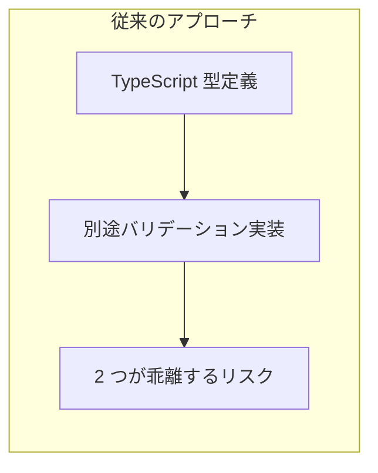
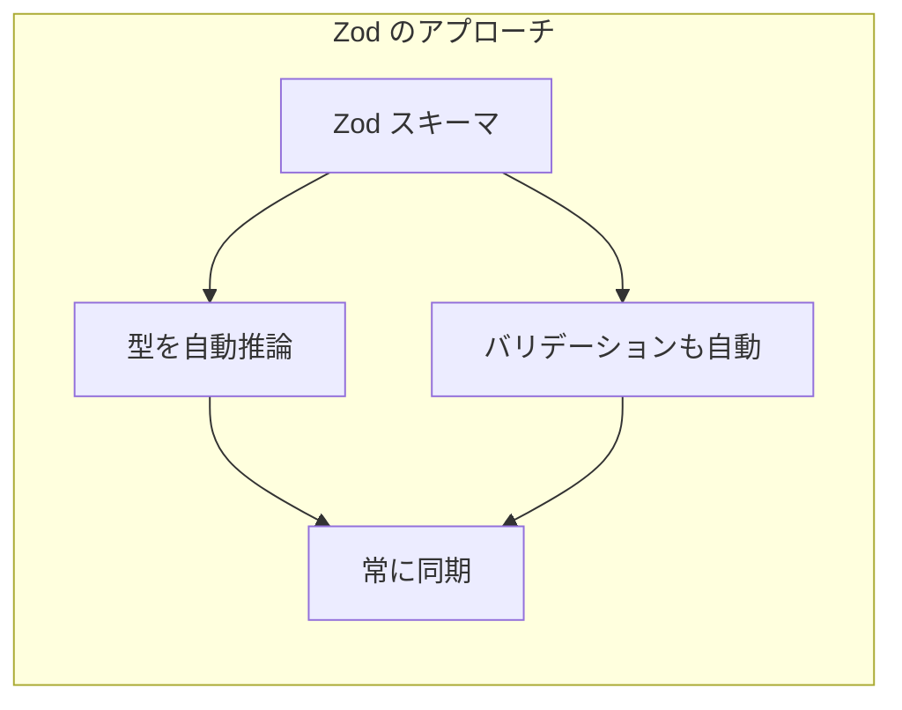

# Zod スキーマ定義

## 目次

- [Zod とは](#zod-とは)
- [なぜ Zod を使うのか](#なぜ-zod-を使うのか)
  - [1. 型とバリデーションの一元管理](#1-型とバリデーションの一元管理)
  - [2. フロントエンドとバックエンドで共有](#2-フロントエンドとバックエンドで共有)
  - [3. 優れたエラーメッセージ](#3-優れたエラーメッセージ)
- [基本的なスキーマ定義](#基本的なスキーマ定義)
  - [プリミティブ型](#プリミティブ型)
  - [文字列のバリデーション](#文字列のバリデーション)
  - [数値のバリデーション](#数値のバリデーション)
- [オブジェクトスキーマ](#オブジェクトスキーマ)
  - [基本的なオブジェクト](#基本的なオブジェクト)
  - [ネストしたオブジェクト](#ネストしたオブジェクト)
- [オプショナルとデフォルト値](#オプショナルとデフォルト値)
  - [オプショナルフィールド](#オプショナルフィールド)
  - [デフォルト値](#デフォルト値)
- [カスタムエラーメッセージ](#カスタムエラーメッセージ)
  - [日本語エラーメッセージ](#日本語エラーメッセージ)
  - [エラーマップでグローバル設定](#エラーマップでグローバル設定)
- [refine / superRefine による高度なバリデーション](#refine--superrefine-による高度なバリデーション)
  - [refine: カスタムバリデーション](#refine-カスタムバリデーション)
  - [superRefine: 複数のカスタムエラー](#superrefine-複数のカスタムエラー)
- [EC サイトでの実例](#ec-サイトでの実例)
  - [ユーザー登録スキーマ](#ユーザー登録スキーマ)
  - [配送先住所スキーマ](#配送先住所スキーマ)
  - [商品レビュースキーマ](#商品レビュースキーマ)
- [パッケージ構成](#パッケージ構成)
  - [packages/validators の構成](#packagesvalidators-の構成)
  - [package.json](#packagejson)
  - [使用例](#使用例)
- [バリデーションの実行](#バリデーションの実行)
  - [parse vs safeParse](#parse-vs-safeparse)
  - [フォームデータのバリデーション](#フォームデータのバリデーション)
- [まとめ](#まとめ)
  - [Zod を使うメリット](#zod-を使うメリット)
  - [ベストプラクティス](#ベストプラクティス)
- [次のステップ](#次のステップ)

## Zod とは

**Zod** は、TypeScriptファーストのスキーマ宣言・バリデーションライブラリです。
スキーマを定義するだけで、ランタイムのバリデーションとTypeScriptの型を同時に得られます。

```typescript
import { z } from "zod";

// スキーマを定義
const userSchema = z.object({
  name: z.string(),
  email: z.string().email(),
  age: z.number().min(0),
});

// スキーマから型を推論
type User = z.infer<typeof userSchema>;
// { name: string; email: string; age: number }
```

***

## なぜ Zod を使うのか

### 1. 型とバリデーションの一元管理





### 2. フロントエンドとバックエンドで共有

```text
packages/validators/
  src/
    user.ts       # ユーザースキーマ
    address.ts    # 住所スキーマ
    review.ts     # レビュースキーマ
```

同じスキーマを `apps/web`（フロントエンド）と `apps/admin`（管理画面）で使用できます。

### 3. 優れたエラーメッセージ

```typescript
const result = userSchema.safeParse({
  name: "",
  email: "invalid-email",
  age: -5,
});

if (!result.success) {
  console.log(result.error.issues);
  // [
  //   { path: ["name"], message: "String must contain at least 1 character(s)" },
  //   { path: ["email"], message: "Invalid email" },
  //   { path: ["age"], message: "Number must be greater than or equal to 0" }
  // ]
}
```

***

## 基本的なスキーマ定義

### プリミティブ型

```typescript
import { z } from "zod";

// 文字列
const stringSchema = z.string();

// 数値
const numberSchema = z.number();

// 真偽値
const booleanSchema = z.boolean();

// 日付
const dateSchema = z.date();

// null / undefined
const nullSchema = z.null();
const undefinedSchema = z.undefined();
```

### 文字列のバリデーション

```typescript
const emailSchema = z.string().email("有効なメールアドレスを入力してください");

const passwordSchema = z
  .string()
  .min(8, "パスワードは8文字以上で入力してください")
  .max(100, "パスワードは100文字以内で入力してください")
  .regex(/[A-Z]/, "大文字を含めてください")
  .regex(/[a-z]/, "小文字を含めてください")
  .regex(/[0-9]/, "数字を含めてください");

const urlSchema = z.string().url("有効なURLを入力してください");

const uuidSchema = z.string().uuid("有効なUUIDを入力してください");
```

### 数値のバリデーション

```typescript
const priceSchema = z
  .number()
  .min(0, "価格は0以上で入力してください")
  .max(1000000, "価格は100万円以下で入力してください");

const quantitySchema = z
  .number()
  .int("数量は整数で入力してください")
  .positive("数量は1以上で入力してください");

const ratingSchema = z
  .number()
  .min(1, "評価は1以上で入力してください")
  .max(5, "評価は5以下で入力してください");
```

***

## オブジェクトスキーマ

### 基本的なオブジェクト

```typescript
const productSchema = z.object({
  id: z.string().uuid(),
  name: z.string().min(1, "商品名を入力してください"),
  price: z.number().min(0),
  description: z.string(),
  categoryId: z.string().uuid(),
});

type Product = z.infer<typeof productSchema>;
// {
//   id: string;
//   name: string;
//   price: number;
//   description: string;
//   categoryId: string;
// }
```

### ネストしたオブジェクト

```typescript
const orderSchema = z.object({
  id: z.string().uuid(),
  user: z.object({
    id: z.string().uuid(),
    name: z.string(),
    email: z.string().email(),
  }),
  items: z.array(
    z.object({
      productId: z.string().uuid(),
      quantity: z.number().int().positive(),
      price: z.number().min(0),
    })
  ),
  shippingAddress: z.object({
    postalCode: z.string().regex(/^\d{3}-?\d{4}$/),
    prefecture: z.string(),
    city: z.string(),
    address: z.string(),
  }),
});
```

***

## オプショナルとデフォルト値

### オプショナルフィールド

```typescript
const userProfileSchema = z.object({
  name: z.string(),
  email: z.string().email(),
  // オプショナル（undefined を許容）
  nickname: z.string().optional(),
  // null を許容
  avatarUrl: z.string().url().nullable(),
  // null または undefined を許容
  bio: z.string().nullish(),
});

type UserProfile = z.infer<typeof userProfileSchema>;
// {
//   name: string;
//   email: string;
//   nickname?: string | undefined;
//   avatarUrl: string | null;
//   bio?: string | null | undefined;
// }
```

### デフォルト値

```typescript
const settingsSchema = z.object({
  theme: z.enum(["light", "dark"]).default("light"),
  notificationsEnabled: z.boolean().default(true),
  itemsPerPage: z.number().int().min(1).max(100).default(20),
});

// パース時にデフォルト値が適用される
const settings = settingsSchema.parse({});
// { theme: "light", notificationsEnabled: true, itemsPerPage: 20 }
```

***

## カスタムエラーメッセージ

### 日本語エラーメッセージ

```typescript
const registerSchema = z.object({
  email: z.string({ required_error: "メールアドレスは必須です" }).email({
    message: "有効なメールアドレスを入力してください",
  }),
  password: z
    .string({ required_error: "パスワードは必須です" })
    .min(8, { message: "パスワードは8文字以上で入力してください" })
    .max(100, { message: "パスワードは100文字以内で入力してください" }),
  name: z
    .string({ required_error: "名前は必須です" })
    .min(1, { message: "名前を入力してください" })
    .max(50, { message: "名前は50文字以内で入力してください" }),
});
```

### エラーマップでグローバル設定

```typescript
import { z } from "zod";

const customErrorMap: z.ZodErrorMap = (issue, ctx) => {
  switch (issue.code) {
    case z.ZodIssueCode.invalid_type:
      if (issue.expected === "string") {
        return { message: "文字列を入力してください" };
      }
      if (issue.expected === "number") {
        return { message: "数値を入力してください" };
      }
      break;
    case z.ZodIssueCode.too_small:
      if (issue.type === "string") {
        return { message: `${issue.minimum}文字以上で入力してください` };
      }
      break;
    case z.ZodIssueCode.too_big:
      if (issue.type === "string") {
        return { message: `${issue.maximum}文字以内で入力してください` };
      }
      break;
  }
  return { message: ctx.defaultError };
};

z.setErrorMap(customErrorMap);
```

***

## refine / superRefine による高度なバリデーション

### refine: カスタムバリデーション

```typescript
// パスワード確認のバリデーション
const passwordFormSchema = z
  .object({
    password: z.string().min(8),
    confirmPassword: z.string().min(8),
  })
  .refine((data) => data.password === data.confirmPassword, {
    message: "パスワードが一致しません",
    path: ["confirmPassword"], // エラーを表示するフィールド
  });
```

### superRefine: 複数のカスタムエラー

```typescript
const complexFormSchema = z
  .object({
    startDate: z.date(),
    endDate: z.date(),
    quantity: z.number(),
    maxQuantity: z.number(),
  })
  .superRefine((data, ctx) => {
    if (data.endDate < data.startDate) {
      ctx.addIssue({
        code: z.ZodIssueCode.custom,
        message: "終了日は開始日より後にしてください",
        path: ["endDate"],
      });
    }

    if (data.quantity > data.maxQuantity) {
      ctx.addIssue({
        code: z.ZodIssueCode.custom,
        message: `数量は${data.maxQuantity}以下にしてください`,
        path: ["quantity"],
      });
    }
  });
```

***

## EC サイトでの実例

### ユーザー登録スキーマ

```typescript
// packages/validators/src/user.ts
import { z } from "zod";

export const registerSchema = z
  .object({
    email: z
      .string({ required_error: "メールアドレスは必須です" })
      .email({ message: "有効なメールアドレスを入力してください" }),
    password: z
      .string({ required_error: "パスワードは必須です" })
      .min(8, { message: "パスワードは8文字以上で入力してください" })
      .regex(/[A-Z]/, { message: "大文字を含めてください" })
      .regex(/[a-z]/, { message: "小文字を含めてください" })
      .regex(/[0-9]/, { message: "数字を含めてください" }),
    confirmPassword: z.string({
      required_error: "パスワード確認は必須です",
    }),
    name: z
      .string({ required_error: "名前は必須です" })
      .min(1, { message: "名前を入力してください" })
      .max(50, { message: "名前は50文字以内で入力してください" }),
    agreedToTerms: z.literal(true, {
      errorMap: () => ({ message: "利用規約に同意してください" }),
    }),
  })
  .refine((data) => data.password === data.confirmPassword, {
    message: "パスワードが一致しません",
    path: ["confirmPassword"],
  });

export type RegisterInput = z.infer<typeof registerSchema>;
```

### 配送先住所スキーマ

```typescript
// packages/validators/src/address.ts
import { z } from "zod";

export const addressSchema = z.object({
  postalCode: z.string({ required_error: "郵便番号は必須です" }).regex(/^\d{3}-?\d{4}$/, {
    message: "郵便番号は「123-4567」の形式で入力してください",
  }),
  prefecture: z
    .string({ required_error: "都道府県は必須です" })
    .min(1, { message: "都道府県を選択してください" }),
  city: z
    .string({ required_error: "市区町村は必須です" })
    .min(1, { message: "市区町村を入力してください" }),
  address: z
    .string({ required_error: "番地は必須です" })
    .min(1, { message: "番地を入力してください" }),
  building: z.string().optional(),
  phone: z.string({ required_error: "電話番号は必須です" }).regex(/^0\d{9,10}$/, {
    message: "電話番号を正しく入力してください",
  }),
});

export type AddressInput = z.infer<typeof addressSchema>;
```

### 商品レビュースキーマ

```typescript
// packages/validators/src/review.ts
import { z } from "zod";

export const reviewSchema = z.object({
  rating: z
    .number({ required_error: "評価は必須です" })
    .int({ message: "評価は1〜5の整数で入力してください" })
    .min(1, { message: "評価は1以上で入力してください" })
    .max(5, { message: "評価は5以下で入力してください" }),
  title: z
    .string({ required_error: "タイトルは必須です" })
    .min(1, { message: "タイトルを入力してください" })
    .max(100, { message: "タイトルは100文字以内で入力してください" }),
  content: z
    .string({ required_error: "レビュー内容は必須です" })
    .min(10, { message: "レビューは10文字以上で入力してください" })
    .max(1000, { message: "レビューは1000文字以内で入力してください" }),
  productId: z.string().uuid({ message: "無効な商品IDです" }),
});

export type ReviewInput = z.infer<typeof reviewSchema>;
```

***

## パッケージ構成

### packages/validators の構成

```text
packages/validators/
├── package.json
├── tsconfig.json
└── src/
    ├── index.ts
    ├── user.ts
    ├── address.ts
    └── review.ts
```

### package.json

```json
{
  "name": "@ec/validators",
  "version": "0.0.1",
  "private": true,
  "exports": {
    ".": "./src/index.ts",
    "./user": "./src/user.ts",
    "./address": "./src/address.ts",
    "./review": "./src/review.ts"
  },
  "dependencies": {
    "zod": "catalog:"
  },
  "devDependencies": {
    "@ec/typescript-config": "workspace:*",
    "typescript": "catalog:"
  }
}
```

### 使用例

```typescript
// apps/web/app/register/page.tsx
import { registerSchema, type RegisterInput } from "@ec/validators/user";

function RegisterForm(): JSX.Element {
  const handleSubmit = (data: RegisterInput): void => {
    const result = registerSchema.safeParse(data);
    if (!result.success) {
      // エラー処理
    }
  };

  return <form>{/* ... */}</form>;
}
```

***

## バリデーションの実行

### parse vs safeParse

```typescript
import { z } from "zod";

const schema = z.string().email();

// parse: 失敗すると例外をスロー
try {
  const email = schema.parse("invalid-email");
} catch (error) {
  if (error instanceof z.ZodError) {
    console.log(error.issues);
  }
}

// safeParse: 失敗しても例外をスローしない（推奨）
const result = schema.safeParse("invalid-email");
if (result.success) {
  console.log(result.data); // 型安全なデータ
} else {
  console.log(result.error.issues); // エラー情報
}
```

### フォームデータのバリデーション

```typescript
async function validateFormData(
  formData: FormData
): Promise<{ success: true; data: RegisterInput } | { success: false; errors: z.ZodIssue[] }> {
  const rawData = {
    email: formData.get("email"),
    password: formData.get("password"),
    confirmPassword: formData.get("confirmPassword"),
    name: formData.get("name"),
    agreedToTerms: formData.get("agreedToTerms") === "on",
  };

  const result = registerSchema.safeParse(rawData);

  if (result.success) {
    return { success: true, data: result.data };
  }

  return { success: false, errors: result.error.issues };
}
```

***

## まとめ

### Zod を使うメリット

- 型とバリデーションを一元管理できる
- TypeScriptの型を自動推論できる
- フロントエンドとバックエンドでスキーマを共有できる
- 詳細なエラーメッセージを設定できる
- カスタムバリデーションが柔軟に書ける

### ベストプラクティス

1. スキーマは `packages/validators` で一元管理する
2. 日本語のエラーメッセージを設定する
3. `safeParse` を使って安全にバリデーションする
4. 複雑なバリデーションは `refine` / `superRefine` を使う

***

## 次のステップ

Zodスキーマの定義方法を理解したら、[Server Actions 基礎](./02-server-actions.md) に進んで、サーバーサイドでのフォーム処理を学びましょう。
