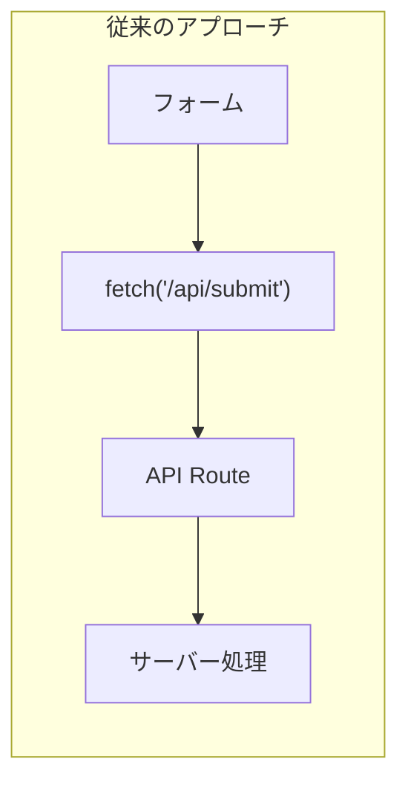
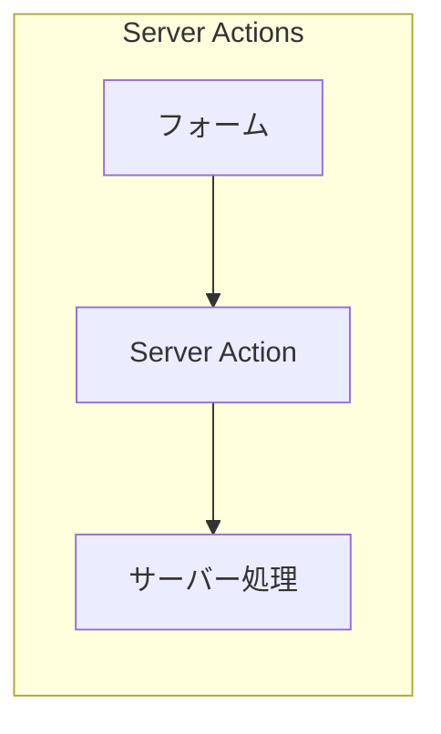
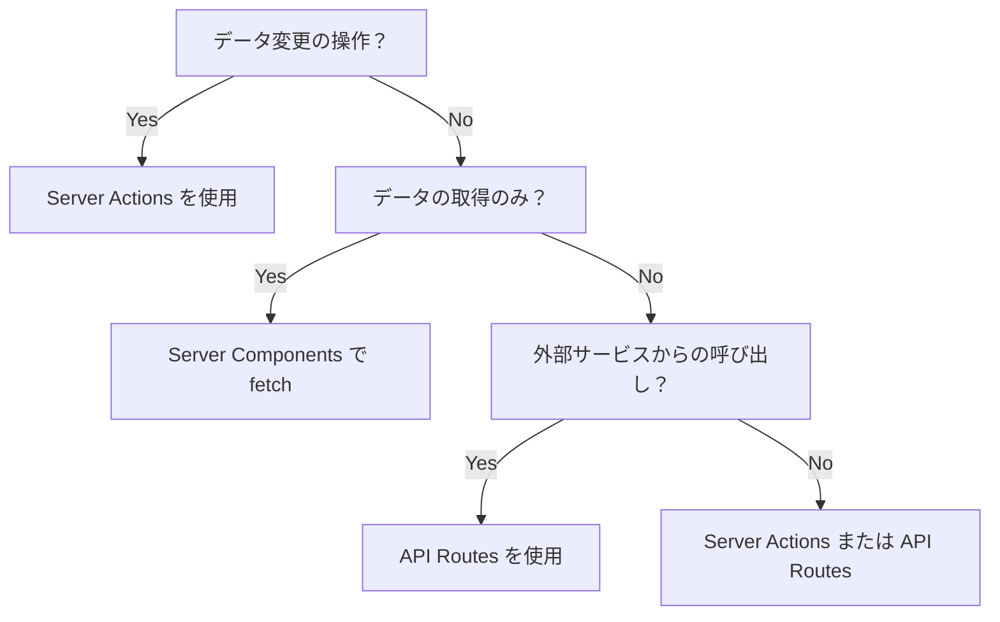

# Server Actions 基礎

## Server Actions とは

**Server Actions** は、Next.js 13.4 で導入された機能で、サーバー上で実行される非同期関数です。
フォームの送信やデータの変更を、API Routes を作成せずに直接処理できます。





---

## 'use server' ディレクティブ

Server Actions を定義するには、関数またはファイルの先頭に `'use server'` ディレクティブを追加します。

### ファイル単位で定義

```typescript
// app/actions.ts
"use server";

export async function createUser(formData: FormData): Promise<void> {
  const email = formData.get("email");
  const password = formData.get("password");
  // サーバーサイドの処理
}

export async function updateUser(formData: FormData): Promise<void> {
  // サーバーサイドの処理
}
```

### 関数単位で定義

```typescript
// app/register/page.tsx
async function RegisterPage(): Promise<JSX.Element> {
  async function handleSubmit(formData: FormData): Promise<void> {
    "use server";
    const email = formData.get("email");
    // サーバーサイドの処理
  }

  return (
    <form action={handleSubmit}>
      <input type="email" name="email" />
      <button type="submit">登録</button>
    </form>
  );
}

export default RegisterPage;
```

---

## フォームからの呼び出し

### 基本的な使い方

```typescript
// app/actions.ts
"use server";

export async function submitForm(formData: FormData): Promise<void> {
  const name = formData.get("name") as string;
  const email = formData.get("email") as string;

  console.log(`Name: ${name}, Email: ${email}`);
}
```

```typescript
// app/contact/page.tsx
import { submitForm } from "@/app/actions";

export default function ContactPage(): JSX.Element {
  return (
    <form action={submitForm}>
      <input type="text" name="name" placeholder="名前" required />
      <input type="email" name="email" placeholder="メール" required />
      <button type="submit">送信</button>
    </form>
  );
}
```

### Client Component からの呼び出し

```typescript
// app/components/ContactForm.tsx
"use client";

import { submitForm } from "@/app/actions";

export function ContactForm(): JSX.Element {
  return (
    <form action={submitForm}>
      <input type="text" name="name" placeholder="名前" required />
      <input type="email" name="email" placeholder="メール" required />
      <button type="submit">送信</button>
    </form>
  );
}
```

---

## データの受け取り

### FormData から値を取得

```typescript
"use server";

export async function registerUser(formData: FormData): Promise<void> {
  // 単一の値を取得
  const email = formData.get("email") as string | null;
  const password = formData.get("password") as string | null;

  // チェックボックスの値（on または null）
  const agreedToTerms = formData.get("agreedToTerms") === "on";

  // 複数の値を取得（チェックボックスグループなど）
  const interests = formData.getAll("interests") as string[];

  // ファイルを取得
  const avatar = formData.get("avatar") as File | null;
}
```

### オブジェクトに変換

```typescript
"use server";

import { registerSchema } from "@ec/validators/user";

export async function registerUser(formData: FormData): Promise<{
  success: boolean;
  errors?: Record<string, string[]>;
}> {
  // FormData をオブジェクトに変換
  const rawData = {
    email: formData.get("email"),
    password: formData.get("password"),
    confirmPassword: formData.get("confirmPassword"),
    name: formData.get("name"),
    agreedToTerms: formData.get("agreedToTerms") === "on",
  };

  // Zod でバリデーション
  const result = registerSchema.safeParse(rawData);

  if (!result.success) {
    // フィールドごとのエラーを返す
    const errors: Record<string, string[]> = {};
    for (const issue of result.error.issues) {
      const field = issue.path[0] as string;
      errors[field] = errors[field] ?? [];
      errors[field].push(issue.message);
    }
    return { success: false, errors };
  }

  // 登録処理
  // await db.user.create({ data: result.data });

  return { success: true };
}
```

---

## バリデーションとエラーレスポンス

### 戻り値を使ったエラーハンドリング

```typescript
// app/actions.ts
"use server";

import { z } from "zod";
import { registerSchema } from "@ec/validators/user";

export type ActionState = {
  success: boolean;
  message?: string;
  errors?: Record<string, string[]>;
};

export async function registerUser(formData: FormData): Promise<ActionState> {
  const rawData = {
    email: formData.get("email"),
    password: formData.get("password"),
    confirmPassword: formData.get("confirmPassword"),
    name: formData.get("name"),
    agreedToTerms: formData.get("agreedToTerms") === "on",
  };

  // バリデーション
  const result = registerSchema.safeParse(rawData);

  if (!result.success) {
    const errors: Record<string, string[]> = {};
    for (const issue of result.error.issues) {
      const field = issue.path[0] as string;
      errors[field] = errors[field] ?? [];
      errors[field].push(issue.message);
    }
    return {
      success: false,
      message: "入力内容に誤りがあります",
      errors,
    };
  }

  try {
    // ユーザー登録処理
    // await db.user.create({ data: result.data });

    return {
      success: true,
      message: "登録が完了しました",
    };
  } catch (error) {
    return {
      success: false,
      message: "登録に失敗しました。時間をおいて再度お試しください。",
    };
  }
}
```

---

## セキュリティ考慮事項

### 1. サーバーサイドでのバリデーション

クライアントサイドのバリデーションは UX のためであり、セキュリティのためには **必ずサーバーサイドでバリデーション** を行う必要があります。

```typescript
"use server";

import { registerSchema } from "@ec/validators/user";

export async function registerUser(formData: FormData): Promise<ActionState> {
  // 必ずサーバーサイドでバリデーション
  const result = registerSchema.safeParse({
    email: formData.get("email"),
    password: formData.get("password"),
    // ...
  });

  if (!result.success) {
    return { success: false, errors: /* ... */ };
  }

  // バリデーション済みのデータのみを使用
  const validatedData = result.data;
}
```

### 2. 認証の確認

保護されたアクションでは、認証状態を確認します。

```typescript
"use server";

import { cookies } from "next/headers";
import { verifySession } from "@/lib/auth";

export async function updateProfile(formData: FormData): Promise<ActionState> {
  // セッションを確認
  const cookieStore = await cookies();
  const sessionToken = cookieStore.get("session")?.value;

  if (!sessionToken) {
    return { success: false, message: "ログインしてください" };
  }

  const session = await verifySession(sessionToken);

  if (!session) {
    return { success: false, message: "セッションが無効です" };
  }

  // 認証済みユーザーの処理
  const userId = session.userId;
  // ...
}
```

### 3. CSRF 対策

Next.js は Server Actions に対して自動的に CSRF トークンを検証します。
特別な設定なしで、安全にフォームを処理できます。

### 4. 入力値のサニタイズ

ユーザー入力は適切にサニタイズします。

```typescript
"use server";

import { z } from "zod";

const commentSchema = z.object({
  content: z
    .string()
    .min(1)
    .max(1000)
    // HTML タグを除去
    .transform((val) => val.replace(/<[^>]*>/g, "")),
});

export async function createComment(formData: FormData): Promise<ActionState> {
  const result = commentSchema.safeParse({
    content: formData.get("content"),
  });

  if (!result.success) {
    return { success: false, errors: /* ... */ };
  }

  // サニタイズ済みのデータ
  const sanitizedContent = result.data.content;
}
```

---

## Server Actions vs API Routes

### 使い分けの基準



| 項目               | Server Actions             | API Routes          |
| ------------------ | -------------------------- | ------------------- |
| 主な用途           | フォーム送信、データ変更   | 外部 API、Webhook   |
| 呼び出し元         | フォーム、Client Component | fetch、外部サービス |
| CSRF 対策          | 自動                       | 手動で実装          |
| 型安全性           | 高い                       | 手動で型定義        |
| エンドポイント公開 | なし                       | あり                |

### Server Actions を使うべきケース

- フォームの送信
- データの作成・更新・削除
- ユーザーアクション（いいね、フォローなど）
- ファイルのアップロード

### API Routes を使うべきケース

- Webhook の受け取り
- 外部サービスからの呼び出し
- 認証プロバイダーのコールバック
- CORS が必要なエンドポイント

---

## 実装パターン

### リダイレクトとリフレッシュ

```typescript
"use server";

import { redirect } from "next/navigation";
import { revalidatePath } from "next/cache";

export async function createProduct(formData: FormData): Promise<void> {
  // 商品を作成
  const product = await db.product.create({
    data: {
      name: formData.get("name") as string,
      price: Number(formData.get("price")),
    },
  });

  // キャッシュを再検証
  revalidatePath("/products");

  // 作成した商品ページにリダイレクト
  redirect(`/products/${product.id}`);
}
```

### プログレッシブエンハンスメント

JavaScript が無効でもフォームが動作するように実装します。

```typescript
// app/contact/page.tsx
import { submitContact } from "@/app/actions";

export default function ContactPage(): JSX.Element {
  return (
    <form action={submitContact}>
      <input type="text" name="name" required />
      <input type="email" name="email" required />
      <textarea name="message" required />
      <button type="submit">送信</button>
    </form>
  );
}
```

この実装では以下が可能です。

- JavaScript が有効な場合: 非同期でフォームを送信
- JavaScript が無効な場合: 通常のフォーム送信として動作

---

## EC サイトでの実装例

### 商品レビュー投稿

```typescript
// app/actions/review.ts
"use server";

import { revalidatePath } from "next/cache";
import { cookies } from "next/headers";
import { reviewSchema } from "@ec/validators/review";
import type { ActionState } from "@/types/action";

export async function createReview(formData: FormData): Promise<ActionState> {
  // 認証確認
  const cookieStore = await cookies();
  const sessionToken = cookieStore.get("session")?.value;

  if (!sessionToken) {
    return { success: false, message: "ログインしてください" };
  }

  // バリデーション
  const rawData = {
    productId: formData.get("productId"),
    rating: Number(formData.get("rating")),
    title: formData.get("title"),
    content: formData.get("content"),
  };

  const result = reviewSchema.safeParse(rawData);

  if (!result.success) {
    const errors: Record<string, string[]> = {};
    for (const issue of result.error.issues) {
      const field = issue.path[0] as string;
      errors[field] = errors[field] ?? [];
      errors[field].push(issue.message);
    }
    return { success: false, errors };
  }

  try {
    // レビューを作成
    // await db.review.create({ data: { ...result.data, userId } });

    // 商品ページのキャッシュを再検証
    revalidatePath(`/products/${result.data.productId}`);

    return { success: true, message: "レビューを投稿しました" };
  } catch (error) {
    return {
      success: false,
      message: "レビューの投稿に失敗しました",
    };
  }
}
```

### カートへの追加

```typescript
// app/actions/cart.ts
"use server";

import { revalidatePath } from "next/cache";
import { cookies } from "next/headers";
import { z } from "zod";
import type { ActionState } from "@/types/action";

const addToCartSchema = z.object({
  productId: z.string().uuid(),
  quantity: z.number().int().positive().max(99),
});

export async function addToCart(formData: FormData): Promise<ActionState> {
  const rawData = {
    productId: formData.get("productId"),
    quantity: Number(formData.get("quantity")),
  };

  const result = addToCartSchema.safeParse(rawData);

  if (!result.success) {
    return { success: false, message: "無効なリクエストです" };
  }

  try {
    // カートに追加
    // await cartService.addItem(result.data);

    // カートページのキャッシュを再検証
    revalidatePath("/cart");

    return { success: true, message: "カートに追加しました" };
  } catch (error) {
    return { success: false, message: "カートへの追加に失敗しました" };
  }
}
```

---

## まとめ

### Server Actions のメリット

- API Routes を作成せずにサーバー処理が書ける
- 型安全にフォームデータを処理できる
- CSRF 対策が自動的に行われる
- プログレッシブエンハンスメントに対応

### ベストプラクティス

1. 必ずサーバーサイドでバリデーションを行う
2. エラーメッセージはフィールドごとに配列形式で返す
3. 認証が必要なアクションでは認証確認を行う
4. `revalidatePath` でキャッシュを適切に再検証する

---

## 次のステップ

Server Actions の基本を理解したら、[useActionState フック](./03-use-action-state.md) に進んで、フォームの状態管理を学びましょう。
