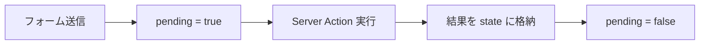

# useActionState フック

## 目次

- [useActionState とは](#useactionstate-とは)
- [基本的な使い方](#基本的な使い方)
  - [シグネチャ](#シグネチャ)
  - [基本例](#基本例)
- [状態管理のパターン](#状態管理のパターン)
  - [状態の型定義](#状態の型定義)
  - [成功・エラーの判定](#成功エラーの判定)
- [フォームとの連携](#フォームとの連携)
  - [フィールドごとのエラー表示](#フィールドごとのエラー表示)
- [useFormStatus との組み合わせ](#useformstatus-との組み合わせ)
  - [useFormStatus の基本](#useformstatus-の基本)
  - [注意点](#注意点)
  - [完全な実装例](#完全な実装例)
- [実装例](#実装例)
  - [ログインフォーム](#ログインフォーム)
  - [お問い合わせフォーム](#お問い合わせフォーム)
- [まとめ](#まとめ)
  - [useActionState のメリット](#useactionstate-のメリット)
  - [ベストプラクティス](#ベストプラクティス)
- [次のステップ](#次のステップ)

## useActionState とは

**useActionState** は React 19 で導入されたフックで、Server Actions の状態を管理するために使用します。
フォームの送信状態（送信中、成功、エラー）を簡単に追跡できます。



---

## 基本的な使い方

### シグネチャ

```typescript
const [state, formAction, isPending] = useActionState(action, initialState);
```

| 戻り値       | 説明                                   |
| ------------ | -------------------------------------- |
| `state`      | Server Action の戻り値（現在の状態）   |
| `formAction` | フォームの `action` 属性に渡す関数     |
| `isPending`  | アクション実行中かどうかを示すブール値 |

| 引数           | 説明                   |
| -------------- | ---------------------- |
| `action`       | 呼び出す Server Action |
| `initialState` | 初期状態               |

### 基本例

```typescript
// app/actions.ts
"use server";

export type ActionState = {
  success: boolean;
  message?: string;
  errors?: Record<string, string[]>;
};

export async function submitForm(prevState: ActionState, formData: FormData): Promise<ActionState> {
  const name = formData.get("name") as string;

  if (!name) {
    return {
      success: false,
      errors: { name: ["名前を入力してください"] },
    };
  }

  // 処理を実行
  await new Promise((resolve) => setTimeout(resolve, 1000));

  return {
    success: true,
    message: "送信が完了しました",
  };
}
```

```typescript
// app/contact/page.tsx
"use client";

import { useActionState } from "react";
import { submitForm, type ActionState } from "@/app/actions";

const initialState: ActionState = {
  success: false,
};

export default function ContactPage(): JSX.Element {
  const [state, formAction, isPending] = useActionState(
    submitForm,
    initialState
  );

  return (
    <form action={formAction}>
      <div>
        <input type="text" name="name" placeholder="名前" />
        {state.errors?.name && (
          <p className="text-red-500">{state.errors.name[0]}</p>
        )}
      </div>

      <button type="submit" disabled={isPending}>
        {isPending ? "送信中..." : "送信"}
      </button>

      {state.success && (
        <p className="text-green-500">{state.message}</p>
      )}
    </form>
  );
}
```

---

## 状態管理のパターン

### 状態の型定義

```typescript
// types/action.ts
export type ActionState<T = unknown> = {
  success: boolean;
  message?: string;
  errors?: Record<string, string[]>;
  data?: T;
};
```

### 成功・エラーの判定

```typescript
"use client";

import { useActionState } from "react";
import { registerUser, type ActionState } from "@/app/actions";

export function RegisterForm(): JSX.Element {
  const [state, formAction, isPending] = useActionState(registerUser, {
    success: false,
  });

  return (
    <form action={formAction}>
      {/* フォームフィールド */}
      <input type="email" name="email" />
      <input type="password" name="password" />

      {/* 全体的なエラーメッセージ */}
      {!state.success && state.message && (
        <div className="text-red-500">{state.message}</div>
      )}

      {/* 成功メッセージ */}
      {state.success && (
        <div className="text-green-500">{state.message}</div>
      )}

      <button type="submit" disabled={isPending}>
        {isPending ? "登録中..." : "登録"}
      </button>
    </form>
  );
}
```

---

## フォームとの連携

### フィールドごとのエラー表示

```typescript
"use client";

import { useActionState } from "react";
import { registerUser, type ActionState } from "@/app/actions";

type FormFieldProps = {
  name: string;
  type: string;
  label: string;
  errors?: string[];
};

function FormField({ name, type, label, errors }: FormFieldProps): JSX.Element {
  return (
    <div className="mb-4">
      <label htmlFor={name} className="block text-sm font-medium">
        {label}
      </label>
      <input
        id={name}
        type={type}
        name={name}
        className={`mt-1 block w-full rounded-md border ${
          errors ? "border-red-500" : "border-gray-300"
        }`}
      />
      {errors?.map((error, index) => (
        <p key={index} className="mt-1 text-sm text-red-500">
          {error}
        </p>
      ))}
    </div>
  );
}

export function RegisterForm(): JSX.Element {
  const [state, formAction, isPending] = useActionState(registerUser, {
    success: false,
  });

  return (
    <form action={formAction}>
      <FormField
        name="email"
        type="email"
        label="メールアドレス"
        errors={state.errors?.email}
      />
      <FormField
        name="password"
        type="password"
        label="パスワード"
        errors={state.errors?.password}
      />
      <FormField
        name="confirmPassword"
        type="password"
        label="パスワード確認"
        errors={state.errors?.confirmPassword}
      />
      <FormField
        name="name"
        type="text"
        label="名前"
        errors={state.errors?.name}
      />

      <button
        type="submit"
        disabled={isPending}
        className="w-full bg-blue-500 text-white py-2 rounded-md disabled:opacity-50"
      >
        {isPending ? "登録中..." : "登録"}
      </button>
    </form>
  );
}
```

---

## useFormStatus との組み合わせ

`useFormStatus` は、親の `<form>` の送信状態を取得するフックです。
`useActionState` と組み合わせて使用します。

### useFormStatus の基本

```typescript
"use client";

import { useFormStatus } from "react-dom";

function SubmitButton(): JSX.Element {
  const { pending } = useFormStatus();

  return (
    <button type="submit" disabled={pending}>
      {pending ? "送信中..." : "送信"}
    </button>
  );
}
```

### 注意点

`useFormStatus` は **`<form>` の子コンポーネント内** でのみ動作します。

```typescript
// NG: フォームと同じコンポーネント内では動作しない
function ContactForm(): JSX.Element {
  const { pending } = useFormStatus(); // 常に pending = false

  return (
    <form action={submitForm}>
      <button disabled={pending}>送信</button>
    </form>
  );
}

// OK: 子コンポーネントとして分離
function ContactForm(): JSX.Element {
  return (
    <form action={submitForm}>
      <SubmitButton />
    </form>
  );
}

function SubmitButton(): JSX.Element {
  const { pending } = useFormStatus(); // 正常に動作

  return <button disabled={pending}>送信</button>;
}
```

### 完全な実装例

```typescript
// components/SubmitButton.tsx
"use client";

import { useFormStatus } from "react-dom";

type SubmitButtonProps = {
  children: React.ReactNode;
  loadingText?: string;
};

export function SubmitButton({
  children,
  loadingText = "送信中...",
}: SubmitButtonProps): JSX.Element {
  const { pending } = useFormStatus();

  return (
    <button
      type="submit"
      disabled={pending}
      className="w-full bg-blue-500 text-white py-2 rounded-md disabled:opacity-50"
    >
      {pending ? loadingText : children}
    </button>
  );
}
```

```typescript
// components/RegisterForm.tsx
"use client";

import { useActionState } from "react";
import { registerUser } from "@/app/actions";
import { SubmitButton } from "./SubmitButton";

export function RegisterForm(): JSX.Element {
  const [state, formAction] = useActionState(registerUser, {
    success: false,
  });

  return (
    <form action={formAction}>
      <input type="email" name="email" />
      <input type="password" name="password" />

      {/* 子コンポーネントとして使用 */}
      <SubmitButton loadingText="登録中...">登録する</SubmitButton>

      {state.success && <p>登録が完了しました</p>}
    </form>
  );
}
```

---

## 実装例

### ログインフォーム

```typescript
// app/actions/auth.ts
"use server";

import { cookies } from "next/headers";
import { redirect } from "next/navigation";
import { loginSchema } from "@ec/validators/user";
import type { ActionState } from "@/types/action";

export async function login(prevState: ActionState, formData: FormData): Promise<ActionState> {
  const rawData = {
    email: formData.get("email"),
    password: formData.get("password"),
  };

  const result = loginSchema.safeParse(rawData);

  if (!result.success) {
    const errors: Record<string, string[]> = {};
    for (const issue of result.error.issues) {
      const field = issue.path[0] as string;
      errors[field] = errors[field] ?? [];
      errors[field].push(issue.message);
    }
    return { success: false, errors };
  }

  try {
    // 認証処理
    // const user = await authenticate(result.data);

    // セッションを設定
    const cookieStore = await cookies();
    cookieStore.set("session", "session-token", {
      httpOnly: true,
      secure: process.env.NODE_ENV === "production",
      sameSite: "lax",
      maxAge: 60 * 60 * 24 * 7, // 1週間
    });
  } catch (error) {
    return {
      success: false,
      message: "メールアドレスまたはパスワードが正しくありません",
    };
  }

  redirect("/dashboard");
}
```

```typescript
// app/login/page.tsx
"use client";

import { useActionState } from "react";
import { login } from "@/app/actions/auth";
import { SubmitButton } from "@/components/SubmitButton";

export default function LoginPage(): JSX.Element {
  const [state, formAction] = useActionState(login, {
    success: false,
  });

  return (
    <div className="max-w-md mx-auto mt-10">
      <h1 className="text-2xl font-bold mb-6">ログイン</h1>

      <form action={formAction} className="space-y-4">
        <div>
          <label htmlFor="email" className="block text-sm font-medium">
            メールアドレス
          </label>
          <input
            id="email"
            type="email"
            name="email"
            className="mt-1 block w-full rounded-md border border-gray-300 px-3 py-2"
          />
          {state.errors?.email && (
            <p className="mt-1 text-sm text-red-500">{state.errors.email[0]}</p>
          )}
        </div>

        <div>
          <label htmlFor="password" className="block text-sm font-medium">
            パスワード
          </label>
          <input
            id="password"
            type="password"
            name="password"
            className="mt-1 block w-full rounded-md border border-gray-300 px-3 py-2"
          />
          {state.errors?.password && (
            <p className="mt-1 text-sm text-red-500">
              {state.errors.password[0]}
            </p>
          )}
        </div>

        {!state.success && state.message && (
          <div className="text-red-500 text-sm">{state.message}</div>
        )}

        <SubmitButton loadingText="ログイン中...">ログイン</SubmitButton>
      </form>
    </div>
  );
}
```

### お問い合わせフォーム

```typescript
// app/actions/contact.ts
"use server";

import { z } from "zod";
import type { ActionState } from "@/types/action";

const contactSchema = z.object({
  name: z.string().min(1, "名前を入力してください"),
  email: z.string().email("有効なメールアドレスを入力してください"),
  subject: z.string().min(1, "件名を入力してください"),
  message: z
    .string()
    .min(10, "メッセージは10文字以上で入力してください")
    .max(1000, "メッセージは1000文字以内で入力してください"),
});

export async function submitContact(
  prevState: ActionState,
  formData: FormData
): Promise<ActionState> {
  const rawData = {
    name: formData.get("name"),
    email: formData.get("email"),
    subject: formData.get("subject"),
    message: formData.get("message"),
  };

  const result = contactSchema.safeParse(rawData);

  if (!result.success) {
    const errors: Record<string, string[]> = {};
    for (const issue of result.error.issues) {
      const field = issue.path[0] as string;
      errors[field] = errors[field] ?? [];
      errors[field].push(issue.message);
    }
    return { success: false, errors };
  }

  try {
    // メール送信処理
    // await sendEmail(result.data);

    return {
      success: true,
      message: "お問い合わせを受け付けました。返信をお待ちください。",
    };
  } catch (error) {
    return {
      success: false,
      message: "送信に失敗しました。時間をおいて再度お試しください。",
    };
  }
}
```

```typescript
// app/contact/page.tsx
"use client";

import { useActionState } from "react";
import { submitContact } from "@/app/actions/contact";
import { SubmitButton } from "@/components/SubmitButton";

export default function ContactPage(): JSX.Element {
  const [state, formAction] = useActionState(submitContact, {
    success: false,
  });

  if (state.success) {
    return (
      <div className="max-w-md mx-auto mt-10 text-center">
        <div className="text-green-500 text-xl mb-4">
          お問い合わせありがとうございます
        </div>
        <p>{state.message}</p>
      </div>
    );
  }

  return (
    <div className="max-w-md mx-auto mt-10">
      <h1 className="text-2xl font-bold mb-6">お問い合わせ</h1>

      <form action={formAction} className="space-y-4">
        <div>
          <label htmlFor="name" className="block text-sm font-medium">
            お名前
          </label>
          <input
            id="name"
            type="text"
            name="name"
            className="mt-1 block w-full rounded-md border border-gray-300 px-3 py-2"
          />
          {state.errors?.name && (
            <p className="mt-1 text-sm text-red-500">{state.errors.name[0]}</p>
          )}
        </div>

        <div>
          <label htmlFor="email" className="block text-sm font-medium">
            メールアドレス
          </label>
          <input
            id="email"
            type="email"
            name="email"
            className="mt-1 block w-full rounded-md border border-gray-300 px-3 py-2"
          />
          {state.errors?.email && (
            <p className="mt-1 text-sm text-red-500">{state.errors.email[0]}</p>
          )}
        </div>

        <div>
          <label htmlFor="subject" className="block text-sm font-medium">
            件名
          </label>
          <input
            id="subject"
            type="text"
            name="subject"
            className="mt-1 block w-full rounded-md border border-gray-300 px-3 py-2"
          />
          {state.errors?.subject && (
            <p className="mt-1 text-sm text-red-500">
              {state.errors.subject[0]}
            </p>
          )}
        </div>

        <div>
          <label htmlFor="message" className="block text-sm font-medium">
            メッセージ
          </label>
          <textarea
            id="message"
            name="message"
            rows={5}
            className="mt-1 block w-full rounded-md border border-gray-300 px-3 py-2"
          />
          {state.errors?.message && (
            <p className="mt-1 text-sm text-red-500">
              {state.errors.message[0]}
            </p>
          )}
        </div>

        {!state.success && state.message && (
          <div className="text-red-500 text-sm">{state.message}</div>
        )}

        <SubmitButton loadingText="送信中...">送信</SubmitButton>
      </form>
    </div>
  );
}
```

---

## まとめ

### useActionState のメリット

- Server Actions の状態を簡単に追跡できる
- ローディング状態を自動で管理できる
- バリデーションエラーを状態として管理できる
- プログレッシブエンハンスメントに対応

### ベストプラクティス

1. `ActionState` 型を統一して使用する
2. `useFormStatus` と組み合わせてボタンの状態を管理する
3. フィールドごとにエラーを表示する
4. 成功時はユーザーにフィードバックを表示する

---

## 次のステップ

useActionState の使い方を理解したら、[楽観的 UI 更新](./04-optimistic-ui.md) に進んで、より良いユーザー体験を実現する方法を学びましょう。
