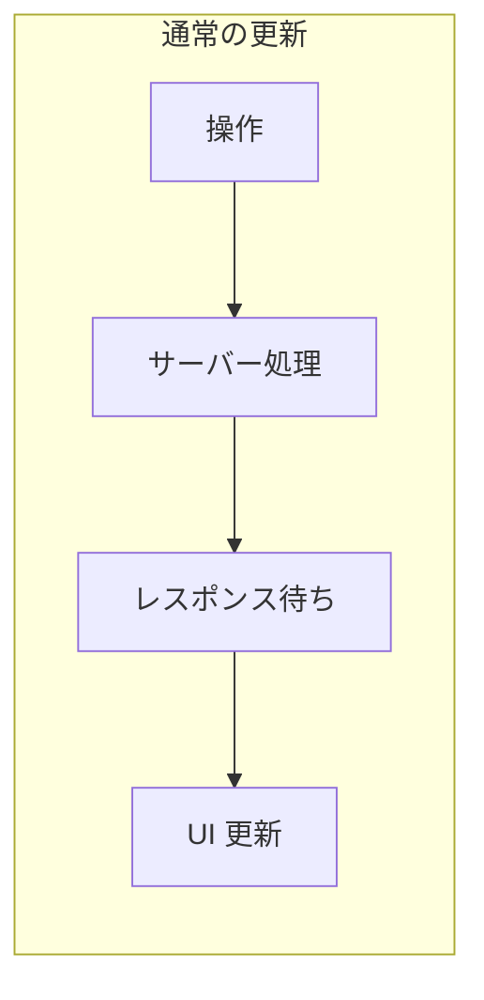
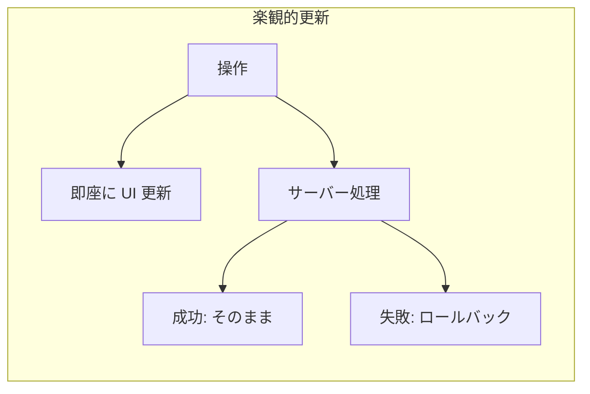
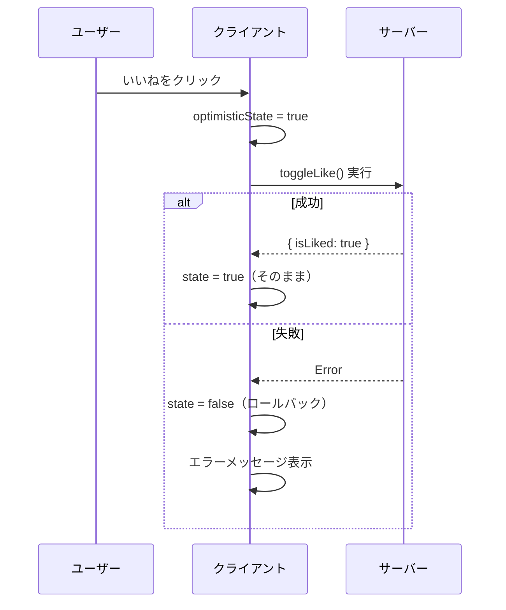

# 楽観的 UI 更新

## 目次

- [楽観的更新とは](#楽観的更新とは)
- [useOptimistic フック](#useoptimistic-フック)
  - [シグネチャ](#シグネチャ)
- [基本的な使い方](#基本的な使い方)
  - [シンプルな例: いいねボタン](#シンプルな例-いいねボタン)
- [EC サイトでの活用例](#ec-サイトでの活用例)
  - [カートへの追加](#カートへの追加)
  - [カートの数量変更](#カートの数量変更)
  - [お気に入りリスト](#お気に入りリスト)
- [エラー時のロールバック](#エラー時のロールバック)
  - [ロールバックの仕組み](#ロールバックの仕組み)
- [useTransition との組み合わせ](#usetransition-との組み合わせ)
  - [なぜ useTransition が必要か](#なぜ-usetransition-が必要か)
- [楽観的更新のベストプラクティス](#楽観的更新のベストプラクティス)
  - [1. 適切な場面で使用する](#1-適切な場面で使用する)
  - [2. エラーハンドリングを忘れない](#2-エラーハンドリングを忘れない)
  - [3. 一時的な ID を使用する](#3-一時的な-id-を使用する)
  - [4. ローディング状態を表示する](#4-ローディング状態を表示する)
- [まとめ](#まとめ)
  - [楽観的更新のメリット](#楽観的更新のメリット)
  - [実装のポイント](#実装のポイント)
- [次のステップ](#次のステップ)

## 楽観的更新とは

**楽観的更新（Optimistic Update）** とは、サーバーからの応答を待たずに、UI を即座に更新する手法です。
ユーザーにとって操作が即座に反映されるため、より良い体験を提供できます。





---

## useOptimistic フック

React 19 で導入された `useOptimistic` フックを使用して、楽観的更新を実装できます。

### シグネチャ

```typescript
const [optimisticState, addOptimistic] = useOptimistic(state, updateFn);
```

| 戻り値            | 説明                                    |
| ----------------- | --------------------------------------- |
| `optimisticState` | 楽観的な状態（実際の状態 + 楽観的変更） |
| `addOptimistic`   | 楽観的な変更を追加する関数              |

| 引数       | 説明                                             |
| ---------- | ------------------------------------------------ |
| `state`    | 実際の状態                                       |
| `updateFn` | 状態と楽観的な値を受け取り、新しい状態を返す関数 |

---

## 基本的な使い方

### シンプルな例: いいねボタン

```typescript
// app/actions/like.ts
"use server";

import { revalidatePath } from "next/cache";

export async function toggleLike(productId: string): Promise<{ isLiked: boolean }> {
  // いいねの状態を切り替え
  // const result = await db.like.toggle({ productId, userId });

  await new Promise((resolve) => setTimeout(resolve, 1000)); // 擬似的な遅延

  revalidatePath(`/products/${productId}`);

  return { isLiked: true };
}
```

```typescript
// components/LikeButton.tsx
"use client";

import { useOptimistic, useTransition } from "react";
import { toggleLike } from "@/app/actions/like";
import { Heart } from "lucide-react";

type LikeButtonProps = {
  productId: string;
  initialIsLiked: boolean;
};

export function LikeButton({
  productId,
  initialIsLiked,
}: LikeButtonProps): JSX.Element {
  const [isPending, startTransition] = useTransition();
  const [optimisticIsLiked, setOptimisticIsLiked] = useOptimistic(
    initialIsLiked,
    (currentState, newState: boolean) => newState
  );

  const handleClick = (): void => {
    startTransition(async () => {
      // 楽観的に UI を更新
      setOptimisticIsLiked(!optimisticIsLiked);

      // サーバーに送信
      await toggleLike(productId);
    });
  };

  return (
    <button
      onClick={handleClick}
      disabled={isPending}
      className={`p-2 rounded-full ${
        optimisticIsLiked ? "text-red-500" : "text-gray-400"
      }`}
    >
      <Heart fill={optimisticIsLiked ? "currentColor" : "none"} />
    </button>
  );
}
```

---

## EC サイトでの活用例

### カートへの追加

```typescript
// types/cart.ts
export type CartItem = {
  id: string;
  productId: string;
  name: string;
  price: number;
  quantity: number;
  imageUrl: string;
};
```

```typescript
// app/actions/cart.ts
"use server";

import { revalidatePath } from "next/cache";
import type { CartItem } from "@/types/cart";

export async function addToCart(productId: string, quantity: number): Promise<CartItem> {
  // カートに追加
  // const item = await cartService.add({ productId, quantity });

  await new Promise((resolve) => setTimeout(resolve, 500));

  revalidatePath("/cart");

  return {
    id: crypto.randomUUID(),
    productId,
    name: "商品名",
    price: 1000,
    quantity,
    imageUrl: "/placeholder.jpg",
  };
}
```

```typescript
// components/AddToCartButton.tsx
"use client";

import { useOptimistic, useTransition } from "react";
import { addToCart } from "@/app/actions/cart";
import type { CartItem } from "@/types/cart";

type AddToCartButtonProps = {
  product: {
    id: string;
    name: string;
    price: number;
    imageUrl: string;
  };
  cartItems: CartItem[];
  onCartUpdate: (items: CartItem[]) => void;
};

export function AddToCartButton({
  product,
  cartItems,
  onCartUpdate,
}: AddToCartButtonProps): JSX.Element {
  const [isPending, startTransition] = useTransition();
  const [optimisticItems, addOptimisticItem] = useOptimistic(
    cartItems,
    (currentItems, newItem: CartItem) => [...currentItems, newItem]
  );

  const handleClick = (): void => {
    startTransition(async () => {
      // 楽観的なアイテムを追加
      const optimisticItem: CartItem = {
        id: `temp-${Date.now()}`,
        productId: product.id,
        name: product.name,
        price: product.price,
        quantity: 1,
        imageUrl: product.imageUrl,
      };
      addOptimisticItem(optimisticItem);

      // サーバーに送信
      const actualItem = await addToCart(product.id, 1);
      onCartUpdate([...cartItems, actualItem]);
    });
  };

  return (
    <button
      onClick={handleClick}
      disabled={isPending}
      className="bg-blue-500 text-white px-4 py-2 rounded-md disabled:opacity-50"
    >
      {isPending ? "追加中..." : "カートに追加"}
    </button>
  );
}
```

### カートの数量変更

```typescript
// components/CartItemQuantity.tsx
"use client";

import { useOptimistic, useTransition } from "react";
import { updateQuantity } from "@/app/actions/cart";
import type { CartItem } from "@/types/cart";

type CartItemQuantityProps = {
  item: CartItem;
  onUpdate: (item: CartItem) => void;
};

export function CartItemQuantity({
  item,
  onUpdate,
}: CartItemQuantityProps): JSX.Element {
  const [isPending, startTransition] = useTransition();
  const [optimisticItem, setOptimisticItem] = useOptimistic(
    item,
    (current, newQuantity: number) => ({
      ...current,
      quantity: newQuantity,
    })
  );

  const handleChange = (delta: number): void => {
    const newQuantity = optimisticItem.quantity + delta;
    if (newQuantity < 1 || newQuantity > 99) return;

    startTransition(async () => {
      // 楽観的に数量を更新
      setOptimisticItem(newQuantity);

      // サーバーに送信
      const updatedItem = await updateQuantity(item.id, newQuantity);
      onUpdate(updatedItem);
    });
  };

  return (
    <div className="flex items-center gap-2">
      <button
        onClick={() => handleChange(-1)}
        disabled={isPending || optimisticItem.quantity <= 1}
        className="w-8 h-8 border rounded"
      >
        -
      </button>
      <span className="w-8 text-center">{optimisticItem.quantity}</span>
      <button
        onClick={() => handleChange(1)}
        disabled={isPending || optimisticItem.quantity >= 99}
        className="w-8 h-8 border rounded"
      >
        +
      </button>
    </div>
  );
}
```

### お気に入りリスト

```typescript
// components/FavoritesList.tsx
"use client";

import { useOptimistic, useTransition } from "react";
import { removeFromFavorites } from "@/app/actions/favorites";
import type { Product } from "@ec/shared/types";

type FavoritesListProps = {
  initialFavorites: Product[];
};

export function FavoritesList({
  initialFavorites,
}: FavoritesListProps): JSX.Element {
  const [isPending, startTransition] = useTransition();
  const [optimisticFavorites, removeOptimistic] = useOptimistic(
    initialFavorites,
    (currentFavorites, productIdToRemove: string) =>
      currentFavorites.filter((p) => p.id !== productIdToRemove)
  );

  const handleRemove = (productId: string): void => {
    startTransition(async () => {
      // 楽観的に削除
      removeOptimistic(productId);

      // サーバーに送信
      await removeFromFavorites(productId);
    });
  };

  if (optimisticFavorites.length === 0) {
    return <p>お気に入りはありません</p>;
  }

  return (
    <ul className="space-y-4">
      {optimisticFavorites.map((product) => (
        <li key={product.id} className="flex items-center justify-between">
          <div>
            <p className="font-medium">{product.name}</p>
            <p className="text-gray-500">¥{product.price.toLocaleString()}</p>
          </div>
          <button
            onClick={() => handleRemove(product.id)}
            disabled={isPending}
            className="text-red-500"
          >
            削除
          </button>
        </li>
      ))}
    </ul>
  );
}
```

---

## エラー時のロールバック

楽観的更新でエラーが発生した場合、自動的にロールバックされます。

```typescript
// components/ToggleLike.tsx
"use client";

import { useOptimistic, useTransition, useState } from "react";
import { toggleLike } from "@/app/actions/like";

type ToggleLikeProps = {
  productId: string;
  initialIsLiked: boolean;
};

export function ToggleLike({
  productId,
  initialIsLiked,
}: ToggleLikeProps): JSX.Element {
  const [isLiked, setIsLiked] = useState(initialIsLiked);
  const [error, setError] = useState<string | null>(null);
  const [isPending, startTransition] = useTransition();

  const [optimisticIsLiked, setOptimisticIsLiked] = useOptimistic(
    isLiked,
    (_, newState: boolean) => newState
  );

  const handleClick = (): void => {
    setError(null);

    startTransition(async () => {
      // 楽観的に更新
      setOptimisticIsLiked(!optimisticIsLiked);

      try {
        const result = await toggleLike(productId);
        setIsLiked(result.isLiked);
      } catch (e) {
        // エラー時は元の状態に戻る（useOptimistic が自動でロールバック）
        setError("エラーが発生しました。もう一度お試しください。");
      }
    });
  };

  return (
    <div>
      <button
        onClick={handleClick}
        disabled={isPending}
        className={optimisticIsLiked ? "text-red-500" : "text-gray-400"}
      >
        {optimisticIsLiked ? "♥" : "♡"}
      </button>
      {error && <p className="text-red-500 text-sm">{error}</p>}
    </div>
  );
}
```

### ロールバックの仕組み



---

## useTransition との組み合わせ

`useOptimistic` は `useTransition` と組み合わせて使用するのが一般的です。

```typescript
"use client";

import { useOptimistic, useTransition } from "react";

export function OptimisticComponent(): JSX.Element {
  const [isPending, startTransition] = useTransition();
  const [optimisticValue, setOptimisticValue] = useOptimistic(
    initialValue,
    updateFn
  );

  const handleAction = (): void => {
    startTransition(async () => {
      // 楽観的に更新
      setOptimisticValue(newValue);

      // サーバーアクション
      await serverAction();
    });
  };

  return (
    <button onClick={handleAction} disabled={isPending}>
      {isPending ? "処理中..." : "実行"}
    </button>
  );
}
```

### なぜ useTransition が必要か

- `useTransition` により、UI の更新を「低優先度」としてマーク
- ユーザー入力などの高優先度タスクをブロックしない
- `isPending` でローディング状態を取得できる

---

## 楽観的更新のベストプラクティス

### 1. 適切な場面で使用する

楽観的更新が効果的なケースを以下に示します。

- いいね/お気に入りのトグル
- カートへの追加/削除
- 数量の変更
- 通知の既読処理

楽観的更新を避けるべきケースを以下に示します。

- 決済処理
- 重要なデータの更新
- 不可逆な操作

### 2. エラーハンドリングを忘れない

```typescript
startTransition(async () => {
  setOptimisticValue(newValue);

  try {
    await serverAction();
  } catch (error) {
    // エラー時のフィードバック
    toast.error("操作に失敗しました");
  }
});
```

### 3. 一時的な ID を使用する

```typescript
const optimisticItem: CartItem = {
  id: `temp-${Date.now()}`, // 一時的な ID
  // ...
};

// サーバーからの応答で実際の ID に置き換え
const actualItem = await addToCart(product.id, 1);
```

### 4. ローディング状態を表示する

```typescript
<button disabled={isPending}>
  {isPending ? "追加中..." : "カートに追加"}
</button>
```

---

## まとめ

### 楽観的更新のメリット

- ユーザー体験の向上（即座のフィードバック）
- 操作がスムーズに感じられる
- ネットワーク遅延の影響を軽減

### 実装のポイント

1. `useOptimistic` で楽観的な状態を管理する
2. `useTransition` と組み合わせて使用する
3. エラー時は自動でロールバックされる
4. 決済など不可逆な操作には使用しない

---

## 次のステップ

楽観的 UI 更新を理解したら、[エラーハンドリング](./05-error-handling.md) に進んで、バリデーションエラーやサーバーエラーの処理方法を学びましょう。
