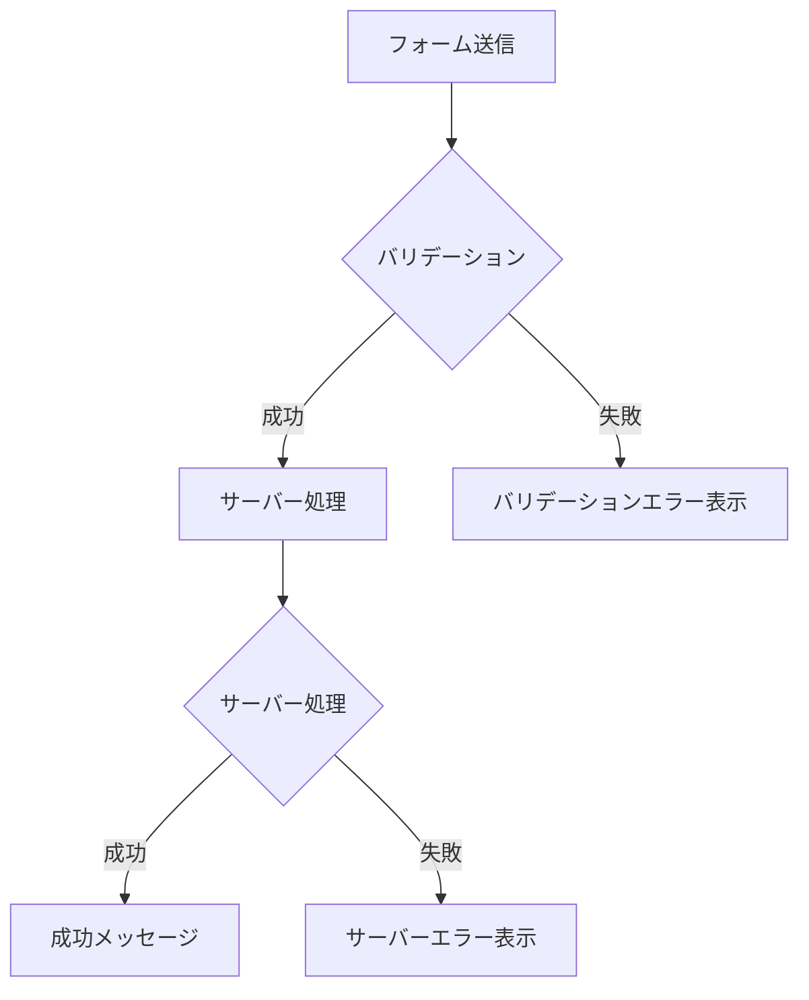

# エラーハンドリング

## 目次

- [エラーハンドリングの重要性](#エラーハンドリングの重要性)
- [バリデーションエラーの表示](#バリデーションエラーの表示)
  - [フィールドごとのエラー表示](#フィールドごとのエラー表示)
  - [フォーム全体での使用](#フォーム全体での使用)
- [サーバーエラーのハンドリング](#サーバーエラーのハンドリング)
  - [エラーの分類](#エラーの分類)
  - [エラーメッセージの表示](#エラーメッセージの表示)
- [トースト通知](#トースト通知)
  - [トーストコンポーネント](#トーストコンポーネント)
  - [トースト管理のコンテキスト](#トースト管理のコンテキスト)
  - [フォームでの使用](#フォームでの使用)
- [ユーザーフレンドリーなエラー UX](#ユーザーフレンドリーなエラー-ux)
  - [エラーメッセージのガイドライン](#エラーメッセージのガイドライン)
  - [アクセシビリティ対応](#アクセシビリティ対応)
  - [エラー時のフォーカス管理](#エラー時のフォーカス管理)
- [エラー状態のリセット](#エラー状態のリセット)
  - [フォームリセット](#フォームリセット)
  - [手動リセット](#手動リセット)
- [エラーハンドリングのパターン](#エラーハンドリングのパターン)
  - [包括的なエラーハンドリング](#包括的なエラーハンドリング)
  - [使用例](#使用例)
- [まとめ](#まとめ)
  - [エラーハンドリングのポイント](#エラーハンドリングのポイント)
  - [ベストプラクティス](#ベストプラクティス)
- [次のステップ](#次のステップ)

## エラーハンドリングの重要性

フォーム処理では様々なエラーが発生します。
エラーハンドリングを実装することで、ユーザーに分かりやすいフィードバックを提供できます。



---

## バリデーションエラーの表示

### フィールドごとのエラー表示

```typescript
// types/action.ts
export type ActionState = {
  success: boolean;
  message?: string;
  errors?: Record<string, string[]>;
};
```

```typescript
// components/FormField.tsx
type FormFieldProps = {
  name: string;
  label: string;
  type?: string;
  errors?: string[];
  required?: boolean;
};

export function FormField({
  name,
  label,
  type = "text",
  errors,
  required = false,
}: FormFieldProps): JSX.Element {
  const hasError = errors && errors.length > 0;

  return (
    <div className="mb-4">
      <label
        htmlFor={name}
        className="block text-sm font-medium text-gray-700"
      >
        {label}
        {required && <span className="text-red-500 ml-1">*</span>}
      </label>
      <input
        id={name}
        name={name}
        type={type}
        className={`
          mt-1 block w-full rounded-md border px-3 py-2
          ${hasError
            ? "border-red-500 focus:border-red-500 focus:ring-red-500"
            : "border-gray-300 focus:border-blue-500 focus:ring-blue-500"
          }
        `}
        aria-invalid={hasError}
        aria-describedby={hasError ? `${name}-error` : undefined}
      />
      {hasError && (
        <div id={`${name}-error`} className="mt-1" role="alert">
          {errors.map((error, index) => (
            <p key={index} className="text-sm text-red-500">
              {error}
            </p>
          ))}
        </div>
      )}
    </div>
  );
}
```

### フォーム全体での使用

```typescript
// components/RegisterForm.tsx
"use client";

import { useActionState } from "react";
import { registerUser } from "@/app/actions";
import { FormField } from "./FormField";
import { SubmitButton } from "./SubmitButton";

export function RegisterForm(): JSX.Element {
  const [state, formAction] = useActionState(registerUser, {
    success: false,
  });

  return (
    <form action={formAction}>
      <FormField
        name="email"
        label="メールアドレス"
        type="email"
        errors={state.errors?.email}
        required
      />
      <FormField
        name="password"
        label="パスワード"
        type="password"
        errors={state.errors?.password}
        required
      />
      <FormField
        name="confirmPassword"
        label="パスワード確認"
        type="password"
        errors={state.errors?.confirmPassword}
        required
      />
      <FormField
        name="name"
        label="名前"
        errors={state.errors?.name}
        required
      />

      <SubmitButton>登録する</SubmitButton>
    </form>
  );
}
```

---

## サーバーエラーのハンドリング

### エラーの分類

```typescript
// app/actions/register.ts
"use server";

import { registerSchema } from "@ec/validators/user";
import type { ActionState } from "@/types/action";

export async function registerUser(
  prevState: ActionState,
  formData: FormData
): Promise<ActionState> {
  // 1. バリデーションエラー
  const rawData = {
    email: formData.get("email"),
    password: formData.get("password"),
    confirmPassword: formData.get("confirmPassword"),
    name: formData.get("name"),
    agreedToTerms: formData.get("agreedToTerms") === "on",
  };

  const result = registerSchema.safeParse(rawData);

  if (!result.success) {
    const errors: Record<string, string[]> = {};
    for (const issue of result.error.issues) {
      const field = issue.path[0] as string;
      errors[field] = errors[field] ?? [];
      errors[field].push(issue.message);
    }
    return {
      success: false,
      message: "入力内容を確認してください",
      errors,
    };
  }

  try {
    // 2. ビジネスロジックエラー（重複メールなど）
    const existingUser = await checkEmailExists(result.data.email);
    if (existingUser) {
      return {
        success: false,
        errors: {
          email: ["このメールアドレスは既に登録されています"],
        },
      };
    }

    // ユーザー登録
    await createUser(result.data);

    return {
      success: true,
      message: "登録が完了しました",
    };
  } catch (error) {
    // 3. システムエラー
    console.error("Registration error:", error);

    return {
      success: false,
      message: "システムエラーが発生しました。時間をおいて再度お試しください。",
    };
  }
}
```

### エラーメッセージの表示

```typescript
// components/RegisterForm.tsx
"use client";

import { useActionState } from "react";
import { registerUser } from "@/app/actions";

export function RegisterForm(): JSX.Element {
  const [state, formAction] = useActionState(registerUser, {
    success: false,
  });

  return (
    <form action={formAction}>
      {/* 全体的なエラーメッセージ */}
      {!state.success && state.message && !state.errors && (
        <div
          className="mb-4 p-4 bg-red-50 border border-red-200 rounded-md"
          role="alert"
        >
          <p className="text-red-700">{state.message}</p>
        </div>
      )}

      {/* 成功メッセージ */}
      {state.success && state.message && (
        <div
          className="mb-4 p-4 bg-green-50 border border-green-200 rounded-md"
          role="status"
        >
          <p className="text-green-700">{state.message}</p>
        </div>
      )}

      {/* フォームフィールド */}
      {/* ... */}
    </form>
  );
}
```

---

## トースト通知

### トーストコンポーネント

```typescript
// components/Toast.tsx
"use client";

import { useEffect, useState } from "react";
import { X } from "lucide-react";

type ToastType = "success" | "error" | "info" | "warning";

type ToastProps = {
  type: ToastType;
  message: string;
  duration?: number;
  onClose: () => void;
};

const typeStyles: Record<ToastType, string> = {
  success: "bg-green-500",
  error: "bg-red-500",
  info: "bg-blue-500",
  warning: "bg-yellow-500",
};

export function Toast({
  type,
  message,
  duration = 5000,
  onClose,
}: ToastProps): JSX.Element {
  const [isVisible, setIsVisible] = useState(true);

  useEffect(() => {
    const timer = setTimeout(() => {
      setIsVisible(false);
      setTimeout(onClose, 300); // アニメーション後に削除
    }, duration);

    return (): void => clearTimeout(timer);
  }, [duration, onClose]);

  return (
    <div
      className={`
        fixed bottom-4 right-4 px-4 py-3 rounded-md text-white shadow-lg
        flex items-center gap-3 transition-opacity duration-300
        ${typeStyles[type]}
        ${isVisible ? "opacity-100" : "opacity-0"}
      `}
      role="alert"
    >
      <span>{message}</span>
      <button
        onClick={onClose}
        className="p-1 hover:bg-white/20 rounded"
        aria-label="閉じる"
      >
        <X size={16} />
      </button>
    </div>
  );
}
```

### トースト管理のコンテキスト

```typescript
// contexts/ToastContext.tsx
"use client";

import { createContext, useContext, useState, useCallback } from "react";
import { Toast } from "@/components/Toast";

type ToastType = "success" | "error" | "info" | "warning";

type ToastItem = {
  id: string;
  type: ToastType;
  message: string;
};

type ToastContextType = {
  showToast: (type: ToastType, message: string) => void;
};

const ToastContext = createContext<ToastContextType | null>(null);

export function ToastProvider({
  children,
}: {
  children: React.ReactNode;
}): JSX.Element {
  const [toasts, setToasts] = useState<ToastItem[]>([]);

  const showToast = useCallback((type: ToastType, message: string): void => {
    const id = crypto.randomUUID();
    setToasts((prev) => [...prev, { id, type, message }]);
  }, []);

  const removeToast = useCallback((id: string): void => {
    setToasts((prev) => prev.filter((toast) => toast.id !== id));
  }, []);

  return (
    <ToastContext.Provider value={{ showToast }}>
      {children}
      <div className="fixed bottom-4 right-4 space-y-2">
        {toasts.map((toast) => (
          <Toast
            key={toast.id}
            type={toast.type}
            message={toast.message}
            onClose={() => removeToast(toast.id)}
          />
        ))}
      </div>
    </ToastContext.Provider>
  );
}

export function useToast(): ToastContextType {
  const context = useContext(ToastContext);
  if (!context) {
    throw new Error("useToast must be used within a ToastProvider");
  }
  return context;
}
```

### フォームでの使用

```typescript
// components/ContactForm.tsx
"use client";

import { useActionState, useEffect } from "react";
import { submitContact } from "@/app/actions/contact";
import { useToast } from "@/contexts/ToastContext";

export function ContactForm(): JSX.Element {
  const [state, formAction] = useActionState(submitContact, {
    success: false,
  });
  const { showToast } = useToast();

  useEffect(() => {
    if (state.success) {
      showToast("success", state.message ?? "送信が完了しました");
    } else if (state.message && !state.errors) {
      showToast("error", state.message);
    }
  }, [state, showToast]);

  return (
    <form action={formAction}>
      {/* フォームフィールド */}
    </form>
  );
}
```

---

## ユーザーフレンドリーなエラー UX

### エラーメッセージのガイドライン

| 良い例                                   | 悪い例             |
| ---------------------------------------- | ------------------ |
| メールアドレスの形式が正しくありません   | Invalid email      |
| パスワードは8文字以上で入力してください  | Password too short |
| 数量は1以上99以下で入力してください      | Invalid quantity   |
| このメールアドレスは既に登録されています | Duplicate email    |

### アクセシビリティ対応

```typescript
// components/FormField.tsx
export function FormField({
  name,
  label,
  type = "text",
  errors,
  required = false,
}: FormFieldProps): JSX.Element {
  const hasError = errors && errors.length > 0;
  const errorId = `${name}-error`;

  return (
    <div className="mb-4">
      <label htmlFor={name} className="block text-sm font-medium">
        {label}
        {required && (
          <span className="text-red-500 ml-1" aria-hidden="true">
            *
          </span>
        )}
      </label>
      <input
        id={name}
        name={name}
        type={type}
        required={required}
        aria-required={required}
        aria-invalid={hasError}
        aria-describedby={hasError ? errorId : undefined}
        className="..."
      />
      {hasError && (
        <div id={errorId} role="alert" aria-live="polite">
          {errors.map((error, index) => (
            <p key={index} className="text-sm text-red-500">
              {error}
            </p>
          ))}
        </div>
      )}
    </div>
  );
}
```

### エラー時のフォーカス管理

```typescript
// components/RegisterForm.tsx
"use client";

import { useActionState, useEffect, useRef } from "react";
import { registerUser } from "@/app/actions";

export function RegisterForm(): JSX.Element {
  const [state, formAction] = useActionState(registerUser, {
    success: false,
  });
  const formRef = useRef<HTMLFormElement>(null);

  useEffect(() => {
    if (!state.success && state.errors) {
      // エラーがある場合、最初のエラーフィールドにフォーカス
      const firstErrorField = Object.keys(state.errors)[0];
      if (firstErrorField) {
        const input = formRef.current?.querySelector(
          `[name="${firstErrorField}"]`
        ) as HTMLInputElement | null;
        input?.focus();
      }
    }
  }, [state]);

  return (
    <form ref={formRef} action={formAction}>
      {/* フォームフィールド */}
    </form>
  );
}
```

---

## エラー状態のリセット

### フォームリセット

```typescript
// components/ContactForm.tsx
"use client";

import { useActionState, useRef } from "react";
import { submitContact } from "@/app/actions/contact";

export function ContactForm(): JSX.Element {
  const [state, formAction] = useActionState(submitContact, {
    success: false,
  });
  const formRef = useRef<HTMLFormElement>(null);

  // 成功時にフォームをリセット
  if (state.success && formRef.current) {
    formRef.current.reset();
  }

  return (
    <form ref={formRef} action={formAction}>
      {/* フォームフィールド */}
    </form>
  );
}
```

### 手動リセット

```typescript
// components/ContactForm.tsx
"use client";

import { useActionState } from "react";
import { submitContact, type ActionState } from "@/app/actions/contact";

const initialState: ActionState = {
  success: false,
};

export function ContactForm(): JSX.Element {
  const [state, formAction] = useActionState(submitContact, initialState);

  const handleReset = (): void => {
    // フォームをリセットするためのダミーアクション
    // 実際にはページをリロードするか、状態管理を使用
  };

  return (
    <form action={formAction}>
      {/* フォームフィールド */}

      <div className="flex gap-4">
        <button type="submit">送信</button>
        <button type="reset" onClick={handleReset}>
          リセット
        </button>
      </div>
    </form>
  );
}
```

---

## エラーハンドリングのパターン

### 包括的なエラーハンドリング

```typescript
// lib/action-utils.ts
import { z } from "zod";
import type { ActionState } from "@/types/action";

export function formatZodErrors(error: z.ZodError): Record<string, string[]> {
  const errors: Record<string, string[]> = {};
  for (const issue of error.issues) {
    const field = issue.path[0] as string;
    errors[field] = errors[field] ?? [];
    errors[field].push(issue.message);
  }
  return errors;
}

export function createSuccessResponse<T>(message: string, data?: T): ActionState<T> {
  return {
    success: true,
    message,
    data,
  };
}

export function createErrorResponse(
  message: string,
  errors?: Record<string, string[]>
): ActionState {
  return {
    success: false,
    message,
    errors,
  };
}

export function createValidationErrorResponse(error: z.ZodError): ActionState {
  return {
    success: false,
    message: "入力内容を確認してください",
    errors: formatZodErrors(error),
  };
}
```

### 使用例

```typescript
// app/actions/register.ts
"use server";

import { registerSchema } from "@ec/validators/user";
import {
  createSuccessResponse,
  createErrorResponse,
  createValidationErrorResponse,
} from "@/lib/action-utils";
import type { ActionState } from "@/types/action";

export async function registerUser(
  prevState: ActionState,
  formData: FormData
): Promise<ActionState> {
  const rawData = {
    email: formData.get("email"),
    password: formData.get("password"),
    confirmPassword: formData.get("confirmPassword"),
    name: formData.get("name"),
    agreedToTerms: formData.get("agreedToTerms") === "on",
  };

  const result = registerSchema.safeParse(rawData);

  if (!result.success) {
    return createValidationErrorResponse(result.error);
  }

  try {
    // ユーザー登録処理
    await createUser(result.data);

    return createSuccessResponse("登録が完了しました");
  } catch (error) {
    if (error instanceof DuplicateEmailError) {
      return createErrorResponse("登録に失敗しました", {
        email: ["このメールアドレスは既に登録されています"],
      });
    }

    console.error("Registration error:", error);
    return createErrorResponse("システムエラーが発生しました。時間をおいて再度お試しください。");
  }
}
```

---

## まとめ

### エラーハンドリングのポイント

1. **フィールドごとにエラーを表示** - ユーザーが問題を特定しやすくする
2. **分かりやすいメッセージ** - 日本語で具体的なエラー内容を伝える
3. **アクセシビリティ** - `aria-invalid`, `aria-describedby`, `role="alert"` を使用
4. **エラー時のフォーカス** - 最初のエラーフィールドにフォーカスを移動
5. **トースト通知** - 成功・エラーを画面上に表示

### ベストプラクティス

- バリデーションエラーはフィールドごとに表示
- システムエラーは全体メッセージとして表示
- 成功時はフィードバックを提供（トースト、メッセージ、リダイレクト）
- エラーメッセージは具体的で actionable に

---

## 次のステップ

エラーハンドリングを理解したら、[演習 1: ユーザー登録フォーム](./exercises/01-register-form.md) に進んで、実際にフォームを実装してみましょう。
