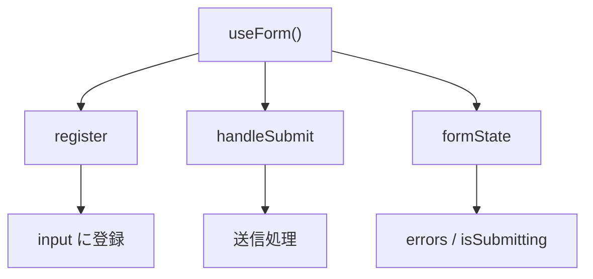

# react-hook-form 基礎

## 目次

- [概要](#概要)
  - [react-hook-form とは](#react-hook-form-とは)
  - [なぜ react-hook-form を使うのか](#なぜ-react-hook-form-を使うのか)
- [インストール](#インストール)
- [基本的な使い方](#基本的な使い方)
  - [useForm フック](#useform-フック)
  - [register でフィールドを登録](#register-でフィールドを登録)
  - [handleSubmit でフォーム送信](#handlesubmit-でフォーム送信)
- [Zod との連携](#zod-との連携)
  - [@hookform/resolvers のインストール](#hookformresolvers-のインストール)
  - [zodResolver の使用](#zodresolver-の使用)
- [バリデーションエラーの表示](#バリデーションエラーの表示)
  - [フィールドごとのエラー](#フィールドごとのエラー)
  - [エラーメッセージコンポーネント](#エラーメッセージコンポーネント)
- [Server Actions との組み合わせ](#server-actions-との組み合わせ)
  - [クライアントバリデーション + サーバー処理](#クライアントバリデーション--サーバー処理)
  - [サーバーエラーの表示](#サーバーエラーの表示)
- [フォーム状態の管理](#フォーム状態の管理)
  - [formState で状態を取得](#formstate-で状態を取得)
  - [送信中の状態表示](#送信中の状態表示)
- [EC サイトでの活用例](#ec-サイトでの活用例)
  - [ユーザー登録フォーム](#ユーザー登録フォーム)
  - [配送先住所フォーム](#配送先住所フォーム)
- [useActionState との比較](#useactionstate-との比較)
- [まとめ](#まとめ)
- [次のステップ](#次のステップ)

## 概要

### react-hook-form とは

react-hook-form は、React でフォームを効率的に管理するためのライブラリです。
非制御コンポーネント（uncontrolled components）を活用し、パフォーマンスを最適化しながらフォーム状態を管理します。



### なぜ react-hook-form を使うのか

| 課題              | react-hook-form の解決策 |
| --------------- | -------------------- |
| useState の多用    | register で自動管理       |
| 再レンダリングの多さ      | 非制御コンポーネントで最小化       |
| バリデーションの実装      | Zod 連携で宣言的に          |
| エラー表示のボイラープレート  | formState.errors で統一 |
| TypeScript との相性 | 型推論が効く               |

***

## インストール

```bash
pnpm add react-hook-form
```

Zod と連携する場合は以下のパッケージも追加します。

```bash
pnpm add @hookform/resolvers
```

***

## 基本的な使い方

### useForm フック

```typescript
"use client";

import { useForm } from "react-hook-form";

type FormData = {
  email: string;
  password: string;
};

export function LoginForm(): React.ReactElement {
  const { register, handleSubmit, formState } = useForm<FormData>();

  const onSubmit = (data: FormData): void => {
    console.log(data);
  };

  return (
    <form onSubmit={handleSubmit(onSubmit)}>
      <input {...register("email")} placeholder="メールアドレス" />
      <input {...register("password")} type="password" placeholder="パスワード" />
      <button type="submit">ログイン</button>
    </form>
  );
}
```

### register でフィールドを登録

`register` は input 要素に必要な props を返します。

```typescript
const { register } = useForm<FormData>();

// 基本的な使い方
<input {...register("email")} />

// バリデーションルールを追加
<input
  {...register("email", {
    required: "メールアドレスは必須です",
    pattern: {
      value: /^[A-Z0-9._%+-]+@[A-Z0-9.-]+\.[A-Z]{2,}$/i,
      message: "有効なメールアドレスを入力してください",
    },
  })}
/>
```

### handleSubmit でフォーム送信

`handleSubmit` はバリデーションを実行し、成功時のみコールバックを呼び出します。

```typescript
const { handleSubmit } = useForm<FormData>();

// 同期処理
const onSubmit = (data: FormData): void => {
  console.log(data);
};

// 非同期処理
const onSubmitAsync = async (data: FormData): Promise<void> => {
  await fetch("/api/login", {
    method: "POST",
    body: JSON.stringify(data),
  });
};

<form onSubmit={handleSubmit(onSubmit)}>
  {/* ... */}
</form>
```

***

## Zod との連携

### @hookform/resolvers のインストール

```bash
pnpm add @hookform/resolvers
```

### zodResolver の使用

```typescript
"use client";

import { useForm } from "react-hook-form";
import { zodResolver } from "@hookform/resolvers/zod";
import { z } from "zod/v4";

// Zod スキーマを定義
const loginSchema = z.object({
  email: z.email("有効なメールアドレスを入力してください"),
  password: z.string().min(8, "パスワードは8文字以上です"),
});

// 型を推論
type LoginFormData = z.infer<typeof loginSchema>;

export function LoginForm(): React.ReactElement {
  const {
    register,
    handleSubmit,
    formState: { errors },
  } = useForm<LoginFormData>({
    resolver: zodResolver(loginSchema),
  });

  const onSubmit = (data: LoginFormData): void => {
    console.log(data);
  };

  return (
    <form onSubmit={handleSubmit(onSubmit)}>
      <div>
        <input {...register("email")} placeholder="メールアドレス" />
        {errors.email && <span>{errors.email.message}</span>}
      </div>
      <div>
        <input {...register("password")} type="password" placeholder="パスワード" />
        {errors.password && <span>{errors.password.message}</span>}
      </div>
      <button type="submit">ログイン</button>
    </form>
  );
}
```

***

## バリデーションエラーの表示

### フィールドごとのエラー

```typescript
const {
  register,
  formState: { errors },
} = useForm<FormData>({
  resolver: zodResolver(schema),
});

return (
  <div>
    <input
      {...register("email")}
      aria-invalid={errors.email ? "true" : "false"}
    />
    {errors.email && (
      <p role="alert" className="text-red-500 text-sm">
        {errors.email.message}
      </p>
    )}
  </div>
);
```

### エラーメッセージコンポーネント

```typescript
// components/form-error.tsx
type FormErrorProps = {
  message?: string;
};

export function FormError({ message }: FormErrorProps): React.ReactElement | null {
  if (!message) return null;

  return (
    <p role="alert" className="mt-1 text-sm text-red-600">
      {message}
    </p>
  );
}

// 使用例
<FormError message={errors.email?.message} />
```

***

## Server Actions との組み合わせ

### クライアントバリデーション + サーバー処理

```typescript
"use client";

import { useForm } from "react-hook-form";
import { zodResolver } from "@hookform/resolvers/zod";
import { z } from "zod/v4";
import { registerUser } from "@/app/actions/auth";

const registerSchema = z.object({
  name: z.string().min(1, "名前は必須です"),
  email: z.string().email("有効なメールアドレスを入力してください"),
  password: z.string().min(8, "パスワードは8文字以上です"),
});

type RegisterFormData = z.infer<typeof registerSchema>;

export function RegisterForm(): React.ReactElement {
  const {
    register,
    handleSubmit,
    formState: { errors, isSubmitting },
    setError,
  } = useForm<RegisterFormData>({
    resolver: zodResolver(registerSchema),
  });

  const onSubmit = async (data: RegisterFormData): Promise<void> => {
    // Server Action を呼び出し
    const result = await registerUser(data);

    if (result.error) {
      // サーバーエラーをフォームに反映
      setError("root.serverError", {
        message: result.error,
      });
    }
  };

  return (
    <form onSubmit={handleSubmit(onSubmit)}>
      {errors.root?.serverError && (
        <div className="text-red-500">{errors.root.serverError.message}</div>
      )}

      <input {...register("name")} placeholder="お名前" />
      {errors.name && <span>{errors.name.message}</span>}

      <input {...register("email")} placeholder="メールアドレス" />
      {errors.email && <span>{errors.email.message}</span>}

      <input {...register("password")} type="password" placeholder="パスワード" />
      {errors.password && <span>{errors.password.message}</span>}

      <button type="submit" disabled={isSubmitting}>
        {isSubmitting ? "登録中..." : "登録"}
      </button>
    </form>
  );
}
```

### サーバーエラーの表示

```typescript
// app/actions/auth.ts
"use server";

import { z } from "zod/v4";

const registerSchema = z.object({
  name: z.string().min(1),
  email: z.string().email(),
  password: z.string().min(8),
});

type RegisterResult = {
  success: boolean;
  error?: string;
};

export async function registerUser(
  data: z.infer<typeof registerSchema>
): Promise<RegisterResult> {
  // サーバーサイドでも再バリデーション
  const parsed = registerSchema.safeParse(data);
  if (!parsed.success) {
    return { success: false, error: "入力内容に問題があります" };
  }

  // メールアドレスの重複チェックなど
  const existingUser = await db.user.findUnique({
    where: { email: parsed.data.email },
  });

  if (existingUser) {
    return { success: false, error: "このメールアドレスは既に使用されています" };
  }

  // ユーザー作成
  await db.user.create({ data: parsed.data });

  return { success: true };
}
```

***

## フォーム状態の管理

### formState で状態を取得

```typescript
const {
  formState: {
    errors,         // バリデーションエラー
    isSubmitting,   // 送信中かどうか
    isSubmitSuccessful, // 送信成功したかどうか
    isDirty,        // フォームが変更されたかどうか
    isValid,        // フォームが有効かどうか
    touchedFields,  // タッチされたフィールド
  },
} = useForm<FormData>();
```

### 送信中の状態表示

```typescript
export function ContactForm(): React.ReactElement {
  const {
    register,
    handleSubmit,
    formState: { isSubmitting, isSubmitSuccessful },
    reset,
  } = useForm<ContactFormData>();

  const onSubmit = async (data: ContactFormData): Promise<void> => {
    await submitContact(data);
    reset(); // フォームをリセット
  };

  if (isSubmitSuccessful) {
    return <div>お問い合わせを受け付けました</div>;
  }

  return (
    <form onSubmit={handleSubmit(onSubmit)}>
      {/* フィールド */}
      <button type="submit" disabled={isSubmitting}>
        {isSubmitting ? (
          <>
            <Spinner /> 送信中...
          </>
        ) : (
          "送信"
        )}
      </button>
    </form>
  );
}
```

***

## EC サイトでの活用例

### ユーザー登録フォーム

```typescript
// schemas/user.ts
import { z } from "zod/v4";

export const userRegistrationSchema = z
  .object({
    name: z.string().min(1, "お名前を入力してください"),
    email: z.string().email("有効なメールアドレスを入力してください"),
    password: z
      .string()
      .min(8, "パスワードは8文字以上です")
      .regex(/[A-Z]/, "大文字を1文字以上含めてください")
      .regex(/[0-9]/, "数字を1文字以上含めてください"),
    confirmPassword: z.string(),
    agreeToTerms: z.literal(true, {
      errorMap: () => ({ message: "利用規約に同意してください" }),
    }),
  })
  .refine((data) => data.password === data.confirmPassword, {
    message: "パスワードが一致しません",
    path: ["confirmPassword"],
  });

export type UserRegistrationData = z.infer<typeof userRegistrationSchema>;
```

```typescript
// components/registration-form.tsx
"use client";

import { useForm } from "react-hook-form";
import { zodResolver } from "@hookform/resolvers/zod";
import {
  userRegistrationSchema,
  type UserRegistrationData,
} from "@/schemas/user";

export function RegistrationForm(): React.ReactElement {
  const {
    register,
    handleSubmit,
    formState: { errors, isSubmitting },
  } = useForm<UserRegistrationData>({
    resolver: zodResolver(userRegistrationSchema),
  });

  const onSubmit = async (data: UserRegistrationData): Promise<void> => {
    // 登録処理
  };

  return (
    <form onSubmit={handleSubmit(onSubmit)} className="space-y-4">
      <div>
        <label htmlFor="name">お名前</label>
        <input id="name" {...register("name")} />
        {errors.name && <p className="text-red-500">{errors.name.message}</p>}
      </div>

      <div>
        <label htmlFor="email">メールアドレス</label>
        <input id="email" type="email" {...register("email")} />
        {errors.email && <p className="text-red-500">{errors.email.message}</p>}
      </div>

      <div>
        <label htmlFor="password">パスワード</label>
        <input id="password" type="password" {...register("password")} />
        {errors.password && (
          <p className="text-red-500">{errors.password.message}</p>
        )}
      </div>

      <div>
        <label htmlFor="confirmPassword">パスワード（確認）</label>
        <input
          id="confirmPassword"
          type="password"
          {...register("confirmPassword")}
        />
        {errors.confirmPassword && (
          <p className="text-red-500">{errors.confirmPassword.message}</p>
        )}
      </div>

      <div>
        <label>
          <input type="checkbox" {...register("agreeToTerms")} />
          利用規約に同意する
        </label>
        {errors.agreeToTerms && (
          <p className="text-red-500">{errors.agreeToTerms.message}</p>
        )}
      </div>

      <button type="submit" disabled={isSubmitting}>
        {isSubmitting ? "登録中..." : "登録する"}
      </button>
    </form>
  );
}
```

### 配送先住所フォーム

```typescript
// schemas/address.ts
import { z } from "zod/v4";

export const addressSchema = z.object({
  postalCode: z
    .string()
    .regex(/^\d{3}-?\d{4}$/, "正しい郵便番号を入力してください"),
  prefecture: z.string().min(1, "都道府県を選択してください"),
  city: z.string().min(1, "市区町村を入力してください"),
  address1: z.string().min(1, "番地を入力してください"),
  address2: z.string().optional(),
  phone: z
    .string()
    .regex(/^0\d{9,10}$/, "正しい電話番号を入力してください"),
});

export type AddressData = z.infer<typeof addressSchema>;
```

***

## useActionState との比較

| 観点                      | react-hook-form | useActionState    |
| ----------------------- | --------------- | ----------------- |
| バリデーションタイミング            | クライアント（即時）      | サーバー（送信後）         |
| UX                      | 即時フィードバック       | 送信後にエラー表示         |
| バンドルサイズ                 | ライブラリ分増加        | 追加なし              |
| Progressive Enhancement | JavaScript 必須   | JavaScript なしでも動作 |
| 複雑なフォーム                 | 得意（動的フィールド等）    | シンプルなフォーム向き       |
| TypeScript              | 型推論が効く          | 型定義が必要            |

**使い分けの指針**

- react-hook-form は複雑なフォーム、即時バリデーション、多数のフィールドに向いている
- useActionState はシンプルなフォーム、Progressive Enhancement 重視の場合に向いている

***

## まとめ

- react-hook-form は非制御コンポーネントでパフォーマンスを最適化
- `register`, `handleSubmit`, `formState` の 3 つが基本
- `@hookform/resolvers` で Zod と連携し、型安全なバリデーションを実現
- Server Actions と組み合わせてクライアント + サーバーの二重バリデーション
- `setError` でサーバーエラーをフォームに反映

***

## 次のステップ

react-hook-form の基礎を理解したら、[演習 1: ユーザー登録フォーム](./exercises/01-register-form.md) で実際にフォームを実装してみましょう。
