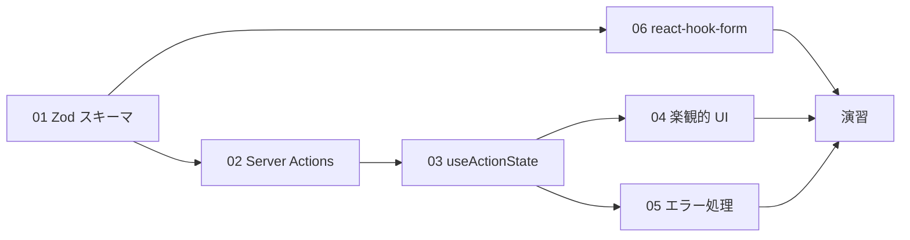
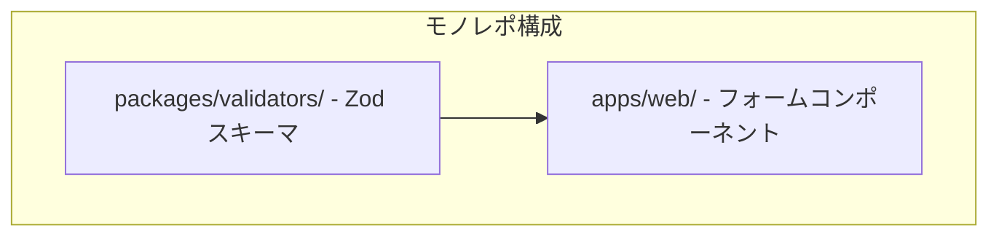
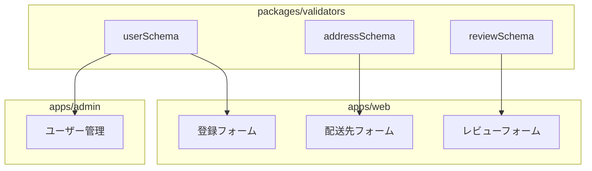

# Phase 7: フォーム + Server Actions

## 目次

- [概要](#概要)
- [難易度](#難易度)
- [所要時間目安](#所要時間目安)
- [前提知識](#前提知識)
- [学習目標](#学習目標)
- [目次](#目次-1)
  - [学習フロー](#学習フロー)
- [演習問題](#演習問題)
- [作業場所](#作業場所)
- [使用ツール](#使用ツール)
- [関連する EC サイト機能](#関連する-ec-サイト機能)
  - [バリデーションスキーマの共有](#バリデーションスキーマの共有)
- [推奨学習リソース](#推奨学習リソース)
  - [公式ドキュメント](#公式ドキュメント)
  - [参考記事](#参考記事)
- [自己チェックリスト](#自己チェックリスト)
- [次のフェーズ](#次のフェーズ)

## 概要

ZodによるバリデーションとServer Actionsを使ったフォーム処理を習得するフェーズです。
ECサイトに必要なユーザー登録、配送先の住所入力、商品レビューなどのフォーム機能を実装します。

***

## 難易度

難易度: 3/5（中）

フォームのバリデーションとサーバーサイドの処理を組み合わせるため、フロントエンドとバックエンドの両方の理解が必要です。

***

## 所要時間目安

約6〜8時間です。

***

## 前提知識

- Phase 6（テスト駆動開発）を完了していること
- TypeScriptの基本的な理解
- Reactコンポーネントの作成経験
- Next.js App Routerの基礎知識

***

## 学習目標

このフェーズを完了すると、以下ができるようになります。

- [ ] Zodを使ってバリデーションスキーマを定義できる
- [ ] Server Actionsでフォームデータを安全に処理できる
- [ ] useActionStateフックでフォームの状態を管理できる
- [ ] useOptimisticで楽観的UI更新を実装できる
- [ ] バリデーションエラーをユーザーフレンドリーに表示できる
- [ ] フロントエンドとバックエンドでバリデーションスキーマを共有できる
- [ ] react-hook-formでクライアントサイドのフォーム状態を管理できる
- [ ] react-hook-formとZodを連携できる

***

## 目次

1. [Zod スキーマ定義](./01-zod-schema.md)
2. [Server Actions 基礎](./02-server-actions.md)
3. [useActionState フック](./03-use-action-state.md)
4. [楽観的 UI 更新](./04-optimistic-ui.md)
5. [エラーハンドリング](./05-error-handling.md)
6. [react-hook-form 基礎](./06-react-hook-form.md)

### 学習フロー

***

## 演習問題

- [演習 1: ユーザー登録フォーム](./exercises/01-register-form.md)
- [演習 2: 配送先住所フォーム](./exercises/02-address-form.md)
- [演習 3: 商品レビュー投稿フォーム](./exercises/03-review-form.md)

***

## 作業場所

このフェーズでは主に以下のディレクトリで作業します。

- `packages/validators/` - Zodスキーマを一元管理
- `apps/web/` - フォームコンポーネントとServer Actions

***

## 使用ツール

| ツール             | バージョン | 用途                            |
| --------------- | ----- | ----------------------------- |
| Zod             | 4.x   | スキーマ定義・バリデーション                |
| React           | 19.x  | useActionState, useOptimistic |
| Next.js         | 16.x  | Server Actions                |
| TypeScript      | 5.9+  | 型安全なフォーム処理                    |
| react-hook-form | 7.x   | クライアントサイドフォーム状態管理             |

***

## 関連する EC サイト機能

このフェーズで実装するECサイト機能は以下の通りです。

| EC 機能    | 実装画面            | 使用技術                |
| -------- | --------------- | ------------------- |
| ユーザー登録   | /register       | Zod, Server Actions |
| ログイン     | /login          | Zod, Server Actions |
| 配送先の住所登録 | /checkout       | Zod, useActionState |
| 商品レビュー投稿 | /products/\[id] | Zod, useOptimistic  |
| お問い合わせ   | /contact        | Zod, Server Actions |

### バリデーションスキーマの共有

***

## 推奨学習リソース

### 公式ドキュメント

- [Zod 公式ドキュメント](https://zod.dev/)
- [Next.js Server Actions](https://nextjs.org/docs/app/building-your-application/data-fetching/server-actions-and-mutations)
- [React useActionState](https://react.dev/reference/react/useActionState)
- [React useOptimistic](https://react.dev/reference/react/useOptimistic)

### 参考記事

- [Zod を使ったフォームバリデーション](https://zenn.dev/topics/zod)
- [Server Actions 入門](https://zenn.dev/topics/serveractions)

***

## 自己チェックリスト

Phase 7を完了する前に、以下を確認してください。

- [ ] Zodスキーマを使ってフォーム入力を検証できる
- [ ] Server Actionsでフォームデータを受け取り処理できる
- [ ] useActionStateでフォームの状態（送信中、エラー、成功）を管理できる
- [ ] useOptimisticで即座にUIを更新できる
- [ ] バリデーションエラーを各フィールドに表示できる
- [ ] packages/validatorsでスキーマを共有できている
- [ ] react-hook-formのuseForm, register, handleSubmitを使える
- [ ] zodResolverでZodとreact-hook-formを連携できる

***

## 次のフェーズ

Phase 7を完了したら、[Phase 8: 認証機能](../phase-08-authentication/README.md) に進みましょう。
Phase 8では、このフェーズで作成したフォームを使ってユーザー認証システムを構築します。
