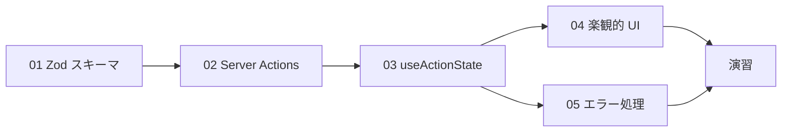
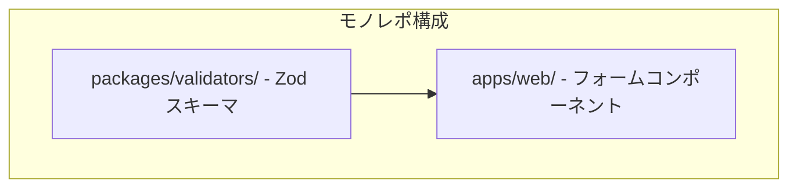
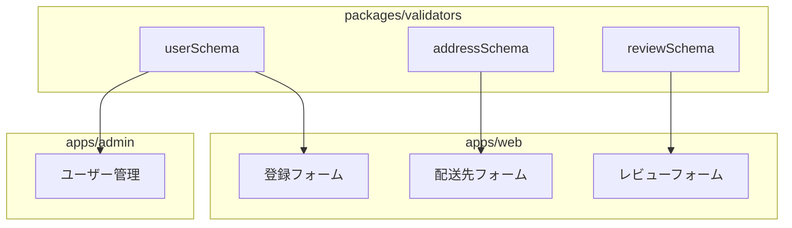

# Phase 7: フォーム + Server Actions

## 概要

Zod によるバリデーションと Server Actions を使ったフォーム処理を習得するフェーズです。
EC サイトに必要なユーザー登録、配送先の住所入力、商品レビューなどのフォーム機能を実装します。

---

## 難易度

難易度: 3/5（中）

フォームのバリデーションとサーバーサイドの処理を組み合わせるため、フロントエンドとバックエンドの両方の理解が必要です。

---

## 所要時間目安

約 6〜8 時間です。

---

## 前提知識

- Phase 6（テスト駆動開発）を完了していること
- TypeScript の基本的な理解
- React コンポーネントの作成経験
- Next.js App Router の基礎知識

---

## 学習目標

このフェーズを完了すると、以下ができるようになります。

- [ ] Zod を使ってバリデーションスキーマを定義できる
- [ ] Server Actions でフォームデータを安全に処理できる
- [ ] useActionState フックでフォームの状態を管理できる
- [ ] useOptimistic で楽観的 UI 更新を実装できる
- [ ] バリデーションエラーをユーザーフレンドリーに表示できる
- [ ] フロントエンドとバックエンドでバリデーションスキーマを共有できる

---

## 目次

1. [Zod スキーマ定義](./01-zod-schema.md)
2. [Server Actions 基礎](./02-server-actions.md)
3. [useActionState フック](./03-use-action-state.md)
4. [楽観的 UI 更新](./04-optimistic-ui.md)
5. [エラーハンドリング](./05-error-handling.md)

### 学習フロー

---

## 演習問題

- [演習 1: ユーザー登録フォーム](./exercises/01-register-form.md)
- [演習 2: 配送先住所フォーム](./exercises/02-address-form.md)
- [演習 3: 商品レビュー投稿フォーム](./exercises/03-review-form.md)

---

## 作業場所

このフェーズでは主に以下のディレクトリで作業します。

- `packages/validators/` - Zod スキーマを一元管理
- `apps/web/` - フォームコンポーネントと Server Actions

---

## 使用ツール

| ツール     | バージョン | 用途                          |
| ---------- | ---------- | ----------------------------- |
| Zod        | 4.x        | スキーマ定義・バリデーション  |
| React      | 19.x       | useActionState, useOptimistic |
| Next.js    | 16.x       | Server Actions                |
| TypeScript | 5.9+       | 型安全なフォーム処理          |

---

## 関連する EC サイト機能

このフェーズで実装する EC サイト機能は以下の通りです。

| EC 機能          | 実装画面         | 使用技術            |
| ---------------- | ---------------- | ------------------- |
| ユーザー登録     | /register        | Zod, Server Actions |
| ログイン         | /login           | Zod, Server Actions |
| 配送先の住所登録 | /checkout        | Zod, useActionState |
| 商品レビュー投稿 | /products/\[id\] | Zod, useOptimistic  |
| お問い合わせ     | /contact         | Zod, Server Actions |

### バリデーションスキーマの共有

---

## 推奨学習リソース

### 公式ドキュメント

- [Zod 公式ドキュメント](https://zod.dev/)
- [Next.js Server Actions](https://nextjs.org/docs/app/building-your-application/data-fetching/server-actions-and-mutations)
- [React useActionState](https://react.dev/reference/react/useActionState)
- [React useOptimistic](https://react.dev/reference/react/useOptimistic)

### 参考記事

- [Zod を使ったフォームバリデーション](https://zenn.dev/topics/zod)
- [Server Actions 入門](https://zenn.dev/topics/serveractions)

---

## 自己チェックリスト

Phase 7 を完了する前に、以下を確認してください。

- [ ] Zod スキーマを使ってフォーム入力を検証できる
- [ ] Server Actions でフォームデータを受け取り処理できる
- [ ] useActionState でフォームの状態（送信中、エラー、成功）を管理できる
- [ ] useOptimistic で即座に UI を更新できる
- [ ] バリデーションエラーを各フィールドに表示できる
- [ ] packages/validators でスキーマを共有できている

---

## 次のフェーズ

Phase 7 を完了したら、[Phase 8: 認証機能](../phase-08-authentication/README.md) に進みましょう。
Phase 8 では、このフェーズで作成したフォームを使ってユーザー認証システムを構築します。
