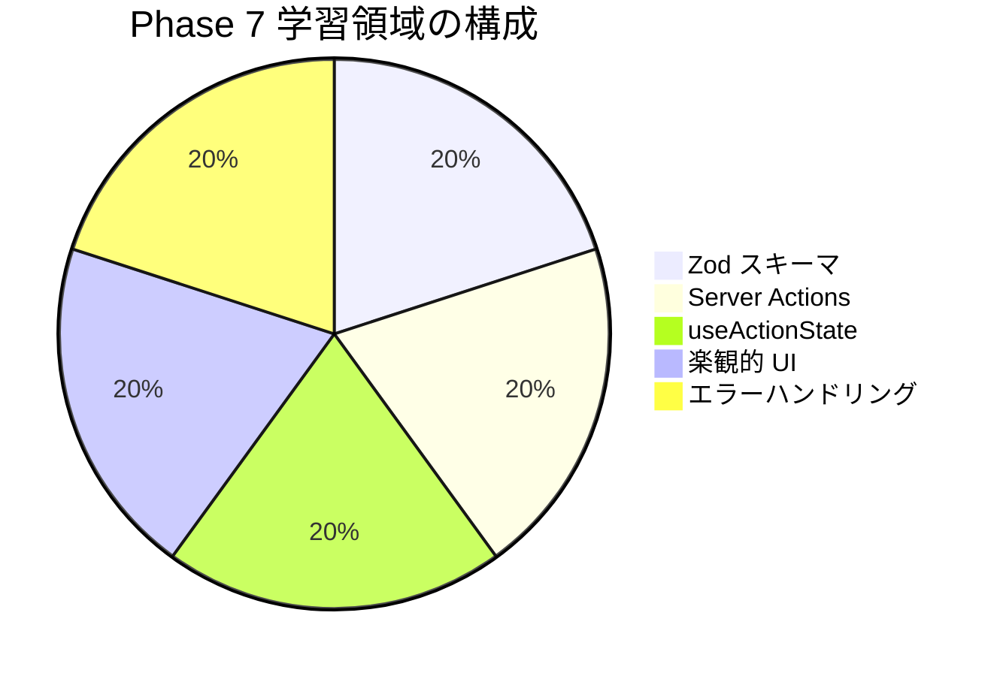

# Phase 7: 自己チェックリスト

Phase 7 の理解度を確認するためのチェックリストです。
各項目を確認し、自信を持って「はい」と答えられるか確認してください。

## 目次

- [学習領域の概要](#学習領域の概要)
- [Zod スキーマ](#zod-スキーマ)
  - [理解度チェック](#理解度チェック)
  - [確認質問](#確認質問)
- [Server Actions](#server-actions)
  - [理解度チェック](#理解度チェック-1)
  - [確認質問](#確認質問-1)
- [useActionState フック](#useactionstate-フック)
  - [理解度チェック](#理解度チェック-2)
  - [確認質問](#確認質問-2)
- [楽観的 UI 更新](#楽観的-ui-更新)
  - [理解度チェック](#理解度チェック-3)
  - [確認質問](#確認質問-3)
- [エラーハンドリング](#エラーハンドリング)
  - [理解度チェック](#理解度チェック-4)
  - [確認質問](#確認質問-4)
- [実践確認](#実践確認)
  - [操作チェック](#操作チェック)
- [総合評価](#総合評価)
  - [達成度の目安](#達成度の目安)
- [よくある間違い](#よくある間違い)
  - [Zod スキーマ](#zod-スキーマ-1)
  - [Server Actions](#server-actions-1)
  - [useActionState](#useactionstate)
  - [楽観的 UI](#楽観的-ui)
- [次のステップ](#次のステップ)

## 学習領域の概要

---

## Zod スキーマ

### 理解度チェック

- [ ] Zod の基本的なスキーマ（`z.string()`, `z.number()` など）を定義できる
- [ ] バリデーションルール（`min`, `max`, `email`, `regex`）を設定できる
- [ ] オブジェクトスキーマ（`z.object()`）を定義できる
- [ ] `z.infer` で型を推論できる
- [ ] カスタムエラーメッセージを設定できる
- [ ] `refine` / `superRefine` でカスタムバリデーションを実装できる

### 確認質問

1. `parse` と `safeParse` の違いは何ですか？

   **回答例**: `parse` は失敗時に例外をスロー、`safeParse` は成功/失敗を含むオブジェクトを返す

2. なぜ `packages/validators` でスキーマを一元管理するのですか？

   **回答例**: フロントエンドとバックエンドで同じスキーマを共有し、型とバリデーションの一貫性を保つため

3. `refine` と `superRefine` の使い分けは？

   **回答例**: `refine` は単一のカスタムエラー、`superRefine` は複数のカスタムエラーを追加する場合

---

## Server Actions

### 理解度チェック

- [ ] `'use server'` ディレクティブの使い方を理解している
- [ ] Server Actions をファイル単位・関数単位で定義できる
- [ ] `FormData` からデータを取得できる
- [ ] Server Actions でバリデーションを行い、エラーを返せる
- [ ] `revalidatePath` でキャッシュを再検証できる
- [ ] Server Actions と API Routes の使い分けを理解している

### 確認質問

1. Server Actions はどこで実行されますか？

   **回答例**: サーバーサイドで実行される

2. Server Actions の CSRF 対策はどうなっていますか？

   **回答例**: Next.js が自動的に CSRF トークンを処理するため、特別な設定は不要

3. Server Actions で `redirect` を使う場合の注意点は？

   **回答例**: try-catch 外で呼び出す。`redirect` は例外をスローするため、catch ブロックでキャッチされてしまう

---

## useActionState フック

### 理解度チェック

- [ ] `useActionState` の基本的な使い方を理解している
- [ ] `state`, `formAction`, `isPending` の役割を説明できる
- [ ] フォームの状態（成功、エラー、送信中）を管理できる
- [ ] `useFormStatus` との違いを理解している
- [ ] `useFormStatus` は子コンポーネントで使用する必要があることを理解している

### 確認質問

1. `useActionState` の第2引数は何を指定しますか？

   **回答例**: 初期状態（initialState）を指定する

2. `useFormStatus` はどこで使用できますか？

   **回答例**: `<form>` の子コンポーネント内でのみ使用できる

3. Server Action の引数はどうなりますか？

   **回答例**: 第1引数に前回の状態（prevState）、第2引数に FormData が渡される

---

## 楽観的 UI 更新

### 理解度チェック

- [ ] 楽観的更新の概念を説明できる
- [ ] `useOptimistic` フックの使い方を理解している
- [ ] `useTransition` との組み合わせ方を理解している
- [ ] エラー時の自動ロールバックを理解している
- [ ] 楽観的更新を使うべきケースと避けるべきケースを判断できる

### 確認質問

1. 楽観的更新のメリットは何ですか？

   **回答例**: ユーザー体験の向上。操作が即座に反映されるため、レスポンシブに感じられる

2. 楽観的更新を避けるべきケースは？

   **回答例**: 決済処理、重要なデータの更新、不可逆な操作

3. エラー時はどうなりますか？

   **回答例**: `useOptimistic` が自動的にロールバックし、元の状態に戻る

---

## エラーハンドリング

### 理解度チェック

- [ ] フィールドごとにエラーメッセージを表示できる
- [ ] アクセシビリティに配慮したエラー表示を実装できる
- [ ] トースト通知を実装できる
- [ ] サーバーエラーとバリデーションエラーを区別して表示できる
- [ ] エラー時に最初のエラーフィールドにフォーカスを移動できる

### 確認質問

1. `aria-invalid` と `aria-describedby` の役割は？

   **回答例**: `aria-invalid` はフィールドがエラー状態であることを示し、`aria-describedby` はエラーメッセージの ID を関連付ける

2. ユーザーフレンドリーなエラーメッセージの特徴は？

   **回答例**: 日本語で具体的、何を修正すべきかが明確、技術的な用語を避ける

3. バリデーションエラーとサーバーエラーの表示を分ける理由は？

   **回答例**: バリデーションエラーは各フィールドに、サーバーエラーは全体メッセージとして表示することで、ユーザーが問題を特定しやすくなる

---

## 実践確認

### 操作チェック

- [ ] `packages/validators` に Zod スキーマを作成できる
- [ ] Server Actions でフォームデータを処理できる
- [ ] `useActionState` でフォームの状態を管理できる
- [ ] 楽観的 UI 更新を実装できる
- [ ] エラーメッセージを適切に表示できる
- [ ] 演習 1〜3 をすべて完了した

---

## 総合評価

### 達成度の目安

| 達成率    | 評価                                   |
| --------- | -------------------------------------- |
| 90% 以上  | 完璧！Phase 8 に進みましょう           |
| 70% - 89% | 良好。不安な部分を復習してから進む     |
| 50% - 69% | 該当するドキュメントを再読してください |
| 50% 未満  | 最初からもう一度取り組みましょう       |

---

## よくある間違い

### Zod スキーマ

| 間違い                                 | 正しい方法                               |
| -------------------------------------- | ---------------------------------------- |
| `parse` を使ってエラーをキャッチしない | `safeParse` を使用してエラーを安全に処理 |
| エラーメッセージを設定しない           | 日本語のカスタムエラーメッセージを設定   |
| スキーマを各ファイルで定義             | `packages/validators` で一元管理         |

### Server Actions

| 間違い                           | 正しい方法                           |
| -------------------------------- | ------------------------------------ |
| クライアントでのみバリデーション | サーバーサイドでも必ずバリデーション |
| エラー時に例外をスロー           | `ActionState` 型でエラーを返す       |
| `redirect` を try-catch 内で使用 | try-catch 外で使用                   |

### useActionState

| 間違い                                      | 正しい方法                     |
| ------------------------------------------- | ------------------------------ |
| 同じコンポーネントで `useFormStatus` を使用 | 子コンポーネントに分離して使用 |
| 初期状態を指定しない                        | 必ず第2引数で初期状態を指定    |

### 楽観的 UI

| 間違い                     | 正しい方法                                       |
| -------------------------- | ------------------------------------------------ |
| すべての操作に楽観的更新   | 適切なケースでのみ使用（いいね、カート追加など） |
| エラー処理を忘れる         | エラー時のフィードバックを表示                   |
| `useTransition` なしで使用 | `useTransition` と組み合わせて使用               |

---

## 次のステップ

チェックリストを確認して理解度に自信が持てたら、[Phase 8: 認証機能](../phase-08-authentication/README.md) に進みましょう。

Phase 8 では、このフェーズで作成したフォームを使ってユーザー認証システムを構築します。
