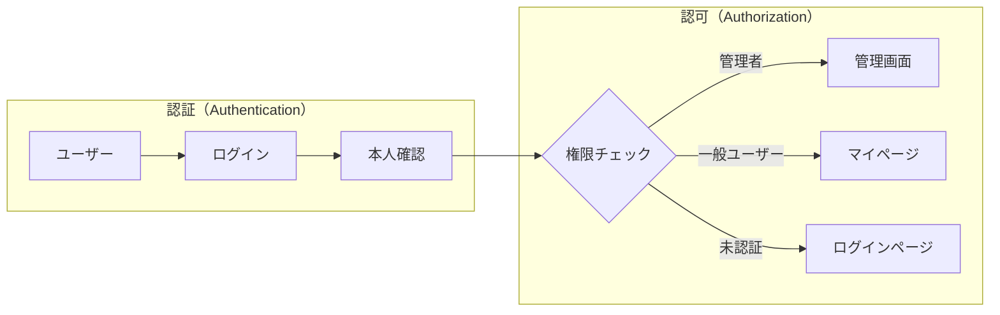
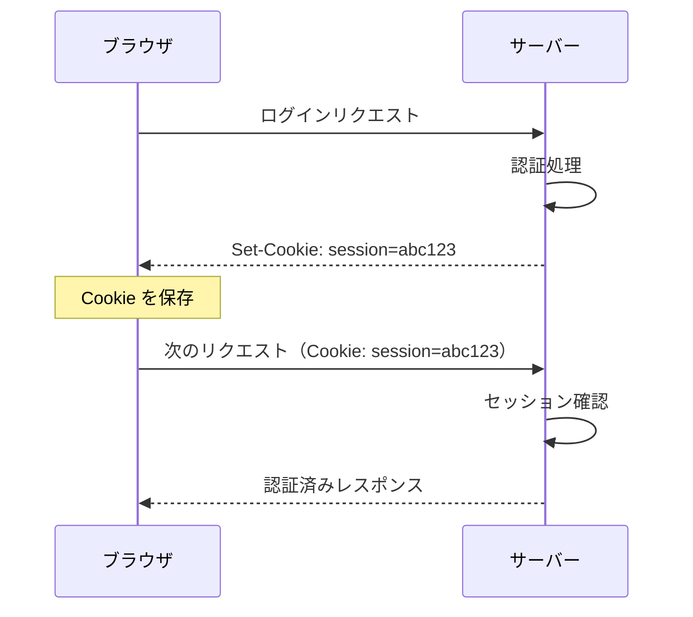
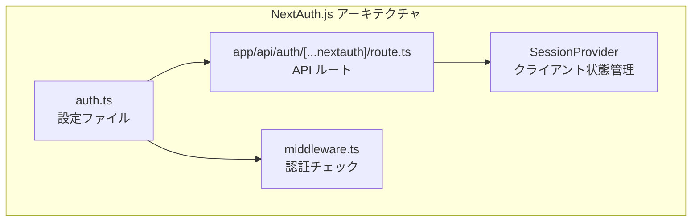
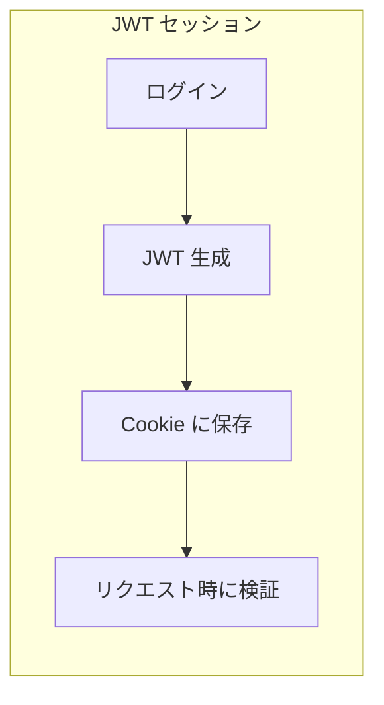
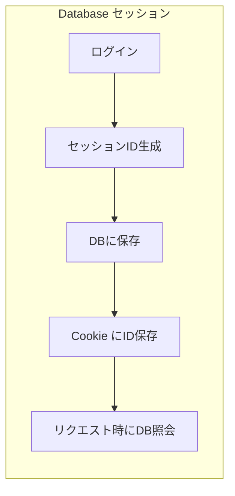

# Cookie ベース認証と NextAuth.js

## 目次

- [認証（Authentication）と認可（Authorization）](#認証authenticationと認可authorization)
  - [認証（Authentication）](#認証authentication)
  - [認可（Authorization）](#認可authorization)
- [Cookie ベース認証の仕組み](#cookie-ベース認証の仕組み)
  - [Cookie とは](#cookie-とは)
  - [Cookie の重要な属性](#cookie-の重要な属性)
- [NextAuth.js（Auth.js v5）とは](#nextauthjsauthjs-v5とは)
  - [特徴](#特徴)
  - [主要コンポーネント](#主要コンポーネント)
- [NextAuth.js のセットアップ](#nextauthjs-のセットアップ)
  - [1. パッケージのインストール](#1-パッケージのインストール)
  - [2. 設定ファイルの作成（auth.ts）](#2-設定ファイルの作成authts)
  - [3. API ルートの作成](#3-api-ルートの作成)
  - [4. 環境変数の設定](#4-環境変数の設定)
- [セッション戦略](#セッション戦略)
  - [JWT セッション（デフォルト）](#jwt-セッションデフォルト)
  - [Database セッション](#database-セッション)
  - [比較表](#比較表)
- [Credentials Provider の詳細設定](#credentials-provider-の詳細設定)
  - [パスワードハッシュ化](#パスワードハッシュ化)
  - [ユーザー登録フロー](#ユーザー登録フロー)
- [OAuth Provider の設定](#oauth-provider-の設定)
  - [GitHub Provider](#github-provider)
  - [Google Provider](#google-provider)
- [セキュリティのベストプラクティス](#セキュリティのベストプラクティス)
  - [1. 環境変数の管理](#1-環境変数の管理)
  - [2. パスワードポリシー](#2-パスワードポリシー)
  - [3. レート制限](#3-レート制限)
- [まとめ](#まとめ)
  - [学んだこと](#学んだこと)
- [次のステップ](#次のステップ)

## 認証（Authentication）と認可（Authorization）

Web アプリケーションのセキュリティを考える際、認証と認可は異なる概念です。

### 認証（Authentication）

**「あなたは誰ですか？」** を確認するプロセスです。

- ユーザー名とパスワードの検証
- OAuth による第三者認証（Google, GitHub など）
- 多要素認証（MFA）

### 認可（Authorization）

**「あなたは何ができますか？」** を確認するプロセスです。

- 管理者のみが管理画面にアクセスできる
- 自分の注文履歴のみ閲覧できる
- 特定のロールを持つユーザーのみが編集できる



***

## Cookie ベース認証の仕組み

### Cookie とは

Cookie は、Web サーバーがブラウザに保存を依頼する小さなデータです。



### Cookie の重要な属性

| 属性         | 説明                          | 推奨設定       |
| ---------- | --------------------------- | ---------- |
| `HttpOnly` | JavaScript からアクセス不可（XSS 対策） | `true`     |
| `Secure`   | HTTPS 通信でのみ送信               | `true`（本番） |
| `SameSite` | クロスサイトリクエストでの送信制御（CSRF 対策）  | `lax`      |
| `Path`     | Cookie が有効なパス               | `/`        |
| `Max-Age`  | 有効期限（秒）                     | 用途による      |

```typescript
// Cookie 設定の例
cookies().set("session", token, {
  httpOnly: true,
  secure: process.env.NODE_ENV === "production",
  sameSite: "lax",
  path: "/",
  maxAge: 60 * 60 * 24 * 7, // 7日間
});
```

***

## NextAuth.js（Auth.js v5）とは

NextAuth.js は、Next.js 向けの認証ライブラリです。v5 からは **Auth.js** としてフレームワーク非依存になりました。

### 特徴

- 複数の認証プロバイダー対応（OAuth, Credentials など）
- JWT / Database セッション選択可能
- App Router 完全対応
- TypeScript サポート
- セキュリティベストプラクティス組み込み

### 主要コンポーネント



***

## NextAuth.js のセットアップ

### 1. パッケージのインストール

```bash
pnpm add next-auth@beta
```

### 2. 設定ファイルの作成（auth.ts）

```typescript
// auth.ts（プロジェクトルート）
import NextAuth from "next-auth";
import Credentials from "next-auth/providers/credentials";
import GitHub from "next-auth/providers/github";
import { z } from "zod";

// 認証情報のバリデーションスキーマ
const credentialsSchema = z.object({
  email: z.string().email(),
  password: z.string().min(8),
});

export const { handlers, signIn, signOut, auth } = NextAuth({
  providers: [
    // Credentials Provider（メール/パスワード認証）
    Credentials({
      credentials: {
        email: { label: "Email", type: "email" },
        password: { label: "Password", type: "password" },
      },
      authorize: async (credentials) => {
        // バリデーション
        const parsed = credentialsSchema.safeParse(credentials);
        if (!parsed.success) {
          return null;
        }

        const { email, password } = parsed.data;

        // ユーザー検索（実際は DB から取得）
        const user = await findUserByEmail(email);
        if (!user) {
          return null;
        }

        // パスワード検証
        const isValidPassword = await verifyPassword(password, user.passwordHash);
        if (!isValidPassword) {
          return null;
        }

        // 認証成功
        return {
          id: user.id,
          email: user.email,
          name: user.name,
        };
      },
    }),

    // OAuth Provider（GitHub）
    GitHub({
      clientId: process.env.GITHUB_CLIENT_ID,
      clientSecret: process.env.GITHUB_CLIENT_SECRET,
    }),
  ],

  // セッション設定
  session: {
    strategy: "jwt", // JWT セッション
    maxAge: 30 * 24 * 60 * 60, // 30日
  },

  // ページ設定
  pages: {
    signIn: "/login",
    signOut: "/logout",
    error: "/auth/error",
  },

  // コールバック
  callbacks: {
    // JWT トークンのカスタマイズ
    jwt: async ({ token, user }) => {
      if (user) {
        token.id = user.id;
      }
      return token;
    },

    // セッション情報のカスタマイズ
    session: async ({ session, token }) => {
      if (token?.id) {
        session.user.id = token.id as string;
      }
      return session;
    },
  },
});
```

### 3. API ルートの作成

```typescript
// app/api/auth/[...nextauth]/route.ts
import { handlers } from "@/auth";

export const { GET, POST } = handlers;
```

### 4. 環境変数の設定

```env
# .env.local
AUTH_SECRET=your-super-secret-key-here
GITHUB_CLIENT_ID=your-github-client-id
GITHUB_CLIENT_SECRET=your-github-client-secret
```

`AUTH_SECRET` は以下のコマンドで生成できます。

```bash
openssl rand -base64 32
```

***

## セッション戦略

NextAuth.js では、JWT と Database の 2 つのセッション戦略を選択できます。

### JWT セッション（デフォルト）



**特徴:**

- データベース不要
- スケーラブル
- トークンサイズに制限あり

```typescript
session: {
  strategy: "jwt",
  maxAge: 30 * 24 * 60 * 60, // 30日
}
```

### Database セッション



**特徴:**

- 即時無効化が可能
- セッション情報をサーバーで管理
- データベースアダプターが必要

```typescript
import { PrismaAdapter } from "@auth/prisma-adapter";
import { prisma } from "@/lib/prisma";

export const { handlers, auth } = NextAuth({
  adapter: PrismaAdapter(prisma),
  session: {
    strategy: "database",
  },
  // ...
});
```

### 比較表

| 項目       | JWT セッション  | Database セッション |
| -------- | ---------- | -------------- |
| データベース   | 不要         | 必要             |
| スケーラビリティ | 高い         | 中程度            |
| 即時無効化    | 困難         | 容易             |
| データサイズ   | 制限あり       | 制限なし           |
| 推奨用途     | ステートレス API | 管理機能が必要な場合     |

***

## Credentials Provider の詳細設定

メール/パスワード認証を実装する場合の詳細設定です。

### パスワードハッシュ化

```bash
pnpm add bcrypt
pnpm add -D @types/bcrypt
```

```typescript
// lib/password.ts
import bcrypt from "bcrypt";

const SALT_ROUNDS = 10;

export async function hashPassword(password: string): Promise<string> {
  return bcrypt.hash(password, SALT_ROUNDS);
}

export async function verifyPassword(password: string, hashedPassword: string): Promise<boolean> {
  return bcrypt.compare(password, hashedPassword);
}
```

### ユーザー登録フロー

```typescript
// app/register/actions.ts
"use server";

import { z } from "zod";
import { hashPassword } from "@/lib/password";
import { createUser } from "@/lib/db/users";

const registerSchema = z.object({
  name: z.string().min(1),
  email: z.string().email(),
  password: z.string().min(8),
});

export async function registerAction(formData: FormData) {
  const parsed = registerSchema.safeParse({
    name: formData.get("name"),
    email: formData.get("email"),
    password: formData.get("password"),
  });

  if (!parsed.success) {
    return { error: "入力内容に誤りがあります" };
  }

  const { name, email, password } = parsed.data;

  // パスワードをハッシュ化して保存
  const passwordHash = await hashPassword(password);

  try {
    await createUser({ name, email, passwordHash });
    return { success: true };
  } catch (error) {
    return { error: "登録に失敗しました" };
  }
}
```

***

## OAuth Provider の設定

### GitHub Provider

1. [GitHub Developer Settings](https://github.com/settings/developers) で OAuth App を作成
2. Authorization callback URL: `http://localhost:3000/api/auth/callback/github`

```typescript
import GitHub from "next-auth/providers/github";

GitHub({
  clientId: process.env.GITHUB_CLIENT_ID,
  clientSecret: process.env.GITHUB_CLIENT_SECRET,
});
```

### Google Provider

1. [Google Cloud Console](https://console.cloud.google.com/) で OAuth 2.0 クライアントを作成
2. 承認済みのリダイレクト URI: `http://localhost:3000/api/auth/callback/google`

```typescript
import Google from "next-auth/providers/google";

Google({
  clientId: process.env.GOOGLE_CLIENT_ID,
  clientSecret: process.env.GOOGLE_CLIENT_SECRET,
});
```

***

## セキュリティのベストプラクティス

### 1. 環境変数の管理

```env
# 本番環境では強力なシークレットを使用
AUTH_SECRET=<openssl rand -base64 32 の出力>

# クライアントシークレットは公開しない
GITHUB_CLIENT_SECRET=...
```

### 2. パスワードポリシー

```typescript
const passwordSchema = z
  .string()
  .min(8, "8文字以上で入力してください")
  .regex(/[A-Z]/, "大文字を含めてください")
  .regex(/[a-z]/, "小文字を含めてください")
  .regex(/[0-9]/, "数字を含めてください");
```

### 3. レート制限

ブルートフォース攻撃を防ぐため、ログイン試行回数を制限します。

```typescript
// 簡易的なレート制限の例
const loginAttempts = new Map<string, { count: number; lastAttempt: Date }>();

function checkRateLimit(ip: string): boolean {
  const attempt = loginAttempts.get(ip);
  const now = new Date();

  if (!attempt) {
    loginAttempts.set(ip, { count: 1, lastAttempt: now });
    return true;
  }

  // 15分経過でリセット
  const diffMinutes = (now.getTime() - attempt.lastAttempt.getTime()) / 60000;
  if (diffMinutes > 15) {
    loginAttempts.set(ip, { count: 1, lastAttempt: now });
    return true;
  }

  // 5回以上の試行をブロック
  if (attempt.count >= 5) {
    return false;
  }

  attempt.count++;
  attempt.lastAttempt = now;
  return true;
}
```

***

## まとめ

### 学んだこと

- 認証と認可の違い
- Cookie ベース認証の仕組みと重要な属性
- NextAuth.js のセットアップと設定
- JWT と Database セッションの違い
- Credentials Provider と OAuth Provider の設定
- セキュリティのベストプラクティス

***

## 次のステップ

NextAuth.js の基本設定を理解したら、[Middleware での認証](./02-middleware.md) に進んで、保護されたルートの実装方法を学びましょう。
