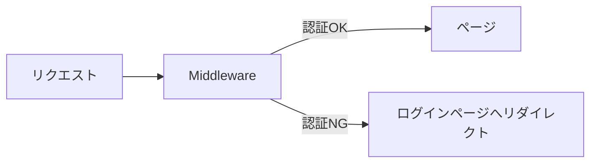
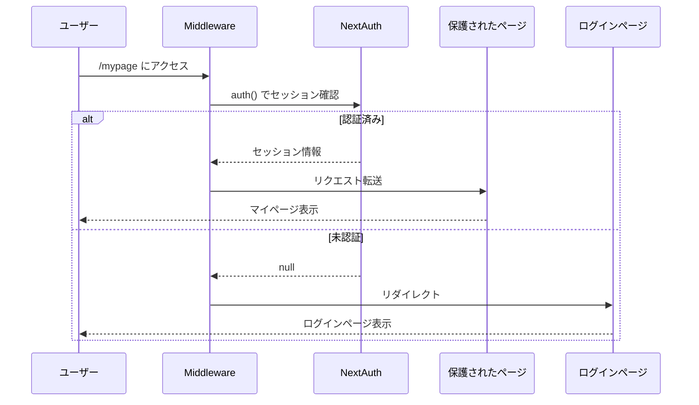
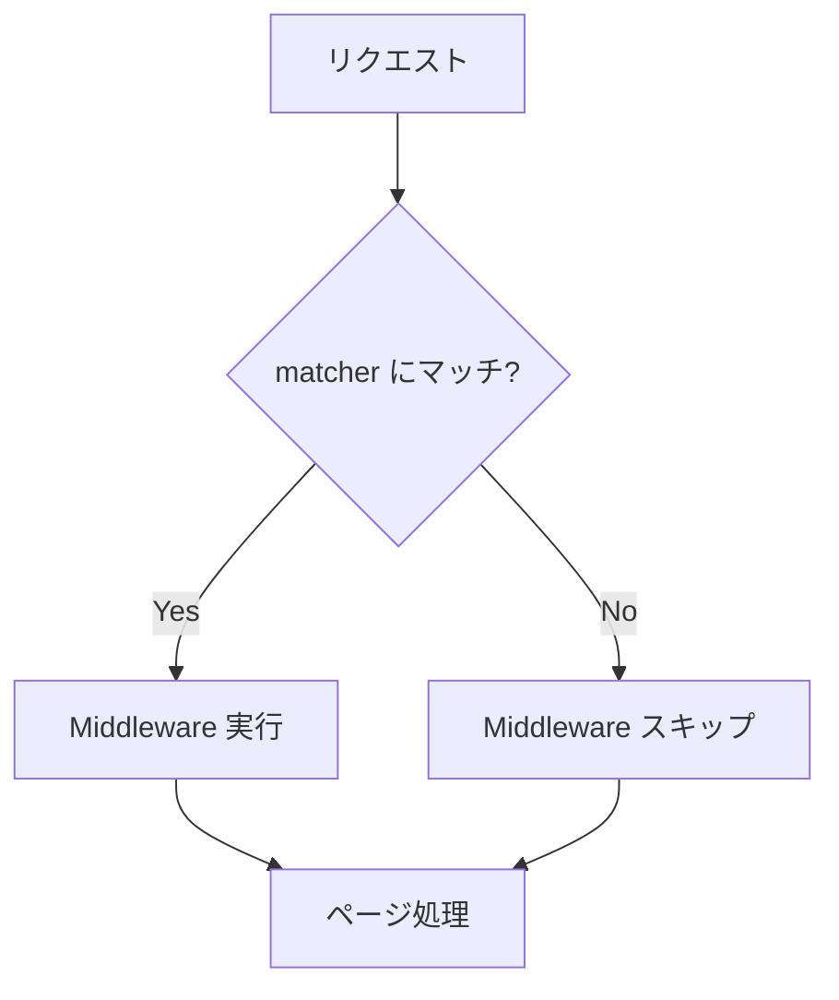

# Middleware での認証

## Next.js Middleware とは

Middleware は、リクエストが完了する前に実行されるコードです。認証チェック、リダイレクト、ヘッダーの変更などに使用されます。



### Middleware の特徴

- **Edge Runtime** で実行される
- すべてのルートに対して実行可能
- リクエストを変更・リダイレクト可能
- レスポンスヘッダーを変更可能

---

## Middleware の基本構造

### ファイル配置

```text
project-root/
├── middleware.ts    # ルートに配置
├── app/
│   ├── page.tsx
│   ├── mypage/
│   │   └── page.tsx
│   └── login/
│       └── page.tsx
```

### 基本的な Middleware

```typescript
// middleware.ts
import { type NextRequest, NextResponse } from "next/server";

export function middleware(request: NextRequest) {
  // リクエスト情報の取得
  const { pathname } = request.nextUrl;

  console.log(`Middleware: ${pathname}`);

  // 次の処理へ進む
  return NextResponse.next();
}

// Middleware を適用するパスを指定
export const config = {
  matcher: [
    /*
     * 以下を除くすべてのパスにマッチ:
     * - api (API routes)
     * - _next/static (静的ファイル)
     * - _next/image (画像最適化)
     * - favicon.ico (ファビコン)
     */
    "/((?!api|_next/static|_next/image|favicon.ico).*)",
  ],
};
```

---

## NextAuth.js と Middleware の連携

### auth() 関数を使った認証チェック

NextAuth.js v5 では、`auth()` 関数を使って Middleware で認証状態を確認できます。

```typescript
// middleware.ts
import { auth } from "@/auth";
import { NextResponse } from "next/server";

export default auth((req) => {
  const { nextUrl } = req;
  const isLoggedIn = !!req.auth;

  // 保護されたルートの定義
  const protectedRoutes = ["/mypage", "/orders", "/favorites"];
  const isProtectedRoute = protectedRoutes.some((route) => nextUrl.pathname.startsWith(route));

  // 認証が必要なページに未認証でアクセス
  if (isProtectedRoute && !isLoggedIn) {
    const loginUrl = new URL("/login", nextUrl.origin);
    loginUrl.searchParams.set("callbackUrl", nextUrl.pathname);
    return NextResponse.redirect(loginUrl);
  }

  // 認証済みユーザーがログインページにアクセス
  if (nextUrl.pathname === "/login" && isLoggedIn) {
    return NextResponse.redirect(new URL("/mypage", nextUrl.origin));
  }

  return NextResponse.next();
});

export const config = {
  matcher: ["/((?!api|_next/static|_next/image|favicon.ico).*)"],
};
```

### 認証フローの図解



---

## matcher 設定

### 基本的なパターン

```typescript
export const config = {
  matcher: [
    // 単一のパス
    "/mypage",

    // ワイルドカード（1階層）
    "/products/:path",

    // ワイルドカード（複数階層）
    "/orders/:path*",

    // 正規表現
    "/((?!api|_next/static|_next/image|favicon.ico).*)",
  ],
};
```

### よく使うパターン

```typescript
// 特定のパスのみを保護
export const config = {
  matcher: ["/mypage/:path*", "/orders/:path*", "/checkout/:path*"],
};

// 特定のパスを除外
export const config = {
  matcher: [
    /*
     * 以下を除くすべてのパスにマッチ:
     * - api ルート
     * - 静的ファイル
     * - 認証関連ページ
     */
    "/((?!api|_next/static|_next/image|auth|login|register).*)",
  ],
};
```

### パターンの優先度



---

## 複雑な認証ロジック

### ロールベースのアクセス制御

```typescript
// middleware.ts
import { auth } from "@/auth";
import { NextResponse } from "next/server";

// ルートごとの必要ロール
const routeRoles: Record<string, string[]> = {
  "/admin": ["admin"],
  "/mypage": ["user", "admin"],
  "/orders": ["user", "admin"],
};

export default auth((req) => {
  const { nextUrl } = req;
  const user = req.auth?.user;

  // 保護されたルートかチェック
  const matchedRoute = Object.keys(routeRoles).find((route) => nextUrl.pathname.startsWith(route));

  if (!matchedRoute) {
    return NextResponse.next();
  }

  // 未認証
  if (!user) {
    return NextResponse.redirect(new URL("/login", nextUrl.origin));
  }

  // ロールチェック
  const requiredRoles = routeRoles[matchedRoute];
  const userRole = user.role as string;

  if (!requiredRoles.includes(userRole)) {
    return NextResponse.redirect(new URL("/unauthorized", nextUrl.origin));
  }

  return NextResponse.next();
});
```

### 型定義の拡張

```typescript
// types/next-auth.d.ts
import { type DefaultSession } from "next-auth";

declare module "next-auth" {
  interface Session {
    user: {
      id: string;
      role: string;
    } & DefaultSession["user"];
  }

  interface User {
    role: string;
  }
}

declare module "@auth/core/jwt" {
  interface JWT {
    id: string;
    role: string;
  }
}
```

---

## Edge Runtime の制約

Middleware は Edge Runtime で実行されるため、いくつかの制約があります。

### 使用できないもの

| 機能                  | 代替手段                  |
| --------------------- | ------------------------- |
| Node.js API           | Web Standard API を使用   |
| ファイルシステム      | API Route で処理          |
| 一部の npm パッケージ | Edge 対応パッケージを使用 |
| データベース直接接続  | API Route 経由でアクセス  |

### Edge 対応の例

```typescript
// ❌ Node.js の fs は使えない
import fs from "fs";

// ✅ fetch API は使える
const response = await fetch("https://api.example.com/user");

// ❌ 一部の暗号化ライブラリは使えない
import bcrypt from "bcrypt";

// ✅ Web Crypto API は使える
const encoder = new TextEncoder();
const data = encoder.encode("password");
const hash = await crypto.subtle.digest("SHA-256", data);
```

### jose ライブラリの使用

JWT の検証には、Edge 対応の `jose` ライブラリを使用できます。

```typescript
import { jwtVerify } from "jose";

async function verifyToken(token: string) {
  const secret = new TextEncoder().encode(process.env.AUTH_SECRET);

  try {
    const { payload } = await jwtVerify(token, secret);
    return payload;
  } catch {
    return null;
  }
}
```

---

## リダイレクトパターン

### コールバック URL の保持

```typescript
export default auth((req) => {
  const { nextUrl } = req;

  if (!req.auth) {
    // ログイン後に元のページに戻れるようにする
    const loginUrl = new URL("/login", nextUrl.origin);
    loginUrl.searchParams.set("callbackUrl", nextUrl.pathname);
    return NextResponse.redirect(loginUrl);
  }

  return NextResponse.next();
});
```

### ログインページでのコールバック処理

```typescript
// app/login/page.tsx
import { redirect } from "next/navigation";
import { auth } from "@/auth";

type Props = {
  searchParams: Promise<{ callbackUrl?: string }>;
};

export default async function LoginPage({ searchParams }: Props) {
  const session = await auth();
  const { callbackUrl } = await searchParams;

  // 既にログイン済みならリダイレクト
  if (session) {
    redirect(callbackUrl || "/mypage");
  }

  return (
    <div>
      <h1>ログイン</h1>
      {/* ログインフォーム */}
    </div>
  );
}
```

---

## デバッグとトラブルシューティング

### ログの追加

```typescript
export default auth((req) => {
  const { nextUrl } = req;

  console.log("=== Middleware ===");
  console.log("Path:", nextUrl.pathname);
  console.log("Auth:", req.auth ? "Yes" : "No");
  console.log("User:", req.auth?.user?.email);

  // ...
});
```

### よくある問題と解決策

| 問題                      | 原因                             | 解決策                        |
| ------------------------- | -------------------------------- | ----------------------------- |
| Middleware が実行されない | matcher が正しく設定されていない | パターンを確認                |
| 無限リダイレクト          | ログインページも保護している     | ログインページを除外          |
| セッションが取得できない  | Cookie が送信されていない        | credentials: 'include' を確認 |
| Edge Runtime エラー       | 非対応の API を使用              | 代替手段を使用                |

---

## パフォーマンス考慮

### Middleware を軽量に保つ

```typescript
// ❌ 重い処理
export default auth(async (req) => {
  // データベースクエリを直接実行しない
  const user = await db.user.findUnique({ where: { id: req.auth?.user?.id } });
  // ...
});

// ✅ 軽量な処理
export default auth((req) => {
  // セッション情報のみを使用
  const isAdmin = req.auth?.user?.role === "admin";
  // ...
});
```

### 必要なルートのみに適用

```typescript
// ❌ すべてのルートに適用
export const config = {
  matcher: ["/:path*"],
};

// ✅ 必要なルートのみに適用
export const config = {
  matcher: ["/mypage/:path*", "/orders/:path*"],
};
```

---

## まとめ

### 学んだこと

- Next.js Middleware の基本構造と配置
- NextAuth.js の `auth()` 関数を使った認証チェック
- matcher 設定によるルート指定
- ロールベースのアクセス制御
- Edge Runtime の制約と対策
- デバッグとパフォーマンスの考慮点

---

## 次のステップ

Middleware での認証チェックを理解したら、[保護されたルート](./03-protected-routes.md) に進んで、Server/Client Component での認証状態の取得方法を学びましょう。
