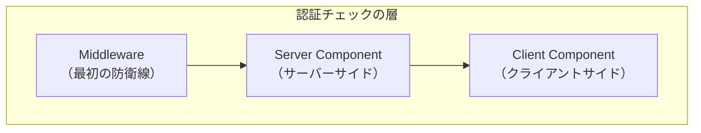
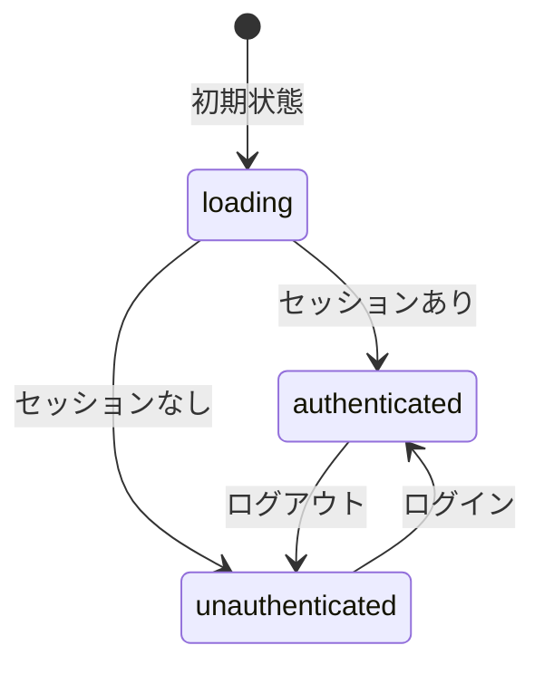
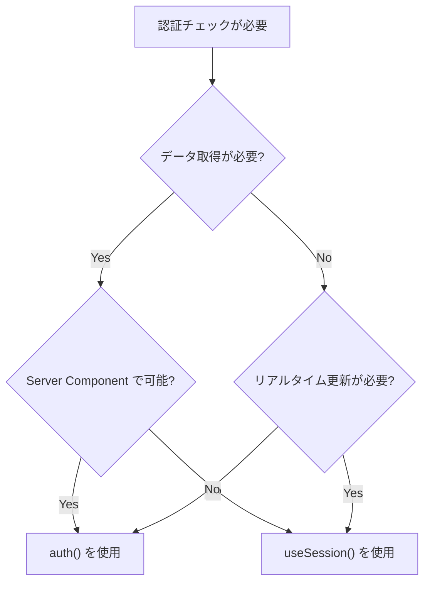
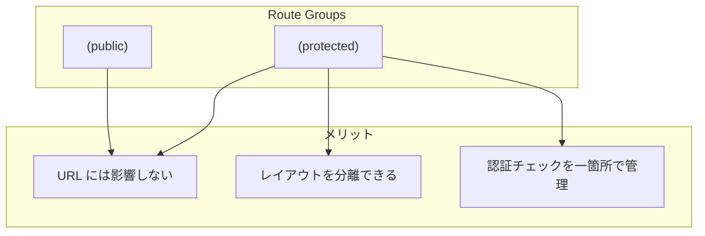
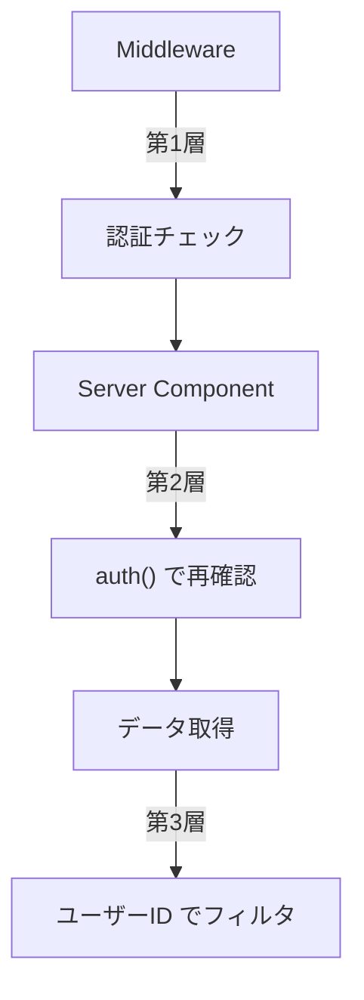

# 保護されたルート

## 目次

- [概要](#概要)
- [Server Component での認証](#server-component-での認証)
  - [auth() 関数を使用](#auth-関数を使用)
  - [セッション情報の型](#セッション情報の型)
- [Client Component での認証](#client-component-での認証)
  - [SessionProvider の設定](#sessionprovider-の設定)
  - [useSession フック](#usesession-フック)
  - [useSession の状態](#usesession-の状態)
- [auth() と useSession() の使い分け](#auth-と-usesession-の使い分け)
  - [比較表](#比較表)
  - [使い分けの指針](#使い分けの指針)
  - [具体例](#具体例)
- [Route Groups を使った構成](#route-groups-を使った構成)
  - [ディレクトリ構造](#ディレクトリ構造)
  - [保護されたルートのレイアウト](#保護されたルートのレイアウト)
  - [Route Groups のメリット](#route-groups-のメリット)
- [認証が必要なコンポーネント](#認証が必要なコンポーネント)
  - [認証ガード HOC](#認証ガード-hoc)
  - [認証必須コンポーネント](#認証必須コンポーネント)
- [ローディング状態の処理](#ローディング状態の処理)
  - [Suspense を使用](#suspense-を使用)
  - [loading.tsx を使用](#loadingtsx-を使用)
- [エラーハンドリング](#エラーハンドリング)
  - [認証エラーページ](#認証エラーページ)
  - [権限エラーページ](#権限エラーページ)
- [セキュリティのベストプラクティス](#セキュリティのベストプラクティス)
  - [1. 多層防御](#1-多層防御)
  - [2. センシティブなデータの保護](#2-センシティブなデータの保護)
- [まとめ](#まとめ)
  - [学んだこと](#学んだこと)
- [次のステップ](#次のステップ)

## 概要

保護されたルートとは、認証されたユーザーのみがアクセスできるページです。Next.js App Router では、Server Component と Client Component の両方で認証状態を確認できます。



***

## Server Component での認証

### auth() 関数を使用

Server Component では、NextAuth.js の `auth()` 関数を使ってセッション情報を取得します。

```typescript
// app/mypage/page.tsx
import { redirect } from "next/navigation";
import { auth } from "@/auth";

export default async function MyPage() {
  const session = await auth();

  // 未認証ならログインページへリダイレクト
  if (!session) {
    redirect("/login");
  }

  return (
    <div>
      <h1>マイページ</h1>
      <p>ようこそ、{session.user?.name} さん</p>
      <p>メールアドレス: {session.user?.email}</p>
    </div>
  );
}
```

### セッション情報の型

```typescript
// auth() が返すセッション情報
type Session = {
  user?: {
    name?: string | null;
    email?: string | null;
    image?: string | null;
    id?: string; // カスタム追加
  };
  expires: string;
};
```

***

## Client Component での認証

### SessionProvider の設定

Client Component でセッション情報を使用するには、`SessionProvider` でアプリをラップします。

```typescript
// app/providers.tsx
"use client";

import { SessionProvider } from "next-auth/react";
import { type ReactNode } from "react";

type Props = {
  children: ReactNode;
};

export function Providers({ children }: Props) {
  return <SessionProvider>{children}</SessionProvider>;
}
```

```typescript
// app/layout.tsx
import { Providers } from "./providers";

export default function RootLayout({
  children,
}: {
  children: React.ReactNode;
}) {
  return (
    <html lang="ja">
      <body>
        <Providers>{children}</Providers>
      </body>
    </html>
  );
}
```

### useSession フック

```typescript
// components/UserMenu.tsx
"use client";

import { useSession, signOut } from "next-auth/react";
import Link from "next/link";

export function UserMenu() {
  const { data: session, status } = useSession();

  // ローディング中
  if (status === "loading") {
    return <div>読み込み中...</div>;
  }

  // 未認証
  if (status === "unauthenticated") {
    return (
      <div>
        <Link href="/login">ログイン</Link>
        <Link href="/register">新規登録</Link>
      </div>
    );
  }

  // 認証済み
  return (
    <div>
      <span>{session?.user?.name}</span>
      <Link href="/mypage">マイページ</Link>
      <button onClick={() => signOut()}>ログアウト</button>
    </div>
  );
}
```

### useSession の状態



| status            | session   | 説明       |
| ----------------- | --------- | -------- |
| `loading`         | undefined | セッション確認中 |
| `authenticated`   | Session   | 認証済み     |
| `unauthenticated` | null      | 未認証      |

***

## auth() と useSession() の使い分け

### 比較表

| 項目       | auth()           | useSession()     |
| -------- | ---------------- | ---------------- |
| 使用場所     | Server Component | Client Component |
| 実行タイミング  | サーバーサイド          | クライアントサイド        |
| 初期ローディング | なし               | あり               |
| リアルタイム更新 | ページ再読み込み必要       | 自動更新             |
| SEO      | クローラーに見える        | クローラーに見えない       |

### 使い分けの指針



### 具体例

```typescript
// ✅ Server Component で auth() を使用
// - ページの初期データ取得
// - SEO が重要なページ
// - サーバーサイドでのデータ取得が必要な場合

// app/orders/page.tsx
import { auth } from "@/auth";

export default async function OrdersPage() {
  const session = await auth();
  const orders = await fetchOrders(session?.user?.id);

  return <OrderList orders={orders} />;
}
```

```typescript
// ✅ Client Component で useSession() を使用
// - ヘッダーのユーザーメニュー
// - リアルタイムで認証状態を反映したい場合
// - インタラクティブな認証 UI

// components/Header.tsx
"use client";

import { useSession } from "next-auth/react";

export function Header() {
  const { data: session } = useSession();

  return (
    <header>
      {session ? (
        <span>こんにちは、{session.user?.name} さん</span>
      ) : (
        <Link href="/login">ログイン</Link>
      )}
    </header>
  );
}
```

***

## Route Groups を使った構成

### ディレクトリ構造

```text
app/
├── (public)/           # 認証不要のルート
│   ├── layout.tsx
│   ├── page.tsx        # トップページ
│   ├── products/
│   │   └── page.tsx    # 商品一覧
│   └── login/
│       └── page.tsx    # ログインページ
│
├── (protected)/        # 認証必須のルート
│   ├── layout.tsx      # 認証チェック付きレイアウト
│   ├── mypage/
│   │   └── page.tsx
│   ├── orders/
│   │   └── page.tsx
│   └── favorites/
│       └── page.tsx
│
└── layout.tsx          # ルートレイアウト
```

### 保護されたルートのレイアウト

```typescript
// app/(protected)/layout.tsx
import { redirect } from "next/navigation";
import { auth } from "@/auth";

export default async function ProtectedLayout({
  children,
}: {
  children: React.ReactNode;
}) {
  const session = await auth();

  if (!session) {
    redirect("/login");
  }

  return (
    <div>
      <nav>
        <a href="/mypage">マイページ</a>
        <a href="/orders">注文履歴</a>
        <a href="/favorites">お気に入り</a>
      </nav>
      <main>{children}</main>
    </div>
  );
}
```

### Route Groups のメリット



***

## 認証が必要なコンポーネント

### 認証ガード HOC

```typescript
// components/withAuth.tsx
"use client";

import { useSession } from "next-auth/react";
import { useRouter } from "next/navigation";
import { useEffect, type ComponentType } from "react";

export function withAuth<P extends object>(Component: ComponentType<P>) {
  return function AuthenticatedComponent(props: P) {
    const { status } = useSession();
    const router = useRouter();

    useEffect(() => {
      if (status === "unauthenticated") {
        router.push("/login");
      }
    }, [status, router]);

    if (status === "loading") {
      return <div>読み込み中...</div>;
    }

    if (status === "unauthenticated") {
      return null;
    }

    return <Component {...props} />;
  };
}

// 使用例
const ProtectedComponent = withAuth(MyComponent);
```

### 認証必須コンポーネント

```typescript
// components/RequireAuth.tsx
"use client";

import { useSession } from "next-auth/react";
import { useRouter } from "next/navigation";
import { useEffect, type ReactNode } from "react";

type Props = {
  children: ReactNode;
  fallback?: ReactNode;
};

export function RequireAuth({ children, fallback }: Props) {
  const { status } = useSession();
  const router = useRouter();

  useEffect(() => {
    if (status === "unauthenticated") {
      router.push("/login");
    }
  }, [status, router]);

  if (status === "loading") {
    return fallback ?? <div>読み込み中...</div>;
  }

  if (status === "unauthenticated") {
    return null;
  }

  return <>{children}</>;
}

// 使用例
<RequireAuth>
  <SecretContent />
</RequireAuth>
```

***

## ローディング状態の処理

### Suspense を使用

```typescript
// app/(protected)/mypage/page.tsx
import { Suspense } from "react";
import { auth } from "@/auth";
import { UserProfile } from "@/components/UserProfile";
import { UserProfileSkeleton } from "@/components/UserProfileSkeleton";

export default async function MyPage() {
  const session = await auth();

  return (
    <div>
      <h1>マイページ</h1>
      <Suspense fallback={<UserProfileSkeleton />}>
        <UserProfile userId={session?.user?.id} />
      </Suspense>
    </div>
  );
}
```

### loading.tsx を使用

```typescript
// app/(protected)/mypage/loading.tsx
export default function Loading() {
  return (
    <div className="animate-pulse">
      <div className="h-8 w-48 bg-gray-200 rounded mb-4" />
      <div className="h-4 w-64 bg-gray-200 rounded mb-2" />
      <div className="h-4 w-56 bg-gray-200 rounded" />
    </div>
  );
}
```

***

## エラーハンドリング

### 認証エラーページ

```typescript
// app/auth/error/page.tsx
type Props = {
  searchParams: Promise<{ error?: string }>;
};

export default async function AuthErrorPage({ searchParams }: Props) {
  const { error } = await searchParams;

  const errorMessages: Record<string, string> = {
    Configuration: "サーバー設定にエラーがあります",
    AccessDenied: "アクセスが拒否されました",
    Verification: "認証リンクが無効か期限切れです",
    Default: "認証中にエラーが発生しました",
  };

  const message = errorMessages[error || "Default"] || errorMessages.Default;

  return (
    <div>
      <h1>認証エラー</h1>
      <p>{message}</p>
      <a href="/login">ログインページへ戻る</a>
    </div>
  );
}
```

### 権限エラーページ

```typescript
// app/unauthorized/page.tsx
import Link from "next/link";

export default function UnauthorizedPage() {
  return (
    <div>
      <h1>アクセス権限がありません</h1>
      <p>このページにアクセスする権限がありません。</p>
      <Link href="/">トップページへ戻る</Link>
    </div>
  );
}
```

***

## セキュリティのベストプラクティス

### 1. 多層防御



```typescript
// 多層防御の例
// app/(protected)/orders/page.tsx
import { auth } from "@/auth";
import { redirect } from "next/navigation";

export default async function OrdersPage() {
  const session = await auth();

  // 第2層: Server Component で再確認
  if (!session?.user?.id) {
    redirect("/login");
  }

  // 第3層: ユーザー自身のデータのみ取得
  const orders = await db.order.findMany({
    where: { userId: session.user.id },
  });

  return <OrderList orders={orders} />;
}
```

### 2. センシティブなデータの保護

```typescript
// ❌ センシティブなデータをクライアントに渡さない
export default async function UserPage() {
  const user = await db.user.findUnique({
    where: { id: session.user.id },
  });

  // passwordHash がクライアントに送信される
  return <UserProfile user={user} />;
}

// ✅ 必要なデータのみを選択
export default async function UserPage() {
  const user = await db.user.findUnique({
    where: { id: session.user.id },
    select: {
      id: true,
      name: true,
      email: true,
      // passwordHash は含めない
    },
  });

  return <UserProfile user={user} />;
}
```

***

## まとめ

### 学んだこと

- Server Component での `auth()` を使った認証チェック
- Client Component での `useSession()` の使用方法
- `SessionProvider` の設定
- Route Groups を使った認証ルートの構成
- ローディング状態とエラーハンドリング
- セキュリティのベストプラクティス

***

## 次のステップ

保護されたルートの実装を理解したら、[セッション管理](./04-session-management.md) に進んで、セッションの有効期限やリフレッシュの設定方法を学びましょう。
