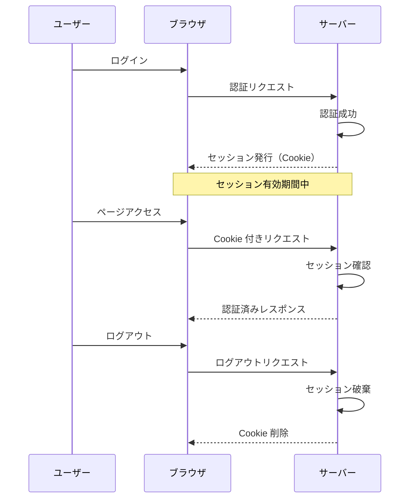
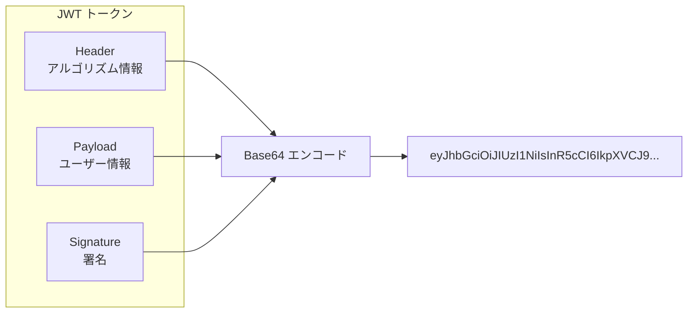
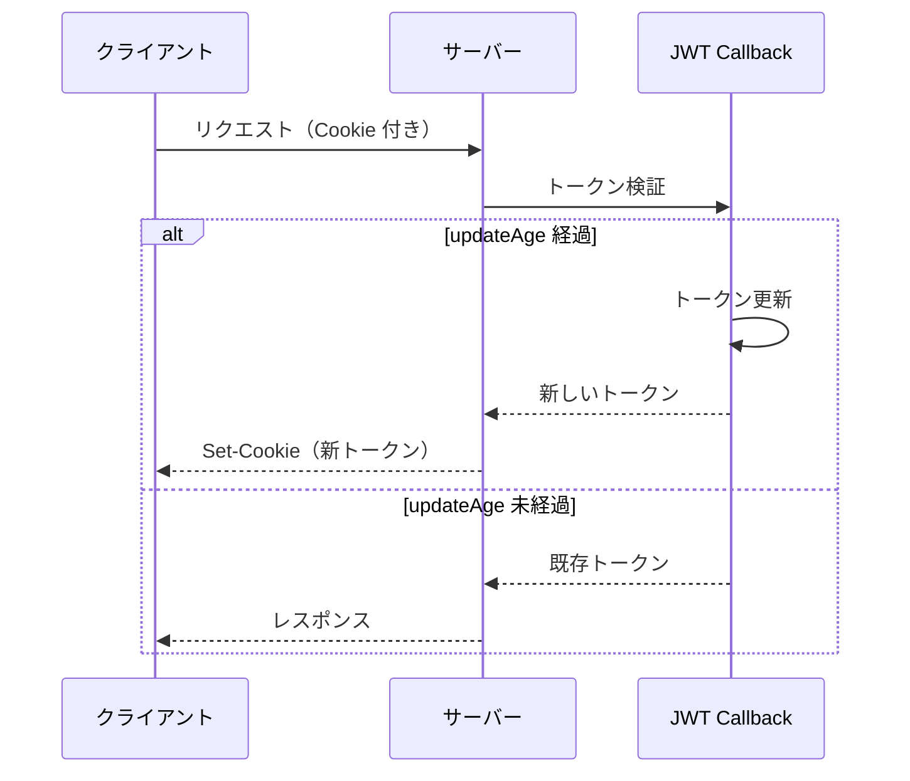
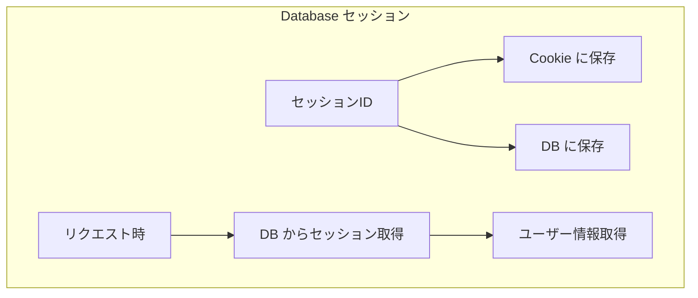
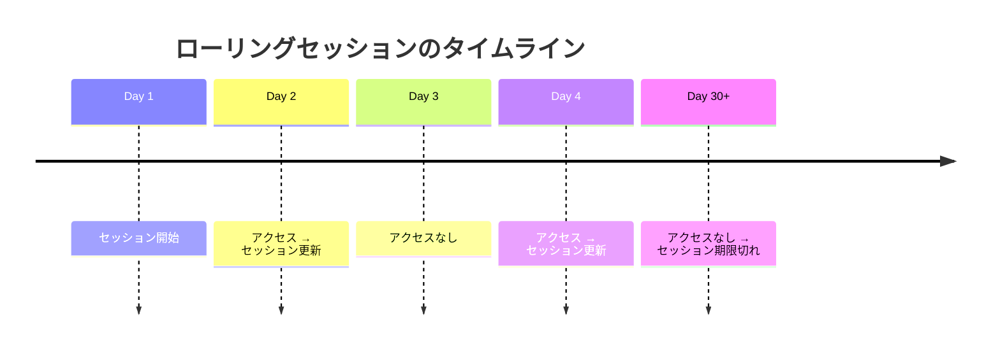
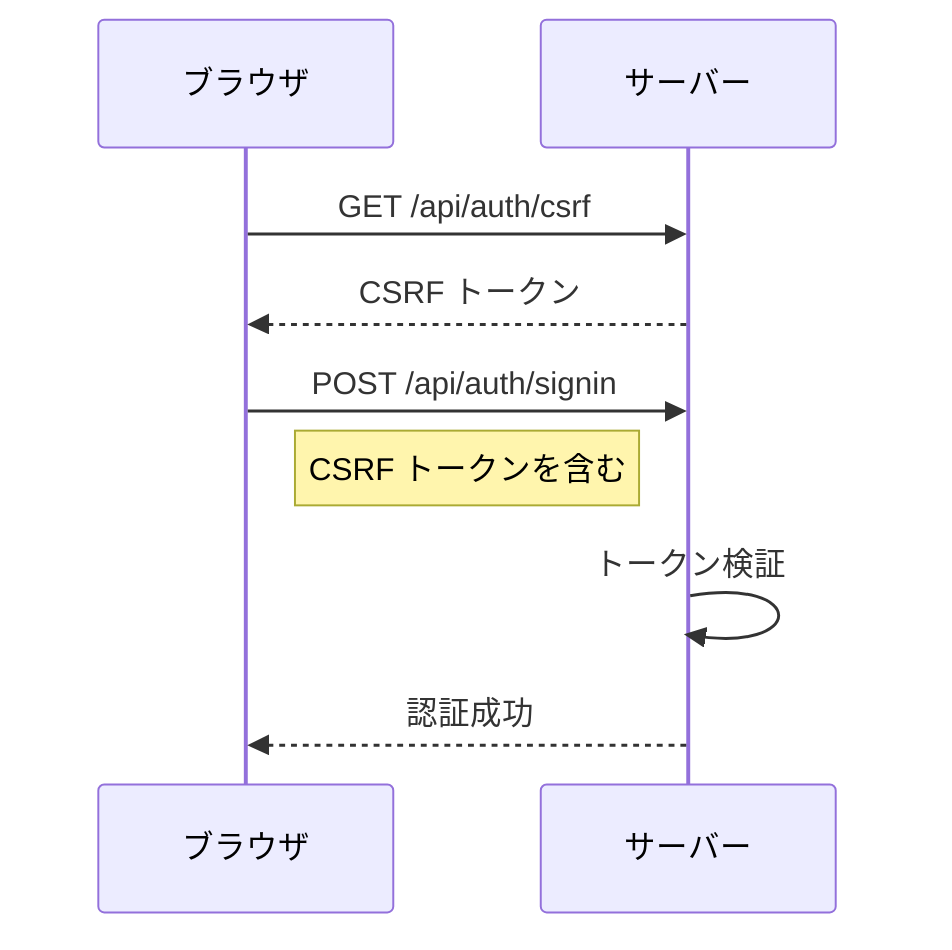
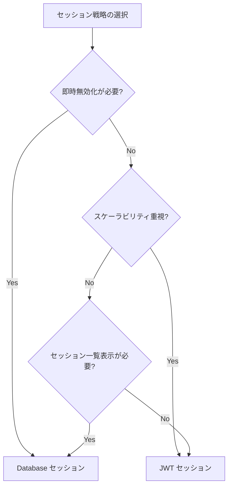

# セッション管理

## 目次

- [セッションとは](#セッションとは)
- [NextAuth.js のセッション設定](#nextauthjs-のセッション設定)
  - [基本設定](#基本設定)
  - [設定オプションの詳細](#設定オプションの詳細)
- [JWT セッションの詳細](#jwt-セッションの詳細)
  - [JWT の構造](#jwt-の構造)
  - [JWT コールバック](#jwt-コールバック)
  - [トークンの更新フロー](#トークンの更新フロー)
- [Database セッションの詳細](#database-セッションの詳細)
  - [データベースアダプターの設定](#データベースアダプターの設定)
  - [必要なテーブル（Prisma）](#必要なテーブルprisma)
  - [Database セッションの特徴](#database-セッションの特徴)
- [セッションの更新](#セッションの更新)
  - [update() 関数を使用](#update-関数を使用)
  - [ローリングセッション](#ローリングセッション)
- [ログアウト処理](#ログアウト処理)
  - [signOut 関数](#signout-関数)
  - [Server Action でのログアウト](#server-action-でのログアウト)
  - [全デバイスからログアウト（Database セッション）](#全デバイスからログアウトdatabase-セッション)
- [CSRF 対策](#csrf-対策)
  - [NextAuth.js の自動対策](#nextauthjs-の自動対策)
  - [Server Actions との連携](#server-actions-との連携)
- [セッション情報のカスタマイズ](#セッション情報のカスタマイズ)
  - [カスタムセッション型](#カスタムセッション型)
  - [コールバックでの設定](#コールバックでの設定)
- [セッションの監視とデバッグ](#セッションの監視とデバッグ)
  - [セッションイベント](#セッションイベント)
  - [デバッグモード](#デバッグモード)
- [よくあるパターン](#よくあるパターン)
  - [セッション有効期限の延長](#セッション有効期限の延長)
  - [アクティブセッションの表示](#アクティブセッションの表示)
  - [特定セッションの無効化](#特定セッションの無効化)
- [まとめ](#まとめ)
  - [学んだこと](#学んだこと)
  - [セッション戦略の選択指針](#セッション戦略の選択指針)
- [次のステップ](#次のステップ)

## セッションとは

セッションは、ユーザーがログインしてからログアウトするまでの間、認証状態を維持するための仕組みです。



***

## NextAuth.js のセッション設定

### 基本設定

```typescript
// auth.ts
export const { handlers, auth, signIn, signOut } = NextAuth({
  session: {
    // セッション戦略
    strategy: "jwt", // "jwt" | "database"

    // セッション有効期限（秒）
    maxAge: 30 * 24 * 60 * 60, // 30日

    // セッション更新間隔（秒）
    updateAge: 24 * 60 * 60, // 24時間
  },
  // ...
});
```

### 設定オプションの詳細

| オプション       | 説明                      | デフォルト |
| ----------- | ----------------------- | ----- |
| `strategy`  | セッション戦略（jwt / database） | `jwt` |
| `maxAge`    | セッションの有効期限（秒）           | 30日   |
| `updateAge` | セッション更新までの間隔（秒）         | 24時間  |

***

## JWT セッションの詳細

### JWT の構造



### JWT コールバック

JWT トークンにカスタム情報を追加できます。

```typescript
// auth.ts
export const { handlers, auth } = NextAuth({
  callbacks: {
    // JWT トークン作成・更新時に呼ばれる
    jwt: async ({ token, user, account, trigger, session }) => {
      // 初回サインイン時
      if (user) {
        token.id = user.id;
        token.role = user.role;
      }

      // セッション更新時（update() 呼び出し時）
      if (trigger === "update" && session) {
        token.name = session.name;
      }

      return token;
    },

    // セッション取得時に呼ばれる
    session: async ({ session, token }) => {
      if (token) {
        session.user.id = token.id as string;
        session.user.role = token.role as string;
      }
      return session;
    },
  },
});
```

### トークンの更新フロー



***

## Database セッションの詳細

### データベースアダプターの設定

```typescript
// auth.ts
import { PrismaAdapter } from "@auth/prisma-adapter";
import { prisma } from "@/lib/prisma";

export const { handlers, auth } = NextAuth({
  adapter: PrismaAdapter(prisma),
  session: {
    strategy: "database",
    maxAge: 30 * 24 * 60 * 60, // 30日
  },
});
```

### 必要なテーブル（Prisma）

```prisma
// prisma/schema.prisma
model User {
  id            String    @id @default(cuid())
  name          String?
  email         String?   @unique
  emailVerified DateTime?
  image         String?
  accounts      Account[]
  sessions      Session[]
}

model Account {
  id                String  @id @default(cuid())
  userId            String
  type              String
  provider          String
  providerAccountId String
  refresh_token     String?
  access_token      String?
  expires_at        Int?
  token_type        String?
  scope             String?
  id_token          String?
  session_state     String?

  user User @relation(fields: [userId], references: [id], onDelete: Cascade)

  @@unique([provider, providerAccountId])
}

model Session {
  id           String   @id @default(cuid())
  sessionToken String   @unique
  userId       String
  expires      DateTime
  user         User     @relation(fields: [userId], references: [id], onDelete: Cascade)
}
```

### Database セッションの特徴



**メリット:**

- セッションの即時無効化が可能
- サーバー側でセッション情報を一元管理
- アクティブセッションの一覧表示が可能

**デメリット:**

- 毎リクエストで DB アクセスが発生
- スケーリングが難しい

***

## セッションの更新

### update() 関数を使用

```typescript
// Client Component でセッションを更新
"use client";

import { useSession } from "next-auth/react";

export function UpdateProfileForm() {
  const { data: session, update } = useSession();

  async function handleSubmit(formData: FormData) {
    const name = formData.get("name") as string;

    // サーバーに更新を送信
    await fetch("/api/user/profile", {
      method: "PATCH",
      body: JSON.stringify({ name }),
    });

    // セッションを更新
    await update({ name });
  }

  return (
    <form action={handleSubmit}>
      <input name="name" defaultValue={session?.user?.name ?? ""} />
      <button type="submit">更新</button>
    </form>
  );
}
```

### ローリングセッション

`updateAge` を設定すると、一定期間ごとにセッションが自動更新されます。

```typescript
session: {
  maxAge: 30 * 24 * 60 * 60,    // 30日で期限切れ
  updateAge: 24 * 60 * 60,      // 24時間ごとに更新
}
```



***

## ログアウト処理

### signOut 関数

```typescript
// Client Component
"use client";

import { signOut } from "next-auth/react";

export function LogoutButton() {
  return (
    <button
      onClick={() =>
        signOut({
          callbackUrl: "/", // ログアウト後のリダイレクト先
        })
      }
    >
      ログアウト
    </button>
  );
}
```

### Server Action でのログアウト

```typescript
// app/actions/auth.ts
"use server";

import { signOut } from "@/auth";

export async function logoutAction() {
  await signOut({
    redirectTo: "/",
  });
}
```

```typescript
// components/LogoutButton.tsx
"use client";

import { logoutAction } from "@/app/actions/auth";

export function LogoutButton() {
  return (
    <form action={logoutAction}>
      <button type="submit">ログアウト</button>
    </form>
  );
}
```

### 全デバイスからログアウト（Database セッション）

```typescript
// Database セッションの場合のみ可能
async function logoutAllDevices(userId: string) {
  // ユーザーの全セッションを削除
  await prisma.session.deleteMany({
    where: { userId },
  });
}
```

***

## CSRF 対策

### NextAuth.js の自動対策

NextAuth.js は以下の CSRF 対策を自動で行います。

- CSRF トークンの生成と検証
- SameSite Cookie 属性の設定
- Origin ヘッダーの検証



### Server Actions との連携

Server Actions では、Next.js が自動的に CSRF 対策を実施します。

```typescript
// app/actions/auth.ts
"use server";

import { signIn } from "@/auth";

export async function loginAction(formData: FormData) {
  // Next.js が自動的に CSRF トークンを検証
  await signIn("credentials", formData);
}
```

***

## セッション情報のカスタマイズ

### カスタムセッション型

```typescript
// types/next-auth.d.ts
import { type DefaultSession } from "next-auth";

declare module "next-auth" {
  interface Session {
    user: {
      id: string;
      role: "user" | "admin";
      subscriptionStatus?: "active" | "inactive";
    } & DefaultSession["user"];
  }

  interface User {
    role: "user" | "admin";
    subscriptionStatus?: "active" | "inactive";
  }
}

declare module "@auth/core/jwt" {
  interface JWT {
    id: string;
    role: "user" | "admin";
    subscriptionStatus?: "active" | "inactive";
  }
}
```

### コールバックでの設定

```typescript
// auth.ts
callbacks: {
  jwt: async ({ token, user }) => {
    if (user) {
      token.id = user.id;
      token.role = user.role;
      token.subscriptionStatus = user.subscriptionStatus;
    }
    return token;
  },
  session: async ({ session, token }) => {
    session.user.id = token.id;
    session.user.role = token.role;
    session.user.subscriptionStatus = token.subscriptionStatus;
    return session;
  },
},
```

***

## セッションの監視とデバッグ

### セッションイベント

```typescript
// auth.ts
export const { handlers, auth } = NextAuth({
  events: {
    signIn: async ({ user, account, profile }) => {
      console.log("ユーザーがサインインしました:", user.email);
      // ログ記録、アナリティクス送信など
    },
    signOut: async ({ token }) => {
      console.log("ユーザーがサインアウトしました:", token?.email);
    },
    createUser: async ({ user }) => {
      console.log("新規ユーザーが作成されました:", user.email);
      // ウェルカムメール送信など
    },
    session: async ({ session, token }) => {
      // セッションがアクセスされるたびに呼ばれる
    },
  },
});
```

### デバッグモード

```typescript
// auth.ts
export const { handlers, auth } = NextAuth({
  debug: process.env.NODE_ENV === "development",
  // ...
});
```

開発環境でデバッグモードを有効にすると、認証フローの詳細がコンソールに出力されます。

***

## よくあるパターン

### セッション有効期限の延長

```typescript
// 「ログイン状態を維持する」チェックボックスの実装
export const { handlers, auth, signIn } = NextAuth({
  callbacks: {
    jwt: async ({ token, user, trigger }) => {
      if (user) {
        // ユーザーの設定に基づいて有効期限を設定
        token.maxAge = user.rememberMe ? 30 * 24 * 60 * 60 : 24 * 60 * 60;
      }
      return token;
    },
  },
});
```

### アクティブセッションの表示

```typescript
// Database セッションの場合
async function getActiveSessions(userId: string) {
  const sessions = await prisma.session.findMany({
    where: {
      userId,
      expires: { gt: new Date() },
    },
    orderBy: { expires: "desc" },
  });

  return sessions;
}
```

### 特定セッションの無効化

```typescript
// Database セッションの場合
async function revokeSession(sessionToken: string) {
  await prisma.session.delete({
    where: { sessionToken },
  });
}
```

***

## まとめ

### 学んだこと

- セッションの基本概念と NextAuth.js での設定
- JWT セッションと Database セッションの違い
- セッションの更新とローリングセッション
- ログアウト処理の実装
- CSRF 対策の仕組み
- セッション情報のカスタマイズ
- セッションの監視とデバッグ

### セッション戦略の選択指針



***

## 次のステップ

セッション管理を理解したら、[演習問題](./exercises/01-login-logout.md) に進んで、実際にログイン/ログアウト機能を実装してみましょう。
