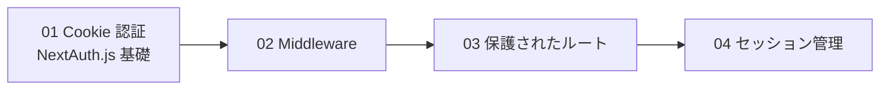
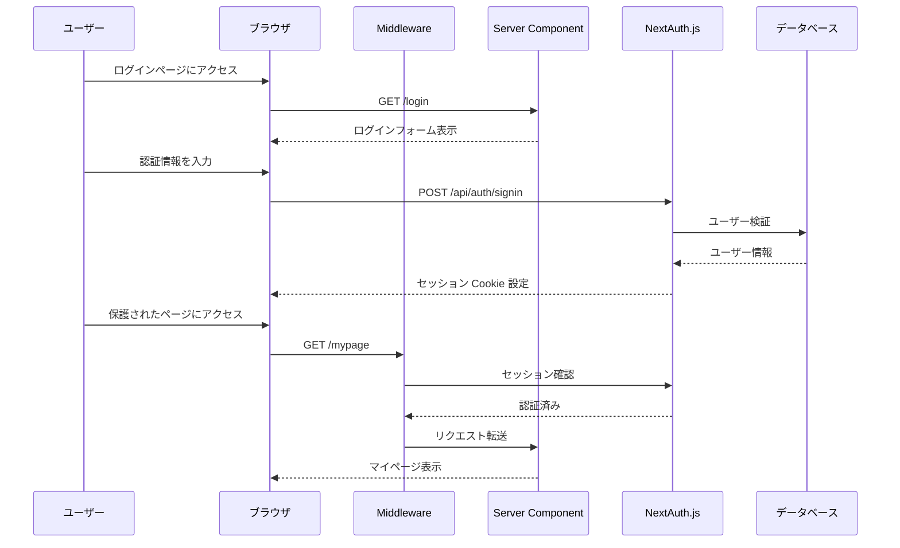
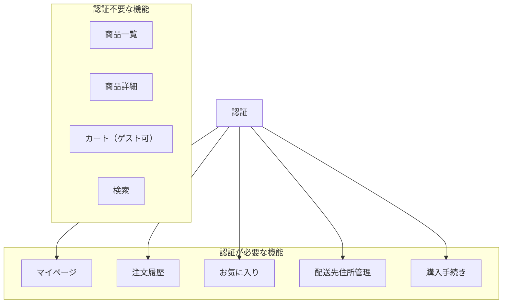

# Phase 8: 認証機能

## 目次

- [概要](#概要)
- [難易度](#難易度)
- [所要時間目安](#所要時間目安)
- [前提知識](#前提知識)
- [学習目標](#学習目標)
- [目次](#目次-1)
  - [学習フロー](#学習フロー)
- [演習問題](#演習問題)
- [認証フローの全体像](#認証フローの全体像)
- [使用ツール](#使用ツール)
- [関連する EC サイト機能](#関連する-ec-サイト機能)
  - [EC サイトでの認証の重要性](#ec-サイトでの認証の重要性)
- [推奨学習リソース](#推奨学習リソース)
  - [公式ドキュメント](#公式ドキュメント)
  - [参考記事](#参考記事)
- [自己チェックリスト](#自己チェックリスト)
  - [概念理解](#概念理解)
  - [実装スキル](#実装スキル)
  - [セキュリティ](#セキュリティ)
- [次のフェーズ](#次のフェーズ)

## 概要

Next.js での認証パターンを理解し、NextAuth.js（Auth.js v5）を使った実践的な認証機能を実装するフェーズです。
EC サイトに必須のユーザー認証機能を構築し、保護されたルートやセッション管理の仕組みを習得します。

---

## 難易度

難易度: 3/5（中）

認証は Web アプリケーションの重要な機能であり、セキュリティの理解が求められます。NextAuth.js を使用することで、複雑な認証ロジックを簡略化できます。

---

## 所要時間目安

約 6〜8 時間です。

---

## 前提知識

- Phase 7（フォーム + Server Actions）を完了していること
- Cookie とセッションの基本的な概念
- Next.js App Router の基本（layout, page, middleware）
- Server Components と Client Components の違い

---

## 学習目標

このフェーズを完了すると、以下ができるようになります。

- [ ] 認証（Authentication）と認可（Authorization）の違いを説明できる
- [ ] NextAuth.js（Auth.js v5）をセットアップできる
- [ ] Credentials Provider でメール/パスワード認証を実装できる
- [ ] OAuth Provider（GitHub, Google など）を設定できる
- [ ] Middleware を使って認証が必要なルートを保護できる
- [ ] Server/Client Component でセッション情報を取得できる
- [ ] セッションの有効期限とリフレッシュを設定できる

---

## 目次

1. [Cookie ベース認証と NextAuth.js](./01-cookie-auth.md)
2. [Middleware での認証](./02-middleware.md)
3. [保護されたルート](./03-protected-routes.md)
4. [セッション管理](./04-session-management.md)

### 学習フロー

---

## 演習問題

- [演習 1: ログイン/ログアウト機能](./exercises/01-login-logout.md)
- [演習 2: マイページ](./exercises/02-mypage.md)
- [演習 3: ルートガード](./exercises/03-route-guard.md)

---

## 認証フローの全体像

---

## 使用ツール

| ツール      | バージョン | 用途                   |
| ----------- | ---------- | ---------------------- |
| NextAuth.js | 5.x        | 認証ライブラリ         |
| next-auth   | beta       | App Router 対応版      |
| @auth/core  | -          | Auth.js コア機能       |
| bcrypt      | -          | パスワードハッシュ化   |
| Zod         | 4.x        | 認証情報バリデーション |

---

## 関連する EC サイト機能

このフェーズで実装する機能は EC サイトの以下の部分に対応します。

| 機能                | 説明                              |
| ------------------- | --------------------------------- |
| ユーザー登録        | メール/パスワードでアカウント作成 |
| ログイン/ログアウト | 認証状態の管理                    |
| マイページ          | 認証ユーザー専用ページ            |
| 注文履歴            | ログインユーザーの過去の注文一覧  |
| お気に入り一覧      | ログインユーザーのお気に入り商品  |
| 保護されたルート    | 未認証ユーザーのアクセス制限      |

### EC サイトでの認証の重要性

---

## 推奨学習リソース

### 公式ドキュメント

- [NextAuth.js ドキュメント](https://authjs.dev/)
- [Next.js Authentication](https://nextjs.org/docs/app/building-your-application/authentication)
- [Auth.js Getting Started](https://authjs.dev/getting-started)

### 参考記事

- [NextAuth.js v5 Migration Guide](https://authjs.dev/getting-started/migrating-to-v5)
- [Next.js App Router での認証パターン](https://zenn.dev/topics/nextauth)

---

## 自己チェックリスト

Phase 8 を完了する前に、以下を確認してください。

### 概念理解

- [ ] 認証（Authentication）と認可（Authorization）の違いを説明できる
- [ ] Cookie ベース認証の仕組みを理解している
- [ ] JWT と Database セッションの違いを説明できる
- [ ] CSRF 攻撃とその対策を理解している

### 実装スキル

- [ ] NextAuth.js の設定ファイル（auth.ts）を書ける
- [ ] Credentials Provider を設定できる
- [ ] OAuth Provider（GitHub など）を設定できる
- [ ] Middleware で認証チェックを実装できる
- [ ] Server Component で `auth()` を使ってセッションを取得できる
- [ ] Client Component で `useSession()` を使える
- [ ] ログイン/ログアウト機能を実装できる

### セキュリティ

- [ ] パスワードを平文で保存してはいけないことを理解している
- [ ] 環境変数で機密情報を管理できる
- [ ] セッション有効期限の設定を理解している

---

## 次のフェーズ

Phase 8 を完了したら、[Phase 9: 注文フロー + API Routes](../phase-09-order-flow/README.md) に進みましょう。
