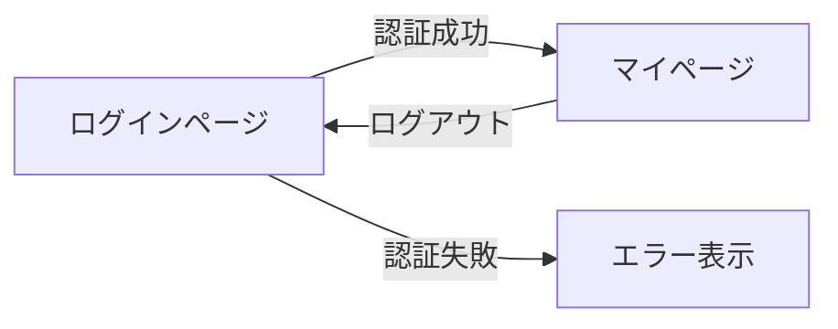

# 演習 1: ログイン/ログアウト機能

## 目標

NextAuth.js を使って、メール/パスワードでのログイン・ログアウト機能を実装します。

---

## 完成イメージ



---

## 要件

### 機能要件

1. ログインページ（/login）を作成する
2. メールアドレスとパスワードでログインできる
3. ログイン成功後、マイページ（/mypage）にリダイレクトする
4. ログイン失敗時、エラーメッセージを表示する
5. ログアウトボタンでログアウトできる
6. ログアウト後、トップページにリダイレクトする

### 非機能要件

- パスワードは bcrypt でハッシュ化
- Zod でフォームバリデーション
- 環境変数で機密情報を管理

---

## 実装手順

### Step 1: NextAuth.js のセットアップ

```bash
pnpm add next-auth@beta bcrypt
pnpm add -D @types/bcrypt
```

### Step 2: 環境変数の設定

```env
# .env.local
AUTH_SECRET=<openssl rand -base64 32 の出力>
```

### Step 3: auth.ts の作成

```typescript
// auth.ts
import NextAuth from "next-auth";
import Credentials from "next-auth/providers/credentials";
import { z } from "zod";
// bcrypt と findUserByEmail、verifyPassword を実装

const credentialsSchema = z.object({
  email: z.string().email(),
  password: z.string().min(8),
});

export const { handlers, signIn, signOut, auth } = NextAuth({
  providers: [
    Credentials({
      credentials: {
        email: {},
        password: {},
      },
      authorize: async (credentials) => {
        // TODO: バリデーションとユーザー認証を実装
      },
    }),
  ],
  pages: {
    signIn: "/login",
  },
});
```

### Step 4: API Route の作成

```typescript
// app/api/auth/[...nextauth]/route.ts
import { handlers } from "@/auth";

export const { GET, POST } = handlers;
```

### Step 5: ログインページの作成

```typescript
// app/login/page.tsx
// TODO: ログインフォームを実装
```

### Step 6: ログアウトボタンの作成

```typescript
// components/LogoutButton.tsx
// TODO: ログアウト機能を実装
```

---

## ヒント

### ログインフォームの実装

<details>
<summary>ヒントを見る</summary>

Server Action を使ってログイン処理を実装します。

```typescript
// app/login/actions.ts
"use server";

import { signIn } from "@/auth";
import { AuthError } from "next-auth";

export async function loginAction(formData: FormData) {
  try {
    await signIn("credentials", {
      email: formData.get("email"),
      password: formData.get("password"),
      redirectTo: "/mypage",
    });
  } catch (error) {
    if (error instanceof AuthError) {
      switch (error.type) {
        case "CredentialsSignin":
          return { error: "メールアドレスまたはパスワードが正しくありません" };
        default:
          return { error: "エラーが発生しました" };
      }
    }
    throw error;
  }
}
```

</details>

### useActionState の使用

<details>
<summary>ヒントを見る</summary>

```typescript
"use client";

import { useActionState } from "react";
import { loginAction } from "./actions";

export function LoginForm() {
  const [state, formAction, isPending] = useActionState(loginAction, null);

  return (
    <form action={formAction}>
      {state?.error && <p className="text-red-500">{state.error}</p>}
      <input name="email" type="email" required />
      <input name="password" type="password" required />
      <button type="submit" disabled={isPending}>
        {isPending ? "ログイン中..." : "ログイン"}
      </button>
    </form>
  );
}
```

</details>

### モックユーザーデータ

<details>
<summary>ヒントを見る</summary>

データベースがない場合は、モックデータを使用できます。

```typescript
// lib/mock-users.ts
import { hashSync } from "bcrypt";

export const mockUsers = [
  {
    id: "1",
    email: "user@example.com",
    name: "テストユーザー",
    // password: "password123"
    passwordHash: hashSync("password123", 10),
  },
];

export function findUserByEmail(email: string) {
  return mockUsers.find((user) => user.email === email);
}
```

</details>

---

## 解答例

<details>
<summary>完全な解答を見る</summary>

### auth.ts

```typescript
import NextAuth from "next-auth";
import Credentials from "next-auth/providers/credentials";
import { compare } from "bcrypt";
import { z } from "zod";
import { findUserByEmail } from "@/lib/mock-users";

const credentialsSchema = z.object({
  email: z.string().email(),
  password: z.string().min(8),
});

export const { handlers, signIn, signOut, auth } = NextAuth({
  providers: [
    Credentials({
      credentials: {
        email: { label: "Email", type: "email" },
        password: { label: "Password", type: "password" },
      },
      authorize: async (credentials) => {
        const parsed = credentialsSchema.safeParse(credentials);
        if (!parsed.success) {
          return null;
        }

        const { email, password } = parsed.data;
        const user = findUserByEmail(email);

        if (!user) {
          return null;
        }

        const isValidPassword = await compare(password, user.passwordHash);
        if (!isValidPassword) {
          return null;
        }

        return {
          id: user.id,
          email: user.email,
          name: user.name,
        };
      },
    }),
  ],
  session: {
    strategy: "jwt",
  },
  pages: {
    signIn: "/login",
  },
});
```

### app/login/page.tsx

```typescript
import { redirect } from "next/navigation";
import { auth } from "@/auth";
import { LoginForm } from "./LoginForm";

export default async function LoginPage() {
  const session = await auth();

  if (session) {
    redirect("/mypage");
  }

  return (
    <div className="max-w-md mx-auto mt-10">
      <h1 className="text-2xl font-bold mb-6">ログイン</h1>
      <LoginForm />
    </div>
  );
}
```

### app/login/LoginForm.tsx

```typescript
"use client";

import { useActionState } from "react";
import { loginAction } from "./actions";

export function LoginForm() {
  const [state, formAction, isPending] = useActionState(loginAction, null);

  return (
    <form action={formAction} className="space-y-4">
      {state?.error && (
        <div className="p-3 bg-red-100 text-red-700 rounded">
          {state.error}
        </div>
      )}

      <div>
        <label htmlFor="email" className="block text-sm font-medium">
          メールアドレス
        </label>
        <input
          id="email"
          name="email"
          type="email"
          required
          className="mt-1 block w-full rounded border p-2"
        />
      </div>

      <div>
        <label htmlFor="password" className="block text-sm font-medium">
          パスワード
        </label>
        <input
          id="password"
          name="password"
          type="password"
          required
          minLength={8}
          className="mt-1 block w-full rounded border p-2"
        />
      </div>

      <button
        type="submit"
        disabled={isPending}
        className="w-full bg-blue-600 text-white py-2 rounded hover:bg-blue-700 disabled:opacity-50"
      >
        {isPending ? "ログイン中..." : "ログイン"}
      </button>
    </form>
  );
}
```

### components/LogoutButton.tsx

```typescript
"use client";

import { signOut } from "next-auth/react";

export function LogoutButton() {
  return (
    <button
      onClick={() => signOut({ callbackUrl: "/" })}
      className="text-red-600 hover:text-red-800"
    >
      ログアウト
    </button>
  );
}
```

</details>

---

## 発展課題

1. **OAuth Provider の追加**: GitHub でのログインを追加してみましょう
2. **ユーザー登録機能**: 新規ユーザー登録ページを作成してみましょう
3. **Remember Me**: 「ログイン状態を維持する」チェックボックスを追加してみましょう

---

## 確認ポイント

- [ ] ログインページが表示される
- [ ] 正しい認証情報でログインできる
- [ ] 誤った認証情報でエラーメッセージが表示される
- [ ] ログイン後、マイページにリダイレクトされる
- [ ] ログアウトできる
- [ ] ログアウト後、トップページにリダイレクトされる

---

## 次の演習

ログイン/ログアウト機能を実装したら、[演習 2: マイページ](./02-mypage.md) に進みましょう。
