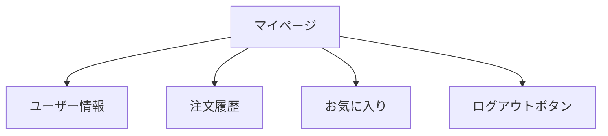

# 演習 2: マイページ

## 目次

- [目標](#目標)
- [完成イメージ](#完成イメージ)
- [要件](#要件)
  - [機能要件](#機能要件)
  - [技術要件](#技術要件)
- [実装手順](#実装手順)
  - [Step 1: Route Groups の構成](#step-1-route-groups-の構成)
  - [Step 2: 保護されたレイアウトの作成](#step-2-保護されたレイアウトの作成)
  - [Step 3: マイページの作成](#step-3-マイページの作成)
  - [Step 4: ユーザーメニューの作成](#step-4-ユーザーメニューの作成)
- [ヒント](#ヒント)
  - [保護されたレイアウト](#保護されたレイアウト)
  - [SessionProvider の設定](#sessionprovider-の設定)
  - [useSession の使用](#usesession-の使用)
- [解答例](#解答例)
  - [app/(protected)/layout.tsx](#appprotectedlayouttsx)
  - [app/(protected)/mypage/page.tsx](#appprotectedmypagepagetsx)
  - [app/(protected)/orders/page.tsx](#appprotectedorderspagetsx)
  - [app/(protected)/favorites/page.tsx](#appprotectedfavoritespagetsx)
  - [components/UserMenu.tsx（Client Component 版）](#componentsusermenutsxclient-component-版)
- [発展課題](#発展課題)
- [確認ポイント](#確認ポイント)
- [次の演習](#次の演習)

## 目標

認証ユーザー専用のマイページを実装し、Server ComponentとClient Componentでのセッション取得を実践します。

***

## 完成イメージ



***

## 要件

### 機能要件

1. マイページ（/mypage）を作成する
2. 認証済みユーザーのみアクセス可能にする
3. ユーザー情報（名前、メールアドレス）を表示する
4. 注文履歴へのリンクを表示する
5. お気に入り一覧へのリンクを表示する
6. ログアウトボタンを配置する

### 技術要件

- Server Componentで `auth()` を使用してセッションを取得
- Client Componentで `useSession()` を使用してユーザーメニューを表示
- Route Groupsを使って保護されたルートを構成

***

## 実装手順

### Step 1: Route Groups の構成

```text
app/
├── (public)/
│   └── login/
│       └── page.tsx
├── (protected)/
│   ├── layout.tsx      # 認証チェック
│   ├── mypage/
│   │   └── page.tsx
│   ├── orders/
│   │   └── page.tsx
│   └── favorites/
│       └── page.tsx
└── layout.tsx
```

### Step 2: 保護されたレイアウトの作成

```typescript
// app/(protected)/layout.tsx
// TODO: 認証チェックを実装
```

### Step 3: マイページの作成

```typescript
// app/(protected)/mypage/page.tsx
// TODO: ユーザー情報の表示を実装
```

### Step 4: ユーザーメニューの作成

```typescript
// components/UserMenu.tsx
// TODO: useSession を使ってユーザーメニューを実装
```

***

## ヒント

### 保護されたレイアウト

<details>
<summary>ヒントを見る</summary>

```typescript
// app/(protected)/layout.tsx
import { redirect } from "next/navigation";
import { auth } from "@/auth";

export default async function ProtectedLayout({
  children,
}: {
  children: React.ReactNode;
}) {
  const session = await auth();

  if (!session) {
    redirect("/login");
  }

  return (
    <div className="min-h-screen">
      <nav className="bg-gray-100 p-4">
        {/* ナビゲーション */}
      </nav>
      <main className="p-4">{children}</main>
    </div>
  );
}
```

</details>

### SessionProvider の設定

<details>
<summary>ヒントを見る</summary>

```typescript
// app/providers.tsx
"use client";

import { SessionProvider } from "next-auth/react";

export function Providers({ children }: { children: React.ReactNode }) {
  return <SessionProvider>{children}</SessionProvider>;
}
```

```typescript
// app/layout.tsx
import { Providers } from "./providers";

export default function RootLayout({
  children,
}: {
  children: React.ReactNode;
}) {
  return (
    <html lang="ja">
      <body>
        <Providers>{children}</Providers>
      </body>
    </html>
  );
}
```

</details>

### useSession の使用

<details>
<summary>ヒントを見る</summary>

```typescript
"use client";

import { useSession } from "next-auth/react";

export function UserInfo() {
  const { data: session, status } = useSession();

  if (status === "loading") {
    return <div>読み込み中...</div>;
  }

  if (!session) {
    return null;
  }

  return (
    <div>
      <p>名前: {session.user?.name}</p>
      <p>メール: {session.user?.email}</p>
    </div>
  );
}
```

</details>

***

## 解答例

<details>
<summary>完全な解答を見る</summary>

### app/(protected)/layout.tsx

```typescript
import { redirect } from "next/navigation";
import Link from "next/link";
import { auth } from "@/auth";
import { LogoutButton } from "@/components/LogoutButton";

export default async function ProtectedLayout({
  children,
}: {
  children: React.ReactNode;
}) {
  const session = await auth();

  if (!session) {
    redirect("/login");
  }

  return (
    <div className="min-h-screen">
      <nav className="bg-gray-100 p-4">
        <div className="max-w-4xl mx-auto flex justify-between items-center">
          <div className="flex gap-4">
            <Link href="/mypage" className="hover:underline">
              マイページ
            </Link>
            <Link href="/orders" className="hover:underline">
              注文履歴
            </Link>
            <Link href="/favorites" className="hover:underline">
              お気に入り
            </Link>
          </div>
          <div className="flex items-center gap-4">
            <span>{session.user?.name}</span>
            <LogoutButton />
          </div>
        </div>
      </nav>
      <main className="max-w-4xl mx-auto p-4">{children}</main>
    </div>
  );
}
```

### app/(protected)/mypage/page.tsx

```typescript
import { auth } from "@/auth";
import Link from "next/link";

export default async function MyPage() {
  const session = await auth();

  return (
    <div className="space-y-8">
      <section>
        <h1 className="text-2xl font-bold mb-4">マイページ</h1>
        <p>ようこそ、{session?.user?.name} さん</p>
      </section>

      <section className="grid gap-4 md:grid-cols-2">
        <div className="p-6 border rounded-lg">
          <h2 className="text-lg font-semibold mb-2">アカウント情報</h2>
          <dl className="space-y-2">
            <div>
              <dt className="text-sm text-gray-500">名前</dt>
              <dd>{session?.user?.name}</dd>
            </div>
            <div>
              <dt className="text-sm text-gray-500">メールアドレス</dt>
              <dd>{session?.user?.email}</dd>
            </div>
          </dl>
        </div>

        <div className="p-6 border rounded-lg">
          <h2 className="text-lg font-semibold mb-2">クイックリンク</h2>
          <ul className="space-y-2">
            <li>
              <Link href="/orders" className="text-blue-600 hover:underline">
                注文履歴を見る
              </Link>
            </li>
            <li>
              <Link href="/favorites" className="text-blue-600 hover:underline">
                お気に入り一覧を見る
              </Link>
            </li>
            <li>
              <Link href="/settings" className="text-blue-600 hover:underline">
                アカウント設定
              </Link>
            </li>
          </ul>
        </div>
      </section>
    </div>
  );
}
```

### app/(protected)/orders/page.tsx

```typescript
import { auth } from "@/auth";

// モックデータ
const mockOrders = [
  {
    id: "1",
    date: "2024-01-15",
    total: 12800,
    status: "配送完了",
  },
  {
    id: "2",
    date: "2024-01-20",
    total: 5400,
    status: "発送準備中",
  },
];

export default async function OrdersPage() {
  const session = await auth();

  // 実際はユーザーIDで注文を取得
  // const orders = await fetchOrders(session?.user?.id);

  return (
    <div>
      <h1 className="text-2xl font-bold mb-4">注文履歴</h1>

      {mockOrders.length === 0 ? (
        <p>注文履歴がありません。</p>
      ) : (
        <ul className="space-y-4">
          {mockOrders.map((order) => (
            <li key={order.id} className="p-4 border rounded-lg">
              <div className="flex justify-between items-start">
                <div>
                  <p className="font-medium">注文番号: {order.id}</p>
                  <p className="text-sm text-gray-500">{order.date}</p>
                </div>
                <div className="text-right">
                  <p className="font-medium">
                    ¥{order.total.toLocaleString()}
                  </p>
                  <p className="text-sm text-green-600">{order.status}</p>
                </div>
              </div>
            </li>
          ))}
        </ul>
      )}
    </div>
  );
}
```

### app/(protected)/favorites/page.tsx

```typescript
import { auth } from "@/auth";
import Link from "next/link";

// モックデータ
const mockFavorites = [
  {
    id: "1",
    name: "商品A",
    price: 3980,
    imageUrl: "/products/1.jpg",
  },
  {
    id: "2",
    name: "商品B",
    price: 2480,
    imageUrl: "/products/2.jpg",
  },
];

export default async function FavoritesPage() {
  const session = await auth();

  // 実際はユーザーIDでお気に入りを取得
  // const favorites = await fetchFavorites(session?.user?.id);

  return (
    <div>
      <h1 className="text-2xl font-bold mb-4">お気に入り</h1>

      {mockFavorites.length === 0 ? (
        <p>お気に入りに追加した商品がありません。</p>
      ) : (
        <ul className="grid gap-4 md:grid-cols-3">
          {mockFavorites.map((product) => (
            <li key={product.id} className="p-4 border rounded-lg">
              <div className="aspect-square bg-gray-100 rounded mb-2" />
              <p className="font-medium">{product.name}</p>
              <p className="text-gray-600">
                ¥{product.price.toLocaleString()}
              </p>
              <Link
                href={`/products/${product.id}`}
                className="text-blue-600 text-sm hover:underline"
              >
                商品詳細を見る
              </Link>
            </li>
          ))}
        </ul>
      )}
    </div>
  );
}
```

### components/UserMenu.tsx（Client Component 版）

```typescript
"use client";

import { useSession, signOut } from "next-auth/react";
import Link from "next/link";

export function UserMenu() {
  const { data: session, status } = useSession();

  if (status === "loading") {
    return <div className="animate-pulse w-24 h-8 bg-gray-200 rounded" />;
  }

  if (!session) {
    return (
      <div className="flex gap-2">
        <Link href="/login" className="text-blue-600 hover:underline">
          ログイン
        </Link>
        <Link href="/register" className="text-blue-600 hover:underline">
          新規登録
        </Link>
      </div>
    );
  }

  return (
    <div className="flex items-center gap-4">
      <Link href="/mypage" className="hover:underline">
        {session.user?.name}
      </Link>
      <button
        onClick={() => signOut({ callbackUrl: "/" })}
        className="text-red-600 hover:text-red-800"
      >
        ログアウト
      </button>
    </div>
  );
}
```

</details>

***

## 発展課題

1. **プロフィール編集**: ユーザー名を変更できる機能を追加してみましょう
2. **プロフィール画像**: 画像をアップロードして表示できる機能を追加してみましょう
3. **最近見た商品**: 閲覧履歴を表示する機能を追加してみましょう

***

## 確認ポイント

- [ ] 未認証でマイページにアクセスするとログインページにリダイレクトされる
- [ ] ログイン後、マイページにユーザー情報が表示される
- [ ] 注文履歴ページにアクセスできる
- [ ] お気に入りページにアクセスできる
- [ ] ナビゲーションメニューが正しく表示される
- [ ] ログアウトボタンが動作する

***

## 次の演習

マイページを実装したら、[演習 3: ルートガード](./03-route-guard.md) に進みましょう。
