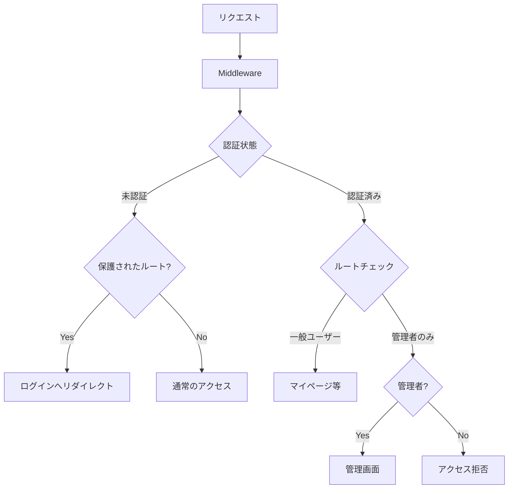

# 演習 3: ルートガード

## 目次

- [目標](#目標)
- [完成イメージ](#完成イメージ)
- [要件](#要件)
  - [機能要件](#機能要件)
  - [技術要件](#技術要件)
- [実装手順](#実装手順)
  - [Step 1: 基本的な Middleware の作成](#step-1-基本的な-middleware-の作成)
  - [Step 2: matcher の設定](#step-2-matcher-の設定)
  - [Step 3: callbackUrl の実装](#step-3-callbackurl-の実装)
  - [Step 4: ロールベースアクセス制御](#step-4-ロールベースアクセス制御)
- [ヒント](#ヒント)
  - [基本的な Middleware](#基本的な-middleware)
  - [保護されたルートの定義](#保護されたルートの定義)
  - [callbackUrl の処理](#callbackurl-の処理)
  - [ロールチェック](#ロールチェック)
- [解答例](#解答例)
  - [middleware.ts](#middlewarets)
  - [types/next-auth.d.ts（型拡張）](#typesnext-authdts型拡張)
  - [auth.ts（コールバック追加）](#authtsコールバック追加)
  - [app/unauthorized/page.tsx](#appunauthorizedpagetsx)
  - [app/login/page.tsx（callbackUrl 対応）](#apploginpagetsxcallbackurl-対応)
  - [app/login/LoginForm.tsx（callbackUrl 対応）](#apploginloginformtsxcallbackurl-対応)
  - [app/login/actions.ts（callbackUrl 対応）](#apploginactionstscallbackurl-対応)
- [発展課題](#発展課題)
- [確認ポイント](#確認ポイント)
- [トラブルシューティング](#トラブルシューティング)
  - [よくある問題](#よくある問題)
- [まとめ](#まとめ)
- [Phase 8 完了](#phase-8-完了)

## 目標

Middlewareを使って認証が必要なルートを保護し、高度なアクセス制御を実装します。

***

## 完成イメージ



***

## 要件

### 機能要件

1. Middlewareで認証チェックを実装する
2. 保護されたルートへの未認証アクセスをログインページにリダイレクトする
3. ログイン後に元のページに戻れる（callbackUrl）
4. 認証済みユーザーがログインページにアクセスした場合、マイページにリダイレクトする
5. 管理者のみがアクセスできるルートを作成する

### 技術要件

- middleware.tsを作成
- matcherで適用するパスを指定
- NextAuth.jsのauth() 関数を使用
- ロールベースのアクセス制御を実装

***

## 実装手順

### Step 1: 基本的な Middleware の作成

```typescript
// middleware.ts
// TODO: 基本的な認証チェックを実装
```

### Step 2: matcher の設定

```typescript
export const config = {
  matcher: [
    // TODO: 適切なパターンを設定
  ],
};
```

### Step 3: callbackUrl の実装

```typescript
// TODO: リダイレクト時に元のURLを保持
```

### Step 4: ロールベースアクセス制御

```typescript
// TODO: 管理者のみアクセス可能なルートを設定
```

***

## ヒント

### 基本的な Middleware

<details>
<summary>ヒントを見る</summary>

```typescript
// middleware.ts
import { auth } from "@/auth";
import { NextResponse } from "next/server";

export default auth((req) => {
  const { nextUrl } = req;
  const isLoggedIn = !!req.auth;

  console.log("Middleware:", {
    path: nextUrl.pathname,
    isLoggedIn,
  });

  return NextResponse.next();
});
```

</details>

### 保護されたルートの定義

<details>
<summary>ヒントを見る</summary>

```typescript
// 保護されたルートのプレフィックス
const protectedRoutes = ["/mypage", "/orders", "/favorites", "/checkout"];

// パスが保護されたルートかチェック
const isProtectedRoute = protectedRoutes.some((route) => nextUrl.pathname.startsWith(route));
```

</details>

### callbackUrl の処理

<details>
<summary>ヒントを見る</summary>

```typescript
if (isProtectedRoute && !isLoggedIn) {
  const loginUrl = new URL("/login", nextUrl.origin);
  // 元のパスを callbackUrl として保持
  loginUrl.searchParams.set("callbackUrl", nextUrl.pathname);
  return NextResponse.redirect(loginUrl);
}
```

</details>

### ロールチェック

<details>
<summary>ヒントを見る</summary>

```typescript
// 管理者ルート
const adminRoutes = ["/admin"];

const isAdminRoute = adminRoutes.some((route) => nextUrl.pathname.startsWith(route));

if (isAdminRoute) {
  const userRole = req.auth?.user?.role;
  if (userRole !== "admin") {
    return NextResponse.redirect(new URL("/unauthorized", nextUrl.origin));
  }
}
```

</details>

***

## 解答例

<details>
<summary>完全な解答を見る</summary>

### middleware.ts

```typescript
import { auth } from "@/auth";
import { NextResponse } from "next/server";

// 保護されたルート（認証必須）
const protectedRoutes = ["/mypage", "/orders", "/favorites", "/checkout"];

// 管理者専用ルート
const adminRoutes = ["/admin"];

// 認証ページ（認証済みならリダイレクト）
const authRoutes = ["/login", "/register"];

export default auth((req) => {
  const { nextUrl } = req;
  const isLoggedIn = !!req.auth;
  const userRole = req.auth?.user?.role;

  // パスのチェック
  const isProtectedRoute = protectedRoutes.some((route) => nextUrl.pathname.startsWith(route));
  const isAdminRoute = adminRoutes.some((route) => nextUrl.pathname.startsWith(route));
  const isAuthRoute = authRoutes.some((route) => nextUrl.pathname.startsWith(route));

  // 管理者ルートのチェック
  if (isAdminRoute) {
    if (!isLoggedIn) {
      const loginUrl = new URL("/login", nextUrl.origin);
      loginUrl.searchParams.set("callbackUrl", nextUrl.pathname);
      return NextResponse.redirect(loginUrl);
    }
    if (userRole !== "admin") {
      return NextResponse.redirect(new URL("/unauthorized", nextUrl.origin));
    }
    return NextResponse.next();
  }

  // 保護されたルートのチェック
  if (isProtectedRoute && !isLoggedIn) {
    const loginUrl = new URL("/login", nextUrl.origin);
    loginUrl.searchParams.set("callbackUrl", nextUrl.pathname);
    return NextResponse.redirect(loginUrl);
  }

  // 認証ページへの認証済みアクセス
  if (isAuthRoute && isLoggedIn) {
    return NextResponse.redirect(new URL("/mypage", nextUrl.origin));
  }

  return NextResponse.next();
});

export const config = {
  matcher: [
    /*
     * 以下を除くすべてのパスにマッチ:
     * - api (API routes)
     * - _next/static (静的ファイル)
     * - _next/image (画像最適化)
     * - favicon.ico (ファビコン)
     * - public フォルダのファイル
     */
    "/((?!api|_next/static|_next/image|favicon.ico|.*\\..*|_next).*)",
  ],
};
```

### types/next-auth.d.ts（型拡張）

```typescript
import { type DefaultSession } from "next-auth";

declare module "next-auth" {
  interface Session {
    user: {
      id: string;
      role: "user" | "admin";
    } & DefaultSession["user"];
  }

  interface User {
    role: "user" | "admin";
  }
}

declare module "@auth/core/jwt" {
  interface JWT {
    id: string;
    role: "user" | "admin";
  }
}
```

### auth.ts（コールバック追加）

```typescript
export const { handlers, signIn, signOut, auth } = NextAuth({
  // ... 既存の設定
  callbacks: {
    jwt: async ({ token, user }) => {
      if (user) {
        token.id = user.id;
        token.role = user.role;
      }
      return token;
    },
    session: async ({ session, token }) => {
      if (token) {
        session.user.id = token.id as string;
        session.user.role = token.role as "user" | "admin";
      }
      return session;
    },
  },
});
```

### app/unauthorized/page.tsx

```typescript
import Link from "next/link";

export default function UnauthorizedPage() {
  return (
    <div className="min-h-screen flex items-center justify-center">
      <div className="text-center">
        <h1 className="text-4xl font-bold text-red-600 mb-4">
          アクセス拒否
        </h1>
        <p className="text-gray-600 mb-6">
          このページにアクセスする権限がありません。
        </p>
        <Link
          href="/"
          className="text-blue-600 hover:underline"
        >
          トップページに戻る
        </Link>
      </div>
    </div>
  );
}
```

### app/login/page.tsx（callbackUrl 対応）

```typescript
import { redirect } from "next/navigation";
import { auth } from "@/auth";
import { LoginForm } from "./LoginForm";

type Props = {
  searchParams: Promise<{ callbackUrl?: string }>;
};

export default async function LoginPage({ searchParams }: Props) {
  const session = await auth();
  const { callbackUrl } = await searchParams;

  if (session) {
    redirect(callbackUrl || "/mypage");
  }

  return (
    <div className="max-w-md mx-auto mt-10">
      <h1 className="text-2xl font-bold mb-6">ログイン</h1>
      <LoginForm callbackUrl={callbackUrl} />
    </div>
  );
}
```

### app/login/LoginForm.tsx（callbackUrl 対応）

```typescript
"use client";

import { useActionState } from "react";
import { loginAction } from "./actions";

type Props = {
  callbackUrl?: string;
};

export function LoginForm({ callbackUrl }: Props) {
  const [state, formAction, isPending] = useActionState(
    loginAction.bind(null, callbackUrl),
    null,
  );

  return (
    <form action={formAction} className="space-y-4">
      {/* フォーム内容 */}
    </form>
  );
}
```

### app/login/actions.ts（callbackUrl 対応）

```typescript
"use server";

import { signIn } from "@/auth";
import { AuthError } from "next-auth";

export async function loginAction(
  callbackUrl: string | undefined,
  _prevState: unknown,
  formData: FormData
) {
  try {
    await signIn("credentials", {
      email: formData.get("email"),
      password: formData.get("password"),
      redirectTo: callbackUrl || "/mypage",
    });
  } catch (error) {
    if (error instanceof AuthError) {
      return { error: "認証に失敗しました" };
    }
    throw error;
  }
}
```

</details>

***

## 発展課題

1. **権限レベル**: 複数の権限レベル（guest, user, premium, admin）を実装してみましょう
2. **IP 制限**: 管理画面へのアクセスを特定のIPアドレスのみに制限してみましょう
3. **レート制限**: ログイン試行回数を制限する機能を追加してみましょう
4. **監査ログ**: 認証イベント（ログイン、ログアウト、アクセス拒否）を記録してみましょう

***

## 確認ポイント

- [ ] 未認証で /mypageにアクセスするとログインページにリダイレクトされる
- [ ] ログイン後、元のページ（callbackUrl）に戻れる
- [ ] 認証済みでログインページにアクセスするとマイページにリダイレクトされる
- [ ] 一般ユーザーで /adminにアクセスすると権限エラーページが表示される
- [ ] 管理者で /adminにアクセスできる
- [ ] 静的ファイル（\_next/static, 画像など）はMiddlewareの影響を受けない

***

## トラブルシューティング

### よくある問題

| 問題             | 原因               | 解決策                   |
| -------------- | ---------------- | --------------------- |
| 無限リダイレクト       | ログインページも保護       | matcher から除外          |
| 静的ファイルが読み込めない  | matcher が広すぎる    | \_next/static を除外     |
| セッションが取得できない   | Edge Runtime の制約 | API Route 経由でデータ取得    |
| ロールが undefined | コールバック未設定        | jwt/session コールバックを確認 |

***

## まとめ

この演習で学んだことは以下のとおりです。

1. Middlewareを使った認証チェックの実装
2. matcherによるルート指定
3. callbackUrlを使ったUX向上
4. ロールベースのアクセス制御
5. 型安全な認証情報の取得

***

## Phase 8 完了

お疲れさまでした。Phase 8の演習をすべて完了しました。

[Phase 9: 注文フロー](../../phase-09-order-flow/README.md) に進みましょう。
