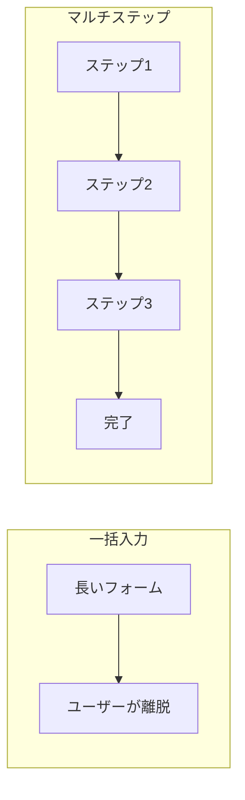
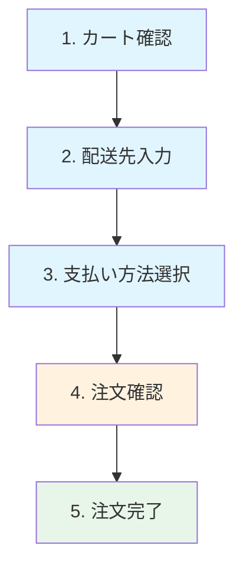
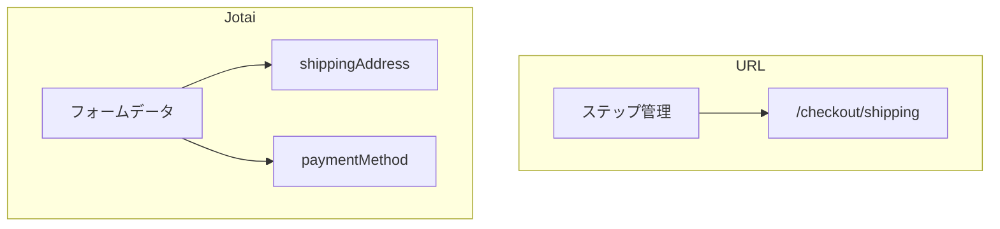

# マルチステップフォーム

## 目次

- [マルチステップフォームとは](#マルチステップフォームとは)
  - [なぜ分割するのか](#なぜ分割するのか)
- [EC サイトの購入フロー](#ec-サイトの購入フロー)
- [状態管理のアプローチ](#状態管理のアプローチ)
  - [1. URL パラメータ方式](#1-url-パラメータ方式)
  - [2. Jotai（グローバル状態）方式](#2-jotaiグローバル状態方式)
  - [3. ハイブリッド方式（推奨）](#3-ハイブリッド方式推奨)
- [ステップナビゲーション](#ステップナビゲーション)
  - [プログレスバー](#プログレスバー)
  - [ステップ間の遷移制御](#ステップ間の遷移制御)
- [バリデーション戦略](#バリデーション戦略)
  - [ステップごとのバリデーション](#ステップごとのバリデーション)
  - [Server Actions でのバリデーション](#server-actions-でのバリデーション)
- [離脱防止と復帰](#離脱防止と復帰)
  - [入力途中のデータ保持](#入力途中のデータ保持)
  - [離脱確認ダイアログ](#離脱確認ダイアログ)
- [よくある間違い](#よくある間違い)
  - [1. ステップのスキップを許可してしまう](#1-ステップのスキップを許可してしまう)
  - [2. 戻るボタンで状態が消える](#2-戻るボタンで状態が消える)
  - [3. 完了ページで更新すると再注文される](#3-完了ページで更新すると再注文される)
- [まとめ](#まとめ)
  - [マルチステップフォームの要点](#マルチステップフォームの要点)
  - [EC 購入フローの特徴](#ec-購入フローの特徴)
- [次のステップ](#次のステップ)

## マルチステップフォームとは

**マルチステップフォーム**は、長いフォームを複数のステップに分割して、ユーザーに段階的に入力してもらう UI パターンです。

### なぜ分割するのか



- **認知負荷の軽減** - 一度に処理する情報量を減らす
- **進捗の可視化** - どこまで進んだかが分かる
- **離脱率の低減** - 少しずつ進めるため心理的ハードルが下がる
- **エラー処理の容易さ** - ステップごとにバリデーションできる

---

## EC サイトの購入フロー

典型的な EC サイトの購入フローは、以下のステップで構成されます。



| ステップ       | 内容                     | 特徴                   |
| -------------- | ------------------------ | ---------------------- |
| カート確認     | 商品一覧、数量変更       | 編集可能、離脱も多い   |
| 配送先入力     | 住所、連絡先             | バリデーションが重要   |
| 支払い方法選択 | クレジット、代引きなど   | セキュリティに配慮     |
| 注文確認       | 最終確認、規約同意       | 変更不可、二重送信防止 |
| 注文完了       | 完了メッセージ、注文番号 | ブックマーク不可       |

---

## 状態管理のアプローチ

マルチステップフォームの状態管理には、主に 3 つのアプローチがあります。

### 1. URL パラメータ方式

各ステップを別のページとして実装し、URL で状態を管理します。

```text
/checkout/cart          # ステップ1
/checkout/shipping      # ステップ2
/checkout/payment       # ステップ3
/checkout/confirm       # ステップ4
/checkout/complete      # ステップ5
```

#### メリット

- ブラウザの戻る/進むボタンが自然に動作
- ブックマークやリンク共有が可能
- SEO に有利（各ステップが独立したページ）

#### デメリット

- ステップ間のデータ受け渡しに工夫が必要
- URL の管理が煩雑になる可能性

### 2. Jotai（グローバル状態）方式

Jotai の Atom でフォーム全体の状態を管理します。

```typescript
// packages/store/src/checkout.ts
import { atom } from "jotai";
import { atomWithStorage } from "jotai/utils";

export type CheckoutStep = "cart" | "shipping" | "payment" | "confirm" | "complete";

export type CheckoutState = {
  step: CheckoutStep;
  shippingAddress: ShippingAddress | null;
  paymentMethod: PaymentMethod | null;
};

// ブラウザを閉じても保持される
export const checkoutAtom = atomWithStorage<CheckoutState>("checkout", {
  step: "cart",
  shippingAddress: null,
  paymentMethod: null,
});

// 現在のステップだけを取得する派生 Atom
export const currentStepAtom = atom((get) => get(checkoutAtom).step);
```

#### メリット

- データの受け渡しがシンプル
- 永続化が容易（atomWithStorage）
- 型安全

#### デメリット

- URL と状態の同期が必要
- ブラウザの履歴と整合性を取る必要がある

### 3. ハイブリッド方式（推奨）

URL でステップを管理し、Jotai でフォームデータを管理します。



```typescript
// 各ステップのデータを個別の Atom で管理
export const shippingAddressAtom = atomWithStorage<ShippingAddress | null>(
  "checkout:shipping",
  null
);

export const paymentMethodAtom = atomWithStorage<PaymentMethod | null>("checkout:payment", null);
```

---

## ステップナビゲーション

### プログレスバー

ユーザーに現在の進捗を示すコンポーネントを実装します。

```tsx
// apps/web/app/checkout/components/StepProgress.tsx
"use client";

type Step = {
  id: string;
  label: string;
  href: string;
};

const STEPS: Step[] = [
  { id: "cart", label: "カート", href: "/checkout/cart" },
  { id: "shipping", label: "配送先", href: "/checkout/shipping" },
  { id: "payment", label: "支払い", href: "/checkout/payment" },
  { id: "confirm", label: "確認", href: "/checkout/confirm" },
];

type Props = {
  currentStep: string;
};

export function StepProgress({ currentStep }: Props): JSX.Element {
  const currentIndex = STEPS.findIndex((step) => step.id === currentStep);

  return (
    <nav aria-label="購入手続きの進捗">
      <ol className="flex items-center justify-between">
        {STEPS.map((step, index) => {
          const isCompleted = index < currentIndex;
          const isCurrent = index === currentIndex;

          return (
            <li
              key={step.id}
              className="flex items-center"
            >
              <span
                className={`flex h-8 w-8 items-center justify-center rounded-full ${isCompleted ? "bg-green-500 text-white" : ""} ${isCurrent ? "bg-blue-500 text-white" : ""} ${!isCompleted && !isCurrent ? "bg-gray-200 text-gray-500" : ""} `}
                aria-current={isCurrent ? "step" : undefined}
              >
                {isCompleted ? "✓" : index + 1}
              </span>
              <span className="ml-2 text-sm">{step.label}</span>
            </li>
          );
        })}
      </ol>
    </nav>
  );
}
```

### ステップ間の遷移制御

前のステップが未完了であれば、先へ進めないよう制御します。

```tsx
// apps/web/app/checkout/shipping/page.tsx
import { redirect } from "next/navigation";
import { cookies } from "next/headers";

export default async function ShippingPage(): Promise<JSX.Element> {
  // カートが空の場合はカートページにリダイレクト
  const cookieStore = await cookies();
  const cartData = cookieStore.get("cart");

  if (!cartData?.value) {
    redirect("/checkout/cart");
  }

  return (
    <div>
      <h1>配送先入力</h1>
      {/* フォーム */}
    </div>
  );
}
```

---

## バリデーション戦略

### ステップごとのバリデーション

各ステップで入力値を検証し、次に進む前にエラーを表示します。

```typescript
// packages/validators/src/checkout.ts
import { z } from "zod";

// 配送先スキーマ
export const shippingAddressSchema = z.object({
  postalCode: z.string().regex(/^\d{3}-?\d{4}$/, "郵便番号の形式が正しくありません"),
  prefecture: z.string().min(1, "都道府県を選択してください"),
  city: z.string().min(1, "市区町村を入力してください"),
  address1: z.string().min(1, "番地を入力してください"),
  address2: z.string().optional(),
  name: z.string().min(1, "お名前を入力してください"),
  phone: z.string().regex(/^0\d{9,10}$/, "電話番号の形式が正しくありません"),
});

export type ShippingAddress = z.infer<typeof shippingAddressSchema>;

// 支払い方法スキーマ
export const paymentMethodSchema = z.discriminatedUnion("type", [
  z.object({
    type: z.literal("credit_card"),
    cardNumber: z.string().min(1, "カード番号を入力してください"),
    expiryDate: z.string().min(1, "有効期限を入力してください"),
    cvv: z.string().min(1, "セキュリティコードを入力してください"),
  }),
  z.object({
    type: z.literal("bank_transfer"),
  }),
  z.object({
    type: z.literal("cash_on_delivery"),
  }),
]);

export type PaymentMethod = z.infer<typeof paymentMethodSchema>;
```

### Server Actions でのバリデーション

```typescript
// apps/web/app/checkout/shipping/actions.ts
"use server";

import { redirect } from "next/navigation";
import { shippingAddressSchema } from "@ec/validators/checkout";

export type ShippingFormState = {
  errors?: Record<string, string[]>;
  success?: boolean;
};

export async function saveShippingAddress(
  prevState: ShippingFormState,
  formData: FormData
): Promise<ShippingFormState> {
  const rawData = {
    postalCode: formData.get("postalCode"),
    prefecture: formData.get("prefecture"),
    city: formData.get("city"),
    address1: formData.get("address1"),
    address2: formData.get("address2"),
    name: formData.get("name"),
    phone: formData.get("phone"),
  };

  const result = shippingAddressSchema.safeParse(rawData);

  if (!result.success) {
    return {
      errors: result.error.flatten().fieldErrors as Record<string, string[]>,
    };
  }

  // 配送先を保存（Cookie またはデータベース）
  // ...

  redirect("/checkout/payment");
}
```

---

## 離脱防止と復帰

### 入力途中のデータ保持

`atomWithStorage` を使用して、ブラウザを閉じても入力データを保持します。

```typescript
import { atomWithStorage } from "jotai/utils";

// sessionStorage を使う場合（ブラウザを閉じると消える）
export const shippingDraftAtom = atomWithStorage<Partial<ShippingAddress>>(
  "checkout:shipping:draft",
  {},
  undefined,
  { getOnInit: true }
);

// localStorage を使う場合（ブラウザを閉じても残る）
export const shippingAddressAtom = atomWithStorage<ShippingAddress | null>(
  "checkout:shipping",
  null
);
```

### 離脱確認ダイアログ

入力途中でページを離れようとした場合に確認ダイアログを表示します。

```tsx
"use client";

import { useEffect } from "react";

export function useBeforeUnload(isDirty: boolean): void {
  useEffect(() => {
    const handleBeforeUnload = (e: BeforeUnloadEvent): void => {
      if (isDirty) {
        e.preventDefault();
        e.returnValue = "";
      }
    };

    window.addEventListener("beforeunload", handleBeforeUnload);

    return () => {
      window.removeEventListener("beforeunload", handleBeforeUnload);
    };
  }, [isDirty]);
}

// 使用例
function ShippingForm(): JSX.Element {
  const [isDirty, setIsDirty] = useState(false);

  useBeforeUnload(isDirty);

  return <form onChange={() => setIsDirty(true)}>{/* フォームフィールド */}</form>;
}
```

---

## よくある間違い

### 1. ステップのスキップを許可してしまう

```typescript
// ❌ 悪い例：前のステップを確認せずに表示
export default function PaymentPage(): JSX.Element {
  return <PaymentForm />;
}

// ✅ 良い例：前のステップの完了を確認
export default async function PaymentPage(): Promise<JSX.Element> {
  const shippingAddress = await getShippingAddress();

  if (!shippingAddress) {
    redirect("/checkout/shipping");
  }

  return <PaymentForm />;
}
```

### 2. 戻るボタンで状態が消える

```typescript
// ❌ 悪い例：ローカル state のみで管理
const [address, setAddress] = useState<ShippingAddress | null>(null);

// ✅ 良い例：永続化された Atom で管理
const [address, setAddress] = useAtom(shippingAddressAtom);
```

### 3. 完了ページで更新すると再注文される

```typescript
// ❌ 悪い例：完了ページで状態が残っている
export default function CompletePage(): JSX.Element {
  // 更新すると同じ注文が作成される可能性
}

// ✅ 良い例：完了時に状態をクリア
export default function CompletePage(): JSX.Element {
  useEffect(() => {
    // 完了後は checkout 状態をクリア
    clearCheckoutState();
  }, []);
}
```

---

## まとめ

### マルチステップフォームの要点

- 長いフォームを分割して認知負荷を軽減
- URL とグローバル状態のハイブリッド管理が推奨
- 各ステップでバリデーションを実行
- 前のステップの完了を確認してから次に進む
- 離脱防止とデータの永続化を考慮

### EC 購入フローの特徴

- カート → 配送先 → 支払い → 確認 → 完了の 5 ステップ
- 確認画面での二重送信防止が重要
- 完了後は状態をクリアして再注文を防止

---

## 次のステップ

マルチステップフォームの設計を理解したら、[API Routes 設計](./02-api-routes.md) に進んで、注文データを処理する API の実装方法を学びましょう。
