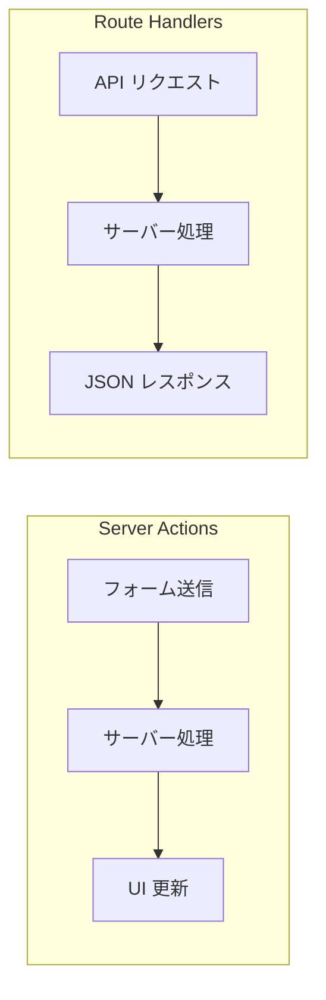
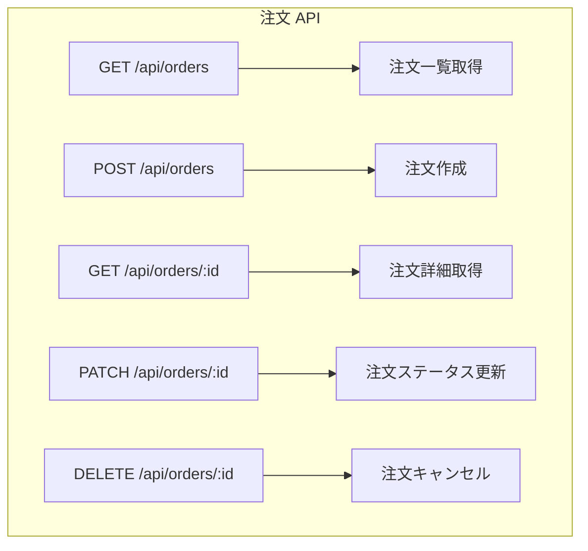

# API Routes 設計

## 目次

- [Route Handlers とは](#route-handlers-とは)
  - [Server Actions との違い](#server-actions-との違い)
- [基本的な Route Handler](#基本的な-route-handler)
  - [ファイル構成](#ファイル構成)
  - [GET リクエスト](#get-リクエスト)
  - [POST リクエスト](#post-リクエスト)
  - [動的ルート](#動的ルート)
- [RESTful API 設計](#restful-api-設計)
  - [エンドポイント設計](#エンドポイント設計)
  - [クエリパラメータ](#クエリパラメータ)
- [型定義](#型定義)
  - [リクエスト/レスポンスの型](#リクエストレスポンスの型)
- [エラーハンドリング](#エラーハンドリング)
  - [統一されたエラーレスポンス](#統一されたエラーレスポンス)
  - [HTTP ステータスコードの使い分け](#http-ステータスコードの使い分け)
- [認証・認可](#認証認可)
  - [Cookie からユーザーを取得](#cookie-からユーザーを取得)
  - [Middleware での認証チェック](#middleware-での認証チェック)
- [EC サイトでの実践例](#ec-サイトでの実践例)
  - [注文作成 API の完全な実装](#注文作成-api-の完全な実装)
- [よくある間違い](#よくある間違い)
  - [1. エラーハンドリングの欠如](#1-エラーハンドリングの欠如)
  - [2. バリデーションの欠如](#2-バリデーションの欠如)
  - [3. 認証チェックの欠如](#3-認証チェックの欠如)
- [まとめ](#まとめ)
  - [Route Handlers の要点](#route-handlers-の要点)
  - [設計のベストプラクティス](#設計のベストプラクティス)
- [次のステップ](#次のステップ)

## Route Handlers とは

**Route Handlers** は、Next.js App RouterでAPIエンドポイントを作成する仕組みです。
`app/api/` ディレクトリ内に `route.ts` ファイルを作成することで、RESTful APIを実装できます。

### Server Actions との違い



| 特徴        | Server Actions | Route Handlers         |
| --------- | -------------- | ---------------------- |
| 用途        | フォーム処理         | API エンドポイント            |
| 呼び出し元     | React コンポーネント  | 任意のクライアント              |
| レスポンス     | React の状態更新    | JSON / その他             |
| HTTP メソッド | POST のみ        | GET, POST, PUT, DELETE |
| 外部からの利用   | 不可             | 可能                     |

***

## 基本的な Route Handler

### ファイル構成

```text
app/
└── api/
    └── orders/
        ├── route.ts              # /api/orders
        └── [id]/
            └── route.ts          # /api/orders/[id]
```

### GET リクエスト

```typescript
// app/api/orders/route.ts
import { NextResponse } from "next/server";

// 注文一覧を取得
export async function GET(): Promise<NextResponse> {
  try {
    // データベースから注文を取得（MSW でモック）
    const orders = await fetchOrders();

    return NextResponse.json(orders);
  } catch (error) {
    return NextResponse.json({ error: "注文の取得に失敗しました" }, { status: 500 });
  }
}
```

### POST リクエスト

```typescript
// app/api/orders/route.ts
import { NextResponse, type NextRequest } from "next/server";
import { orderSchema } from "@ec/validators/order";

// 新規注文を作成
export async function POST(request: NextRequest): Promise<NextResponse> {
  try {
    const body = await request.json();

    // バリデーション
    const result = orderSchema.safeParse(body);
    if (!result.success) {
      return NextResponse.json(
        { error: "入力内容が正しくありません", details: result.error.flatten() },
        { status: 400 }
      );
    }

    // 注文を作成
    const order = await createOrder(result.data);

    return NextResponse.json(order, { status: 201 });
  } catch (error) {
    return NextResponse.json({ error: "注文の作成に失敗しました" }, { status: 500 });
  }
}
```

### 動的ルート

```typescript
// app/api/orders/[id]/route.ts
import { NextResponse, type NextRequest } from "next/server";

type Params = {
  params: Promise<{ id: string }>;
};

// 特定の注文を取得
export async function GET(request: NextRequest, { params }: Params): Promise<NextResponse> {
  const { id } = await params;

  try {
    const order = await fetchOrderById(id);

    if (!order) {
      return NextResponse.json({ error: "注文が見つかりません" }, { status: 404 });
    }

    return NextResponse.json(order);
  } catch (error) {
    return NextResponse.json({ error: "注文の取得に失敗しました" }, { status: 500 });
  }
}

// 注文のステータスを更新
export async function PATCH(request: NextRequest, { params }: Params): Promise<NextResponse> {
  const { id } = await params;
  const body = await request.json();

  try {
    const order = await updateOrderStatus(id, body.status);

    return NextResponse.json(order);
  } catch (error) {
    return NextResponse.json({ error: "注文の更新に失敗しました" }, { status: 500 });
  }
}
```

***

## RESTful API 設計

### エンドポイント設計

ECサイトの注文関連APIをRESTfulに設計します。



| メソッド   | エンドポイント         | 説明      | ステータスコード               |
| ------ | --------------- | ------- | ---------------------- |
| GET    | /api/orders     | 注文一覧取得  | 200 OK                 |
| POST   | /api/orders     | 注文作成    | 201 Created            |
| GET    | /api/orders/:id | 注文詳細取得  | 200 OK / 404 Not Found |
| PATCH  | /api/orders/:id | 注文更新    | 200 OK / 404 Not Found |
| DELETE | /api/orders/:id | 注文キャンセル | 204 No Content         |

### クエリパラメータ

```typescript
// app/api/orders/route.ts
import { NextResponse, type NextRequest } from "next/server";

export async function GET(request: NextRequest): Promise<NextResponse> {
  const searchParams = request.nextUrl.searchParams;

  // ページネーション
  const page = Number(searchParams.get("page")) || 1;
  const limit = Number(searchParams.get("limit")) || 10;

  // フィルタリング
  const status = searchParams.get("status");

  // ソート
  const sort = searchParams.get("sort") || "createdAt";
  const order = searchParams.get("order") || "desc";

  const orders = await fetchOrders({
    page,
    limit,
    status,
    sort,
    order,
  });

  return NextResponse.json({
    data: orders.data,
    pagination: {
      page,
      limit,
      total: orders.total,
      totalPages: Math.ceil(orders.total / limit),
    },
  });
}
```

***

## 型定義

### リクエスト/レスポンスの型

```typescript
// packages/validators/src/order.ts
import { z } from "zod";

// 注文アイテムのスキーマ
export const orderItemSchema = z.object({
  productId: z.string().uuid(),
  productName: z.string(),
  quantity: z.number().int().positive(),
  unitPrice: z.number().positive(),
});

// 配送先のスキーマ
export const shippingAddressSchema = z.object({
  postalCode: z.string(),
  prefecture: z.string(),
  city: z.string(),
  address1: z.string(),
  address2: z.string().optional(),
  name: z.string(),
  phone: z.string(),
});

// 注文作成リクエストのスキーマ
export const createOrderSchema = z.object({
  items: z.array(orderItemSchema).min(1, "商品を1つ以上選択してください"),
  shippingAddress: shippingAddressSchema,
  paymentMethod: z.enum(["credit_card", "bank_transfer", "cash_on_delivery"]),
});

// 注文ステータス
export const orderStatusSchema = z.enum([
  "pending", // 保留中
  "confirmed", // 確認済み
  "processing", // 処理中
  "shipped", // 発送済み
  "delivered", // 配達完了
  "cancelled", // キャンセル
]);

// 注文レスポンスのスキーマ
export const orderSchema = z.object({
  id: z.string().uuid(),
  orderNumber: z.string(),
  items: z.array(orderItemSchema),
  shippingAddress: shippingAddressSchema,
  paymentMethod: z.enum(["credit_card", "bank_transfer", "cash_on_delivery"]),
  status: orderStatusSchema,
  subtotal: z.number(),
  shippingFee: z.number(),
  total: z.number(),
  createdAt: z.string().datetime(),
  updatedAt: z.string().datetime(),
});

// 型のエクスポート
export type OrderItem = z.infer<typeof orderItemSchema>;
export type ShippingAddress = z.infer<typeof shippingAddressSchema>;
export type CreateOrderInput = z.infer<typeof createOrderSchema>;
export type OrderStatus = z.infer<typeof orderStatusSchema>;
export type Order = z.infer<typeof orderSchema>;
```

***

## エラーハンドリング

### 統一されたエラーレスポンス

```typescript
// lib/api/errors.ts
export type ApiError = {
  error: string;
  code?: string;
  details?: unknown;
};

export function createErrorResponse(
  message: string,
  status: number,
  code?: string,
  details?: unknown
): NextResponse<ApiError> {
  return NextResponse.json(
    {
      error: message,
      code,
      details,
    },
    { status }
  );
}

// 使用例
export async function POST(request: NextRequest): Promise<NextResponse> {
  try {
    // ...処理
  } catch (error) {
    if (error instanceof ValidationError) {
      return createErrorResponse(
        "入力内容が正しくありません",
        400,
        "VALIDATION_ERROR",
        error.details
      );
    }

    if (error instanceof NotFoundError) {
      return createErrorResponse("リソースが見つかりません", 404, "NOT_FOUND");
    }

    // 予期しないエラー
    console.error("Unexpected error:", error);
    return createErrorResponse("サーバーエラーが発生しました", 500, "INTERNAL_ERROR");
  }
}
```

### HTTP ステータスコードの使い分け

| ステータス | 意味                    | 使用場面             |
| ----- | --------------------- | ---------------- |
| 200   | OK                    | 取得・更新成功          |
| 201   | Created               | 新規リソース作成成功       |
| 204   | No Content            | 削除成功（レスポンスボディなし） |
| 400   | Bad Request           | バリデーションエラー       |
| 401   | Unauthorized          | 認証が必要            |
| 403   | Forbidden             | 権限がない            |
| 404   | Not Found             | リソースが存在しない       |
| 409   | Conflict              | 競合（重複など）         |
| 500   | Internal Server Error | サーバー側のエラー        |

***

## 認証・認可

### Cookie からユーザーを取得

```typescript
// app/api/orders/route.ts
import { cookies } from "next/headers";
import { verifySession } from "@/lib/auth";

export async function GET(): Promise<NextResponse> {
  const cookieStore = await cookies();
  const sessionToken = cookieStore.get("session")?.value;

  if (!sessionToken) {
    return NextResponse.json({ error: "認証が必要です" }, { status: 401 });
  }

  const user = await verifySession(sessionToken);
  if (!user) {
    return NextResponse.json({ error: "セッションが無効です" }, { status: 401 });
  }

  // ユーザーの注文のみを取得
  const orders = await fetchOrdersByUserId(user.id);

  return NextResponse.json(orders);
}
```

### Middleware での認証チェック

```typescript
// middleware.ts
import { NextResponse, type NextRequest } from "next/server";

export function middleware(request: NextRequest): NextResponse {
  const sessionToken = request.cookies.get("session")?.value;

  // /api/orders は認証が必要
  if (request.nextUrl.pathname.startsWith("/api/orders")) {
    if (!sessionToken) {
      return NextResponse.json({ error: "認証が必要です" }, { status: 401 });
    }
  }

  return NextResponse.next();
}

export const config = {
  matcher: ["/api/:path*"],
};
```

***

## EC サイトでの実践例

### 注文作成 API の完全な実装

```typescript
// app/api/orders/route.ts
import { NextResponse, type NextRequest } from "next/server";
import { cookies } from "next/headers";
import { createOrderSchema, type Order } from "@ec/validators/order";
import { verifySession } from "@/lib/auth";
import { createOrder, checkStock, reserveStock } from "@/lib/orders";

export async function POST(request: NextRequest): Promise<NextResponse> {
  // 1. 認証チェック
  const cookieStore = await cookies();
  const sessionToken = cookieStore.get("session")?.value;

  if (!sessionToken) {
    return NextResponse.json({ error: "ログインが必要です" }, { status: 401 });
  }

  const user = await verifySession(sessionToken);
  if (!user) {
    return NextResponse.json({ error: "セッションが無効です" }, { status: 401 });
  }

  // 2. リクエストボディの取得とバリデーション
  let body: unknown;
  try {
    body = await request.json();
  } catch {
    return NextResponse.json({ error: "リクエストボディが不正です" }, { status: 400 });
  }

  const result = createOrderSchema.safeParse(body);
  if (!result.success) {
    return NextResponse.json(
      {
        error: "入力内容が正しくありません",
        details: result.error.flatten(),
      },
      { status: 400 }
    );
  }

  const orderData = result.data;

  // 3. 在庫チェック
  const stockResult = await checkStock(orderData.items);
  if (!stockResult.isAvailable) {
    return NextResponse.json(
      {
        error: "在庫が不足しています",
        details: stockResult.unavailableItems,
      },
      { status: 409 }
    );
  }

  // 4. 注文作成
  try {
    // 在庫を予約（トランザクション）
    await reserveStock(orderData.items);

    // 注文をデータベースに保存
    const order = await createOrder({
      userId: user.id,
      ...orderData,
    });

    return NextResponse.json(order, { status: 201 });
  } catch (error) {
    console.error("Order creation failed:", error);
    return NextResponse.json({ error: "注文の作成に失敗しました" }, { status: 500 });
  }
}
```

***

## よくある間違い

### 1. エラーハンドリングの欠如

```typescript
// ❌ 悪い例：エラーハンドリングがない
export async function GET(): Promise<NextResponse> {
  const data = await fetchData(); // エラーが起きたらクラッシュ
  return NextResponse.json(data);
}

// ✅ 良い例：try-catch でエラーをハンドリング
export async function GET(): Promise<NextResponse> {
  try {
    const data = await fetchData();
    return NextResponse.json(data);
  } catch (error) {
    console.error(error);
    return NextResponse.json({ error: "取得に失敗しました" }, { status: 500 });
  }
}
```

### 2. バリデーションの欠如

```typescript
// ❌ 悪い例：リクエストボディをそのまま使用
export async function POST(request: NextRequest): Promise<NextResponse> {
  const body = await request.json();
  const order = await createOrder(body); // 危険
  return NextResponse.json(order);
}

// ✅ 良い例：Zod でバリデーション
export async function POST(request: NextRequest): Promise<NextResponse> {
  const body = await request.json();
  const result = orderSchema.safeParse(body);

  if (!result.success) {
    return NextResponse.json({ error: "入力が不正です" }, { status: 400 });
  }

  const order = await createOrder(result.data);
  return NextResponse.json(order);
}
```

### 3. 認証チェックの欠如

```typescript
// ❌ 悪い例：認証なしで注文を作成
export async function POST(request: NextRequest): Promise<NextResponse> {
  const body = await request.json();
  const order = await createOrder(body);
  return NextResponse.json(order);
}

// ✅ 良い例：認証を確認してから処理
export async function POST(request: NextRequest): Promise<NextResponse> {
  const user = await getCurrentUser();
  if (!user) {
    return NextResponse.json({ error: "認証が必要です" }, { status: 401 });
  }

  const body = await request.json();
  const order = await createOrder({ ...body, userId: user.id });
  return NextResponse.json(order);
}
```

***

## まとめ

### Route Handlers の要点

- `app/api/` に `route.ts` を配置してAPIを作成
- HTTPメソッド（GET, POST, PUT, DELETE）ごとに関数をエクスポート
- `NextRequest` と `NextResponse` を使用
- 動的ルートは `[id]/route.ts` で実装

### 設計のベストプラクティス

- RESTfulなURL設計
- Zodでリクエストをバリデーション
- 統一されたエラーレスポンス形式
- 操作結果に応じたHTTPステータスコードの使用
- 認証・認可の実装

***

## 次のステップ

API Routesの設計を理解したら、[トランザクション処理](./03-transaction.md) に進んで、注文処理における原子性の確保方法を学びましょう。
