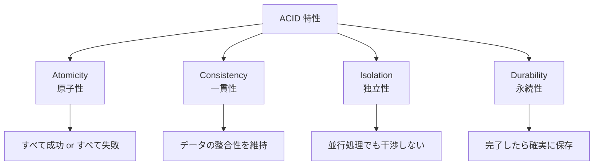
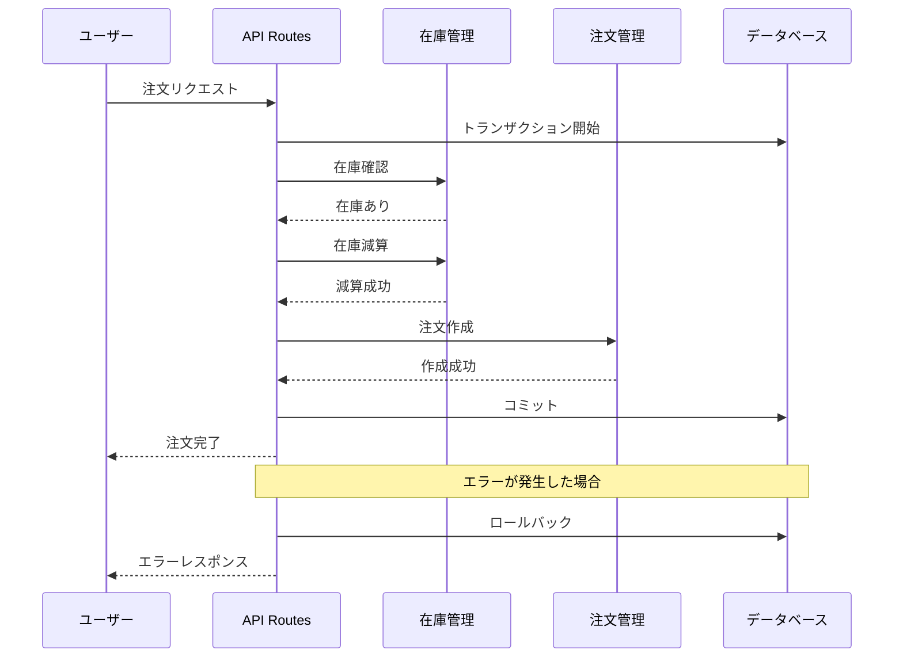
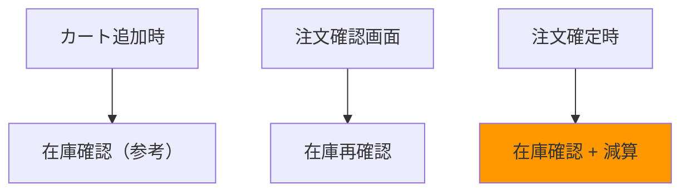
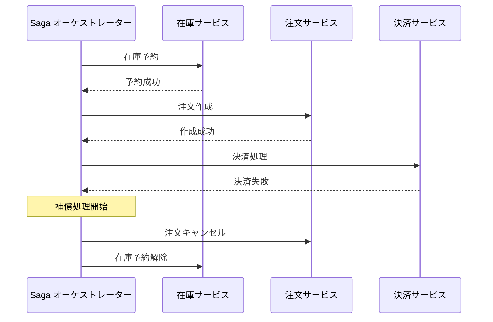

# トランザクション処理

## トランザクションとは

**トランザクション**は、複数の処理をひとまとまりとして扱い、すべて成功するか、すべて失敗するかのどちらかを保証する仕組みです。

### ACID 特性

トランザクションは以下の 4 つの特性（ACID）を満たす必要があります。



| 特性        | 説明                                         | EC サイトでの例                              |
| ----------- | -------------------------------------------- | -------------------------------------------- |
| Atomicity   | すべての処理が成功するか、すべて取り消される | 在庫減算と注文作成が両方成功/失敗            |
| Consistency | データの整合性が常に保たれる                 | 在庫数がマイナスにならない                   |
| Isolation   | 同時実行される処理が互いに干渉しない         | 同じ商品への同時注文が衝突しない             |
| Durability  | 完了した処理は永続的に保存される             | 注文完了後にサーバー停止しても注文が消えない |

---

## EC サイトでのトランザクション

### 注文処理の流れ

注文を作成する際には、複数の処理を原子的に実行する必要があります。



### トランザクションが必要な処理

| 処理           | 関連するデータ       | 失敗時の問題                         |
| -------------- | -------------------- | ------------------------------------ |
| 注文作成       | 在庫、注文、ポイント | 在庫だけ減って注文が作成されない     |
| 注文キャンセル | 在庫、注文、返金     | 在庫が戻らない                       |
| ポイント利用   | ポイント、注文       | ポイントだけ減って注文が作成されない |
| 在庫移動       | 複数の在庫レコード   | 在庫が消える                         |

---

## 実装パターン

### 1. 擬似トランザクション（補償トランザクション）

データベースのトランザクション機能を使わず、コードレベルで原子性を模倣します。

```typescript
// lib/orders/create-order.ts

type OrderResult = { success: true; order: Order } | { success: false; error: string };

export async function createOrderWithCompensation(data: CreateOrderInput): Promise<OrderResult> {
  // 1. 在庫を予約（ソフトロック）
  const reservationId = await reserveStock(data.items);

  try {
    // 2. 注文を作成
    const order = await createOrder({
      ...data,
      reservationId,
    });

    // 3. 在庫予約を確定
    await confirmStockReservation(reservationId);

    return { success: true, order };
  } catch (error) {
    // 補償処理：在庫予約をキャンセル
    await cancelStockReservation(reservationId);

    return {
      success: false,
      error: error instanceof Error ? error.message : "注文作成に失敗しました",
    };
  }
}
```

### 2. データベーストランザクション

データベースのトランザクション機能を直接使用します（Prisma の例）。

```typescript
// lib/orders/create-order.ts
import { prisma } from "@/lib/prisma";

export async function createOrderWithTransaction(data: CreateOrderInput): Promise<Order> {
  return await prisma.$transaction(async (tx) => {
    // 1. 在庫を確認・減算
    for (const item of data.items) {
      const product = await tx.product.findUnique({
        where: { id: item.productId },
      });

      if (!product || product.stock < item.quantity) {
        throw new Error(`商品 ${item.productId} の在庫が不足しています`);
      }

      await tx.product.update({
        where: { id: item.productId },
        data: { stock: { decrement: item.quantity } },
      });
    }

    // 2. 注文を作成
    const order = await tx.order.create({
      data: {
        orderNumber: generateOrderNumber(),
        userId: data.userId,
        status: "confirmed",
        items: {
          create: data.items.map((item) => ({
            productId: item.productId,
            quantity: item.quantity,
            unitPrice: item.unitPrice,
          })),
        },
        shippingAddress: {
          create: data.shippingAddress,
        },
        paymentMethod: data.paymentMethod,
        subtotal: calculateSubtotal(data.items),
        shippingFee: calculateShippingFee(data.items),
        total: calculateTotal(data.items),
      },
      include: {
        items: true,
        shippingAddress: true,
      },
    });

    return order;
  });
}
```

---

## 在庫管理

### 在庫確認のタイミング



| タイミング   | 処理内容        | 目的                               |
| ------------ | --------------- | ---------------------------------- |
| カート追加時 | 在庫数の表示    | ユーザーへの情報提供               |
| 注文確認画面 | 在庫の再確認    | 購入可能かどうかの最終確認         |
| 注文確定時   | 在庫確認 + 減算 | 実際の在庫処理（トランザクション） |

### 在庫確認の実装

```typescript
// lib/stock/check-stock.ts

type StockCheckResult = {
  isAvailable: boolean;
  unavailableItems: Array<{
    productId: string;
    requested: number;
    available: number;
  }>;
};

export async function checkStock(
  items: Array<{ productId: string; quantity: number }>
): Promise<StockCheckResult> {
  const unavailableItems: StockCheckResult["unavailableItems"] = [];

  for (const item of items) {
    const product = await getProduct(item.productId);

    if (!product || product.stock < item.quantity) {
      unavailableItems.push({
        productId: item.productId,
        requested: item.quantity,
        available: product?.stock ?? 0,
      });
    }
  }

  return {
    isAvailable: unavailableItems.length === 0,
    unavailableItems,
  };
}
```

### 在庫予約パターン

同時注文による在庫の取り合いを防ぐため、在庫を「予約」してから注文を作成します。

```typescript
// lib/stock/reserve-stock.ts

type Reservation = {
  id: string;
  items: Array<{ productId: string; quantity: number }>;
  expiresAt: Date;
};

// 在庫を予約（5分間有効）
export async function reserveStock(
  items: Array<{ productId: string; quantity: number }>
): Promise<Reservation> {
  const reservation = await prisma.stockReservation.create({
    data: {
      expiresAt: new Date(Date.now() + 5 * 60 * 1000), // 5分後
      items: {
        create: items.map((item) => ({
          productId: item.productId,
          quantity: item.quantity,
        })),
      },
    },
    include: { items: true },
  });

  // 在庫から予約分を減算
  for (const item of items) {
    await prisma.product.update({
      where: { id: item.productId },
      data: { stock: { decrement: item.quantity } },
    });
  }

  return reservation;
}

// 予約を確定（注文成功時）
export async function confirmReservation(reservationId: string): Promise<void> {
  await prisma.stockReservation.update({
    where: { id: reservationId },
    data: { status: "confirmed" },
  });
}

// 予約をキャンセル（注文失敗時・タイムアウト時）
export async function cancelReservation(reservationId: string): Promise<void> {
  const reservation = await prisma.stockReservation.findUnique({
    where: { id: reservationId },
    include: { items: true },
  });

  if (!reservation) return;

  // 在庫を戻す
  for (const item of reservation.items) {
    await prisma.product.update({
      where: { id: item.productId },
      data: { stock: { increment: item.quantity } },
    });
  }

  await prisma.stockReservation.update({
    where: { id: reservationId },
    data: { status: "cancelled" },
  });
}
```

---

## 楽観的ロック vs 悲観的ロック

### 楽観的ロック

データを読み込んでから更新するまでに、他の処理がデータを変更していないことを確認します。

```typescript
// 楽観的ロック（バージョンを使用）
export async function updateStockOptimistic(productId: string, quantity: number): Promise<void> {
  const product = await prisma.product.findUnique({
    where: { id: productId },
  });

  if (!product) throw new Error("商品が見つかりません");

  // version が変わっていたら更新失敗
  const result = await prisma.product.updateMany({
    where: {
      id: productId,
      version: product.version, // 読み込んだ時のバージョン
    },
    data: {
      stock: product.stock - quantity,
      version: { increment: 1 },
    },
  });

  if (result.count === 0) {
    throw new Error("在庫が他の処理によって更新されました。再試行してください。");
  }
}
```

### 悲観的ロック

データを読み込む時点でロックをかけ、他の処理がアクセスできないようにします。

```typescript
// 悲観的ロック（SELECT FOR UPDATE）
export async function updateStockPessimistic(productId: string, quantity: number): Promise<void> {
  await prisma.$transaction(async (tx) => {
    // FOR UPDATE でロック
    const [product] = await tx.$queryRaw<Product[]>`
      SELECT * FROM products
      WHERE id = ${productId}
      FOR UPDATE
    `;

    if (!product || product.stock < quantity) {
      throw new Error("在庫が不足しています");
    }

    await tx.product.update({
      where: { id: productId },
      data: { stock: { decrement: quantity } },
    });
  });
}
```

### 比較

| 特徴           | 楽観的ロック       | 悲観的ロック       |
| -------------- | ------------------ | ------------------ |
| ロック期間     | なし（検証時のみ） | トランザクション中 |
| 競合時         | 再試行が必要       | 待機               |
| パフォーマンス | 競合が少ないと高速 | ロック待ちが発生   |
| 適用場面       | 競合が少ない場合   | 競合が多い場合     |
| EC での用途    | 商品情報の更新     | 在庫の減算         |

---

## エラー時のロールバック

### 手動ロールバック

トランザクションを使用しない場合、エラー時に手動でロールバック処理を行います。

```typescript
export async function createOrderManualRollback(data: CreateOrderInput): Promise<Order> {
  let stockReserved = false;
  let orderId: string | null = null;

  try {
    // 1. 在庫を減算
    await decrementStock(data.items);
    stockReserved = true;

    // 2. 注文を作成
    const order = await createOrder(data);
    orderId = order.id;

    // 3. 支払い処理
    await processPayment(order);

    return order;
  } catch (error) {
    // ロールバック処理
    if (orderId) {
      await deleteOrder(orderId);
    }

    if (stockReserved) {
      await restoreStock(data.items);
    }

    throw error;
  }
}
```

### Saga パターン

複数のサービスにまたがる処理を調整するパターンです。



```typescript
// lib/orders/order-saga.ts

type SagaStep<T> = {
  execute: () => Promise<T>;
  compensate: () => Promise<void>;
};

async function executeSaga<T>(steps: SagaStep<T>[]): Promise<T[]> {
  const completedSteps: SagaStep<T>[] = [];
  const results: T[] = [];

  try {
    for (const step of steps) {
      const result = await step.execute();
      completedSteps.push(step);
      results.push(result);
    }
    return results;
  } catch (error) {
    // 逆順で補償処理を実行
    for (const step of completedSteps.reverse()) {
      await step.compensate();
    }
    throw error;
  }
}

// 使用例
const orderSaga: SagaStep<unknown>[] = [
  {
    execute: () => reserveStock(items),
    compensate: () => cancelStockReservation(reservationId),
  },
  {
    execute: () => createOrder(data),
    compensate: () => deleteOrder(orderId),
  },
  {
    execute: () => processPayment(paymentData),
    compensate: () => refundPayment(paymentId),
  },
];

await executeSaga(orderSaga);
```

---

## MSW でのモック

開発中は MSW を使用してトランザクション処理をモックします。

```typescript
// mocks/handlers/orders.ts
import { http, HttpResponse, delay } from "msw";
import { v4 as uuid } from "uuid";

// モックデータストア
const mockOrders: Order[] = [];
const mockStock: Record<string, number> = {
  "product-1": 100,
  "product-2": 50,
};

export const orderHandlers = [
  // 注文作成
  http.post("/api/orders", async ({ request }) => {
    await delay(500); // 処理時間をシミュレート

    const body = await request.json();

    // 在庫チェック（モック）
    for (const item of body.items) {
      const stock = mockStock[item.productId] ?? 0;
      if (stock < item.quantity) {
        return HttpResponse.json({ error: "在庫が不足しています" }, { status: 409 });
      }
    }

    // 在庫減算（モック）
    for (const item of body.items) {
      mockStock[item.productId] -= item.quantity;
    }

    // 注文作成（モック）
    const order: Order = {
      id: uuid(),
      orderNumber: `ORD-${Date.now()}`,
      ...body,
      status: "confirmed",
      createdAt: new Date().toISOString(),
    };

    mockOrders.push(order);

    return HttpResponse.json(order, { status: 201 });
  }),
];
```

---

## よくある間違い

### 1. トランザクションなしで複数の更新

```typescript
// ❌ 悪い例：トランザクションなし
async function createOrder(data: CreateOrderInput): Promise<Order> {
  await decrementStock(data.items); // これが成功して
  const order = await saveOrder(data); // これが失敗すると在庫だけ減る
  return order;
}

// ✅ 良い例：トランザクションで囲む
async function createOrder(data: CreateOrderInput): Promise<Order> {
  return await prisma.$transaction(async (tx) => {
    await decrementStock(tx, data.items);
    const order = await saveOrder(tx, data);
    return order;
  });
}
```

### 2. 在庫チェックと減算の間に時間差

```typescript
// ❌ 悪い例：チェックと減算の間に他の注文が入る可能性
const hasStock = await checkStock(items);
if (hasStock) {
  // ← この間に他の注文が在庫を減らすかもしれない
  await decrementStock(items);
}

// ✅ 良い例：チェックと減算を原子的に実行
await prisma.$transaction(async (tx) => {
  const product = await tx.product.findUnique({
    where: { id: productId },
  });

  if (product.stock < quantity) {
    throw new Error("在庫不足");
  }

  await tx.product.update({
    where: { id: productId },
    data: { stock: { decrement: quantity } },
  });
});
```

---

## まとめ

### トランザクションの要点

- 複数の処理を原子的に実行
- ACID 特性を理解する
- エラー時は確実にロールバック

### EC サイトでの実践

- 注文作成時は在庫減算と同時にトランザクション
- 在庫予約パターンで同時注文に対応
- 楽観的/悲観的ロックの使い分け

---

## 次のステップ

トランザクション処理を理解したら、[確認画面パターン](./04-confirmation.md) に進んで、注文確認画面の実装方法を学びましょう。
