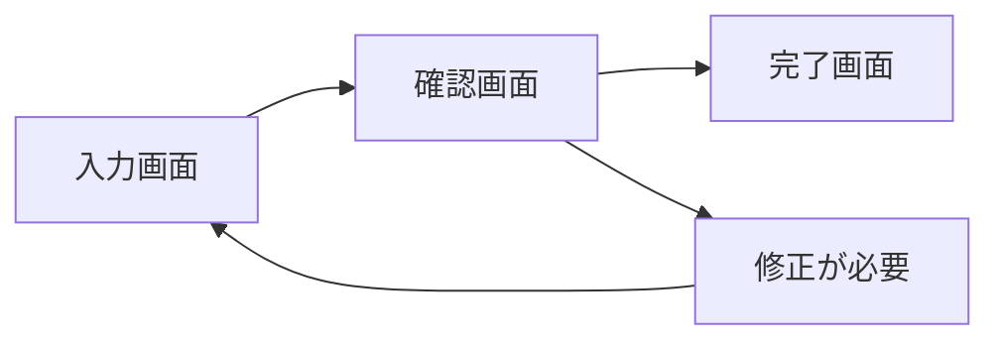
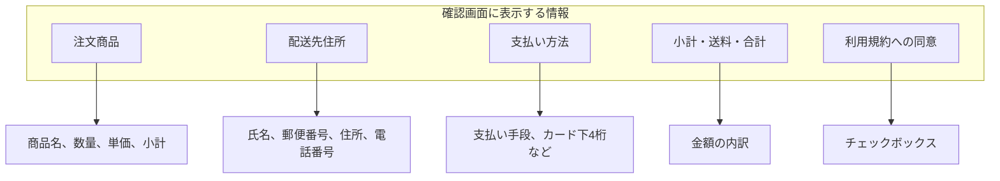
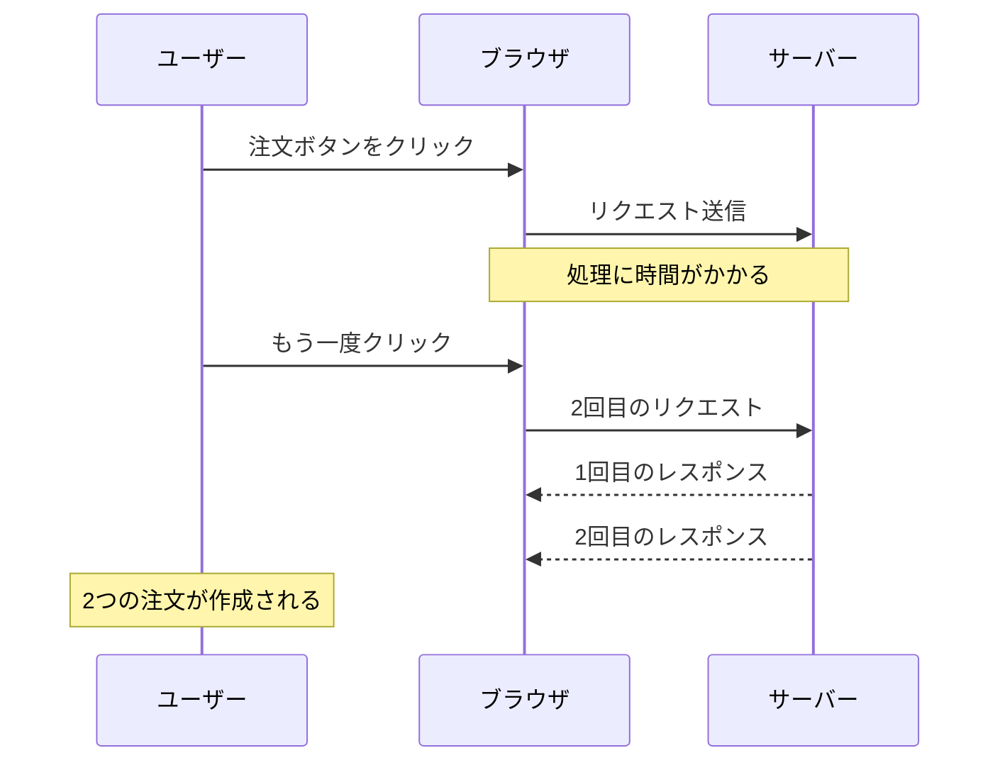
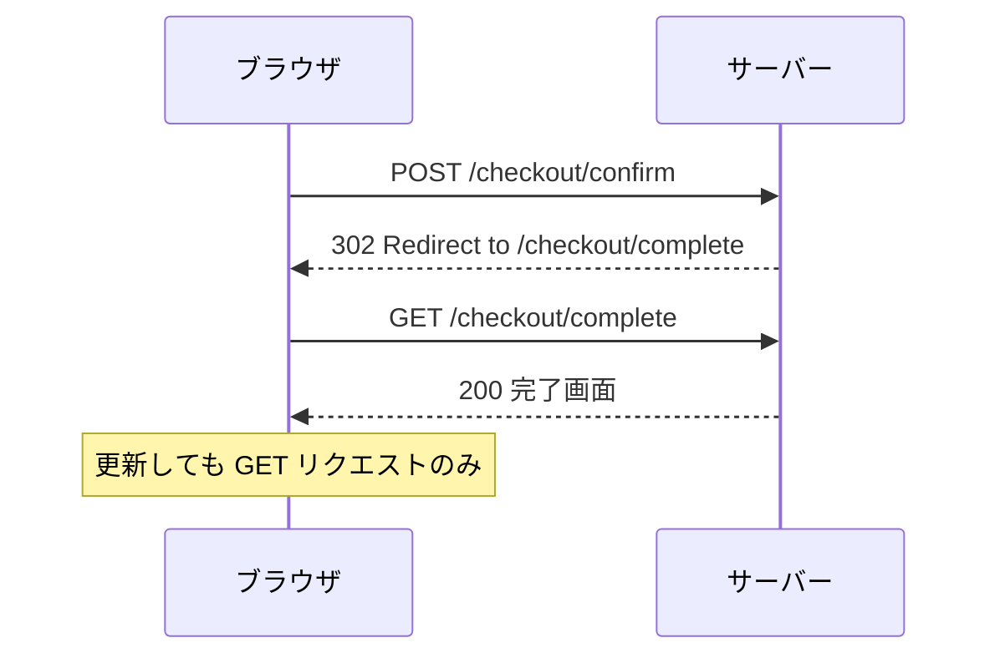
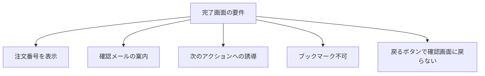

# 確認画面パターン

## 目次

- [確認画面の重要性](#確認画面の重要性)
  - [なぜ確認画面が必要か](#なぜ確認画面が必要か)
- [確認画面の UX 設計](#確認画面の-ux-設計)
  - [表示すべき情報](#表示すべき情報)
  - [レイアウト例](#レイアウト例)
- [実装パターン](#実装パターン)
  - [確認画面の Server Component](#確認画面の-server-component)
  - [注文サマリーコンポーネント](#注文サマリーコンポーネント)
- [二重送信防止](#二重送信防止)
  - [なぜ二重送信が発生するか](#なぜ二重送信が発生するか)
  - [対策 1: ボタンの無効化](#対策-1-ボタンの無効化)
  - [対策 2: トークンによる重複チェック](#対策-2-トークンによる重複チェック)
  - [対策 3: 冪等キー](#対策-3-冪等キー)
- [Post-Redirect-Get パターン](#post-redirect-get-パターン)
  - [PRG パターンとは](#prg-パターンとは)
  - [Server Actions での実装](#server-actions-での実装)
- [完了画面への遷移](#完了画面への遷移)
  - [完了画面の要件](#完了画面の要件)
  - [完了画面の実装](#完了画面の実装)
  - [完了後のクリーンアップ](#完了後のクリーンアップ)
- [よくある間違い](#よくある間違い)
  - [1. 確認画面で GET リクエストを使う](#1-確認画面で-get-リクエストを使う)
  - [2. 完了画面に直接アクセスできてしまう](#2-完了画面に直接アクセスできてしまう)
  - [3. 完了後にカート状態が残っている](#3-完了後にカート状態が残っている)
- [まとめ](#まとめ)
  - [確認画面の要点](#確認画面の要点)
  - [二重送信防止](#二重送信防止-1)
  - [PRG パターン](#prg-パターン)
- [次のステップ](#次のステップ)

## 確認画面の重要性

**確認画面**は、ユーザーが入力した情報を最終確認し、注文を確定する前に間違いを修正する機会を提供する画面です。

### なぜ確認画面が必要か



- **ユーザー体験の向上** - 注文内容を確認でき、安心感を与える
- **エラー防止** - 間違いを事前に発見・修正できる
- **法的要件** - 特定商取引法で注文内容の確認が義務付けられている
- **二重注文防止** - 意図しない重複注文を防ぐ

---

## 確認画面の UX 設計

### 表示すべき情報



### レイアウト例

| セクション     | 内容                      | 編集リンク   |
| -------------- | ------------------------- | ------------ |
| 注文商品       | 商品一覧と小計            | カートへ戻る |
| 配送先         | 氏名、住所、電話番号      | 配送先を変更 |
| 支払い方法     | クレジットカード（下4桁） | 支払いを変更 |
| 合計金額       | 小計 + 送料 = 合計        | -            |
| 利用規約       | 同意チェックボックス      | -            |
| 注文確定ボタン | 「注文を確定する」        | -            |

---

## 実装パターン

### 確認画面の Server Component

```tsx
// app/checkout/confirm/page.tsx
import { redirect } from "next/navigation";
import { getCheckoutData } from "@/lib/checkout";
import { ConfirmationForm } from "./ConfirmationForm";
import { OrderSummary } from "./OrderSummary";

export default async function ConfirmPage(): Promise<JSX.Element> {
  // チェックアウトデータを取得
  const checkoutData = await getCheckoutData();

  // データが不完全な場合はリダイレクト
  if (!checkoutData.cart || checkoutData.cart.length === 0) {
    redirect("/cart");
  }

  if (!checkoutData.shippingAddress) {
    redirect("/checkout/shipping");
  }

  if (!checkoutData.paymentMethod) {
    redirect("/checkout/payment");
  }

  return (
    <div className="mx-auto max-w-3xl p-4">
      <h1 className="mb-6 text-2xl font-bold">注文内容の確認</h1>

      {/* 注文内容のサマリー */}
      <OrderSummary
        cart={checkoutData.cart}
        shippingAddress={checkoutData.shippingAddress}
        paymentMethod={checkoutData.paymentMethod}
      />

      {/* 確認フォーム（規約同意と送信ボタン） */}
      <ConfirmationForm checkoutData={checkoutData} />
    </div>
  );
}
```

### 注文サマリーコンポーネント

```tsx
// app/checkout/confirm/OrderSummary.tsx
import Link from "next/link";
import { type CartItem, type ShippingAddress, type PaymentMethod } from "@ec/validators/checkout";

type Props = {
  cart: CartItem[];
  shippingAddress: ShippingAddress;
  paymentMethod: PaymentMethod;
};

export function OrderSummary({ cart, shippingAddress, paymentMethod }: Props): JSX.Element {
  const subtotal = cart.reduce((sum, item) => sum + item.price * item.quantity, 0);
  const shippingFee = subtotal >= 5000 ? 0 : 500;
  const total = subtotal + shippingFee;

  return (
    <div className="space-y-6">
      {/* 注文商品 */}
      <section className="rounded-lg border p-4">
        <div className="mb-4 flex items-center justify-between">
          <h2 className="text-lg font-semibold">注文商品</h2>
          <Link
            href="/cart"
            className="text-sm text-blue-600 hover:underline"
          >
            変更する
          </Link>
        </div>

        <ul className="divide-y">
          {cart.map((item) => (
            <li
              key={item.productId}
              className="flex items-center justify-between py-3"
            >
              <div>
                <p className="font-medium">{item.name}</p>
                <p className="text-sm text-gray-500">
                  ¥{item.price.toLocaleString()} × {item.quantity}
                </p>
              </div>
              <p className="font-medium">¥{(item.price * item.quantity).toLocaleString()}</p>
            </li>
          ))}
        </ul>
      </section>

      {/* 配送先 */}
      <section className="rounded-lg border p-4">
        <div className="mb-4 flex items-center justify-between">
          <h2 className="text-lg font-semibold">配送先</h2>
          <Link
            href="/checkout/shipping"
            className="text-sm text-blue-600 hover:underline"
          >
            変更する
          </Link>
        </div>

        <address className="text-gray-700 not-italic">
          <p>{shippingAddress.name}</p>
          <p>〒{shippingAddress.postalCode}</p>
          <p>
            {shippingAddress.prefecture}
            {shippingAddress.city}
            {shippingAddress.address1}
          </p>
          {shippingAddress.address2 && <p>{shippingAddress.address2}</p>}
          <p>TEL: {shippingAddress.phone}</p>
        </address>
      </section>

      {/* 支払い方法 */}
      <section className="rounded-lg border p-4">
        <div className="mb-4 flex items-center justify-between">
          <h2 className="text-lg font-semibold">支払い方法</h2>
          <Link
            href="/checkout/payment"
            className="text-sm text-blue-600 hover:underline"
          >
            変更する
          </Link>
        </div>

        <p className="text-gray-700">{formatPaymentMethod(paymentMethod)}</p>
      </section>

      {/* 合計金額 */}
      <section className="rounded-lg border bg-gray-50 p-4">
        <h2 className="mb-4 text-lg font-semibold">お支払い金額</h2>

        <dl className="space-y-2">
          <div className="flex justify-between">
            <dt>小計</dt>
            <dd>¥{subtotal.toLocaleString()}</dd>
          </div>
          <div className="flex justify-between">
            <dt>送料</dt>
            <dd>{shippingFee === 0 ? "無料" : `¥${shippingFee.toLocaleString()}`}</dd>
          </div>
          <div className="flex justify-between border-t pt-2 text-lg font-bold">
            <dt>合計</dt>
            <dd>¥{total.toLocaleString()}</dd>
          </div>
        </dl>
      </section>
    </div>
  );
}

function formatPaymentMethod(method: PaymentMethod): string {
  switch (method.type) {
    case "credit_card":
      return `クレジットカード（**** **** **** ${method.cardNumber.slice(-4)}）`;
    case "bank_transfer":
      return "銀行振込";
    case "cash_on_delivery":
      return "代金引換";
  }
}
```

---

## 二重送信防止

### なぜ二重送信が発生するか



### 対策 1: ボタンの無効化

```tsx
// app/checkout/confirm/ConfirmationForm.tsx
"use client";

import { useActionState } from "react";
import { placeOrder } from "./actions";

export function ConfirmationForm({ checkoutData }): JSX.Element {
  const [state, formAction, isPending] = useActionState(placeOrder, null);

  return (
    <form action={formAction}>
      {/* 利用規約への同意 */}
      <label className="flex items-center gap-2">
        <input
          type="checkbox"
          name="agreedToTerms"
          required
          disabled={isPending}
        />
        <span>
          <a
            href="/terms"
            className="text-blue-600 hover:underline"
            target="_blank"
          >
            利用規約
          </a>
          に同意する
        </span>
      </label>

      {/* エラー表示 */}
      {state?.error && <p className="mt-4 text-red-600">{state.error}</p>}

      {/* 送信ボタン */}
      <button
        type="submit"
        disabled={isPending}
        className={`mt-6 w-full rounded-lg py-3 text-lg font-bold text-white ${
          isPending ? "cursor-not-allowed bg-gray-400" : "bg-orange-500 hover:bg-orange-600"
        } `}
      >
        {isPending ? "処理中..." : "注文を確定する"}
      </button>
    </form>
  );
}
```

### 対策 2: トークンによる重複チェック

```typescript
// app/checkout/confirm/actions.ts
"use server";

import { redirect } from "next/navigation";
import { cookies } from "next/headers";
import { v4 as uuid } from "uuid";

type OrderResult = {
  error?: string;
};

export async function placeOrder(
  prevState: OrderResult | null,
  formData: FormData
): Promise<OrderResult> {
  const cookieStore = await cookies();

  // 1. トークンを取得
  const submittedToken = formData.get("orderToken") as string;
  const savedToken = cookieStore.get("orderToken")?.value;

  // 2. トークンが一致しない場合は二重送信
  if (!submittedToken || submittedToken !== savedToken) {
    return { error: "この注文は既に処理されています" };
  }

  // 3. トークンを無効化（使用済みにする）
  cookieStore.delete("orderToken");

  try {
    // 注文処理
    const order = await createOrder(/* ... */);

    // 新しいトークンを発行（次回用）
    const newToken = uuid();
    cookieStore.set("orderToken", newToken, {
      httpOnly: true,
      secure: true,
      sameSite: "strict",
    });

    redirect(`/checkout/complete?orderId=${order.id}`);
  } catch (error) {
    return { error: "注文の処理に失敗しました" };
  }
}
```

### 対策 3: 冪等キー

```typescript
// 冪等キーを使用した API
export async function POST(request: NextRequest): Promise<NextResponse> {
  const idempotencyKey = request.headers.get("Idempotency-Key");

  if (!idempotencyKey) {
    return NextResponse.json({ error: "Idempotency-Key ヘッダーが必要です" }, { status: 400 });
  }

  // 既に処理済みのキーかチェック
  const existingOrder = await getOrderByIdempotencyKey(idempotencyKey);
  if (existingOrder) {
    // 同じ注文を返す（二重送信として処理）
    return NextResponse.json(existingOrder);
  }

  // 新規注文として処理
  const order = await createOrder({
    idempotencyKey,
    // ...
  });

  return NextResponse.json(order, { status: 201 });
}
```

---

## Post-Redirect-Get パターン

### PRG パターンとは

フォーム送信後にリダイレクトを行い、ブラウザの更新で再送信されることを防ぐパターンです。



### Server Actions での実装

```typescript
// app/checkout/confirm/actions.ts
"use server";

import { redirect } from "next/navigation";

export async function placeOrder(prevState: unknown, formData: FormData): Promise<never> {
  // バリデーション
  const agreedToTerms = formData.get("agreedToTerms") === "on";
  if (!agreedToTerms) {
    throw new Error("利用規約への同意が必要です");
  }

  // 注文処理
  const order = await createOrder(/* ... */);

  // PRG パターン：完了ページにリダイレクト
  redirect(`/checkout/complete?orderId=${order.id}`);
}
```

---

## 完了画面への遷移

### 完了画面の要件



### 完了画面の実装

```tsx
// app/checkout/complete/page.tsx
import { redirect } from "next/navigation";
import Link from "next/link";
import { getOrder } from "@/lib/orders";

type Props = {
  searchParams: Promise<{ orderId?: string }>;
};

export default async function CompletePage({ searchParams }: Props): Promise<JSX.Element> {
  const { orderId } = await searchParams;

  if (!orderId) {
    redirect("/");
  }

  const order = await getOrder(orderId);

  if (!order) {
    redirect("/");
  }

  return (
    <div className="mx-auto max-w-2xl p-4 text-center">
      <div className="mb-6 text-6xl">🎉</div>

      <h1 className="mb-4 text-2xl font-bold">ご注文ありがとうございます</h1>

      <div className="mb-8 rounded-lg bg-gray-50 p-6">
        <p className="mb-2 text-gray-600">注文番号</p>
        <p className="text-2xl font-bold">{order.orderNumber}</p>
      </div>

      <p className="mb-8 text-gray-600">
        ご注文確認メールを {order.email} にお送りしました。
        <br />
        メールが届かない場合は、迷惑メールフォルダをご確認ください。
      </p>

      <div className="flex flex-col gap-4">
        <Link
          href={`/orders/${order.id}`}
          className="rounded-lg bg-blue-500 px-6 py-3 text-white hover:bg-blue-600"
        >
          注文詳細を確認する
        </Link>

        <Link
          href="/"
          className="text-blue-600 hover:underline"
        >
          トップページに戻る
        </Link>
      </div>
    </div>
  );
}
```

### 完了後のクリーンアップ

```tsx
// app/checkout/complete/ClearCheckoutState.tsx
"use client";

import { useEffect } from "react";
import { useSetAtom } from "jotai";
import { RESET } from "jotai/utils";
import { cartAtom, shippingAddressAtom, paymentMethodAtom } from "@ec/store/checkout";

export function ClearCheckoutState(): null {
  const setCart = useSetAtom(cartAtom);
  const setShipping = useSetAtom(shippingAddressAtom);
  const setPayment = useSetAtom(paymentMethodAtom);

  useEffect(() => {
    // チェックアウト状態をクリア
    setCart(RESET);
    setShipping(RESET);
    setPayment(RESET);
  }, [setCart, setShipping, setPayment]);

  return null;
}

// page.tsx で使用
export default async function CompletePage(): Promise<JSX.Element> {
  // ...

  return (
    <div>
      <ClearCheckoutState />
      {/* 完了画面の内容 */}
    </div>
  );
}
```

---

## よくある間違い

### 1. 確認画面で GET リクエストを使う

```typescript
// ❌ 悪い例：GET で注文を確定
// URL: /checkout/complete?confirm=true
export default async function CompletePage({ searchParams }): Promise<JSX.Element> {
  if (searchParams.confirm) {
    await placeOrder(); // GET リクエストで副作用
  }
}

// ✅ 良い例：POST で注文を確定し、リダイレクト
export async function placeOrder(): Promise<never> {
  const order = await createOrder();
  redirect(`/checkout/complete?orderId=${order.id}`);
}
```

### 2. 完了画面に直接アクセスできてしまう

```typescript
// ❌ 悪い例：パラメータなしでもアクセス可能
export default async function CompletePage(): Promise<JSX.Element> {
  return <div>注文が完了しました</div>;
}

// ✅ 良い例：注文 ID がない場合はリダイレクト
export default async function CompletePage({
  searchParams,
}: Props): Promise<JSX.Element> {
  const { orderId } = await searchParams;

  if (!orderId) {
    redirect("/");
  }

  const order = await getOrder(orderId);
  if (!order) {
    redirect("/");
  }

  return <div>注文番号: {order.orderNumber}</div>;
}
```

### 3. 完了後にカート状態が残っている

```typescript
// ❌ 悪い例：完了後もカートにアイテムが残る

// ✅ 良い例：完了時にカートをクリア
useEffect(() => {
  // 注文完了時にカートをクリア
  clearCart();
}, []);
```

---

## まとめ

### 確認画面の要点

- 注文内容を明確に表示
- 各項目に「変更する」リンクを設置
- 利用規約への同意を求める
- 注文ボタンは目立つように

### 二重送信防止

- ボタンの無効化（isPending）
- トークンによる重複チェック
- 冪等キーの使用

### PRG パターン

- POST → Redirect → GET
- ブラウザ更新での再送信を防止

---

## 次のステップ

確認画面パターンを理解したら、[演習 1: カート確認](./exercises/01-cart-confirm.md) に進んで、購入フローの実装を始めましょう。
