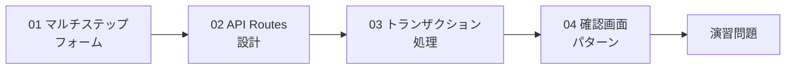
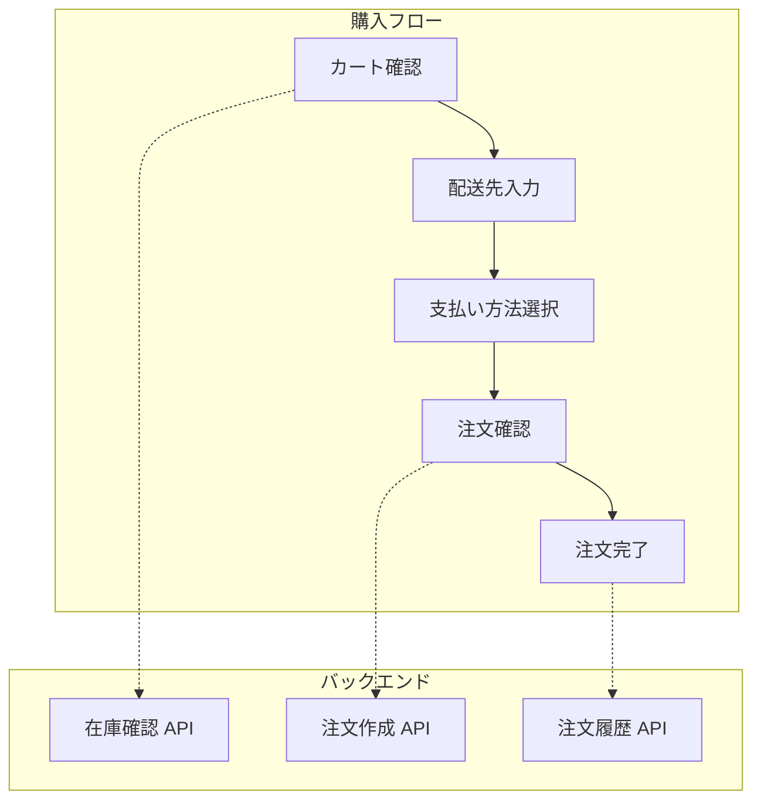
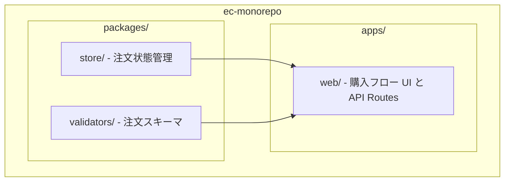

# Phase 9: 注文フロー + API Routes

## 目次

- [概要](#概要)
- [難易度](#難易度)
- [所要時間目安](#所要時間目安)
- [前提知識](#前提知識)
- [学習目標](#学習目標)
- [目次](#目次-1)
  - [学習フロー](#学習フロー)
- [演習問題](#演習問題)
  - [購入フロー全体像](#購入フロー全体像)
- [作業場所](#作業場所)
- [使用ツール](#使用ツール)
- [関連する EC サイト機能](#関連する-ec-サイト機能)
- [推奨学習リソース](#推奨学習リソース)
  - [公式ドキュメント](#公式ドキュメント)
  - [参考記事](#参考記事)
- [自己チェックリスト](#自己チェックリスト)
- [次のフェーズ](#次のフェーズ)

## 概要

複雑なマルチステップの注文フローと API 設計を習得するフェーズです。
EC サイトの購入フロー（カート確認 → 配送先入力 → 支払い方法選択 → 注文確認 → 注文完了）を実装しながら、実践的な API 設計とトランザクション処理を学びます。

---

## 難易度

難易度: 4/5（中上級）

フォーム、状態管理、認証の知識を総合的に活用するフェーズです。

---

## 所要時間目安

約 8〜10 時間です。

---

## 前提知識

- Phase 7（フォーム + Server Actions）を完了していること
- Phase 8（認証機能）を完了していること
- Zod によるバリデーションを理解していること
- Jotai による状態管理を理解していること

---

## 学習目標

このフェーズを完了すると、以下ができるようになります。

- [ ] マルチステップフォームの設計と実装ができる
- [ ] Next.js の Route Handlers で API を設計できる
- [ ] トランザクション的な処理の考え方を理解している
- [ ] 確認画面パターンを適切に実装できる
- [ ] 二重送信防止の対策を実装できる
- [ ] 購入フロー全体を一貫して実装できる

---

## 目次

1. [マルチステップフォーム](./01-multi-step-form.md)
2. [API Routes 設計](./02-api-routes.md)
3. [トランザクション処理](./03-transaction.md)
4. [確認画面パターン](./04-confirmation.md)

### 学習フロー

---

## 演習問題

購入フローの各ステップを順番に実装します。

- [演習 1: カート確認](./exercises/01-cart-confirm.md)
- [演習 2: 配送先入力](./exercises/02-shipping.md)
- [演習 3: 支払い方法選択](./exercises/03-payment.md)
- [演習 4: 注文確認](./exercises/04-order-confirm.md)
- [演習 5: 注文完了](./exercises/05-order-complete.md)

### 購入フロー全体像

---

## 作業場所

このフェーズでは主に以下のディレクトリで作業します。

- `apps/web/app/checkout/` - 購入フローのページ
- `apps/web/app/api/orders/` - 注文関連の API Routes
- `packages/store/` - 注文状態の Atom
- `packages/validators/` - 注文データのスキーマ

---

## 使用ツール

| ツール         | バージョン | 用途               |
| -------------- | ---------- | ------------------ |
| Next.js        | 16+        | Route Handlers     |
| Zod            | 4.x        | バリデーション     |
| Jotai          | 2.x        | 注文フロー状態管理 |
| Server Actions | -          | フォーム送信処理   |

---

## 関連する EC サイト機能

このフェーズで学ぶ内容は、以下の EC 機能に直接関連します。

| EC 機能        | 実装内容               | 使用技術                      |
| -------------- | ---------------------- | ----------------------------- |
| カート確認画面 | カート内容の表示と編集 | Jotai, Server Components      |
| 配送先入力     | 住所フォームと保存     | Zod, Server Actions           |
| 支払い方法選択 | 支払い手段の選択       | Jotai, フォーム               |
| 注文確認画面   | 注文内容の最終確認     | 確認画面パターン              |
| 注文完了       | 注文処理と完了画面     | API Routes, トランザクション  |
| 注文履歴       | 過去の注文一覧と詳細   | API Routes, Server Components |

---

## 推奨学習リソース

### 公式ドキュメント

- [Next.js Route Handlers](https://nextjs.org/docs/app/building-your-application/routing/route-handlers)
- [Next.js Server Actions](https://nextjs.org/docs/app/building-your-application/data-fetching/server-actions-and-mutations)

### 参考記事

- [マルチステップフォームの設計パターン](https://zenn.dev/topics/react)
- [EC サイトの購入フロー UX 設計](https://zenn.dev/topics/ux)

---

## 自己チェックリスト

Phase 9 を完了する前に、以下を確認してください。

- [ ] マルチステップフォームの状態管理方法を理解している
- [ ] Route Handlers で RESTful API を設計できる
- [ ] トランザクション的な処理の考え方を説明できる
- [ ] 確認画面パターンを実装できる
- [ ] 二重送信防止を実装できる
- [ ] カート確認 → 注文完了までのフローが動作している
- [ ] 注文履歴 API が動作している

---

## 次のフェーズ

Phase 9 を完了したら、[Phase 10: パフォーマンス最適化](../phase-10-performance/README.md) に進みましょう。
