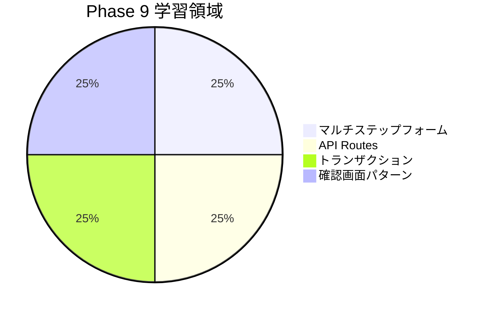

# Phase 9: 自己チェックリスト

## 目次

- [学習領域の概要](#学習領域の概要)
- [マルチステップフォーム](#マルチステップフォーム)
  - [理解度チェック](#理解度チェック)
  - [確認質問](#確認質問)
- [API Routes](#api-routes)
  - [理解度チェック](#理解度チェック-1)
  - [確認質問](#確認質問-1)
- [トランザクション処理](#トランザクション処理)
  - [理解度チェック](#理解度チェック-2)
  - [確認質問](#確認質問-2)
- [確認画面パターン](#確認画面パターン)
  - [理解度チェック](#理解度チェック-3)
  - [確認質問](#確認質問-3)
- [実践確認](#実践確認)
  - [購入フローの動作確認](#購入フローの動作確認)
  - [操作確認](#操作確認)
- [総合評価](#総合評価)
- [よくある質問](#よくある質問)
  - [Q: Server Actions と API Routes はどちらを使うべきか](#q-server-actions-と-api-routes-はどちらを使うべきか)
  - [Q: トランザクション処理はフロントエンドで考える必要があるか](#q-トランザクション処理はフロントエンドで考える必要があるか)
  - [Q: 本番環境でカード情報を扱うにはどうすればよいか](#q-本番環境でカード情報を扱うにはどうすればよいか)
- [振り返り](#振り返り)
  - [学んだこと](#学んだこと)
- [次のステップ](#次のステップ)

## 学習領域の概要

***

## マルチステップフォーム

### 理解度チェック

- [ ] マルチステップフォームの利点を説明できる
- [ ] URLパラメータ方式とJotai方式の違いを理解している
- [ ] ステップ間のナビゲーションを実装できる
- [ ] 前のステップの完了を確認してから次に進む実装ができる
- [ ] 入力途中のデータを永続化できる

### 確認質問

1. マルチステップフォームを採用する理由は何ですか？

   **回答例**: 長いフォームを分割することで認知負荷を軽減し、進捗の可視化によりユーザーの離脱率を低減できる。ステップごとにバリデーションを行えるため、エラー処理も容易になる。

2. URLパラメータ方式とJotai方式のハイブリッド管理とは何ですか？

   **回答例**: URLでステップを管理し（/checkout/shipping, /checkout/paymentなど）、JotaiのAtomでフォームデータを管理する方式。ブラウザの戻る/進むボタンが自然に動作し、データの受け渡しもシンプルになる。

***

## API Routes

### 理解度チェック

- [ ] Route Handlersの基本的な使い方を理解している
- [ ] GET, POST, PATCH, DELETEの各メソッドを実装できる
- [ ] 動的ルート（`[id]`）を使用できる
- [ ] クエリパラメータを取得できる
- [ ] Zodでリクエストボディをバリデーションできる
- [ ] 用途に応じたHTTPステータスコードを返せる

### 確認質問

1. Server ActionsとRoute Handlersの違いは何ですか？

   **回答例**: Server Actionsはフォーム送信などコンポーネントから直接呼び出す処理向けである。Route HandlersはRESTful APIエンドポイントとして外部からもアクセス可能。Server ActionsはPOSTのみだが、Route HandlersはすべてのHTTPメソッドをサポートする。

2. 注文作成APIで必要なセキュリティ対策は何ですか？

   **回答例**: 認証チェック（Cookieからセッションを検証）、リクエストボディのバリデーション（Zodでスキーマ検証）、在庫の確認と予約、エラー時に機密情報を露出しないハンドリングなどが必要である。

***

## トランザクション処理

### 理解度チェック

- [ ] ACID特性を説明できる
- [ ] 在庫確認と減算を原子的に行う必要性を理解している
- [ ] 楽観的ロックと悲観的ロックの違いを説明できる
- [ ] エラー時のロールバック処理を実装できる
- [ ] 在庫予約パターンを理解している

### 確認質問

1. トランザクションのACID特性とは何ですか？

   **回答例**: 以下の4つの特性を指す。

   - Atomicity（原子性）: すべての処理が成功するか、すべて取り消される
   - Consistency（一貫性）: データの整合性が常に保たれる
   - Isolation（独立性）: 同時実行される処理が互いに干渉しない
   - Durability（永続性）: 完了した処理は永続的に保存される

2. 在庫予約パターンはなぜ必要ですか？

   **回答例**: 在庫確認から注文確定までの間に他のユーザーの注文で売り切れる可能性がある。在庫を一時的に予約し、注文処理が成功したら確定、失敗したらキャンセルすることで、競合を防ぐ。

***

## 確認画面パターン

### 理解度チェック

- [ ] 確認画面に表示すべき情報を理解している
- [ ] 二重送信防止の実装方法を理解している
- [ ] Post-Redirect-Getパターンを説明できる
- [ ] 利用規約への同意を求める実装ができる
- [ ] 完了画面へのリダイレクトを実装できる

### 確認質問

1. 二重送信を防止する方法を3つ挙げてください。

   **回答例**:

   1. ボタンの無効化（isPending中はdisabled）
   2. トークンによる重複チェック（一度使用したトークンは無効化）
   3. 冪等キー（Idempotency-Keyヘッダー）の使用

2. Post-Redirect-Getパターンとは何ですか？

   **回答例**: フォーム送信（POST）後にリダイレクト（302）を行い、完了ページをGETで表示するパターン。ブラウザの更新ボタンを押してもPOSTが再実行されず、二重送信を防止できる。

***

## 実践確認

### 購入フローの動作確認

- [ ] カート確認画面で商品一覧が表示される
- [ ] 数量変更・削除が正しく動作する
- [ ] 配送先入力のバリデーションが動作する
- [ ] 支払い方法を選択できる
- [ ] 注文確認画面ですべての情報が表示される
- [ ] 利用規約に同意しないと注文できない
- [ ] 注文確定後に完了画面が表示される
- [ ] 完了後にカートがクリアされる
- [ ] 注文履歴に新しい注文が表示される

### 操作確認

- [ ] `pnpm dev` でエラーなく起動する
- [ ] 購入フロー全体を通して動作する
- [ ] ブラウザの戻る/進むボタンが正しく動作する
- [ ] ページを更新しても入力データが保持される

***

## 総合評価

| 達成率       | 評価                     |
| --------- | ---------------------- |
| 90% 以上    | 次フェーズに進みましょう           |
| 70% - 89% | 良好。不安な部分を復習してから進みましょう  |
| 50% - 69% | 理解が不十分な箇所があります。復習が必要です |
| 50% 未満    | もう一度ドキュメントを読み直しましょう    |

***

## よくある質問

### Q: Server Actions と API Routes はどちらを使うべきか

**A**: 用途によって使い分けます。フォーム送信やコンポーネントからの直接呼び出しにはServer Actionsを使用します。外部からもアクセス可能なAPIが必要な場合や、すべてのHTTPメソッドを使いたい場合はRoute Handlersを使用します。

### Q: トランザクション処理はフロントエンドで考える必要があるか

**A**: トランザクション自体はバックエンド（データベース）で処理しますが、フロントエンド開発者も以下の点を理解しておく必要があります。

- 処理が失敗した場合のエラーハンドリング
- 楽観的更新とロールバック
- 二重送信防止

### Q: 本番環境でカード情報を扱うにはどうすればよいか

**A**: PCI DSS準拠が必要なため、Stripe、PAY.JPなどの決済代行サービスを使用することを強くお勧めします。カード情報を直接サーバーで扱わず、トークン化して処理することでセキュリティリスクを軽減できます。

***

## 振り返り

### 学んだこと

Phase 9を通じて、以下のスキルを習得しました。

1. **マルチステップフォームの設計**
   - 状態管理のアプローチ（URL + Jotaiのハイブリッド）
   - ステップ間のナビゲーションと遷移制御

2. **API Routes の設計**
   - RESTfulなエンドポイント設計
   - リクエストのバリデーションとエラーハンドリング

3. **トランザクション処理**
   - ACID特性の理解
   - 在庫管理と注文処理の原子性

4. **確認画面パターン**
   - 二重送信防止
   - Post-Redirect-Getパターン

***

## 次のステップ

Phase 9を完了したら、[Phase 10: パフォーマンス最適化](../phase-10-performance/README.md) に進みましょう。

Phase 10では、以下の内容を学びます。

- StreamingとSuspenseの活用
- 画像の最適化
- 動的インポート
- Parallel / Intercepting Routes
- Core Web Vitalsの改善
