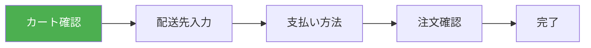

# 演習 1: カート確認画面

## 目次

- [目標](#目標)
- [完成イメージ](#完成イメージ)
- [前提条件](#前提条件)
- [ステップ 1: カート確認ページの作成](#ステップ-1-カート確認ページの作成)
  - [1.1 ページファイルの作成](#11-ページファイルの作成)
  - [1.2 カート内容コンポーネント](#12-カート内容コンポーネント)
- [ステップ 2: 数量変更機能](#ステップ-2-数量変更機能)
  - [2.1 数量変更コンポーネント](#21-数量変更コンポーネント)
  - [2.2 カート操作用の Atom](#22-カート操作用の-atom)
- [ステップ 3: 削除機能](#ステップ-3-削除機能)
- [ステップ 4: サマリーとアクション](#ステップ-4-サマリーとアクション)
  - [4.1 カートサマリー](#41-カートサマリー)
  - [4.2 アクションボタン](#42-アクションボタン)
- [ステップ 5: 在庫確認（オプション）](#ステップ-5-在庫確認オプション)
- [確認ポイント](#確認ポイント)
- [よくある問題](#よくある問題)
  - [1. カートが空になっても画面が更新されない](#1-カートが空になっても画面が更新されない)
  - [2. 数量変更後に小計が更新されない](#2-数量変更後に小計が更新されない)
- [次の演習](#次の演習)

## 目標

購入フローの最初のステップとして、カート内容を確認し、数量変更や削除ができる画面を実装します。



***

## 完成イメージ

```text
┌─────────────────────────────────────────────┐
│  ショッピングカート                          │
├─────────────────────────────────────────────┤
│  ┌─────┐  商品名 A                          │
│  │ 画像 │  ¥1,000                           │
│  └─────┘  [−] 2 [+]  小計: ¥2,000  [削除]   │
├─────────────────────────────────────────────┤
│  ┌─────┐  商品名 B                          │
│  │ 画像 │  ¥500                             │
│  └─────┘  [−] 1 [+]  小計: ¥500    [削除]   │
├─────────────────────────────────────────────┤
│                           小計: ¥2,500      │
│                           送料: ¥500        │
│                           合計: ¥3,000      │
├─────────────────────────────────────────────┤
│          [買い物を続ける]  [レジに進む]      │
└─────────────────────────────────────────────┘
```

***

## 前提条件

- Phase 4 で実装したカート機能（Jotai Atom）が動作していること
- カートに商品が追加できること

***

## ステップ 1: カート確認ページの作成

### 1.1 ページファイルの作成

```tsx
// apps/web/app/checkout/cart/page.tsx
import { CartContent } from "./CartContent";
import { CartSummary } from "./CartSummary";
import { CartActions } from "./CartActions";

export const metadata = {
  title: "ショッピングカート",
};

export default function CartPage(): JSX.Element {
  return (
    <div className="mx-auto max-w-4xl p-4">
      <h1 className="mb-6 text-2xl font-bold">ショッピングカート</h1>

      <div className="grid gap-6 lg:grid-cols-3">
        {/* カート内容（左側） */}
        <div className="lg:col-span-2">
          <CartContent />
        </div>

        {/* サマリー（右側） */}
        <div>
          <CartSummary />
          <CartActions />
        </div>
      </div>
    </div>
  );
}
```

### 1.2 カート内容コンポーネント

```tsx
// apps/web/app/checkout/cart/CartContent.tsx
"use client";

import Image from "next/image";
import { useAtom } from "jotai";
import { cartItemsAtom } from "@ec/store/cart";
import { QuantityControl } from "./QuantityControl";
import { RemoveButton } from "./RemoveButton";

export function CartContent(): JSX.Element {
  const [cartItems] = useAtom(cartItemsAtom);

  if (cartItems.length === 0) {
    return (
      <div className="rounded-lg border p-8 text-center">
        <p className="mb-4 text-gray-500">カートに商品がありません</p>
        <a
          href="/products"
          className="text-blue-600 hover:underline"
        >
          商品を探す
        </a>
      </div>
    );
  }

  return (
    <ul className="divide-y rounded-lg border">
      {cartItems.map((item) => (
        <li
          key={item.productId}
          className="flex gap-4 p-4"
        >
          {/* 商品画像 */}
          <div className="relative h-24 w-24 shrink-0">
            <Image
              src={item.imageUrl}
              alt={item.name}
              fill
              className="rounded-md object-cover"
            />
          </div>

          {/* 商品情報 */}
          <div className="flex flex-1 flex-col justify-between">
            <div>
              <h3 className="font-medium">{item.name}</h3>
              <p className="text-gray-600">¥{item.price.toLocaleString()}</p>
            </div>

            <div className="flex items-center justify-between">
              <QuantityControl
                productId={item.productId}
                quantity={item.quantity}
              />
              <p className="font-medium">小計: ¥{(item.price * item.quantity).toLocaleString()}</p>
            </div>
          </div>

          {/* 削除ボタン */}
          <RemoveButton productId={item.productId} />
        </li>
      ))}
    </ul>
  );
}
```

***

## ステップ 2: 数量変更機能

### 2.1 数量変更コンポーネント

```tsx
// apps/web/app/checkout/cart/QuantityControl.tsx
"use client";

import { useSetAtom } from "jotai";
import { updateQuantityAtom } from "@ec/store/cart";

type Props = {
  productId: string;
  quantity: number;
};

export function QuantityControl({ productId, quantity }: Props): JSX.Element {
  const updateQuantity = useSetAtom(updateQuantityAtom);

  const handleDecrement = (): void => {
    if (quantity > 1) {
      updateQuantity({ productId, quantity: quantity - 1 });
    }
  };

  const handleIncrement = (): void => {
    updateQuantity({ productId, quantity: quantity + 1 });
  };

  return (
    <div className="flex items-center gap-2">
      <button
        type="button"
        onClick={handleDecrement}
        disabled={quantity <= 1}
        className="flex h-8 w-8 items-center justify-center rounded-full border hover:bg-gray-100 disabled:cursor-not-allowed disabled:opacity-50"
        aria-label="数量を減らす"
      >
        −
      </button>

      <span className="w-8 text-center">{quantity}</span>

      <button
        type="button"
        onClick={handleIncrement}
        className="flex h-8 w-8 items-center justify-center rounded-full border hover:bg-gray-100"
        aria-label="数量を増やす"
      >
        +
      </button>
    </div>
  );
}
```

### 2.2 カート操作用の Atom

```typescript
// packages/store/src/cart.ts
import { atom } from "jotai";
import { atomWithStorage } from "jotai/utils";

export type CartItem = {
  productId: string;
  name: string;
  price: number;
  quantity: number;
  imageUrl: string;
};

// カートアイテムの配列（永続化）
export const cartItemsAtom = atomWithStorage<CartItem[]>("cart", []);

// 数量更新用の Atom
export const updateQuantityAtom = atom(
  null,
  (get, set, { productId, quantity }: { productId: string; quantity: number }) => {
    const items = get(cartItemsAtom);
    const updatedItems = items.map((item) =>
      item.productId === productId ? { ...item, quantity } : item
    );
    set(cartItemsAtom, updatedItems);
  }
);

// 削除用の Atom
export const removeItemAtom = atom(null, (get, set, productId: string) => {
  const items = get(cartItemsAtom);
  const filteredItems = items.filter((item) => item.productId !== productId);
  set(cartItemsAtom, filteredItems);
});

// 合計計算用の派生 Atom
export const cartTotalAtom = atom((get) => {
  const items = get(cartItemsAtom);
  const subtotal = items.reduce((sum, item) => sum + item.price * item.quantity, 0);
  const shippingFee = subtotal >= 5000 ? 0 : 500;
  const total = subtotal + shippingFee;

  return { subtotal, shippingFee, total };
});
```

***

## ステップ 3: 削除機能

```tsx
// apps/web/app/checkout/cart/RemoveButton.tsx
"use client";

import { useSetAtom } from "jotai";
import { removeItemAtom } from "@ec/store/cart";

type Props = {
  productId: string;
};

export function RemoveButton({ productId }: Props): JSX.Element {
  const removeItem = useSetAtom(removeItemAtom);

  const handleRemove = (): void => {
    if (window.confirm("この商品をカートから削除しますか？")) {
      removeItem(productId);
    }
  };

  return (
    <button
      type="button"
      onClick={handleRemove}
      className="text-sm text-red-600 hover:underline"
      aria-label="カートから削除"
    >
      削除
    </button>
  );
}
```

***

## ステップ 4: サマリーとアクション

### 4.1 カートサマリー

```tsx
// apps/web/app/checkout/cart/CartSummary.tsx
"use client";

import { useAtomValue } from "jotai";
import { cartTotalAtom } from "@ec/store/cart";

export function CartSummary(): JSX.Element {
  const { subtotal, shippingFee, total } = useAtomValue(cartTotalAtom);

  return (
    <div className="rounded-lg border bg-gray-50 p-4">
      <h2 className="mb-4 font-semibold">注文内容</h2>

      <dl className="space-y-2 text-sm">
        <div className="flex justify-between">
          <dt>小計</dt>
          <dd>¥{subtotal.toLocaleString()}</dd>
        </div>

        <div className="flex justify-between">
          <dt>送料</dt>
          <dd>
            {shippingFee === 0 ? (
              <span className="text-green-600">無料</span>
            ) : (
              `¥${shippingFee.toLocaleString()}`
            )}
          </dd>
        </div>

        {subtotal > 0 && subtotal < 5000 && (
          <p className="text-xs text-gray-500">
            あと ¥{(5000 - subtotal).toLocaleString()} で送料無料
          </p>
        )}

        <div className="flex justify-between border-t pt-2 text-base font-bold">
          <dt>合計</dt>
          <dd>¥{total.toLocaleString()}</dd>
        </div>
      </dl>
    </div>
  );
}
```

### 4.2 アクションボタン

```tsx
// apps/web/app/checkout/cart/CartActions.tsx
"use client";

import Link from "next/link";
import { useAtomValue } from "jotai";
import { cartItemsAtom } from "@ec/store/cart";

export function CartActions(): JSX.Element {
  const cartItems = useAtomValue(cartItemsAtom);
  const hasItems = cartItems.length > 0;

  return (
    <div className="mt-4 space-y-3">
      {hasItems ? (
        <Link
          href="/checkout/shipping"
          className="block w-full rounded-lg bg-orange-500 py-3 text-center font-bold text-white hover:bg-orange-600"
        >
          レジに進む
        </Link>
      ) : (
        <button
          type="button"
          disabled
          className="block w-full cursor-not-allowed rounded-lg bg-gray-300 py-3 text-center font-bold text-white"
        >
          レジに進む
        </button>
      )}

      <Link
        href="/products"
        className="block w-full rounded-lg border py-3 text-center hover:bg-gray-50"
      >
        買い物を続ける
      </Link>
    </div>
  );
}
```

***

## ステップ 5: 在庫確認（オプション）

カート画面表示時に在庫を確認し、不足している場合は警告を表示します。

```tsx
// apps/web/app/checkout/cart/StockWarning.tsx
"use client";

import { useEffect, useState } from "react";
import { useAtomValue } from "jotai";
import { cartItemsAtom } from "@ec/store/cart";

type StockStatus = {
  productId: string;
  productName: string;
  requested: number;
  available: number;
};

export function StockWarning(): JSX.Element | null {
  const cartItems = useAtomValue(cartItemsAtom);
  const [insufficientStock, setInsufficientStock] = useState<StockStatus[]>([]);

  useEffect(() => {
    async function checkStock(): Promise<void> {
      const response = await fetch("/api/stock/check", {
        method: "POST",
        headers: { "Content-Type": "application/json" },
        body: JSON.stringify({
          items: cartItems.map((item) => ({
            productId: item.productId,
            quantity: item.quantity,
          })),
        }),
      });

      const data = await response.json();

      if (!data.isAvailable) {
        setInsufficientStock(data.unavailableItems);
      } else {
        setInsufficientStock([]);
      }
    }

    if (cartItems.length > 0) {
      checkStock();
    }
  }, [cartItems]);

  if (insufficientStock.length === 0) {
    return null;
  }

  return (
    <div className="mb-4 rounded-lg bg-red-50 p-4 text-red-800">
      <p className="mb-2 font-semibold">在庫が不足している商品があります</p>
      <ul className="list-inside list-disc text-sm">
        {insufficientStock.map((item) => (
          <li key={item.productId}>
            {item.productName}: 残り {item.available} 点 （{item.requested} 点をご希望）
          </li>
        ))}
      </ul>
    </div>
  );
}
```

***

## 確認ポイント

以下の動作を確認してください。

- [ ] カートページにアクセスできる
- [ ] カート内の商品が一覧表示される
- [ ] 数量の増減ボタンが動作する
- [ ] 商品を削除できる
- [ ] 小計・送料・合計が正しく計算される
- [ ] カートが空の場合、「カートに商品がありません」などのメッセージが表示される
- [ ] 「レジに進む」ボタンで次のステップに遷移できる

***

## よくある問題

### 1. カートが空になっても画面が更新されない

Jotai の状態が正しく反映されているか確認してください。`useAtom` または `useAtomValue` を使用していることを確認します。

### 2. 数量変更後に小計が更新されない

派生 Atom（`cartTotalAtom`）が正しく設定されているか確認してください。元の Atom（`cartItemsAtom`）が更新されると、派生 Atom も自動的に再計算されます。

***

## 次の演習

カート確認画面が完成したら、[演習 2: 配送先入力](./02-shipping.md) に進みましょう。
