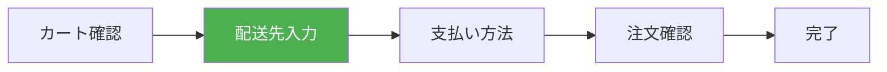

# 演習 2: 配送先入力

## 目標

購入フローの 2 番目のステップとして、配送先住所を入力するフォームを実装します。



---

## 完成イメージ

```text
┌─────────────────────────────────────────────┐
│  配送先の入力                                │
├─────────────────────────────────────────────┤
│  お名前 *                                    │
│  ┌─────────────────────────────────────┐    │
│  │ 山田 太郎                            │    │
│  └─────────────────────────────────────┘    │
│                                             │
│  郵便番号 *                                  │
│  ┌─────────────────────────────────────┐    │
│  │ 123-4567                            │    │
│  └─────────────────────────────────────┘    │
│  [住所を自動入力]                            │
│                                             │
│  都道府県 *                                  │
│  ┌─────────────────────────────────────┐    │
│  │ 東京都                          ▼  │    │
│  └─────────────────────────────────────┘    │
│                                             │
│  市区町村 *                                  │
│  ┌─────────────────────────────────────┐    │
│  │ 渋谷区                              │    │
│  └─────────────────────────────────────┘    │
│                                             │
│  番地 *                                      │
│  ┌─────────────────────────────────────┐    │
│  │ 1-2-3                               │    │
│  └─────────────────────────────────────┘    │
│                                             │
│  建物名・部屋番号                            │
│  ┌─────────────────────────────────────┐    │
│  │ サンプルマンション 101              │    │
│  └─────────────────────────────────────┘    │
│                                             │
│  電話番号 *                                  │
│  ┌─────────────────────────────────────┐    │
│  │ 09012345678                         │    │
│  └─────────────────────────────────────┘    │
├─────────────────────────────────────────────┤
│            [戻る]  [次へ進む]                │
└─────────────────────────────────────────────┘
```

---

## 前提条件

- 演習 1（カート確認）が完了していること
- Phase 7 で学んだ Zod + Server Actions を理解していること

---

## ステップ 1: バリデーションスキーマの作成

### 1.1 配送先スキーマ

```typescript
// packages/validators/src/shipping.ts
import { z } from "zod";

export const shippingAddressSchema = z.object({
  name: z
    .string()
    .min(1, "お名前を入力してください")
    .max(50, "お名前は50文字以内で入力してください"),

  postalCode: z
    .string()
    .regex(/^\d{3}-?\d{4}$/, "郵便番号は「123-4567」または「1234567」の形式で入力してください"),

  prefecture: z.string().min(1, "都道府県を選択してください"),

  city: z
    .string()
    .min(1, "市区町村を入力してください")
    .max(100, "市区町村は100文字以内で入力してください"),

  address1: z
    .string()
    .min(1, "番地を入力してください")
    .max(100, "番地は100文字以内で入力してください"),

  address2: z.string().max(100, "建物名は100文字以内で入力してください").optional(),

  phone: z.string().regex(/^0\d{9,10}$/, "電話番号は「09012345678」の形式で入力してください"),
});

export type ShippingAddress = z.infer<typeof shippingAddressSchema>;

// 都道府県リスト
export const PREFECTURES = [
  "北海道",
  "青森県",
  "岩手県",
  "宮城県",
  "秋田県",
  "山形県",
  "福島県",
  "茨城県",
  "栃木県",
  "群馬県",
  "埼玉県",
  "千葉県",
  "東京都",
  "神奈川県",
  "新潟県",
  "富山県",
  "石川県",
  "福井県",
  "山梨県",
  "長野県",
  "岐阜県",
  "静岡県",
  "愛知県",
  "三重県",
  "滋賀県",
  "京都府",
  "大阪府",
  "兵庫県",
  "奈良県",
  "和歌山県",
  "鳥取県",
  "島根県",
  "岡山県",
  "広島県",
  "山口県",
  "徳島県",
  "香川県",
  "愛媛県",
  "高知県",
  "福岡県",
  "佐賀県",
  "長崎県",
  "熊本県",
  "大分県",
  "宮崎県",
  "鹿児島県",
  "沖縄県",
] as const;
```

---

## ステップ 2: ページの作成

### 2.1 配送先入力ページ

```tsx
// apps/web/app/checkout/shipping/page.tsx
import { redirect } from "next/navigation";
import { cookies } from "next/headers";
import { ShippingForm } from "./ShippingForm";
import { StepProgress } from "../components/StepProgress";

export const metadata = {
  title: "配送先入力",
};

export default async function ShippingPage(): Promise<JSX.Element> {
  // カートが空の場合はリダイレクト
  const cookieStore = await cookies();
  const cartData = cookieStore.get("cart");

  if (!cartData?.value || JSON.parse(cartData.value).length === 0) {
    redirect("/checkout/cart");
  }

  // 保存済みの配送先を取得
  const savedAddress = cookieStore.get("shippingAddress")?.value;
  const defaultValues = savedAddress ? JSON.parse(savedAddress) : undefined;

  return (
    <div className="mx-auto max-w-2xl p-4">
      <StepProgress currentStep="shipping" />

      <h1 className="my-6 text-2xl font-bold">配送先の入力</h1>

      <ShippingForm defaultValues={defaultValues} />
    </div>
  );
}
```

---

## ステップ 3: フォームコンポーネント

### 3.1 配送先フォーム

```tsx
// apps/web/app/checkout/shipping/ShippingForm.tsx
"use client";

import { useActionState } from "react";
import Link from "next/link";
import { saveShippingAddress } from "./actions";
import { PREFECTURES, type ShippingAddress } from "@ec/validators/shipping";
import { FormField } from "@/components/ui/FormField";

type Props = {
  defaultValues?: Partial<ShippingAddress>;
};

export function ShippingForm({ defaultValues }: Props): JSX.Element {
  const [state, formAction, isPending] = useActionState(saveShippingAddress, null);

  return (
    <form
      action={formAction}
      className="space-y-6"
    >
      {/* お名前 */}
      <FormField
        label="お名前"
        name="name"
        type="text"
        required
        defaultValue={defaultValues?.name}
        error={state?.errors?.name?.[0]}
        placeholder="山田 太郎"
      />

      {/* 郵便番号 */}
      <div>
        <FormField
          label="郵便番号"
          name="postalCode"
          type="text"
          required
          defaultValue={defaultValues?.postalCode}
          error={state?.errors?.postalCode?.[0]}
          placeholder="123-4567"
        />
        <button
          type="button"
          className="mt-2 text-sm text-blue-600 hover:underline"
          onClick={() => {
            // 郵便番号から住所を自動入力（後述）
          }}
        >
          住所を自動入力
        </button>
      </div>

      {/* 都道府県 */}
      <div>
        <label
          htmlFor="prefecture"
          className="mb-1 block text-sm font-medium"
        >
          都道府県 <span className="text-red-500">*</span>
        </label>
        <select
          id="prefecture"
          name="prefecture"
          required
          defaultValue={defaultValues?.prefecture ?? ""}
          className="w-full rounded-lg border p-3"
        >
          <option value="">選択してください</option>
          {PREFECTURES.map((pref) => (
            <option
              key={pref}
              value={pref}
            >
              {pref}
            </option>
          ))}
        </select>
        {state?.errors?.prefecture?.[0] && (
          <p className="mt-1 text-sm text-red-600">{state.errors.prefecture[0]}</p>
        )}
      </div>

      {/* 市区町村 */}
      <FormField
        label="市区町村"
        name="city"
        type="text"
        required
        defaultValue={defaultValues?.city}
        error={state?.errors?.city?.[0]}
        placeholder="渋谷区"
      />

      {/* 番地 */}
      <FormField
        label="番地"
        name="address1"
        type="text"
        required
        defaultValue={defaultValues?.address1}
        error={state?.errors?.address1?.[0]}
        placeholder="1-2-3"
      />

      {/* 建物名 */}
      <FormField
        label="建物名・部屋番号"
        name="address2"
        type="text"
        defaultValue={defaultValues?.address2}
        error={state?.errors?.address2?.[0]}
        placeholder="サンプルマンション 101"
      />

      {/* 電話番号 */}
      <FormField
        label="電話番号"
        name="phone"
        type="tel"
        required
        defaultValue={defaultValues?.phone}
        error={state?.errors?.phone?.[0]}
        placeholder="09012345678"
      />

      {/* エラーメッセージ */}
      {state?.error && <p className="text-red-600">{state.error}</p>}

      {/* アクションボタン */}
      <div className="flex gap-4">
        <Link
          href="/checkout/cart"
          className="flex-1 rounded-lg border py-3 text-center hover:bg-gray-50"
        >
          戻る
        </Link>
        <button
          type="submit"
          disabled={isPending}
          className="flex-1 rounded-lg bg-orange-500 py-3 font-bold text-white hover:bg-orange-600 disabled:cursor-not-allowed disabled:bg-gray-400"
        >
          {isPending ? "処理中..." : "次へ進む"}
        </button>
      </div>
    </form>
  );
}
```

### 3.2 汎用フォームフィールド

```tsx
// components/ui/FormField.tsx
type Props = {
  label: string;
  name: string;
  type: "text" | "email" | "tel" | "password";
  required?: boolean;
  defaultValue?: string;
  error?: string;
  placeholder?: string;
};

export function FormField({
  label,
  name,
  type,
  required,
  defaultValue,
  error,
  placeholder,
}: Props): JSX.Element {
  return (
    <div>
      <label
        htmlFor={name}
        className="mb-1 block text-sm font-medium"
      >
        {label} {required && <span className="text-red-500">*</span>}
      </label>
      <input
        id={name}
        name={name}
        type={type}
        required={required}
        defaultValue={defaultValue}
        placeholder={placeholder}
        className={`w-full rounded-lg border p-3 ${error ? "border-red-500" : ""}`}
      />
      {error && <p className="mt-1 text-sm text-red-600">{error}</p>}
    </div>
  );
}
```

---

## ステップ 4: Server Action

```typescript
// apps/web/app/checkout/shipping/actions.ts
"use server";

import { redirect } from "next/navigation";
import { cookies } from "next/headers";
import { shippingAddressSchema } from "@ec/validators/shipping";

export type ShippingFormState = {
  errors?: Record<string, string[]>;
  error?: string;
} | null;

export async function saveShippingAddress(
  prevState: ShippingFormState,
  formData: FormData
): Promise<ShippingFormState> {
  // フォームデータを取得
  const rawData = {
    name: formData.get("name"),
    postalCode: formData.get("postalCode"),
    prefecture: formData.get("prefecture"),
    city: formData.get("city"),
    address1: formData.get("address1"),
    address2: formData.get("address2") || undefined,
    phone: formData.get("phone"),
  };

  // バリデーション
  const result = shippingAddressSchema.safeParse(rawData);

  if (!result.success) {
    return {
      errors: result.error.flatten().fieldErrors as Record<string, string[]>,
    };
  }

  // Cookie に保存
  const cookieStore = await cookies();
  cookieStore.set("shippingAddress", JSON.stringify(result.data), {
    httpOnly: true,
    secure: process.env.NODE_ENV === "production",
    sameSite: "lax",
    maxAge: 60 * 60 * 24, // 24時間
  });

  // 次のステップにリダイレクト
  redirect("/checkout/payment");
}
```

---

## ステップ 5: 郵便番号から住所を自動入力（オプション）

### 5.1 郵便番号検索 API

```typescript
// app/api/postal-code/[code]/route.ts
import { NextResponse, type NextRequest } from "next/server";

type Params = {
  params: Promise<{ code: string }>;
};

export async function GET(request: NextRequest, { params }: Params): Promise<NextResponse> {
  const { code } = await params;

  // 郵便番号のフォーマットを統一
  const normalizedCode = code.replace("-", "");

  try {
    // 郵便番号検索 API を呼び出し
    const response = await fetch(
      `https://zipcloud.ibsnet.co.jp/api/search?zipcode=${normalizedCode}`
    );
    const data = await response.json();

    if (data.results) {
      const result = data.results[0];
      return NextResponse.json({
        prefecture: result.address1,
        city: result.address2,
        address1: result.address3,
      });
    }

    return NextResponse.json({ error: "住所が見つかりませんでした" }, { status: 404 });
  } catch (error) {
    return NextResponse.json({ error: "住所の検索に失敗しました" }, { status: 500 });
  }
}
```

### 5.2 フォームでの使用

```tsx
// ShippingForm.tsx（抜粋）
const handleAutoFill = async (): Promise<void> => {
  const postalCodeInput = document.querySelector<HTMLInputElement>('input[name="postalCode"]');
  const postalCode = postalCodeInput?.value;

  if (!postalCode) {
    alert("郵便番号を入力してください");
    return;
  }

  try {
    const response = await fetch(`/api/postal-code/${postalCode}`);
    const data = await response.json();

    if (data.error) {
      alert(data.error);
      return;
    }

    // フォームに値を設定
    const prefectureSelect = document.querySelector<HTMLSelectElement>('select[name="prefecture"]');
    const cityInput = document.querySelector<HTMLInputElement>('input[name="city"]');
    const address1Input = document.querySelector<HTMLInputElement>('input[name="address1"]');

    if (prefectureSelect) prefectureSelect.value = data.prefecture;
    if (cityInput) cityInput.value = data.city;
    if (address1Input) address1Input.value = data.address1;
  } catch (error) {
    alert("住所の取得に失敗しました");
  }
};
```

---

## 確認ポイント

以下の動作を確認してください。

- [ ] 配送先入力ページにアクセスできる
- [ ] すべてのフィールドに入力できる
- [ ] 必須フィールドが空の場合、エラーが表示される
- [ ] 郵便番号・電話番号の形式が正しくない場合、エラーが表示される
- [ ] 「次へ進む」ボタンで支払い方法ページに遷移できる
- [ ] 「戻る」ボタンでカートページに戻れる
- [ ] ページを更新しても入力した値が保持される

---

## よくある問題

### 1. バリデーションエラーが表示されない

`useActionState` の戻り値を正しく使用しているか確認してください。`state?.errors?.fieldName?.[0]` の形式でアクセスします。

### 2. リダイレクトが動作しない

Server Actions 内で `redirect()` を呼び出していることを確認してください。try-catch の中で `redirect()` を呼ぶと、エラーとして catch される場合があります。

---

## 次の演習

配送先入力が完成したら、[演習 3: 支払い方法選択](./03-payment.md) に進みましょう。
