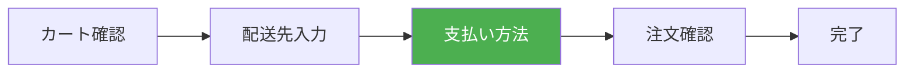

# 演習 3: 支払い方法選択

## 目標

購入フローの 3 番目のステップとして、支払い方法を選択する画面を実装します。



---

## 完成イメージ

```text
┌─────────────────────────────────────────────┐
│  支払い方法の選択                            │
├─────────────────────────────────────────────┤
│  ○ クレジットカード                          │
│    ┌─────────────────────────────────────┐  │
│    │ カード番号                           │  │
│    │ 4111 1111 1111 1111                 │  │
│    └─────────────────────────────────────┘  │
│    ┌───────────────┐ ┌───────────────────┐  │
│    │ 有効期限       │ │ セキュリティコード │  │
│    │ 12/25         │ │ 123               │  │
│    └───────────────┘ └───────────────────┘  │
│                                             │
│  ○ 銀行振込                                  │
│    ご注文確定後、振込先をメールでお知らせします │
│                                             │
│  ○ 代金引換                                  │
│    商品お届け時に配達員にお支払いください     │
│    （手数料 ¥330）                           │
├─────────────────────────────────────────────┤
│            [戻る]  [次へ進む]                │
└─────────────────────────────────────────────┘
```

---

## 前提条件

- 演習 2（配送先入力）が完了していること

---

## ステップ 1: 支払い方法スキーマ

```typescript
// packages/validators/src/payment.ts
import { z } from "zod";

// クレジットカード
const creditCardSchema = z.object({
  type: z.literal("credit_card"),
  cardNumber: z.string().regex(/^\d{13,16}$/, "カード番号は13〜16桁の数字で入力してください"),
  expiryDate: z
    .string()
    .regex(/^(0[1-9]|1[0-2])\/\d{2}$/, "有効期限は「MM/YY」の形式で入力してください"),
  cvv: z.string().regex(/^\d{3,4}$/, "セキュリティコードは3〜4桁の数字で入力してください"),
  cardHolderName: z
    .string()
    .min(1, "カード名義人を入力してください")
    .max(50, "カード名義人は50文字以内で入力してください"),
});

// 銀行振込
const bankTransferSchema = z.object({
  type: z.literal("bank_transfer"),
});

// 代金引換
const cashOnDeliverySchema = z.object({
  type: z.literal("cash_on_delivery"),
});

// 統合スキーマ
export const paymentMethodSchema = z.discriminatedUnion("type", [
  creditCardSchema,
  bankTransferSchema,
  cashOnDeliverySchema,
]);

export type PaymentMethod = z.infer<typeof paymentMethodSchema>;
export type PaymentType = PaymentMethod["type"];

// 支払い方法の表示情報
export const PAYMENT_OPTIONS = [
  {
    type: "credit_card" as const,
    label: "クレジットカード",
    description: "Visa, Mastercard, JCB, American Express",
    icon: "💳",
  },
  {
    type: "bank_transfer" as const,
    label: "銀行振込",
    description: "ご注文確定後、振込先をメールでお知らせします",
    icon: "🏦",
  },
  {
    type: "cash_on_delivery" as const,
    label: "代金引換",
    description: "商品お届け時にお支払い（手数料 ¥330）",
    icon: "💴",
  },
] as const;
```

---

## ステップ 2: ページの作成

```tsx
// apps/web/app/checkout/payment/page.tsx
import { redirect } from "next/navigation";
import { cookies } from "next/headers";
import { PaymentForm } from "./PaymentForm";
import { StepProgress } from "../components/StepProgress";

export const metadata = {
  title: "支払い方法",
};

export default async function PaymentPage(): Promise<JSX.Element> {
  const cookieStore = await cookies();

  // 配送先が未入力の場合はリダイレクト
  const shippingAddress = cookieStore.get("shippingAddress")?.value;
  if (!shippingAddress) {
    redirect("/checkout/shipping");
  }

  // 保存済みの支払い方法を取得
  const savedPayment = cookieStore.get("paymentMethod")?.value;
  const defaultValues = savedPayment ? JSON.parse(savedPayment) : undefined;

  return (
    <div className="mx-auto max-w-2xl p-4">
      <StepProgress currentStep="payment" />

      <h1 className="my-6 text-2xl font-bold">支払い方法の選択</h1>

      <PaymentForm defaultValues={defaultValues} />
    </div>
  );
}
```

---

## ステップ 3: フォームコンポーネント

### 3.1 支払い方法フォーム

```tsx
// apps/web/app/checkout/payment/PaymentForm.tsx
"use client";

import { useState } from "react";
import { useActionState } from "react";
import Link from "next/link";
import { savePaymentMethod } from "./actions";
import { PAYMENT_OPTIONS, type PaymentMethod, type PaymentType } from "@ec/validators/payment";
import { CreditCardForm } from "./CreditCardForm";

type Props = {
  defaultValues?: PaymentMethod;
};

export function PaymentForm({ defaultValues }: Props): JSX.Element {
  const [selectedType, setSelectedType] = useState<PaymentType>(
    defaultValues?.type ?? "credit_card"
  );

  const [state, formAction, isPending] = useActionState(savePaymentMethod, null);

  return (
    <form
      action={formAction}
      className="space-y-6"
    >
      {/* 支払い方法の選択 */}
      <div className="space-y-4">
        {PAYMENT_OPTIONS.map((option) => (
          <label
            key={option.type}
            className={`block cursor-pointer rounded-lg border p-4 transition-colors ${
              selectedType === option.type ? "border-orange-500 bg-orange-50" : "hover:bg-gray-50"
            }`}
          >
            <div className="flex items-start gap-3">
              <input
                type="radio"
                name="type"
                value={option.type}
                checked={selectedType === option.type}
                onChange={(e) => setSelectedType(e.target.value as PaymentType)}
                className="mt-1"
              />

              <div className="flex-1">
                <div className="flex items-center gap-2">
                  <span className="text-xl">{option.icon}</span>
                  <span className="font-medium">{option.label}</span>
                </div>
                <p className="mt-1 text-sm text-gray-600">{option.description}</p>

                {/* クレジットカードの追加フォーム */}
                {option.type === "credit_card" && selectedType === "credit_card" && (
                  <div className="mt-4">
                    <CreditCardForm
                      defaultValues={
                        defaultValues?.type === "credit_card" ? defaultValues : undefined
                      }
                      errors={state?.errors}
                    />
                  </div>
                )}

                {/* 代金引換の手数料表示 */}
                {option.type === "cash_on_delivery" && selectedType === "cash_on_delivery" && (
                  <p className="mt-2 text-sm font-medium text-orange-600">
                    ※ 手数料 ¥330 が追加されます
                  </p>
                )}
              </div>
            </div>
          </label>
        ))}
      </div>

      {/* エラーメッセージ */}
      {state?.error && <p className="text-red-600">{state.error}</p>}

      {/* アクションボタン */}
      <div className="flex gap-4">
        <Link
          href="/checkout/shipping"
          className="flex-1 rounded-lg border py-3 text-center hover:bg-gray-50"
        >
          戻る
        </Link>
        <button
          type="submit"
          disabled={isPending}
          className="flex-1 rounded-lg bg-orange-500 py-3 font-bold text-white hover:bg-orange-600 disabled:cursor-not-allowed disabled:bg-gray-400"
        >
          {isPending ? "処理中..." : "次へ進む"}
        </button>
      </div>
    </form>
  );
}
```

### 3.2 クレジットカードフォーム

```tsx
// apps/web/app/checkout/payment/CreditCardForm.tsx
"use client";

import { type PaymentMethod } from "@ec/validators/payment";

type CreditCardData = Extract<PaymentMethod, { type: "credit_card" }>;

type Props = {
  defaultValues?: CreditCardData;
  errors?: Record<string, string[]>;
};

export function CreditCardForm({ defaultValues, errors }: Props): JSX.Element {
  return (
    <div className="space-y-4 rounded-lg border bg-white p-4">
      {/* カード番号 */}
      <div>
        <label
          htmlFor="cardNumber"
          className="mb-1 block text-sm font-medium"
        >
          カード番号
        </label>
        <input
          id="cardNumber"
          name="cardNumber"
          type="text"
          inputMode="numeric"
          maxLength={16}
          defaultValue={defaultValues?.cardNumber}
          placeholder="4111111111111111"
          className="w-full rounded-lg border p-3"
        />
        {errors?.cardNumber?.[0] && (
          <p className="mt-1 text-sm text-red-600">{errors.cardNumber[0]}</p>
        )}
      </div>

      {/* 有効期限とセキュリティコード */}
      <div className="grid grid-cols-2 gap-4">
        <div>
          <label
            htmlFor="expiryDate"
            className="mb-1 block text-sm font-medium"
          >
            有効期限
          </label>
          <input
            id="expiryDate"
            name="expiryDate"
            type="text"
            maxLength={5}
            defaultValue={defaultValues?.expiryDate}
            placeholder="MM/YY"
            className="w-full rounded-lg border p-3"
          />
          {errors?.expiryDate?.[0] && (
            <p className="mt-1 text-sm text-red-600">{errors.expiryDate[0]}</p>
          )}
        </div>

        <div>
          <label
            htmlFor="cvv"
            className="mb-1 block text-sm font-medium"
          >
            セキュリティコード
          </label>
          <input
            id="cvv"
            name="cvv"
            type="text"
            inputMode="numeric"
            maxLength={4}
            defaultValue={defaultValues?.cvv}
            placeholder="123"
            className="w-full rounded-lg border p-3"
          />
          {errors?.cvv?.[0] && <p className="mt-1 text-sm text-red-600">{errors.cvv[0]}</p>}
        </div>
      </div>

      {/* カード名義人 */}
      <div>
        <label
          htmlFor="cardHolderName"
          className="mb-1 block text-sm font-medium"
        >
          カード名義人（ローマ字）
        </label>
        <input
          id="cardHolderName"
          name="cardHolderName"
          type="text"
          defaultValue={defaultValues?.cardHolderName}
          placeholder="TARO YAMADA"
          className="w-full rounded-lg border p-3 uppercase"
        />
        {errors?.cardHolderName?.[0] && (
          <p className="mt-1 text-sm text-red-600">{errors.cardHolderName[0]}</p>
        )}
      </div>

      <p className="text-xs text-gray-500">
        ※ このフォームはデモ用です。実際のカード情報は入力しないでください。
      </p>
    </div>
  );
}
```

---

## ステップ 4: Server Action

```typescript
// apps/web/app/checkout/payment/actions.ts
"use server";

import { redirect } from "next/navigation";
import { cookies } from "next/headers";
import { paymentMethodSchema, type PaymentType } from "@ec/validators/payment";

export type PaymentFormState = {
  errors?: Record<string, string[]>;
  error?: string;
} | null;

export async function savePaymentMethod(
  prevState: PaymentFormState,
  formData: FormData
): Promise<PaymentFormState> {
  const type = formData.get("type") as PaymentType;

  // 支払い方法に応じたデータを構築
  let paymentData: Record<string, unknown>;

  switch (type) {
    case "credit_card":
      paymentData = {
        type: "credit_card",
        cardNumber: formData.get("cardNumber"),
        expiryDate: formData.get("expiryDate"),
        cvv: formData.get("cvv"),
        cardHolderName: formData.get("cardHolderName"),
      };
      break;

    case "bank_transfer":
      paymentData = { type: "bank_transfer" };
      break;

    case "cash_on_delivery":
      paymentData = { type: "cash_on_delivery" };
      break;

    default:
      return { error: "支払い方法を選択してください" };
  }

  // バリデーション
  const result = paymentMethodSchema.safeParse(paymentData);

  if (!result.success) {
    return {
      errors: result.error.flatten().fieldErrors as Record<string, string[]>,
    };
  }

  // Cookie に保存（カード情報はマスク）
  const dataToStore = { ...result.data };
  if (dataToStore.type === "credit_card") {
    // カード番号の下4桁のみ保存
    dataToStore.cardNumber = `****${dataToStore.cardNumber.slice(-4)}`;
    // CVV は保存しない
    delete (dataToStore as Record<string, unknown>).cvv;
  }

  const cookieStore = await cookies();
  cookieStore.set("paymentMethod", JSON.stringify(dataToStore), {
    httpOnly: true,
    secure: process.env.NODE_ENV === "production",
    sameSite: "lax",
    maxAge: 60 * 60 * 24, // 24時間
  });

  // 次のステップにリダイレクト
  redirect("/checkout/confirm");
}
```

---

## ステップ 5: カード番号のフォーマット（オプション）

```tsx
// hooks/useCardNumberFormat.ts
"use client";

import { useState, type ChangeEvent } from "react";

export function useCardNumberFormat(initialValue = ""): {
  value: string;
  onChange: (e: ChangeEvent<HTMLInputElement>) => void;
  rawValue: string;
} {
  const [rawValue, setRawValue] = useState(initialValue.replace(/\s/g, ""));

  const formatCardNumber = (value: string): string => {
    // 数字のみを抽出
    const digits = value.replace(/\D/g, "").slice(0, 16);
    // 4桁ごとにスペースを挿入
    return digits.replace(/(\d{4})(?=\d)/g, "$1 ");
  };

  const handleChange = (e: ChangeEvent<HTMLInputElement>): void => {
    const digits = e.target.value.replace(/\D/g, "");
    setRawValue(digits);
    e.target.value = formatCardNumber(digits);
  };

  return {
    value: formatCardNumber(rawValue),
    onChange: handleChange,
    rawValue,
  };
}
```

---

## 確認ポイント

以下の動作を確認してください。

- [ ] 支払い方法選択ページにアクセスできる
- [ ] 3 つの支払い方法から選択できる
- [ ] クレジットカード選択時に入力フォームが表示される
- [ ] 必須フィールドが空の場合、エラーが表示される
- [ ] 「次へ進む」ボタンで注文確認ページに遷移できる
- [ ] 「戻る」ボタンで配送先入力ページに戻れる

---

## セキュリティに関する注意

### 本番環境での実装

この演習はデモ用であり、実際のカード情報は処理しません。本番環境では以下を考慮してください。

- **PCI DSS 準拠**: カード情報を直接扱う場合は PCI DSS への準拠が必要
- **決済代行サービス**: Stripe, PAY.JP などの決済代行サービスを使用
- **トークン化**: カード情報をトークン化して安全に処理
- **HTTPS 必須**: すべての通信を暗号化

```tsx
// Stripe を使用した例
import { loadStripe } from "@stripe/stripe-js";
import { Elements, CardElement } from "@stripe/react-stripe-js";

const stripePromise = loadStripe("pk_test_...");

function PaymentWithStripe(): JSX.Element {
  return (
    <Elements stripe={stripePromise}>
      <CardElement />
    </Elements>
  );
}
```

---

## 次の演習

支払い方法選択が完成したら、[演習 4: 注文確認](./04-order-confirm.md) に進みましょう。
