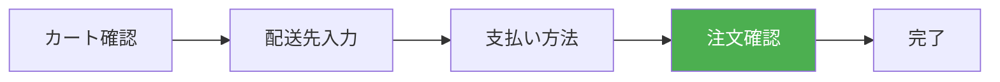

# 演習 4: 注文確認

## 目標

購入フローの 4 番目のステップとして、注文内容を最終確認し、注文を確定する画面を実装します。



---

## 完成イメージ

```text
┌─────────────────────────────────────────────┐
│  注文内容の確認                              │
├─────────────────────────────────────────────┤
│  【注文商品】                         [変更] │
│  ├─ 商品 A × 2         ¥2,000               │
│  └─ 商品 B × 1         ¥500                 │
├─────────────────────────────────────────────┤
│  【配送先】                           [変更] │
│  山田 太郎                                   │
│  〒123-4567                                  │
│  東京都渋谷区1-2-3                           │
│  サンプルマンション 101                      │
│  TEL: 090-1234-5678                         │
├─────────────────────────────────────────────┤
│  【支払い方法】                       [変更] │
│  クレジットカード（**** **** **** 1234）     │
├─────────────────────────────────────────────┤
│  【お支払い金額】                            │
│  小計              ¥2,500                   │
│  送料              ¥500                     │
│  ─────────────────────────                  │
│  合計              ¥3,000                   │
├─────────────────────────────────────────────┤
│  □ 利用規約に同意する                        │
├─────────────────────────────────────────────┤
│            [戻る]  [注文を確定する]          │
└─────────────────────────────────────────────┘
```

---

## 前提条件

- 演習 3（支払い方法選択）が完了していること
- すべてのチェックアウトデータ（カート、配送先、支払い方法）が保存されていること

---

## ステップ 1: ページの作成

```tsx
// apps/web/app/checkout/confirm/page.tsx
import { redirect } from "next/navigation";
import { cookies } from "next/headers";
import { StepProgress } from "../components/StepProgress";
import { OrderSummary } from "./OrderSummary";
import { ConfirmationForm } from "./ConfirmationForm";
import { type CartItem } from "@ec/store/cart";
import { type ShippingAddress } from "@ec/validators/shipping";
import { type PaymentMethod } from "@ec/validators/payment";

export const metadata = {
  title: "注文確認",
};

type CheckoutData = {
  cart: CartItem[];
  shippingAddress: ShippingAddress;
  paymentMethod: PaymentMethod;
};

async function getCheckoutData(): Promise<CheckoutData | null> {
  const cookieStore = await cookies();

  const cartData = cookieStore.get("cart")?.value;
  const shippingData = cookieStore.get("shippingAddress")?.value;
  const paymentData = cookieStore.get("paymentMethod")?.value;

  if (!cartData || !shippingData || !paymentData) {
    return null;
  }

  try {
    return {
      cart: JSON.parse(cartData),
      shippingAddress: JSON.parse(shippingData),
      paymentMethod: JSON.parse(paymentData),
    };
  } catch {
    return null;
  }
}

export default async function ConfirmPage(): Promise<JSX.Element> {
  const checkoutData = await getCheckoutData();

  // データが不完全な場合はリダイレクト
  if (!checkoutData) {
    redirect("/checkout/cart");
  }

  if (checkoutData.cart.length === 0) {
    redirect("/checkout/cart");
  }

  return (
    <div className="mx-auto max-w-3xl p-4">
      <StepProgress currentStep="confirm" />

      <h1 className="my-6 text-2xl font-bold">注文内容の確認</h1>

      <p className="mb-6 text-gray-600">以下の内容で注文を確定します。内容をご確認ください。</p>

      <OrderSummary
        cart={checkoutData.cart}
        shippingAddress={checkoutData.shippingAddress}
        paymentMethod={checkoutData.paymentMethod}
      />

      <ConfirmationForm />
    </div>
  );
}
```

---

## ステップ 2: 注文サマリー

```tsx
// apps/web/app/checkout/confirm/OrderSummary.tsx
import Link from "next/link";
import { type CartItem } from "@ec/store/cart";
import { type ShippingAddress } from "@ec/validators/shipping";
import { type PaymentMethod } from "@ec/validators/payment";

type Props = {
  cart: CartItem[];
  shippingAddress: ShippingAddress;
  paymentMethod: PaymentMethod;
};

export function OrderSummary({ cart, shippingAddress, paymentMethod }: Props): JSX.Element {
  const subtotal = cart.reduce((sum, item) => sum + item.price * item.quantity, 0);
  const shippingFee = subtotal >= 5000 ? 0 : 500;
  const codFee = paymentMethod.type === "cash_on_delivery" ? 330 : 0;
  const total = subtotal + shippingFee + codFee;

  return (
    <div className="space-y-6">
      {/* 注文商品 */}
      <section className="rounded-lg border p-4">
        <div className="mb-4 flex items-center justify-between">
          <h2 className="font-semibold">注文商品</h2>
          <Link
            href="/checkout/cart"
            className="text-sm text-blue-600 hover:underline"
          >
            変更する
          </Link>
        </div>

        <ul className="divide-y">
          {cart.map((item) => (
            <li
              key={item.productId}
              className="flex justify-between py-2"
            >
              <span>
                {item.name} × {item.quantity}
              </span>
              <span>¥{(item.price * item.quantity).toLocaleString()}</span>
            </li>
          ))}
        </ul>
      </section>

      {/* 配送先 */}
      <section className="rounded-lg border p-4">
        <div className="mb-4 flex items-center justify-between">
          <h2 className="font-semibold">配送先</h2>
          <Link
            href="/checkout/shipping"
            className="text-sm text-blue-600 hover:underline"
          >
            変更する
          </Link>
        </div>

        <address className="text-gray-700 not-italic">
          <p className="font-medium">{shippingAddress.name}</p>
          <p>〒{shippingAddress.postalCode}</p>
          <p>
            {shippingAddress.prefecture}
            {shippingAddress.city}
            {shippingAddress.address1}
          </p>
          {shippingAddress.address2 && <p>{shippingAddress.address2}</p>}
          <p>TEL: {shippingAddress.phone}</p>
        </address>
      </section>

      {/* 支払い方法 */}
      <section className="rounded-lg border p-4">
        <div className="mb-4 flex items-center justify-between">
          <h2 className="font-semibold">支払い方法</h2>
          <Link
            href="/checkout/payment"
            className="text-sm text-blue-600 hover:underline"
          >
            変更する
          </Link>
        </div>

        <p className="text-gray-700">{formatPaymentMethod(paymentMethod)}</p>
      </section>

      {/* 合計金額 */}
      <section className="rounded-lg border bg-gray-50 p-4">
        <h2 className="mb-4 font-semibold">お支払い金額</h2>

        <dl className="space-y-2">
          <div className="flex justify-between">
            <dt>小計</dt>
            <dd>¥{subtotal.toLocaleString()}</dd>
          </div>
          <div className="flex justify-between">
            <dt>送料</dt>
            <dd>{shippingFee === 0 ? "無料" : `¥${shippingFee.toLocaleString()}`}</dd>
          </div>
          {codFee > 0 && (
            <div className="flex justify-between">
              <dt>代引手数料</dt>
              <dd>¥{codFee.toLocaleString()}</dd>
            </div>
          )}
          <div className="flex justify-between border-t pt-2 text-lg font-bold">
            <dt>合計</dt>
            <dd>¥{total.toLocaleString()}</dd>
          </div>
        </dl>
      </section>
    </div>
  );
}

function formatPaymentMethod(method: PaymentMethod): string {
  switch (method.type) {
    case "credit_card":
      return `クレジットカード（${method.cardNumber}）`;
    case "bank_transfer":
      return "銀行振込";
    case "cash_on_delivery":
      return "代金引換（手数料 ¥330）";
  }
}
```

---

## ステップ 3: 確認フォーム（二重送信防止）

```tsx
// apps/web/app/checkout/confirm/ConfirmationForm.tsx
"use client";

import { useState } from "react";
import { useActionState } from "react";
import Link from "next/link";
import { placeOrder } from "./actions";

export function ConfirmationForm(): JSX.Element {
  const [agreed, setAgreed] = useState(false);
  const [state, formAction, isPending] = useActionState(placeOrder, null);

  return (
    <form
      action={formAction}
      className="mt-6 space-y-6"
    >
      {/* 利用規約への同意 */}
      <div className="rounded-lg border p-4">
        <label className="flex items-start gap-3">
          <input
            type="checkbox"
            name="agreedToTerms"
            checked={agreed}
            onChange={(e) => setAgreed(e.target.checked)}
            className="mt-1"
            required
          />
          <span className="text-sm">
            <a
              href="/terms"
              target="_blank"
              rel="noopener noreferrer"
              className="text-blue-600 hover:underline"
            >
              利用規約
            </a>
            および
            <a
              href="/privacy"
              target="_blank"
              rel="noopener noreferrer"
              className="text-blue-600 hover:underline"
            >
              プライバシーポリシー
            </a>
            に同意します
          </span>
        </label>
      </div>

      {/* エラーメッセージ */}
      {state?.error && (
        <div className="rounded-lg bg-red-50 p-4 text-red-800">
          <p>{state.error}</p>
        </div>
      )}

      {/* アクションボタン */}
      <div className="flex gap-4">
        <Link
          href="/checkout/payment"
          className="flex-1 rounded-lg border py-3 text-center hover:bg-gray-50"
        >
          戻る
        </Link>
        <button
          type="submit"
          disabled={!agreed || isPending}
          className="flex-1 rounded-lg bg-orange-500 py-3 font-bold text-white hover:bg-orange-600 disabled:cursor-not-allowed disabled:bg-gray-400"
        >
          {isPending ? "処理中..." : "注文を確定する"}
        </button>
      </div>

      {/* 注意事項 */}
      <p className="text-center text-sm text-gray-500">
        「注文を確定する」ボタンをクリックすると、注文が確定されます。
      </p>
    </form>
  );
}
```

---

## ステップ 4: 注文処理 Server Action

```typescript
// apps/web/app/checkout/confirm/actions.ts
"use server";

import { redirect } from "next/navigation";
import { cookies } from "next/headers";
import { v4 as uuid } from "uuid";

export type OrderFormState = {
  error?: string;
} | null;

export async function placeOrder(
  prevState: OrderFormState,
  formData: FormData
): Promise<OrderFormState> {
  const cookieStore = await cookies();

  // 1. 利用規約への同意を確認
  const agreedToTerms = formData.get("agreedToTerms") === "on";
  if (!agreedToTerms) {
    return { error: "利用規約に同意してください" };
  }

  // 2. チェックアウトデータを取得
  const cartData = cookieStore.get("cart")?.value;
  const shippingData = cookieStore.get("shippingAddress")?.value;
  const paymentData = cookieStore.get("paymentMethod")?.value;

  if (!cartData || !shippingData || !paymentData) {
    return { error: "注文データが不完全です。最初からやり直してください。" };
  }

  const cart = JSON.parse(cartData);
  const shippingAddress = JSON.parse(shippingData);
  const paymentMethod = JSON.parse(paymentData);

  // 3. 在庫確認
  const stockResult = await checkStock(cart);
  if (!stockResult.isAvailable) {
    return {
      error: `在庫が不足しています: ${stockResult.unavailableItems
        .map((item: { productName: string }) => item.productName)
        .join(", ")}`,
    };
  }

  // 4. 注文を作成
  try {
    const order = await createOrder({
      cart,
      shippingAddress,
      paymentMethod,
    });

    // 5. チェックアウトデータをクリア
    cookieStore.delete("cart");
    cookieStore.delete("shippingAddress");
    cookieStore.delete("paymentMethod");

    // 6. 完了ページにリダイレクト
    redirect(`/checkout/complete?orderId=${order.id}`);
  } catch (error) {
    console.error("Order creation failed:", error);
    return { error: "注文の作成に失敗しました。もう一度お試しください。" };
  }
}

// 在庫確認（モック）
async function checkStock(cart: Array<{ productId: string; quantity: number }>): Promise<{
  isAvailable: boolean;
  unavailableItems: Array<{ productId: string; productName: string }>;
}> {
  // 実際の実装では API を呼び出す
  return { isAvailable: true, unavailableItems: [] };
}

// 注文作成（モック）
async function createOrder(data: {
  cart: unknown[];
  shippingAddress: unknown;
  paymentMethod: unknown;
}): Promise<{ id: string; orderNumber: string }> {
  // 実際の実装では API を呼び出す
  const orderId = uuid();
  const orderNumber = `ORD-${Date.now()}`;

  return { id: orderId, orderNumber };
}
```

---

## ステップ 5: 二重送信防止の強化

### 5.1 トークンを使用した対策

```typescript
// lib/order-token.ts
import { cookies } from "next/headers";
import { v4 as uuid } from "uuid";

export async function generateOrderToken(): Promise<string> {
  const token = uuid();
  const cookieStore = await cookies();

  cookieStore.set("orderToken", token, {
    httpOnly: true,
    secure: process.env.NODE_ENV === "production",
    sameSite: "strict",
    maxAge: 60 * 30, // 30分
  });

  return token;
}

export async function validateOrderToken(token: string): Promise<boolean> {
  const cookieStore = await cookies();
  const savedToken = cookieStore.get("orderToken")?.value;

  if (!savedToken || savedToken !== token) {
    return false;
  }

  // トークンを無効化
  cookieStore.delete("orderToken");
  return true;
}
```

### 5.2 ページでトークンを生成

```tsx
// app/checkout/confirm/page.tsx
import { generateOrderToken } from "@/lib/order-token";

export default async function ConfirmPage(): Promise<JSX.Element> {
  // ...

  // 注文トークンを生成
  const orderToken = await generateOrderToken();

  return (
    <div>
      {/* ... */}
      <ConfirmationForm orderToken={orderToken} />
    </div>
  );
}
```

### 5.3 Server Action でトークンを検証

```typescript
// actions.ts
import { validateOrderToken } from "@/lib/order-token";

export async function placeOrder(
  prevState: OrderFormState,
  formData: FormData
): Promise<OrderFormState> {
  // トークンの検証
  const orderToken = formData.get("orderToken") as string;
  const isValidToken = await validateOrderToken(orderToken);

  if (!isValidToken) {
    return { error: "この注文は既に処理されています。" };
  }

  // 注文処理...
}
```

---

## 確認ポイント

以下の動作を確認してください。

- [ ] 注文確認ページにアクセスできる
- [ ] カート内容、配送先、支払い方法が正しく表示される
- [ ] 各セクションの「変更する」リンクが機能する
- [ ] 利用規約に同意しないと注文できない
- [ ] 「注文を確定する」ボタンで注文が処理される
- [ ] 処理中はボタンが無効化される
- [ ] 二重クリックで重複注文されない

---

## よくある問題

### 1. リダイレクトが動作しない

Server Actions 内で `redirect()` を呼び出す際、try-catch で囲むと正常に動作しない場合があります。redirect は例外をスローするため、catch で捕捉されてしまいます。

```typescript
// ❌ 動作しない
try {
  redirect("/checkout/complete");
} catch (error) {
  // redirect の例外もここで捕捉される
}

// ✅ 動作する
if (success) {
  redirect("/checkout/complete");
}
return { error: "エラーメッセージ" };
```

### 2. チェックアウトデータが見つからない

Cookie の有効期限が切れている可能性があります。適切なエラーメッセージを表示し、最初からやり直すよう案内してください。

---

## 次の演習

注文確認が完成したら、[演習 5: 注文完了](./05-order-complete.md) に進みましょう。
