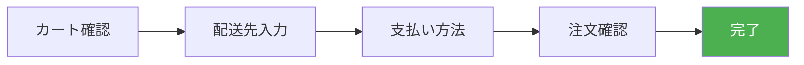
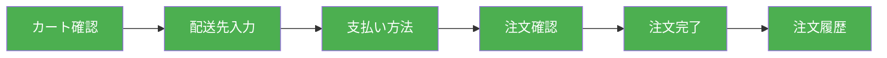

# 演習 5: 注文完了

## 目標

購入フローの最終ステップとして、注文完了画面を実装し、注文履歴機能も追加します。



---

## 完成イメージ

```text
┌─────────────────────────────────────────────┐
│                                             │
│                    🎉                       │
│                                             │
│      ご注文ありがとうございます              │
│                                             │
│  ┌─────────────────────────────────────┐    │
│  │  注文番号                            │    │
│  │  ORD-20240101-123456                │    │
│  └─────────────────────────────────────┘    │
│                                             │
│  ご注文確認メールを xxx@example.com に       │
│  お送りしました。                            │
│                                             │
│  ┌─────────────────────────────────────┐    │
│  │         注文詳細を確認する            │    │
│  └─────────────────────────────────────┘    │
│                                             │
│           トップページに戻る                 │
│                                             │
└─────────────────────────────────────────────┘
```

---

## 前提条件

- 演習 4（注文確認）が完了していること
- 注文が正常に作成されていること

---

## ステップ 1: 注文完了ページ

```tsx
// apps/web/app/checkout/complete/page.tsx
import { redirect } from "next/navigation";
import Link from "next/link";
import { getOrder } from "@/lib/orders";
import { ClearCheckoutState } from "./ClearCheckoutState";

type Props = {
  searchParams: Promise<{ orderId?: string }>;
};

export const metadata = {
  title: "注文完了",
};

export default async function CompletePage({ searchParams }: Props): Promise<JSX.Element> {
  const { orderId } = await searchParams;

  // orderId がない場合はトップページにリダイレクト
  if (!orderId) {
    redirect("/");
  }

  // 注文情報を取得
  const order = await getOrder(orderId);

  if (!order) {
    redirect("/");
  }

  return (
    <div className="mx-auto max-w-2xl p-4">
      {/* チェックアウト状態をクリア */}
      <ClearCheckoutState />

      <div className="py-12 text-center">
        {/* 成功アイコン */}
        <div className="mb-6 text-6xl">🎉</div>

        <h1 className="mb-4 text-2xl font-bold">ご注文ありがとうございます</h1>

        {/* 注文番号 */}
        <div className="mx-auto mb-8 max-w-sm rounded-lg bg-gray-50 p-6">
          <p className="mb-2 text-sm text-gray-600">注文番号</p>
          <p className="text-xl font-bold">{order.orderNumber}</p>
        </div>

        {/* 確認メール案内 */}
        <p className="mb-8 text-gray-600">
          ご注文確認メールを
          <br />
          <span className="font-medium">{order.email}</span>
          <br />
          にお送りしました。
        </p>

        <p className="mb-8 text-sm text-gray-500">
          メールが届かない場合は、迷惑メールフォルダをご確認ください。
        </p>

        {/* アクションボタン */}
        <div className="flex flex-col gap-4">
          <Link
            href={`/orders/${order.id}`}
            className="rounded-lg bg-blue-500 px-6 py-3 font-bold text-white hover:bg-blue-600"
          >
            注文詳細を確認する
          </Link>

          <Link
            href="/"
            className="text-blue-600 hover:underline"
          >
            トップページに戻る
          </Link>
        </div>

        {/* 次回のお買い物案内 */}
        <div className="mt-12 rounded-lg border p-6">
          <h2 className="mb-4 font-semibold">おすすめ商品</h2>
          <p className="text-sm text-gray-600">次回のお買い物にぜひご利用ください。</p>
          <Link
            href="/products"
            className="mt-4 inline-block text-blue-600 hover:underline"
          >
            商品一覧を見る →
          </Link>
        </div>
      </div>
    </div>
  );
}
```

---

## ステップ 2: 状態のクリア

```tsx
// apps/web/app/checkout/complete/ClearCheckoutState.tsx
"use client";

import { useEffect } from "react";
import { useSetAtom } from "jotai";
import { RESET } from "jotai/utils";
import { cartItemsAtom } from "@ec/store/cart";

export function ClearCheckoutState(): null {
  const setCartItems = useSetAtom(cartItemsAtom);

  useEffect(() => {
    // カートをクリア
    setCartItems(RESET);

    // localStorage からもクリア（atomWithStorage 用）
    if (typeof window !== "undefined") {
      localStorage.removeItem("cart");
      localStorage.removeItem("checkout:shipping:draft");
    }
  }, [setCartItems]);

  return null;
}
```

---

## ステップ 3: 注文取得関数

```typescript
// lib/orders.ts
import { type Order } from "@ec/validators/order";

// 注文を取得（モック）
export async function getOrder(orderId: string): Promise<Order | null> {
  try {
    const response = await fetch(`/api/orders/${orderId}`, {
      cache: "no-store",
    });

    if (!response.ok) {
      return null;
    }

    return await response.json();
  } catch {
    return null;
  }
}

// 注文一覧を取得
export async function getOrders(userId: string): Promise<Order[]> {
  try {
    const response = await fetch(`/api/orders?userId=${userId}`, {
      cache: "no-store",
    });

    if (!response.ok) {
      return [];
    }

    const data = await response.json();
    return data.orders;
  } catch {
    return [];
  }
}
```

---

## ステップ 4: 注文履歴ページ

### 4.1 注文一覧ページ

```tsx
// apps/web/app/orders/page.tsx
import Link from "next/link";
import { redirect } from "next/navigation";
import { getCurrentUser } from "@/lib/auth";
import { getOrders } from "@/lib/orders";

export const metadata = {
  title: "注文履歴",
};

export default async function OrdersPage(): Promise<JSX.Element> {
  const user = await getCurrentUser();

  if (!user) {
    redirect("/login?redirect=/orders");
  }

  const orders = await getOrders(user.id);

  return (
    <div className="mx-auto max-w-4xl p-4">
      <h1 className="mb-6 text-2xl font-bold">注文履歴</h1>

      {orders.length === 0 ? (
        <div className="rounded-lg border p-8 text-center">
          <p className="mb-4 text-gray-500">注文履歴がありません</p>
          <Link
            href="/products"
            className="text-blue-600 hover:underline"
          >
            商品を探す
          </Link>
        </div>
      ) : (
        <ul className="space-y-4">
          {orders.map((order) => (
            <li
              key={order.id}
              className="rounded-lg border p-4"
            >
              <div className="flex items-start justify-between">
                <div>
                  <p className="font-medium">{order.orderNumber}</p>
                  <p className="text-sm text-gray-500">
                    {new Date(order.createdAt).toLocaleDateString("ja-JP", {
                      year: "numeric",
                      month: "long",
                      day: "numeric",
                    })}
                  </p>
                </div>
                <div className="text-right">
                  <p className="font-bold">¥{order.total.toLocaleString()}</p>
                  <OrderStatus status={order.status} />
                </div>
              </div>

              <div className="mt-4 flex justify-between">
                <p className="text-sm text-gray-600">{order.items.length} 点の商品</p>
                <Link
                  href={`/orders/${order.id}`}
                  className="text-sm text-blue-600 hover:underline"
                >
                  詳細を見る
                </Link>
              </div>
            </li>
          ))}
        </ul>
      )}
    </div>
  );
}

function OrderStatus({ status }: { status: string }): JSX.Element {
  const statusMap: Record<string, { label: string; className: string }> = {
    pending: { label: "保留中", className: "bg-yellow-100 text-yellow-800" },
    confirmed: { label: "確認済み", className: "bg-blue-100 text-blue-800" },
    processing: { label: "処理中", className: "bg-purple-100 text-purple-800" },
    shipped: { label: "発送済み", className: "bg-indigo-100 text-indigo-800" },
    delivered: { label: "配達完了", className: "bg-green-100 text-green-800" },
    cancelled: { label: "キャンセル", className: "bg-red-100 text-red-800" },
  };

  const { label, className } = statusMap[status] ?? {
    label: status,
    className: "bg-gray-100 text-gray-800",
  };

  return <span className={`rounded-full px-2 py-1 text-xs ${className}`}>{label}</span>;
}
```

### 4.2 注文詳細ページ

```tsx
// apps/web/app/orders/[id]/page.tsx
import { redirect, notFound } from "next/navigation";
import Link from "next/link";
import { getCurrentUser } from "@/lib/auth";
import { getOrder } from "@/lib/orders";

type Props = {
  params: Promise<{ id: string }>;
};

export default async function OrderDetailPage({ params }: Props): Promise<JSX.Element> {
  const { id } = await params;
  const user = await getCurrentUser();

  if (!user) {
    redirect("/login");
  }

  const order = await getOrder(id);

  if (!order) {
    notFound();
  }

  // 注文がログインユーザーのものか確認
  if (order.userId !== user.id) {
    notFound();
  }

  return (
    <div className="mx-auto max-w-3xl p-4">
      <Link
        href="/orders"
        className="mb-4 inline-block text-blue-600 hover:underline"
      >
        ← 注文履歴に戻る
      </Link>

      <h1 className="mb-6 text-2xl font-bold">注文詳細</h1>

      {/* 注文情報 */}
      <div className="mb-6 rounded-lg border p-4">
        <dl className="grid grid-cols-2 gap-4">
          <div>
            <dt className="text-sm text-gray-500">注文番号</dt>
            <dd className="font-medium">{order.orderNumber}</dd>
          </div>
          <div>
            <dt className="text-sm text-gray-500">注文日</dt>
            <dd className="font-medium">{new Date(order.createdAt).toLocaleDateString("ja-JP")}</dd>
          </div>
          <div>
            <dt className="text-sm text-gray-500">ステータス</dt>
            <dd className="font-medium">{order.status}</dd>
          </div>
          <div>
            <dt className="text-sm text-gray-500">支払い方法</dt>
            <dd className="font-medium">{order.paymentMethod}</dd>
          </div>
        </dl>
      </div>

      {/* 注文商品 */}
      <div className="mb-6 rounded-lg border p-4">
        <h2 className="mb-4 font-semibold">注文商品</h2>
        <ul className="divide-y">
          {order.items.map((item) => (
            <li
              key={item.productId}
              className="flex justify-between py-3"
            >
              <div>
                <p className="font-medium">{item.productName}</p>
                <p className="text-sm text-gray-500">
                  ¥{item.unitPrice.toLocaleString()} × {item.quantity}
                </p>
              </div>
              <p className="font-medium">¥{(item.unitPrice * item.quantity).toLocaleString()}</p>
            </li>
          ))}
        </ul>
      </div>

      {/* 配送先 */}
      <div className="mb-6 rounded-lg border p-4">
        <h2 className="mb-4 font-semibold">配送先</h2>
        <address className="text-gray-700 not-italic">
          <p>{order.shippingAddress.name}</p>
          <p>〒{order.shippingAddress.postalCode}</p>
          <p>
            {order.shippingAddress.prefecture}
            {order.shippingAddress.city}
            {order.shippingAddress.address1}
          </p>
          {order.shippingAddress.address2 && <p>{order.shippingAddress.address2}</p>}
          <p>TEL: {order.shippingAddress.phone}</p>
        </address>
      </div>

      {/* 合計金額 */}
      <div className="rounded-lg border bg-gray-50 p-4">
        <h2 className="mb-4 font-semibold">お支払い金額</h2>
        <dl className="space-y-2">
          <div className="flex justify-between">
            <dt>小計</dt>
            <dd>¥{order.subtotal.toLocaleString()}</dd>
          </div>
          <div className="flex justify-between">
            <dt>送料</dt>
            <dd>¥{order.shippingFee.toLocaleString()}</dd>
          </div>
          <div className="flex justify-between border-t pt-2 text-lg font-bold">
            <dt>合計</dt>
            <dd>¥{order.total.toLocaleString()}</dd>
          </div>
        </dl>
      </div>
    </div>
  );
}
```

---

## ステップ 5: 注文 API（MSW モック）

```typescript
// mocks/handlers/orders.ts
import { http, HttpResponse, delay } from "msw";
import { v4 as uuid } from "uuid";
import { type Order } from "@ec/validators/order";

// モックデータストア
const mockOrders: Order[] = [];

export const orderHandlers = [
  // 注文一覧取得
  http.get("/api/orders", async ({ request }) => {
    await delay(300);

    const url = new URL(request.url);
    const userId = url.searchParams.get("userId");

    const userOrders = mockOrders.filter((order) => order.userId === userId);

    return HttpResponse.json({
      orders: userOrders.sort(
        (a, b) => new Date(b.createdAt).getTime() - new Date(a.createdAt).getTime()
      ),
    });
  }),

  // 注文詳細取得
  http.get("/api/orders/:id", async ({ params }) => {
    await delay(300);

    const order = mockOrders.find((o) => o.id === params.id);

    if (!order) {
      return HttpResponse.json({ error: "注文が見つかりません" }, { status: 404 });
    }

    return HttpResponse.json(order);
  }),

  // 注文作成
  http.post("/api/orders", async ({ request }) => {
    await delay(500);

    const body = await request.json();

    const order: Order = {
      id: uuid(),
      orderNumber: `ORD-${Date.now()}`,
      userId: body.userId,
      items: body.items,
      shippingAddress: body.shippingAddress,
      paymentMethod: body.paymentMethod,
      status: "confirmed",
      subtotal: body.subtotal,
      shippingFee: body.shippingFee,
      total: body.total,
      email: body.email,
      createdAt: new Date().toISOString(),
      updatedAt: new Date().toISOString(),
    };

    mockOrders.push(order);

    return HttpResponse.json(order, { status: 201 });
  }),
];
```

---

## 確認ポイント

以下の動作を確認してください。

- [ ] 注文完了ページが表示される
- [ ] 注文番号が表示される
- [ ] 確認メールのアドレスが表示される
- [ ] 「注文詳細を確認する」リンクが機能する
- [ ] カートがクリアされている
- [ ] 注文履歴ページに新しい注文が表示される
- [ ] 注文詳細ページで注文内容が確認できる

---

## 発展課題

### 1. 注文確認メールの送信

```typescript
// lib/email/order-confirmation.ts
export async function sendOrderConfirmationEmail(order: Order): Promise<void> {
  // メール送信サービスを使用
  // 例: SendGrid, Amazon SES, Resend など
  await sendEmail({
    to: order.email,
    subject: `ご注文ありがとうございます - ${order.orderNumber}`,
    html: renderOrderConfirmationTemplate(order),
  });
}
```

### 2. 注文ステータスの追跡

```tsx
// 注文ステータスのタイムライン表示
function OrderTimeline({ order }: { order: Order }): JSX.Element {
  const steps = [
    { status: "confirmed", label: "注文確認", icon: "✓" },
    { status: "processing", label: "処理中", icon: "📦" },
    { status: "shipped", label: "発送済み", icon: "🚚" },
    { status: "delivered", label: "配達完了", icon: "🏠" },
  ];

  const currentIndex = steps.findIndex((s) => s.status === order.status);

  return (
    <div className="flex justify-between">
      {steps.map((step, index) => (
        <div
          key={step.status}
          className={`flex flex-col items-center ${
            index <= currentIndex ? "text-green-600" : "text-gray-400"
          }`}
        >
          <span className="text-2xl">{step.icon}</span>
          <span className="text-sm">{step.label}</span>
        </div>
      ))}
    </div>
  );
}
```

---

## まとめ

これで購入フローの全ステップが完成しました。



---

## 次のステップ

全ての演習が完了したら、[チェックリスト](../checklist.md) で学習内容を確認しましょう。
